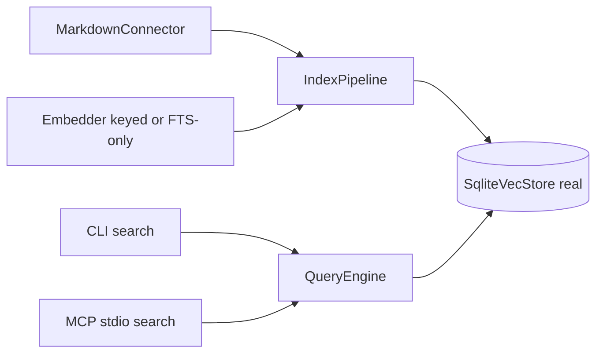

# feat: Phase 1 foundation remaining (on framework main)

**Target repo:** `duketopceo/kurultai`  
**Audience:** personal / developer  
**Base:** current `main` after framework (#19), envs (#30), markdown rename (#36)  
**Process:** **PR-only** (no direct pushes to `main`). Closed superseded #39.

## Goal Capsule

On the **existing** App / pipeline / migration skeleton, make Phase 1 exit real: index a markdown folder into SQLite with FTS (+ vectors when keyed), search via CLI, and expose MCP `search` (stdio) — without requiring an API key for FTS-only mode.

**Stop when:** fixture vault → `index --full` → FTS hit; with key, non-zero embeddings upsert; MCP `tools/list` includes working `search`; CI golden path green on a PR.

---

## Product Contract

### Summary

Phase 1 is **not** greenfield anymore. Framework, env switch, and `MarkdownConnector` naming/MCP trait contract are on main. This plan fills the remaining stubs that block `#27` Phase 1 exit.

### Requirements

| ID | Requirement |
|----|-------------|
| R1 | Real `SqliteVecStore` upsert + FTS5 + vec0 (or equivalent) on top of `migrations`; refuse zero-vector upserts; `store_meta` / fingerprint embed model+dim. |
| R2 | Real OpenRouter embeddings when keyed; **degrade** to FTS-only / skip embed when unkeyed; never ship all-zero vectors as success. |
| R3 | `MarkdownConnector` `full_sync`/`poll` reads `.md` under `root_path`; content-hash skip; orphan cleanup on full sync. |
| R4 | Pipeline + CLI `index`/`search`/`status` use real store/query (honest status — no fake sources). |
| R5 | MCP stdio implements Phase 1 **read** tools needed for exit: at least `search` (+ `status` or `cite` if cheap); share App/pipeline kernel; `install`/`doctor` optional if already partial. |
| R6 | Golden-path integration test + CI gate on GitHub-hosted runners (extend existing workflows). |
| R7 | Post-train prep: add durable `source_uri`, `provenance`, `content_hash` via migration; document export fields. |
| R8 | Land via **PR only**. |

### Actors / flows

- A1 Developer · F1 init/bootstrap → index markdown → search · F2 MCP search · F3 CI golden path

### Scope boundaries

**In:** R1–R8 above on current modules (`src/store`, `src/embed`, `src/connectors/markdown.rs`, `src/query`, `src/pipeline`, `src/mcp`, tests, CI).

**Deferred for later**

- AppFlowy `#4` (after markdown indexes)
- Distillation write path / `remember` tool depth (Phase 3 `#7`)
- RRF polish / LLM rerank (Phase 2 `#6`)
- HTTP daemon productization
- Object storage / cold tier `#34`, GlitchTip `#35`, self-hosted runners `#20`

**Outside identity:** Chat UI, multi-tenant RBAC, Neo4j-in-core, Luke-specific defaults in core.

### Acceptance examples

- AE1. Fixture vault with unique phrase indexes; unkeyed `search` returns that atom via FTS.
- AE2. Zero-vector embed/upsert fails loud; open with mismatched embed_dim fails.
- AE3. Edit one file → one re-upsert; delete file + full sync → orphan removed.
- AE4. MCP `search` returns citation-shaped payload (id, title, excerpt, source_uri).

---

## Planning Contract

### Assumptions

- Extend existing `knowledge_atoms` migration rather than replace the framework store API wholesale.
- Prefer `sqlite-vec` / FTS5 patterns; bump `rusqlite` if required for vec extension.
- MCP Phase 1 tools may be a subset of README’s Phase 3 table (`search` required; `ask`/`remember` can stub or wait).
- Distillation remains raw-first (empty summary/question OK).
- Prior conflicting branch/PR #39 is abandoned; port ideas, don’t merge it.

### Key Technical Decisions

| KTD | Decision | Why |
|-----|----------|-----|
| KTD1 | Build on framework `Store`/`IndexPipeline`/`App`, not parallel runtime | Avoid dual stacks; #19 already owns bootstrap |
| KTD2 | FTS-first + keyless degrade; refuse zero vectors | Day-one offline value; fail loud |
| KTD3 | Markdown `root_path` only; Obsidian = folder | Matches #36 product language |
| KTD4 | Schema evolution via `migrations` bump (v2+) for FTS/vec/meta/export fields | Preserves #19 migration pattern |
| KTD5 | PR-only, small stacked PRs OK (store → embed → markdown → wire → mcp → ci) | Reviewable; user process |
| KTD6 | `#3`/`#32` closed as superseded/duplicate | Tracker hygiene after fresh pull |

### High-Level Technical Design

### Patterns to follow

- `src/store/migrations.rs` — versioned DDL
- `src/pipeline/mod.rs` — connector → embed → upsert loop
- `src/connectors/markdown.rs` — init/path validation already real
- `src/mcp/interface.rs` — AgentRead/AgentWrite contract
- `src/error.rs` / `KurultaiError` — don’t introduce parallel error types

### Risks

| Risk | Mitigation |
|------|------------|
| Migration vs existing empty DBs | Idempotent v2; tests on temp DB |
| Zero-vector stub still callable | Replace embed impl; guard in store upsert |
| MCP scope creep into full Phase 3 tools | Cap Phase 1 at search (+ thin status/cite) |
| Porting large #39 patch blindly | Re-implement against current APIs |

---

## Implementation Units

### U1. Real store: upsert, FTS, vec, meta, export fields

**Goal:** `SqliteVecStore` persists atoms; FTS + vector search work; post-train fields durable.  
**Reqs:** R1, R7 · **Deps:** none · **WOs:** #1, #33  
**Files:** `src/store/mod.rs`, `src/store/migrations.rs`, `src/types.rs`, `tests/store_schema_test.rs`  
**Approach:** Migration v2+: FTS5, vec table or blob+extension, `store_meta`, `source_uri`/`provenance`/`content_hash`; implement trait methods; refuse zero vectors and dim mismatch.  
**Execution note:** Characterization: current stub returns empty/Ok — replace with failing tests first for upsert roundtrip.  
**Test scenarios:**
- Open empty DB migrates; tables present.
- Upsert + FTS hit on unique token.
- Zero-vector upsert errors.
- Dim/model fingerprint rejects mismatch on reopen.
**Verification:** Store tests green; fresh DB self-migrates.

### U2. OpenRouter embedder + FTS-only degrade

**Goal:** Real HTTP embeddings when keyed; no zero success path.  
**Reqs:** R2 · **Deps:** U1 · **WOs:** #2  
**Files:** `src/embed/mod.rs`, `tests/embed_guard_test.rs`  
**Approach:** OpenRouter request; `reject_zero_vector`; FtsOnly/None mode when env key missing; pipeline skips embed when FTS-only.  
**Test scenarios:**
- Zero stub rejected by guard.
- Missing key → embedder reports FTS-only / errors on embed without poisoning store.
**Verification:** Embed tests offline; pipeline indexes without key.

### U3. Markdown connector sync + hash upsert

**Goal:** Index real `.md` trees.  
**Reqs:** R3 · **Deps:** U1 · **WOs:** #31  
**Files:** `src/connectors/markdown.rs`, `tests/fixtures/vault/`, `tests/connector_markdown_test.rs`  
**Approach:** Walk `.md`; content-hash ids; full_sync orphan policy via store delete/reindex already in pipeline.  
**Test scenarios:**
- 3-file fixture → 3 atoms.
- Edit one file → one content_hash change.
- Delete file + full sync → count drops (with real store).
**Verification:** Connector tests green.

### U4. Wire search path (query + CLI honesty)

**Goal:** `kurultai search` / status use real FTS-first query.  
**Reqs:** R4 · **Deps:** U1–U3 · **WOs:** #5  
**Files:** `src/query/mod.rs`, `src/app/context.rs` (as needed), `src/main.rs`, `tests/cli_search_test.rs` or golden  
**Approach:** QueryEngine FTS-first (+ vector when embed works); basic fuse OK (RRF is Phase 2); status lists registered connectors only.  
**Test scenarios:**
- End-to-end fixture index → search hit without key.
**Verification:** Golden or CLI integration test passes.

### U5. MCP stdio `search` (+ thin status)

**Goal:** Agents can call `search` over stdio.  
**Reqs:** R5 · **Deps:** U4 · **WOs:** #11  
**Files:** `src/mcp/` (stdio server beside `interface.rs`), `src/main.rs` (`mcp` subcommand if missing), `tests/mcp_smoke_test.rs`  
**Approach:** Implement AgentRead::search via shared query; tools/list ≥1 working search tool; keep write/`remember` for later unless trivial.  
**Test scenarios:**
- tools/list includes `search`.
- search returns citation-shaped JSON (Covers AE4).
**Verification:** MCP smoke green.

### U6. Golden-path CI on PR

**Goal:** Phase 1 DoD automated on hosted runners.  
**Reqs:** R6, R8 · **Deps:** U1–U4 · **WOs:** #23  
**Files:** `tests/golden_path_test.rs`, `.github/workflows/ci.yml`  
**Approach:** Extend existing CI; fixture vault golden; clippy -D warnings if not already.  
**Test scenarios:**
- CI job runs goldens on PR.
**Verification:** PR CI green.

---

## Verification Contract

- `cargo test` including store, markdown, golden path, MCP smoke
- `cargo clippy --all-targets -- -D warnings`
- Manual: bootstrap → index fixture → search; MCP search once
- Export field list documented (README section or `docs/`)

## Definition of Done

- `#27` Phase 1 exit criteria met on current architecture
- WOs #1, #2, #5, #11, #31, #33 closable (or explicitly residual); #4 still deferred
- Each unit lands via PR
- No object storage / ARC / GlitchTip / Phase 2 RRF required in these PRs

## Work order map

| WO | Plan units | Notes |
|----|------------|-------|
| #1 | U1 | Storage |
| #33 | U1 | Export fields |
| #2 | U2 | Embeddings |
| #31 | U3 | Markdown sync |
| #5 | U4 | CLI search |
| #11 | U5 | MCP search |
| #23 | U6 | CI goldens |
| #4 | — | Deferred |
| #3 / #32 | — | Closed 2026-07-20 |

## Sources

- Current main @ framework + markdown contract
- `#27` sync comment 2026-07-20
- Abandoned ideas from closed #39 (reimplement, don’t merge)
