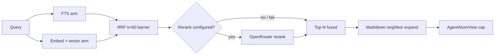

# Search Retrieval RRF Diamond - Plan

## Goal Capsule

**Objective:** Replace Phase 1’s naive max-score FTS+vector merge with a diamond retrieval pipeline: parallel FTS ∥ vector → RRF (`k=60`) → optional OpenRouter rerank → capped `AgentAtomView`, plus token-budgeted markdown context expansion.

**Authority:** This plan > [#6](https://github.com/duketopceo/kurultai/issues/6) issue body (narrowed) > [phase-2-graph-orchestration.md](phase-2-graph-orchestration.md) > Phase 1 invariants in [phase-1-complete.md](phase-1-complete.md).

**Stop when:** CLI + MCP `search` return RRF-ranked capped views; FTS-only path works without API key; optional rerank skips/fails soft; context expansion stays under excerpt budgets; CI green.

**Do not:** implement planner/`ask` synthesis (#7), index-time LLM distillation (#12), local llama.cpp, graph DB, or agent fleets.

---

## Product Contract

### Summary

Phase 1 ships FTS + vector as separate store methods with a brain-side max-score merge. Agents and developers need hybrid ranking that does not invent comparable scores across modalities, stays FTS-first without keys, and never dumps full atom content into MCP.

**Product Contract preservation:** bootstrap (no prior brainstorm file); scope narrowed from #6 by deferring index-time distillation.

### Problem Frame

Incomparable FTS BM25 and vector distance scores make `max(score)` misleading. Serial “FTS then vector” waits waste latency when arms are independent. Hydrating full `content` for every candidate then truncating wastes IO against the token-budget doctrine.

### Requirements

- R1. Retrieval fans out FTS and (when live) vector search in parallel, then fans in once at an RRF barrier with `k=60`.
- R2. Without a live embedder or when embed/vector fails, search still returns FTS results (FTS-first); missing vector is not an error.
- R3. Final MCP/CLI payloads remain `AgentAtomView` excerpts (~400 chars default); raw `content` and embeddings stay off the wire.
- R4. Optional LLM rerank runs only when configured and keyed; on skip or failure, RRF order is returned.
- R5. Markdown hits may expand with same-file neighbor context under an explicit token/char budget without exceeding per-result excerpt caps.
- R6. Candidate prefetch is larger than the final `limit` so fusion/rerank see enough pool, with a hard upper cap.
- R7. Existing fixture phrase search and MCP tool roundtrips keep working; new ranking behavior is covered by tests.

### Actors

- A1. Developer — CLI `kurultai search`
- A2. Agent — MCP `search` / thin `ask` that reuses search
- A3. Operator — config (`reranker_model`, embed key)

### Key Flows

- F1. FTS-only search (NullEmbedder): query → FTS → ranked views
- F2. Hybrid search: query → parallel FTS ∥ embed+vector → RRF → optional rerank → views
- F3. Markdown context: ranked hit → neighbor atoms same file → budgeted excerpt merge → view

### Acceptance Examples

- AE1. Fixture vault + NullEmbedder: `KNOWN_PHRASE_KURULTAI_42` still ranks in top results via FTS; no embed/vector calls.
- AE2. Overlapping FTS+vector atom: single result, `matched_by` includes both, score is RRF sum not `max` of modality scores.
- AE3. Reranker configured but OpenRouter errors: search succeeds with RRF order (warn, soft fail).
- AE4. MCP `search` JSON contains no full `content` field and excerpts respect the char cap after context expansion.

### Success Criteria

- RRF diamond is the only production merge path for `BrainService::search` / query engine.
- CI proves FTS-only, hybrid overlap, soft rerank failure, and excerpt caps.
- README / roadmap mark #6 progress honestly (RRF live; distillation deferred).

### Scope Boundaries

**In scope**

- RRF fusion + candidate prefetch
- Optional OpenRouter rerank behind `runtime.reranker_model`
- Lighter projection / avoid unnecessary full-content work for wide candidate lists where practical
- Markdown same-file neighbor expansion with budgets
- CLI/MCP wiring + tests/docs for the above

**Deferred to follow-up**

- Index-time LLM distillation extractors (listed on #6; track under #12 / later Phase 2+)
- Local ONNX/llama.cpp rerank
- Age-decay / IDF / multi-signal mdvault-style rerank beyond RRF+LLM
- Full `ask` planner/synthesis (#7)
- Heading-column BM25 weight polish if it requires FTS schema redesign (optional stretch only after U1–U4 green)

**Out of product identity for this plan**

- Agent fleets / JS workflow runtimes
- Second graph database for fusion
- Postgres/pgvector backends

### Dependencies

- Phase 1 complete on `main` ([phase-1-complete.md](phase-1-complete.md))
- sqlite-vec `=0.1.6` pin; zero-vector upsert guard
- Config already has `reranker_model: Option<String>`

### Sources

- [#6 Search & Retrieval](https://github.com/duketopceo/kurultai/issues/6)
- [phase-2-graph-orchestration.md](phase-2-graph-orchestration.md)
- [upstream-inspiration.md](../upstream-inspiration.md) Phase 2 section
- [fts-first-null-embedder-no-zero-vectors.md](../solutions/architecture-patterns/fts-first-null-embedder-no-zero-vectors.md)
- Alex Garcia sqlite-vec hybrid / RRF pattern (cited upstream; external fetch may be egress-blocked — use formula `1/(k+rank)` with `k=60`)

---

## Planning Contract

### Assumptions

- A1. **Narrow #6:** this plan ships retrieval quality (RRF, optional rerank, projection, context expansion). Index-time distillation from the issue body is deferred (#12).
- A2. **Rerank transport:** OpenRouter chat/completions (or equivalent ranking endpoint already used by the repo’s HTTP client patterns) when `OPENROUTER_API_KEY` + `reranker_model` are set; no local llama.cpp in Phase 2.
- A3. **FTS-first meaning:** always attempt FTS; vector is additive when live — not “vector only among FTS survivors.”
- A4. **Soft degrade:** embed failure, vector_search failure, and rerank failure all warn and continue with best available ranking (FTS and/or RRF).
- A5. **Blank query:** empty/whitespace (and FTS-sanitized empty) returns `[]` without network calls.
- A6. **`ask`:** thin Phase 1 stub automatically benefits from new `search`; no synthesis work here.
- A7. Scoping confirmed headless from session context (Phase 1 wrap → `/ce-plan` for #6).

### Key Technical Decisions

- KTD1. **Home the pipeline in `src/query/`.** Revive `QueryEngine` / a concrete hybrid engine; `BrainService` delegates so MCP/CLI share one path. Rationale: `DefaultQueryEngine` is already stubbed for “embed → search → fuse → rerank”; growing `brain.rs` further blurs contracts.
- KTD2. **RRF `k=60` with 1-based ranks.** Score contribution `1.0 / (60.0 + rank)` where `rank` starts at 1 for the top hit of each list. Final sort by RRF score desc, then stable tie-break (`id` asc). Rationale: matches Cerebras/Supabase/kb-mcp inspiration; removes incomparable BM25 vs distance max-merge.
- KTD3. **Prefetch pool.** Each arm requests `candidate_limit = clamp(limit * 4, 20, 100)` (exact constants tunable in impl); final truncate to user `limit` (still clamp 1..=50 at API edge). Rationale: fusion needs headroom without unbounded hydrate.
- KTD4. **Projection before expansion.** Prefer id+rank lists then batch-load atoms for the fused top set; do not expand context on the entire prefetch pool. Rationale: Phase 1 residual “hydrate then truncate.”
- KTD5. **Rerank inputs are capped excerpts**, never full `content`. On failure/malformed JSON, keep RRF order. Public `score` becomes rerank score when rerank succeeds; keep `matched_by` as retrieval provenance (do not require `"rerank"` in `matched_by`).
- KTD6. **Context expansion metadata.** Markdown ingest adds lightweight metadata (`rel_path`, `chunk_index`, optional `heading`) so neighbors are ordered without a graph DB. Same-file only; skip non-markdown sources.
- KTD7. **MCP schema stability.** Keep `{ query, limit }` required shape; optional flags only if needed (`rerank: bool` default true when configured). Do not break Cursor tool JSON.

### High-Level Technical Design

Diamond doctrine: independent arms run concurrently; the only merge wait is RRF (+ optional rerank). Loops (embed retry) stay inside the vector arm.

### Patterns to Follow

- `tokio::join!` for arm overlap; vector arm owns embed→search internally (true diamond vs today’s FTS∥embed then serial vector).
- `Embedder::is_live()` gate; never invent zero query vectors ([fts-first learning](../solutions/architecture-patterns/fts-first-null-embedder-no-zero-vectors.md)).
- `KurultaiError` mapping with contextual `format!`; soft paths use `tracing::warn!`.
- MCP stdout stays JSON-RPC-only; logs on stderr.

### System-Wide Impact

- Agents (A2) see better ranking with the same tool names — action parity preserved.
- Thin `ask` and CLI search inherit automatically.
- Token budget and excerpt caps remain the trust boundary for agents.

### Risks & Dependencies

| Risk | Mitigation |
|------|------------|
| Rerank latency / spend | Optional; skip without key/model; soft fail |
| Context expansion blows token budget | Per-result + response budgets; hit-first trim |
| Markdown `source_id` collisions (`path#heading`) | Add `chunk_index` metadata; do not rely on heading alone for order |
| Prefetch hydrate cost | Project/rank first; load full atoms only for fused top |
| SQLite mutex serializes store calls | Diamond still overlaps embed HTTP with FTS; rank-only queries stay short; accept store-lock serialization until WAL/multi-conn is justified |
| External RRF blog egress blocked | Formula fixed in KTD2; upstream doc already cites pattern |

### Alternative Approaches Considered

| Approach | Why not |
|----------|---------|
| Keep max-score merge + tune weights | Scores incomparable across modalities |
| SQL-only single-query hybrid | Harder to soft-degrade arms; less clear diamond boundary |
| Local ONNX rerank now | Extra binary/deps; deferred; OpenRouter matches existing embed path |

### Open Questions

- Q1 *(deferred)*: Exact OpenRouter rerank request shape (chat vs dedicated ranking API) — settle in U3 against current HTTP client patterns.
- Q2 *(deferred)*: Whether MCP gains an optional `rerank: bool` — default keep schema `{query,limit}` unless operators need an override.

---

## Implementation Units

### U1. RRF fusion helpers + diamond search engine

**Goal:** Pure RRF + a `QueryEngine` implementation that fans out FTS ∥ vector and fans in at RRF.

**Requirements:** R1, R2, R6, R7

**Dependencies:** none

**Files:**

- create/modify `src/query/mod.rs` (and split modules if needed, e.g. `src/query/rrf.rs`, `src/query/hybrid.rs`)
- modify `src/mcp/brain.rs` to delegate `search`
- modify `src/lib.rs` / module exports as needed
- test in `src/query/` unit tests and extend `src/mcp/brain.rs` tests

**Approach:** Implement rank-list → RRF map → sorted `SearchResult`. Vector arm: if live, embed then `vector_search`; else empty. Join arms; merge by id; set `matched_by`; apply prefetch limits. Blank query → `[]`.

**Execution note:** Start with unit tests for RRF math and overlap dedupe before wiring BrainService.

**Test scenarios:**

- Happy: two lists with shared id → one result, RRF sum, both matched_by
- Happy: FTS-only (null embedder) → no vector calls; FTS order preserved via RRF single-list
- Edge: empty query → `[]`
- Edge: punctuation-only after FTS sanitize → FTS empty; vector optional
- Edge: RRF ties → stable `id` order
- Error: embed fails → FTS results still returned
- Error: vector_search fails → FTS results still returned
- Integration: fixture phrase still hits via brain search under NullEmbedder

**Verification:** Dedicated RRF/unit tests pass; brain fixture search still finds `KNOWN_PHRASE_KURULTAI_42`.

---

### U2. Candidate projection / batch load

**Goal:** Avoid loading full atom bodies for the entire prefetch pool when only ranks are needed until after fusion.

**Requirements:** R3, R6

**Dependencies:** U1

**Files:**

- modify `src/store/mod.rs` (Store trait + SqliteVecStore)
- tests in `src/store/mod.rs`
- wire through `src/query/`

**Approach:** Add store methods that return `(id, score/distance)` or rowid ranks for FTS/vector without full hydrate, plus `get_many`/`load_by_ids` for the fused top set. Keep existing full-hydrate search APIs working for callers that need them, or migrate internal query path only.

**Test scenarios:**

- Happy: fts id-rank + vector id-rank → fuse → batch load yields same titles as full path for top-N
- Edge: missing id after fuse (deleted mid-flight) → skip, do not panic
- Integration: CLI/MCP search still returns views with excerpts

**Verification:** Store tests cover rank-only + batch load; hybrid search still green.

---

### U3. Optional OpenRouter reranker

**Goal:** Rerank top fused candidates when `reranker_model` + API key present.

**Requirements:** R4, R3

**Dependencies:** U1 (U2 preferred)

**Files:**

- create `src/rerank/` (or under `src/query/rerank.rs`)
- modify `src/app/context.rs` / wiring
- modify `src/config/*` only if defaults/docs needed (`reranker_model` already exists)
- tests with mock HTTP or trait stub

**Approach:** `Reranker` trait with `is_live()`; OpenRouter implementation sends capped query+excerpts; returns ordered ids. Soft-fail to RRF. No call when no candidates or not live.

**Test scenarios:**

- Happy: stub reranker reorders two candidates; final ranks match
- Happy: `reranker_model = None` → zero network
- Error: live reranker returns error → RRF order preserved
- Error: malformed / unknown ids → ignore unknowns, do not invent atoms
- Edge: empty candidate list → no call

**Verification:** Unit tests with stub; optional ignored live test if pattern exists for embed.

---

### U4. Markdown context expansion

**Goal:** Same-file neighbor context under char budgets after ranking.

**Requirements:** R5, R3, AE4

**Dependencies:** U1; U2 recommended

**Files:**

- modify `src/connectors/markdown.rs` (emit `chunk_index` / `rel_path` metadata)
- modify `src/query/` or `src/brain/` expansion helper
- modify `src/brain/mod.rs` if view fields need typed context (prefer folding into excerpt unless a small typed field is clearly better)
- tests in connector + query/brain

**Approach:** On index, stamp ordered chunk metadata. At read time, for markdown hits load prev/next by `(source, rel_path, chunk_index±1)`, merge into excerpt with hit-first priority and hard cap. Skip agent/AppFlowy. Deduplicate if neighbor is already a top hit.

**Test scenarios:**

- Happy: middle chunk expands with prev/next trimmed to cap
- Edge: first/last chunk missing neighbor → no error
- Edge: non-markdown source → no expansion
- Edge: neighbor also in top hits → no duplicate dump
- Integration: MCP search JSON still has no raw `content`; excerpt ≤ cap

**Verification:** Fixture vault multi-heading file proves neighbor merge + cap.

---

### U5. CLI/MCP surface, docs, roadmap

**Goal:** Honest operator docs and stable agent tool behavior.

**Requirements:** R7, AE1, AE4

**Dependencies:** U1–U4 (docs can land progressive; finish after behavior exists)

**Files:**

- `src/main.rs` / CLI help if flags added
- `src/mcp/server.rs` schema/docs comments
- `README.md` architecture Search row + checklist
- `docs/upstream-inspiration.md` / `docs/plans/phase-2-graph-orchestration.md` status blurb if needed
- `tests/cli_smoke.rs`
- `CONCEPTS.md` (RRF / diamond search terms)

**Approach:** Prefer zero required schema changes. Document FTS-first + optional rerank. Update roadmap: #6 in progress / partial complete when RRF ships.

**Test scenarios:**

- Integration: `tests/cli_smoke.rs` index+search fixture still passes
- Integration: MCP tools/list + search roundtrip still passes
- Test expectation: none for pure doc-only commits beyond link sanity

**Verification:** Smoke + MCP tests green; README no longer claims “naive merge” once RRF ships.

---

## Verification Contract

- `cargo test --locked`
- `cargo clippy --all-targets -- -D warnings`
- `cargo fmt --check`
- Prove AE1–AE4 via unit/integration tests named above
- Clear ambient `OPENROUTER_API_KEY` in FTS-only tests (existing CLI smoke pattern)

---

## Definition of Done

- [ ] U1–U5 complete with listed test scenarios
- [ ] No regression in Phase 1 invariants (zero-vector guard, NullEmbedder, MCP stderr logging)
- [ ] Abandoned spike code removed from the diff
- [ ] README/roadmap reflect RRF diamond; distillation explicitly deferred
- [ ] PR(s) green on CI (fmt, clippy, test, audit, macOS smoke)

---

## Appendix

### Research notes

- Current merge: `src/mcp/brain.rs` `HashMap` + `score.max` — replace.
- Store already returns hydrated atoms from FTS/vector — U2 addresses cost.
- Config `reranker_model` already threaded through loader — U3 wires behavior.
- External alexgarcia.xyz fetch may be egress-blocked in agent environments; KTD2 encodes the formula from upstream inspiration already in-repo.
