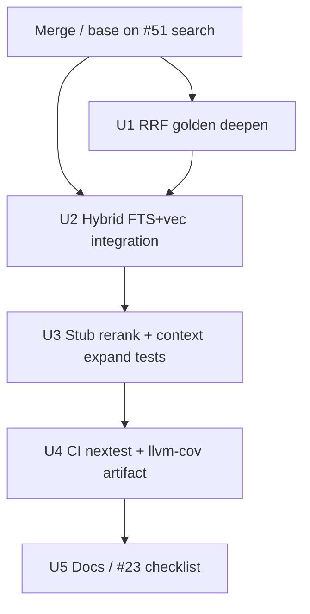

# Phase 2 Testing Work Orders - Plan

## Goal Capsule

**Objective:** Close [#23](https://github.com/duketopceo/kurultai/issues/23) **Phase 2** testing gates — retrieval correctness (FTS+vector+RRF+rerank soft paths+context), plus CI `cargo nextest` and `cargo llvm-cov` artifact **without** a coverage hard gate.

**Authority:** This plan > #23 Phase 2 checklist > Phase 2 search plan [2026-07-21-001-feat-search-retrieval-rrf-plan.md](2026-07-21-001-feat-search-retrieval-rrf-plan.md) test scenarios still thin in-tree.

**Stop when:** Hybrid retrieval integration + RRF golden coverage + stub-rerank/context tests green; CI runs nextest; llvm-cov uploads an artifact with no fail threshold; #23 Phase 2 bullets checked.

**Do not:** Phase 3 coverage floor ≥50%, MCP e2e expansion beyond search correctness, branch-protection settings, distillation tests (#12), full `ask` synthesis (#7).

---

## Product Contract

### Summary

Phase 1 left #23 open for later gates. Phase 2 search (#6 / PR [#51](https://github.com/duketopceo/kurultai/pull/51)) adds RRF, optional rerank, and context expansion, but several #23 Phase 2 checklist items are still open: end-to-end hybrid integration, RRF golden depth, nextest, and llvm-cov.

### Problem Frame

Unit RRF math and store FTS/vector tests exist on the search branch; CI still uses `cargo test` only. Missing: a single path that proves FTS∥vector fusion through `BrainService`/`hybrid_search`, soft-fail rerank, neighbor expansion, and coverage telemetry without blocking merges.

### Requirements

- R1. Integration test: seeded store with fixed embeddings + live fake embedder → hybrid search returns RRF order / `matched_by` for FTS-only, vector-overlap, and soft vector failure.
- R2. RRF golden (or equivalent deterministic) tests encode `k=60`, 1-based ranks, tie-break by id, shared-id sum.
- R3. Stub reranker through hybrid path: reorder success + error keeps RRF order (no network).
- R4. Markdown context expansion: multi-chunk fixture → excerpt includes neighbor markers under char cap; MCP/CLI still never dump full `content`.
- R5. CI: `cargo nextest run --locked` on Linux Lint & Test (keep macOS smoke on `cargo test` or nextest — pick one and document).
- R6. CI: `cargo llvm-cov` (or llvm-cov nextest) uploads HTML/LCOV artifact; **no** coverage % fail gate.
- R7. Update #23 Phase 2 checklist and link this plan from README / testing notes.

### Actors

- A1. Developer — local `cargo nextest` / llvm-cov
- A2. CI — GitHub Actions on PRs
- A3. Maintainer — merges #51 then this work

### Acceptance Examples

- AE1. Hybrid test: atom in both FTS and vector lists appears once with `matched_by` containing fts+vector and RRF score ≈ `2/(60+1)`.
- AE2. NullEmbedder brain search still finds fixture phrase; no embed/vector calls.
- AE3. Stub reranker returning `Err` leaves RRF order unchanged; search succeeds.
- AE4. PR CI uploads coverage artifact; job stays green even if coverage is low.

### Scope Boundaries

**In scope:** #23 Phase 2 bullets; harden gaps from #6 implementation tests.

**Deferred to follow-up:** Coverage ≥50% gate (Phase 3); `cargo-deny`; branch protection UI; live OpenRouter ignored tests as required checks.

**Out of identity:** Replacing Phase 1 gates; inventing new product search behavior.

### Dependencies

- Phase 2 search code on `main` (merge [#51](https://github.com/duketopceo/kurultai/pull/51) first) — or land this PR atop that branch.
- Existing fixtures: `tests/fixtures/vault/`, store tempdir patterns, `NullEmbedder` / pipeline fake embedder.

### Sources

- [#23](https://github.com/duketopceo/kurultai/issues/23) Phase 2 section
- [#6](https://github.com/duketopceo/kurultai/issues/6) / PR #51
- [phase-1-work-orders.md](phase-1-work-orders.md) §8 testing pattern
- [fts-first-null-embedder-no-zero-vectors.md](../solutions/architecture-patterns/fts-first-null-embedder-no-zero-vectors.md)

---

## Planning Contract

### Assumptions

- A1. **Depends on #51.** If #51 is not merged, implement on top of `cursor/phase-2-search-rrf-1c5e` or rebase after merge.
- A2. **nextest replaces Linux `cargo test`**, keep `cargo test --doc` only if doctests appear; today there are none — optional skip.
- A3. **macOS smoke** stays `cargo test --locked` for simplicity unless nextest install is cheap there too.
- A4. **llvm-cov is informational** — upload artifact; do not `continue-on-error` the whole job unless install fails systematically.
- A5. Scoping confirmed headless from “/ce-plan phase 2 work orders test”.

### Key Technical Decisions

- KTD1. **Fake live `Embedder`** with deterministic 4-d vectors for hybrid tests (mirror pipeline test fake) — never hit OpenRouter in CI.
- KTD2. **Place hybrid integration in `tests/retrieval_hybrid.rs`** (or `src/query/hybrid.rs` tests with store) so it exercises public search path used by brain.
- KTD3. **Stub `Reranker` trait object** in-process — no HTTP mock server required for soft-fail/reorder.
- KTD4. **CI tooling via `taiki-e/install-action`** for nextest and cargo-llvm-cov (matches existing cargo-audit install pattern).
- KTD5. **Do not add coverage threshold** until Phase 3 (#23).

### High-Level Technical Design

### Patterns to Follow

- Clear `OPENROUTER_API_KEY` in CLI smoke / FTS-only paths.
- `tempfile::TempDir` for DBs (nextest parallelism).
- Soft-fail semantics already in `hybrid_search` — tests must encode intent (WHY soft-fail matters).

### Risks & Dependencies

| Risk | Mitigation |
|------|------------|
| nextest races on shared temp paths | TempDir only; no global `/tmp` name collisions |
| llvm-cov slows PR | Separate step after tests; cache toolchain; no gate |
| #51 not merged | Base branch on search PR or wait |
| Flaky assert on floating RRF | Use exact `1/(60+rank)` equality with epsilon |

### Alternative Approaches Considered

| Approach | Why not |
|----------|---------|
| Coverage hard gate now | #23 defers to Phase 3 ≥50% |
| Keep only `cargo test` | Misses #23 Phase 2 nextest bullet |
| Live OpenRouter in CI | Spend + flakiness; FTS-first doctrine |

### Open Questions

- Q1 *(deferred)*: Whether macOS job also switches to nextest — default no unless install is free.
- Q2 *(deferred)*: LCOV vs HTML artifact preference — implementer picks one primary upload.

---

## Implementation Units

### U1. RRF golden deepening

**Goal:** Make RRF `k=60` behavior impossible to regress silently.

**Requirements:** R2

**Dependencies:** #51 (`src/query/rrf.rs`)

**Files:**

- modify `src/query/rrf.rs` tests (and/or add `tests/rrf_golden.rs`)

**Approach:** Table-driven cases: shared id sum, single-list order, empty lists, multi-list three-way. Prefer exact expected floats from formula.

**Execution note:** Characterization-first against current `fuse_rrf_ids` before changing production code (should be test-only).

**Test scenarios:**

- Happy: two lists share id → score `2/61`
- Happy: disjoint top hits → stable id tie-break when scores equal
- Edge: empty both lists → empty output
- Edge: duplicate method labels not required; matched_by ordered fts,vector

**Verification:** `cargo test rrf` (or nextest filter) green.

---

### U2. Hybrid FTS + vector integration

**Goal:** Prove diamond path through store + hybrid_search / BrainService.

**Requirements:** R1, AE1, AE2

**Dependencies:** U1, #51 store id-rank + hybrid

**Files:**

- create `tests/retrieval_hybrid.rs` (preferred) or extend `src/mcp/brain.rs` / `src/query/hybrid.rs` tests
- reuse fixture vault and/or hand-seeded atoms with 4-d embeddings

**Approach:** Fake `Embedder { is_live: true }` returning fixed query vector; seed atoms so one FTS hit overlaps vector NN; assert ranks and `matched_by`. Second case: NullEmbedder FTS-only. Third: live embedder whose `vector_search` path returns empty / error soft-fail (if injectable via failing embed).

**Test scenarios:**

- Happy: overlap → single result, both matched_by, RRF score
- Happy: FTS-only NullEmbedder → fts only
- Error: embed fails → FTS results still returned
- Edge: blank query → `[]`
- Integration: fixture phrase still searchable

**Verification:** New integration test file passes under `cargo test --locked` / nextest.

---

### U3. Stub rerank + context expansion tests

**Goal:** Lock soft-fail rerank and neighbor expand budgets.

**Requirements:** R3, R4, AE3

**Dependencies:** U2

**Files:**

- extend `src/rerank/mod.rs` / `src/query/hybrid.rs` tests with stub `Reranker`
- extend `src/query/context.rs` or connector+store integration for `get_by_chunk_meta`
- optional: assert MCP search JSON still has no raw content field (`src/mcp/server.rs`)

**Approach:** `struct StubReranker { mode: Reorder | Fail }`. Multi-heading markdown file in tempdir → index → search middle chunk → summary contains `…prev` / `…next` within `DEFAULT_EXCERPT_CAP`.

**Test scenarios:**

- Happy: stub reorders two candidates via hybrid_search
- Error: stub fails → original RRF order
- Happy: middle chunk expansion includes neighbor snippet
- Edge: first/last chunk missing neighbor → no panic
- Edge: non-markdown / missing metadata → no expansion
- Integration: MCP search roundtrip excerpt ≤ cap

**Verification:** Targeted unit/integration tests green.

---

### U4. CI nextest + llvm-cov artifact

**Goal:** Satisfy #23 Phase 2 CI tooling bullets.

**Requirements:** R5, R6, AE4

**Dependencies:** U1–U3 preferred (so coverage reflects new tests)

**Files:**

- modify `.github/workflows/ci.yml`
- optional `.config/nextest.toml`
- optional note in `.github/workflows/self-hosted.yml` (parity only if trivial)

**Approach:** After clippy, install nextest; `cargo nextest run --locked`. Separate step: install cargo-llvm-cov + llvm-tools; generate lcov/html; `actions/upload-artifact`. No `--fail-under`. Keep release build. macOS: leave `cargo test` unless cheap.

**Test scenarios:**

- Test expectation: none for workflow YAML — verify by CI run on PR
- Smoke: local `cargo nextest run --locked` matches prior pass set

**Verification:** PR CI green; coverage artifact downloadable; no threshold failure.

---

### U5. Docs and #23 checklist

**Goal:** Honest tracking.

**Requirements:** R7

**Dependencies:** U4

**Files:**

- this plan’s DoD / sibling `docs/plans/phase-2-testing-work-orders.md` if kept as checklist mirror
- `README.md` testing blurb if present
- comment/checklist update guidance for human on #23 (agent may lack `closeIssue`)

**Approach:** Mark Phase 2 bullets done when verified; leave Phase 3+ unchecked. Link plan from README near Phase 1 CE plan.

**Test scenarios:** Test expectation: none — docs only.

**Verification:** Links resolve; #23 Phase 2 section reflects reality.

---

## Work order sequence (checklist)

| Step | Work | Blocks | Parallel |
|------|------|--------|----------|
| 0 | Merge #51 search onto `main` | Everything below | — |
| 1 | U1 RRF golden | U2 assertions | — |
| 2 | U2 Hybrid integration | — | U1 |
| 3 | U3 Rerank stub + context | — | after U2 |
| 4 | U4 CI nextest + llvm-cov | — | after tests exist |
| 5 | U5 Docs / #23 update | — | last |

---

## Verification Contract

- `cargo nextest run --locked` (or `cargo test --locked` until U4 lands)
- `cargo clippy --all-targets -- -D warnings`
- `cargo fmt --check`
- CI on PR: Lint & Test + macOS smoke + audit green; coverage artifact present
- Clear ambient API keys in FTS-only tests

## Definition of Done

- [ ] U1–U5 complete with listed scenarios
- [ ] #23 Phase 2 checklist items satisfied (or explicitly deferred with reason)
- [ ] No coverage hard gate introduced
- [ ] Abandoned spikes removed
- [ ] PR green

---

## Appendix

### #23 Phase 2 mapping

| #23 bullet | Plan unit |
|------------|-----------|
| FTS + vector integration with known embeddings | U2 |
| RRF fusion golden-file tests | U1 |
| `cargo llvm-cov` artifact, no hard gate | U4 |
| `cargo nextest` | U4 |

### Already present (do not redo)

- Store FTS/vector unit tests, zero-vector guard
- Pipeline fixture FTS hit
- Brain capped views + CLI smoke (FTS-only)
- On #51: basic `query::rrf` / `rerank` / `context` merge unit tests — deepen, don’t discard
