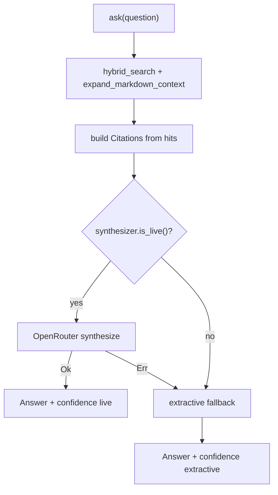

# Phase 3 Ask Synthesis Work Orders - Plan

## Goal Capsule

**Objective:** Open [#7](https://github.com/duketopceo/kurultai/issues/7) Phase 3 with the first shippable work-order tranche — real `ask` synthesis over hybrid retrieval with citations and grounded confidence — without boiling the ocean on HTTP daemon, planner LLM fleets, or agent transcript ingest.

**Authority:** This plan > #7 Phase 3 bullet list > [phase-2-graph-orchestration.md](phase-2-graph-orchestration.md) doctrine > [#37](https://github.com/duketopceo/kurultai/issues/37) token/speed doctrine.

**Stop when:** CLI + MCP `ask` return a synthesized `Answer` with non-empty `citations` when hits exist; live OpenRouter path soft-fails to extractive synthesis; Null/no-key path never invents facts; tests green; README / phase-3 work orders updated. HTTP daemon, planner node, and agent capture remain later work orders.

**Do not:** HTTP daemon on :8421; LLM planner tool-routing; `search_slack` / `who_knows`; agent JSONL connectors; coverage ≥50% hard gate (#23 Phase 3); distillation (#12).

**Product Contract preservation:** Product Contract unchanged (bootstrap from #7 + in-tree stubs).

---

## Product Contract

### Summary

Phase 2 shipped hybrid retrieval (RRF + optional rerank). `BrainService::ask` and MCP `ask` still emit a “synthesis deferred to #7” stub. Users/agents need a grounded answer string plus `Citation` excerpts, with soft degrade when no API key.

### Problem Frame

Retrieval works; the ask boundary lies. Agents calling MCP `ask` get a bullet dump labeled deferred. Doctrine wants SQL brain + capped excerpts + citations — not a second agent runtime.

### Requirements

- R1. After hybrid search (+ markdown context expand), `ask` produces an `Answer` whose `answer` field is a synthesis grounded only in retrieved atom excerpts (not free-form world knowledge beyond those excerpts).
- R2. `citations` and `sources_used` are populated from the retrieved hits (same source/source_id/title/excerpt caps as today).
- R3. When a live synthesizer is configured + API key present, use OpenRouter chat completions (same transport pattern as `OpenRouterReranker`).
- R4. When synthesizer is not live or LLM call fails, soft-fail to deterministic extractive synthesis (hit-first bullet/excerpt merge) — never error the whole ask solely because synthesis LLM failed.
- R5. `confidence` reflects grounding (e.g. empty hits → 0.0; extractive-only → mid band; live synth with citations → higher band) without claiming calibrated probability.
- R6. Token doctrine: prompts and citations use ≤`DEFAULT_EXCERPT_CAP` excerpts; never dump full `content` over MCP/CLI ask.
- R7. Config knob for synthesis model (parallel to `runtime.reranker_model`); keys stay env-only.
- R8. Sibling work-order doc lists deferred Phase 3 units (daemon, planner, agent capture, #23 Phase 3 gates).

### Actors

- A1. Developer — CLI `kurultai ask`
- A2. Agent — MCP `ask` tool
- A3. CI — unit/integration tests without live OpenRouter

### Acceptance Examples

- AE1. Indexed fixture vault; `ask "fixture phrase"` → answer text references retrieved content; `citations.len() >= 1`; excerpts ≤400 chars.
- AE2. No API key → ask still succeeds with extractive answer (no “deferred to #7” string).
- AE3. Stub/failing synthesizer → same citation order as retrieval; ask `Ok`.
- AE4. Blank/empty corpus → empty citations, confidence 0.0, clear “index first” message.

### Scope Boundaries

**In scope:** Synthesizer trait + Null + OpenRouter; App/Brain wiring; HybridQueryEngine alignment; tests; docs for this tranche.

**Deferred (later Phase 3 work orders):** HTTP daemon; planner→executor graph; agent transcript ingest; new MCP tools beyond improving `ask`; coverage floor.

**Out of identity:** Replacing MCP retrieval primitives with a chat-only agent; markdown-as-truth.

### Dependencies

- Phase 2 search on `main` (#51). Phase 2 testing PR [#53](https://github.com/duketopceo/kurultai/pull/53) preferred merged but not blocking this tranche.
- Patterns: `src/rerank/mod.rs` OpenRouter chat client; `BrainService::ask` stub; `AgentAtomView` / `Citation`.

### Sources

- [#7](https://github.com/duketopceo/kurultai/issues/7)
- [docs/upstream-inspiration.md](../upstream-inspiration.md) § Phase 3
- [phase-2-graph-orchestration.md](phase-2-graph-orchestration.md)
- Cerebras KB article (retrieve primitives + citations)

---

## Planning Contract

### Assumptions

- A1. **No separate planner LLM in this tranche.** Retrieval query = user question (existing hybrid path). Planner work order comes later.
- A2. **Extractive NullSynthesizer is the CI path** — no network in default tests.
- A3. **Default synthesis model** when key present: a cheap OpenRouter chat model string in config (document choice in KTD); empty/unset model → NullSynthesizer even with key.
- A4. Scoping confirmed headless from “/lfg … next work orders” (Phase 3 after Phase 2 search/testing).

### Key Technical Decisions

- KTD1. **`Synthesizer` trait** in `src/query/synthesize.rs` (or `src/synthesize/`) with `is_live()`, `synthesize(question, &[SearchResult]) -> Result<String>` — answer body only; caller builds `Answer` + citations.
- KTD2. **OpenRouter chat** mirrors `OpenRouterReranker` URL/timeout/bearer; system prompt mandates cite-only-from-excerpts; temperature 0.
- KTD3. **Wire through `BrainService`** (live CLI/MCP path); update `HybridQueryEngine::ask` to the same helper to avoid dual stubs.
- KTD4. **`runtime.synthesis_model: Option<String>`** in config.toml; App builds synthesizer beside reranker.
- KTD5. **Confidence heuristic (documented, simple):** 0.0 if no hits; ~0.45 extractive; ~0.7 live synth success with ≥1 citation — not ML-calibrated.

### High-Level Technical Design



### Patterns to Follow

- Soft-fail like embed/vector/rerank arms.
- `SecretString` + env-only keys.
- Cap excerpts with `DEFAULT_EXCERPT_CAP`.
- Keep `Answer` / `Citation` schema stable unless a field is clearly missing.

### Risks & Dependencies

| Risk | Mitigation |
|------|------------|
| LLM hallucinates beyond excerpts | Prompt + soft-fail; citations remain retrieval-grounded regardless of answer text |
| Dual ask stubs diverge | Shared `compose_answer` helper used by brain + engine |
| Config surprise with key but no model | Document: unset model → extractive; status CLI shows synthesizer name |

### Open Questions

- Q1 *(deferred)*: Separate cheaper planner model vs same synthesis model — later planner work order.
- Q2 *(deferred)*: HTTP route shapes for daemon — later daemon work order.
- Q3 *(resolved)*: MCP natively in Rust — already true; keep extending `rmcp`/stdio server.

---

## Implementation Units

### U1. Synthesizer trait + Null + OpenRouter

**Goal:** Pluggable synthesis behind a trait with CI-safe Null path.

**Files:** `src/query/synthesize.rs` (new), `src/query/mod.rs`, optionally `src/lib.rs` re-exports if needed.

**Approach:** Define trait; `NullSynthesizer` builds extractive text from top hit titles/excerpts (no “deferred to #7”); `OpenRouterSynthesizer` posts chat completions; unit-test Null + parse/error paths without network.

**Test scenarios:**

- Null extractive includes hit title/excerpt; empty hits → index-first message.
- OpenRouter client construction; response parse happy/error with fixture JSON (httpmock optional — prefer pure parse helpers if already patterned in rerank).

**Verify:** `cargo test synthesize` (or module filter) green.

### U2. Config + App wiring

**Goal:** `runtime.synthesis_model` + `App.synthesizer`.

**Files:** `src/config/file.rs`, `loader.rs`, `mod.rs` defaults; `src/types.rs` `Config`; `src/app/context.rs`; `src/main.rs` status line if present.

**Approach:** Mirror `reranker_model` loading; build OpenRouter synthesizer only when model non-empty + API key; else Null.

**Test scenarios:**

- Config loader maps `synthesis_model`.
- App without key uses Null synthesizer name.

**Verify:** config unit tests + `cargo test`.

### U3. Wire `ask` through synthesizer

**Goal:** `BrainService::ask` and `HybridQueryEngine::ask` produce real Answers.

**Files:** `src/mcp/brain.rs`, `src/query/mod.rs`, MCP tool description in `src/mcp/server.rs` (drop “full synthesis is Phase 3” if no longer accurate — say “synthesizes from retrieved atoms”).

**Approach:** Shared compose helper: search → citations → synthesizer → confidence. Soft-fail LLM → Null extractive.

**Test scenarios:**

- Brain ask with Null synthesizer + seeded store → citations non-empty, answer lacks “deferred to #7”.
- Failing live synthesizer → extractive fallback, still Ok.
- Blank question / no hits → confidence 0.0.

**Verify:** unit tests in `mcp/brain` + optional `tests/ask_synthesis.rs`.

### U4. CLI/MCP regression + integration

**Goal:** Keep search/cite/remember green; add ask coverage.

**Files:** `src/mcp/server.rs` tests; `tests/cli_smoke.rs` or new ask smoke; `tests/ask_synthesis.rs`.

**Approach:** Extend tool-def test expectations; CLI ask against fixture vault with OPENROUTER cleared.

**Test scenarios:**

- MCP tools/list still exposes ask; ask roundtrip returns JSON Answer shape.
- CLI ask on fixture phrase exits 0 with citation-ish output.

**Verify:** `cargo test --locked`.

### U5. Docs / work-order map

**Goal:** Phase 3 work-order map + README links; mark this tranche in-progress/done.

**Files:** `docs/plans/phase-3-work-orders.md` (new), this plan, `README.md` phases section.

**Approach:** List WO1 (this) → WO2 daemon → WO3 planner → WO4 agent capture → WO5 #23 Phase 3 gates. Link plan from README.

**Verify:** Links resolve; no code behavior change.

---

## Verification Contract

```bash
cargo fmt --all -- --check
cargo clippy --all-targets -- -D warnings
cargo test --locked
```

Optional once #53 merges: `cargo nextest run --locked`.

No live OpenRouter required for green CI.

---

## Definition of Done

- [ ] U1–U4 code + tests green
- [ ] No “synthesis deferred to #7” in default ask success path when hits exist
- [ ] Soft-fail synthesis documented in code comments / plan
- [ ] U5 docs landed; phase-3 work orders list deferred WOs
- [ ] PR opened for this tranche

### #7 mapping

| #7 bullet | This plan |
|-----------|-----------|
| Planner → Executor → Synthesis | Synthesis only (planner deferred WO3) |
| MCP tool interface | Improve existing `ask`; search/cite unchanged |
| HTTP daemon | Deferred WO2 |
| Answer with citations | U3 |
| Confidence scoring | U3 heuristic |
