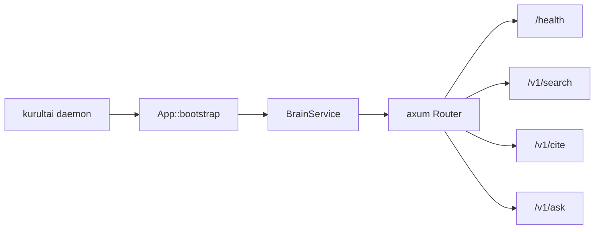

# Phase 3 HTTP Daemon Work Order - Plan

## Goal Capsule

**Objective:** Replace the `kurultai daemon` stub with a local HTTP server on port **8421** (default) that mirrors MCP read tools (`search`, `cite`, `ask`) plus `health`, reusing `BrainService`.

**Authority:** This plan > [#7](https://github.com/duketopceo/kurultai/issues/7) HTTP daemon bullet > Phase 3 work-order map > [#37](https://github.com/duketopceo/kurultai/issues/37) token doctrine.

**Stop when:** `kurultai daemon --port <p>` serves JSON endpoints; integration tests green without OpenRouter; README/daemon docs updated; poll-index loop not required in this WO.

**Do not:** Public/auth-hardened multi-tenant API; planner LLM; agent transcript ingest; WO1 synthesizer (land on main as-is; ask uses current brain); coverage ≥50% gate.

**Product Contract preservation:** Product Contract unchanged (bootstrap from #7).

---

## Product Contract

### Summary

#7 calls for an HTTP daemon for external querying. Today `Commands::Daemon` prints a stub and sleeps. Agents already use MCP stdio; HTTP unlocks curl/scripts/other clients.

### Requirements

- R1. Bind TCP and serve HTTP; default port **8421** via existing `--port`.
- R2. Default bind **127.0.0.1** (localhost-only) for safety; optional `--bind` for host (document).
- R3. `GET /health` → `{"status":"ok"}`.
- R4. Search: `GET /v1/search?q=&limit=` and/or `POST /v1/search` JSON → `AgentAtomView[]` (same caps as MCP).
- R5. Cite: `GET /v1/cite?source=&source_id=` → `Citation` or 404.
- R6. Ask: `POST /v1/ask` `{"question"}` → `Answer` JSON.
- R7. Errors as JSON `{"error":"..."}` with appropriate status; never dump full atom `content`.
- R8. Daemon constructs `BrainService` like CLI mcp/ask/search.

### Actors

- A1. Developer — curl / local scripts
- A2. Future HTTP clients
- A3. CI — axum test / bound-port smoke

### Acceptance Examples

- AE1. Daemon up → `GET /health` 200.
- AE2. Indexed fixture → `GET /v1/search?q=KNOWN_PHRASE…` returns non-empty views, excerpt ≤400.
- AE3. Missing cite → 404 JSON error.
- AE4. `POST /v1/ask` returns `Answer` shape.

### Scope Boundaries

**In:** axum server module, CLI wire, tests, docs.

**Deferred:** Auth, TLS, CORS for browsers, background index poll loop, OpenAPI, remember write (optional stretch if tiny).

### Dependencies

- Phase 2 search on `main`. WO1 ask synthesis (#54) preferred but not required.

### Sources

- [#7](https://github.com/duketopceo/kurultai/issues/7)
- `src/main.rs` Daemon stub
- `src/mcp/server.rs` tool contracts

---

## Planning Contract

### Assumptions

- A1. **axum** is the HTTP stack (tokio-native).
- A2. Localhost bind default — not a public edge service yet.
- A3. No separate API key for HTTP in this WO (local trust).
- A4. Headless LFG scoping from “/lfg on work orders”.

### Key Technical Decisions

- KTD1. New `src/http/` (or `src/daemon/`) with `serve(brain, addr) -> Result<()>`.
- KTD2. `axum::Router` + `State<Arc<BrainService>>`; JSON via `Json<T>`.
- KTD3. Path prefix `/v1/` for query routes; `/health` unversioned.
- KTD4. CLI: `--port` + `--bind` (default `127.0.0.1`).
- KTD5. Tests: `Router` oneshot or ephemeral port + `reqwest`.

### High-Level Technical Design



### Risks

| Risk | Mitigation |
|------|------------|
| Accidental 0.0.0.0 expose | Default 127.0.0.1; warn if bind is not loopback |
| Dual MCP/HTTP drift | Both call BrainService only |

### Open Questions

- Q1 *(deferred)*: Auth for non-localhost — Phase 5.
- Q2 *(deferred)*: Background poll/index in daemon — later.

---

## Implementation Units

### U1. axum deps + http module + health

**Files:** `Cargo.toml`, `src/http/mod.rs`, `src/lib.rs`

**Test scenarios:** health handler returns ok JSON via oneshot.

### U2. search / cite / ask routes

**Files:** `src/http/mod.rs` (or `routes.rs`)

**Test scenarios:** search empty q → []; cite miss → 404; ask returns Answer fields.

### U3. Wire `Commands::Daemon`

**Files:** `src/main.rs`

**Approach:** Build brain, parse bind+port, `http::serve`, print listening URL.

### U4. Integration test

**Files:** `tests/http_daemon.rs`

**Approach:** Fixture vault → ephemeral listen → reqwest GET search known phrase.

### U5. Docs

**Files:** `README.md`, `docs/plans/phase-3-work-orders.md` (create/update on this branch)

---

## Verification Contract

```bash
cargo fmt --all -- --check
cargo clippy --all-targets -- -D warnings
cargo test --locked
```

---

## Definition of Done

- [ ] U1–U4 green
- [ ] Daemon no longer prints “HTTP not implemented yet”
- [ ] U5 docs; work-order map marks WO2 in progress/done
- [ ] PR + CI green
