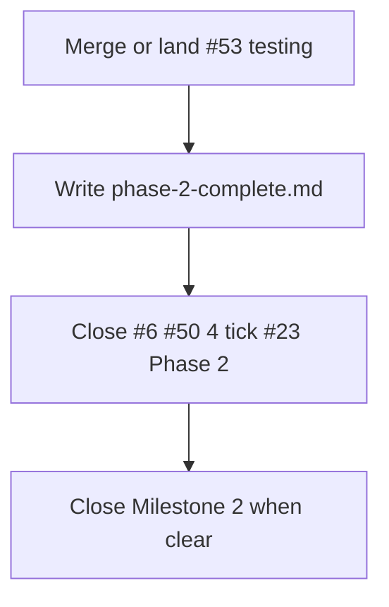

# Phase 2 Closeout - Plan

## Goal Capsule

**Objective:** Officially finish Phase 2 (Search & Retrieval): land the testing gates already drafted in [#53](https://github.com/duketopceo/kurultai/pull/53), publish a Phase 2 complete wrap doc, and close/move GitHub trackers so Milestone 2 can close.

**Authority:** This plan > [#6](https://github.com/duketopceo/kurultai/issues/6) (product done via #51) > [#23](https://github.com/duketopceo/kurultai/issues/23) Phase 2 section > existing plans [2026-07-21-001-feat-search-retrieval-rrf-plan.md](2026-07-21-001-feat-search-retrieval-rrf-plan.md) and testing plan on #52/#53.

**Stop when:** Hybrid retrieval + RRF golden + nextest/llvm-cov artifact are on `main`; `docs/plans/phase-2-complete.md` exists; #6 closed (or marked done with distillation deferred to #12); #23 Phase 2 boxes ticked; redundant plan PRs #50/#52 closed; Milestone 2 closable.

**Do not:** Re-implement RRF/search; start Phase 3 WO3 planner; coverage ≥50% hard gate (Phase 3 / #23); distillation (#12).

**Assumption correction:** User assumed “Phase 2” was next to plan. **Product search already shipped.** This plan is the **remaining Phase 2 slice** (testing + hygiene), not a new retrieval design.

**Product Contract preservation:** unchanged — bootstrap from shipped #6 + #23 Phase 2 checklist.

---

## Product Contract

### Summary

Phase 2 product (RRF diamond, optional rerank, context expand) is on `main` via [#51](https://github.com/duketopceo/kurultai/pull/51). Phase 2 testing gates are implemented on draft [#53](https://github.com/duketopceo/kurultai/pull/53) but not merged. Issue #6 and plan-only PRs #50/#52 are still open, so the phase looks unfinished.

### Problem Frame

Without merging #53 and closing trackers, Milestone 2 and #23 still show Phase 2 incomplete even though search behavior shipped.

### Requirements

- R1. `main` has hybrid FTS∥vector integration tests, RRF golden deepen, stub rerank/context coverage from #53 (or equivalent).
- R2. CI on `main` runs `cargo nextest` (Linux) and uploads llvm-cov artifact **without** coverage fail gate.
- R3. `docs/plans/phase-2-complete.md` documents what shipped, deferred (#12), and next (#7).
- R4. Tracker hygiene: close #6 (search slice done); tick #23 Phase 2; close #50/#52; optional Milestone 2 close when clear.
- R5. README Phase 2 row / checklist already mark search ✅ — ensure testing link present after merge.

### Actors

- A1. Maintainer — merge PRs, run closeout (agent may lack `closeIssue`)
- A2. CI — green on #53 then on `main`

### Acceptance Examples

- AE1. After merge: `cargo test` / nextest includes `tests/retrieval_hybrid.rs` (or equivalent) green on `main`.
- AE2. CI Lint & Test uses nextest + coverage artifact upload.
- AE3. `phase-2-complete.md` linked from README like Phase 1 complete.

### Scope Boundaries

**In:** Merge/land #53 content; wrap docs; closeout script/commands; README links.

**Deferred:** Distillation (#12); Phase 3 ask/daemon (#54/#55 already drafted separately); coverage floor.

**Out of identity:** Redesigning RRF or reopening search architecture.

### Dependencies

- #51 on `main` ✅  
- #53 MERGEABLE / CI green (verify at execute time)  
- Maintainer rights for issue close (same as Phase 1 closeout)

### Sources

- [#6](https://github.com/duketopceo/kurultai/issues/6), [#23](https://github.com/duketopceo/kurultai/issues/23)  
- PR [#51](https://github.com/duketopceo/kurultai/pull/51), [#53](https://github.com/duketopceo/kurultai/pull/53)  
- [phase-1-closeout.md](phase-1-closeout.md) pattern  

---

## Planning Contract

### Assumptions

- A1. #53 still contains the full testing implementation; no need to rewrite tests unless merge conflicts.
- A2. Plan-only #50/#52 are obsolete once #51/#53 land.
- A3. Distillation stays on #12 — closing #6 does not close #12.
- A4. Headless scoping from “/ce-plan what I assume is phase 2” after Phase 1 closeout discussion.

### Key Technical Decisions

- KTD1. **Prefer merge #53** over re-implementing tests on a new branch.
- KTD2. **Mirror Phase 1 closeout:** `phase-2-complete.md` + `phase-2-closeout.md` + optional `scripts/phase-2-closeout.sh`.
- KTD3. **Do not block closeout on #54/#55** — those are Phase 3.
- KTD4. If #53 cannot merge (policy), cherry-pick its commits onto a closeout branch instead.

### High-Level Technical Design



### Risks

| Risk | Mitigation |
|------|------------|
| Branch protection blocks merge | Maintainer `--admin` or satisfy checks; else cherry-pick |
| Agent cannot close issues | Script + human run (same as Phase 1) |
| #53 conflicts with main | Rebase #53 onto main before merge |

### Open Questions

- Q1 *(deferred)*: Whether to mark #6 closed vs leave open for distillation narrative — **default close #6**, keep #12 for distillation.
- Q2 *(resolved)*: Re-plan RRF search? **No** — already shipped.

---

## Implementation Units

### U1. Land Phase 2 testing on main

**Goal:** #53 content on `main` (merge preferred).

**Files:** whatever #53 changes — typically `tests/retrieval_hybrid.rs`, `src/query/rrf.rs` tests, `.github/workflows/ci.yml`, testing plan docs.

**Approach:** Merge #53; if blocked, cherry-pick onto this closeout branch and open a successor PR.

**Test scenarios:** Full `cargo test --locked` / CI Lint & Test green after land.

**Verify:** `tests/retrieval_hybrid` present on `main`; CI shows nextest + llvm-cov artifact.

### U2. Phase 2 complete wrap doc

**Goal:** Durable “what shipped” artifact.

**Files:** `docs/plans/phase-2-complete.md` (new), README link, optionally `docs/plans/phase-2-testing-work-orders.md` if not yet on main.

**Approach:** Mirror `phase-1-complete.md` structure: shipped table (#51, #53), deferred (#12), next (#7).

**Verify:** Links resolve; no contradictory “Phase 2 not started” wording.

### U3. Tracker closeout script + commands

**Goal:** Maintainer can finish GitHub hygiene.

**Files:** `docs/plans/phase-2-closeout.md`, `scripts/phase-2-closeout.sh`

**Approach:** Close #6, #50, #52; instruct tick #23 Phase 2; close Milestone 2 when open_issues allow.

**Verify:** Script documents 403 fallback; commands tested dry by listing issue numbers.

### U4. README / work-order consistency

**Goal:** Phase 2 marked complete with testing note.

**Files:** `README.md` phases table / checklist.

**Verify:** Search ✅; testing gates called out; link to phase-2-complete.md.

---

## Verification Contract

```bash
# After U1 land:
cargo fmt --all -- --check
cargo clippy --all-targets -- -D warnings
cargo test --locked
# CI: nextest + llvm-cov artifact on Linux job
```

Maintainer: `./scripts/phase-2-closeout.sh` (issue write required).

---

## Definition of Done

- [ ] Testing gates on `main` (via #53 or cherry-pick)
- [ ] `phase-2-complete.md` + closeout script/docs
- [ ] README links
- [ ] Maintainer closed #6 #50 #52; #23 Phase 2 ticked; Milestone 2 closable
- [ ] No reopened search redesign

### Mapping

| Item | Status after this plan |
|------|------------------------|
| #6 RRF search | Already shipped (#51) → close |
| #23 Phase 2 bullets | Satisfied by #53 → tick |
| #12 Distillation | Still deferred |
| #7 Phase 3 | Next product phase (#54/#55 drafted) |
