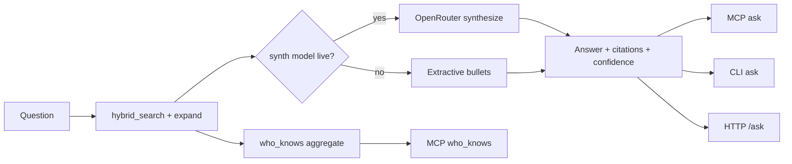

# feat: Phase 3 Synthesis & Interface

**Target repo:** `duketopceo/kurultai`  
**Audience:** developer (personal)  
**Base:** `main` after Phase 1–2 (hybrid RRF search, MCP `search`/`cite`/`remember`, thin `ask` stub)  
**Process:** PR-only

## Goal Capsule

Agents and CLI get **real answers with citations and confidence** via `ask`, plus a **`who_knows`** discovery tool and a **thin HTTP daemon** mirroring the same brain contracts — without requiring an API key for extractive degrade mode.

**Stop when:** fixture-backed `ask` returns grounded prose + citations (LLM when keyed, extractive when not); MCP exposes working `ask` + `who_knows`; `kurultai daemon` serves JSON search/ask; tests + CI green on a PR.

---

## Product Contract

### Summary

Phase 3 developer exit (#27 / #7): replace the “synthesis deferred” stub with a planner-light synthesizer on top of hybrid search; add `who_knows`; productize HTTP on 8421 as a twin of MCP read tools. Privacy-tier capture, Slack tools, distillation, and cold storage stay out.

### Requirements

| ID | Requirement |
|----|-------------|
| R1 | `BrainService::ask` synthesizes from hybrid search hits: OpenRouter when keyed; **extractive degrade** (ranked excerpts → answer) when unkeyed — never hard-fail for missing key. |
| R2 | Answers include citations (source, source_id, title, excerpt) and a **confidence** score reflecting hit strength / emptiness. |
| R3 | MCP `ask` returns structured answer JSON (not only “deferred” text); keep token-capped excerpts. |
| R4 | MCP + CLI **`who_knows`**: given a topic/query, return distinct sources (and sample titles) that match — discovery, not full synthesis. |
| R5 | HTTP daemon on configurable port (default 8421): at least `GET/POST` search and ask (and cite if cheap) over the same `BrainService`. |
| R6 | CLI `ask` prints answer + citations + confidence. |
| R7 | Tests cover ask degrade, ask-with-stub-LLM (or mock), who_knows, daemon smoke; PR-only landing. |

### Actors / flows

- A1 Developer · F1 CLI ask · F2 MCP ask / who_knows · F3 HTTP client ask/search · F4 CI

### Scope boundaries

**In:** R1–R7 on `src/mcp/brain.rs`, synthesis module, `src/mcp/server.rs`, `src/main.rs` daemon, thin HTTP module, tests.

**Deferred for later**

- Agent capture privacy tiers (#25)
- `search_slack` / enterprise connectors (#12)
- Full multi-step planner/executor fleets (clients own orchestration; we keep diamond retrieval + one synthesis node)
- Scale/caching (#13), object storage (#34), AppFlowy (#4)

**Outside identity:** Chat UI product, multi-tenant RBAC, second graph DB.

### Acceptance examples

- AE1. Indexed fixture; unkeyed `ask` returns non-empty answer mentioning a known title/excerpt and confidence &gt; 0.
- AE2. Empty store `ask` → honest empty message, confidence 0, no citations.
- AE3. `who_knows` on fixture topic returns markdown (or configured) source entries.
- AE4. Daemon `POST /ask` returns JSON with `answer`, `citations`, `confidence`.

---

## Planning Contract

### Assumptions

Carrying session-settled decisions into this plan:

| Decision | Class | Rejected | Why |
|----------|-------|----------|-----|
| PR-only landing | user-directed | push to main | process |
| Degrade without API keys | user-approved | key required for exit | FTS-first doctrine |
| Distillation not in this chunk | user-approved (P2) | distill in search phase | #12 later |
| Object storage deferred | user-directed | MinIO in P3 | #34 |
| Local brain, not device→hub scrub daemon | user-approved | edge agent as P3 core | local-first |
| Markdown folder ingest | user-approved | Obsidian app API | #36 |

**Inferred (LFG headless):** Narrow #7 to synthesis + who_knows + thin HTTP — not privacy tiers or Slack. Native Rust HTTP (axum or hyper) sharing `BrainService`. Synthesis is one LLM call over top-k excerpts when live; no multi-agent planner process inside Kurultai.

### Key Technical Decisions

| KTD | Decision | Why |
|-----|----------|-----|
| KTD1 | One synthesis node after hybrid search (diamond already at retrieval) | Matches phase-2 graph note; don’t rebuild fleet runtime |
| KTD2 | Keyless extractive ask; keyed OpenRouter chat completion | Same degrade pattern as NullEmbedder / NullReranker |
| KTD3 | HTTP mirrors MCP contracts (JSON), no second query stack | Token doctrine + one brain |
| KTD4 | `who_knows` = aggregate sources from hybrid search hits | Cheap discovery; no new index |
| KTD5 | PR-only | Settled |

### High-Level Technical Design

### Risks

| Risk | Mitigation |
|------|------------|
| LLM invents facts | Prompt: only use provided excerpts; cite only given ids; tests with fixture |
| Daemon blocks MCP stdout | Logging already stderr for MCP; daemon uses normal logs |
| Scope creep into privacy/#12 | Explicit defer list |

---

## Implementation Units

### U1. Synthesis module + real `BrainService::ask`

**Goal:** Replace deferred stub with extractive + optional LLM synthesis and confidence.  
**Reqs:** R1, R2, R6 · **Deps:** none · **WOs:** #7  
**Files:** `src/synthesize/mod.rs` (new), `src/mcp/brain.rs`, `src/lib.rs`, `src/query/mod.rs` (thin ask delegate or leave), `tests` / unit tests in synthesize  
**Approach:** `synthesize(question, hits) -> Answer`; NullSynthesizer extractive; OpenRouter when `OPENROUTER_API_KEY` + optional config model; confidence from hit scores / emptiness.  
**Execution note:** Start with failing tests for empty store and fixture extractive ask.  
**Test scenarios:**
- Empty hits → empty message, confidence 0.
- Fixture hits, null synthesizer → answer contains excerpt text; citations len ≥ 1.
- Live synthesizer mock returns fixed prose → answer uses it; citations preserved from hits.
**Verification:** Unit tests green; CLI ask on fixture vault works offline.

### U2. MCP `ask` payload + `who_knows` tool

**Goal:** Agents get structured ask + source discovery.  
**Reqs:** R3, R4 · **Deps:** U1 · **WOs:** #7, #11 slice  
**Files:** `src/mcp/server.rs`, `src/mcp/interface.rs`, `src/mcp/brain.rs`, `src/mcp/mod.rs` docs  
**Approach:** Enrich ask tool result JSON; add `who_knows` tools/list + handler aggregating unique sources from search.  
**Test scenarios:**
- tools/list includes `who_knows` and `ask`.
- who_knows on indexed topic returns source name(s).
- ask tool JSON has answer + citations + confidence.
**Verification:** MCP server unit tests green.

### U3. HTTP daemon thin API

**Goal:** `kurultai daemon --port 8421` serves search/ask JSON.  
**Reqs:** R5 · **Deps:** U1 · **WOs:** #7  
**Files:** `src/http/mod.rs` (new), `src/main.rs`, `Cargo.toml` (axum/tower/hyper as needed)  
**Approach:** Bind localhost; routes `/health`, `/search`, `/ask` (and `/cite` optional); share BrainService; no auth in P3 (document local-only).  
**Test scenarios:**
- Smoke: spawn or tower::Service test — POST ask returns 200 JSON shape.
- Unkeyed extractive path via HTTP.
**Verification:** Daemon smoke test or hyper test client green.

### U4. Golden / integration coverage for Phase 3

**Goal:** CI proves ask + who_knows + daemon contracts.  
**Reqs:** R7 · **Deps:** U1–U3  
**Files:** `tests/phase3_ask_test.rs` (or extend cli_smoke), `.github/workflows/ci.yml` if needed  
**Approach:** Temp store + fixture markdown index → ask/who_knows assertions.  
**Test scenarios:** Covers AE1–AE4 as practical in CI without live OpenRouter.  
**Verification:** `cargo test` + clippy on PR.

---

## Verification Contract

- `cargo test`
- `cargo clippy --all-targets -- -D warnings`
- Manual optional: `ask` offline; `daemon` curl `/ask`
- PR-only merge

## Definition of Done

- `#7` core synthesis + interface slice done (privacy/#12 not claimed)
- `#27` Phase 3 exit: agents query via MCP ask; HTTP available for non-MCP
- Plan path recorded; work lands via PR

## Sources

- `#7`, `#27` Phase 3 table
- `docs/plans/phase-2-graph-orchestration.md`
- `CONCEPTS.md` (AgentAtomView, FTS-first, NullEmbedder/NullReranker pattern)
- Existing stub: `BrainService::ask` in `src/mcp/brain.rs`
