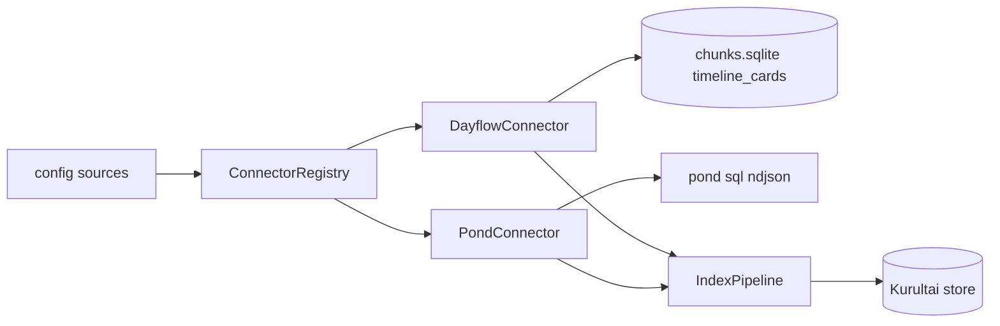

# feat: Phase 4 Pond + Dayflow connectors

**Target repo:** `duketopceo/kurultai`  
**Audience:** solo (personal Mac)  
**Base:** `main` after Phase 3 (#7 / #60)  
**Process:** PR-only

## Goal Capsule

Solo users can index **agent conversation history via Pond** and **Dayflow activity cards** into the same SQLite brain as markdown notes — local-first, read-only source access, FTS-first without requiring new API keys.

**Stop when:** fixture/CI-safe Dayflow sync indexes timeline cards; Pond connector indexes messages when `pond` is available (graceful skip/error when not); both register via config + `kurultai index`; tests + CI green on a PR.

---

## Product Contract

### Summary

Phase 4 first slice of [#8](https://github.com/duketopceo/kurultai/issues/8) / [#21](https://github.com/duketopceo/kurultai/issues/21): ship two local connectors that unlock the solo exit path (“notes + agent chats + Dayflow”) without Composio, plugins, or CodeGraph.

### Requirements

| ID | Requirement |
|----|-------------|
| R1 | **DayflowConnector**: read-only open of `chunks.sqlite` (default `~/Library/Application Support/Dayflow/chunks.sqlite`); map `timeline_cards` → `KnowledgeAtom` (`source=dayflow`). |
| R2 | Config: `kind = "dayflow"` + optional `db_path` / `data_path` in `extra`; missing DB → clear connector error, no panic. |
| R3 | **PondConnector**: ingest via `pond sql --format ndjson` (not Lance direct); map user/assistant `messages` → atoms (`source=pond`); require `pond` on PATH or configurable `pond_bin`. |
| R4 | Register both in `ConnectorRegistry` / `SourceKind` / config kind parsing; enable via `config.toml` sources. |
| R5 | Incremental `poll` uses timestamps / message ids so re-index skips unchanged atoms (content-hash pipeline already helps). |
| R6 | Tests: Dayflow fixture SQLite (minimal schema + cards); Pond unit tests with mocked command or feature-gated skip when `pond` absent; CI green on Linux (Dayflow fixture; Pond graceful). |
| R7 | PR-only landing; update #27/#8/#21 status comments after merge (docs README row optional same PR). |

### Actors / flows

- A1 Solo user · F1 `kurultai index` Dayflow · F2 `kurultai index` Pond · F3 `search`/`ask` over new sources · F4 CI

### Scope boundaries

**In:** R1–R7 — `src/connectors/dayflow.rs`, `src/connectors/pond.rs`, registry/types/config wiring, fixtures + tests.

**Deferred for later**

- Composio meta-connector (#8)
- Custom plugin system / WASM (#14)
- GitHub + CodeGraph filesystem connector (#8)
- Agent capture privacy tiers (#25)
- Distillation (#12), AppFlowy (#4), object storage (#34)
- Dayflow markdown-export watcher / deep-link automation
- Embedding Pond vectors into Kurultai (use FTS/content only this slice)

**Outside identity:** Chat UI, multi-tenant RBAC, rewriting Pond’s Lance store.

### Acceptance examples

- AE1. Dayflow fixture → `full_sync` returns ≥1 atom with known title; `index` makes FTS hit.
- AE2. Missing Dayflow DB path → `init`/`full_sync` returns typed error string mentioning path.
- AE3. With `pond` installed: sync returns atoms with `source=pond` and non-empty `search_text`/content.
- AE4. Without `pond`: connector reports clear “pond binary not found” (or config skip), does not panic CI.
- AE5. Linux CI runs Dayflow fixture tests; macOS-specific default path is config-overridable.

---

## Planning Contract

### Assumptions

| Decision | Class | Rejected | Why |
|----------|-------|----------|-----|
| PR-only landing | user-directed | push to main | process |
| Local-first connectors | user-approved | cloud-only APIs | solo audience |
| Distillation not in this chunk | user-approved | distill in P4 | #12 later |
| Narrow #8 to Pond + Dayflow first | inferred (LFG headless) | full Composio+plugins+GitHub in one PR | ship solo path; #8 umbrella remains |
| Dayflow = SQLite `timeline_cards` | user-approved (#21) | wait for Dayflow REST | available now |
| Pond = `pond sql` ndjson bridge | inferred | embed Lance crate | Pond owns Lance; SQL surface is stable/read-only |
| AppFlowy stays out | user-approved | include #4 | non-blocking leftover |

**Open (deferred, non-blocking):** Composio transport (Hermes vs direct); plugin WASM vs scripts; GitHub CodeGraph vs plain tree.

### Key Technical Decisions

| KTD | Decision | Why |
|-----|----------|-----|
| KTD1 | Add `SourceKind::Dayflow` (do not overload `TechTracker`) | Matches #21; keeps TechTracker for future git/activity mix |
| KTD2 | Dayflow opens SQLite **read-only** + URI mode for WAL (`file:…?mode=ro`) | Same safety as Obsidian plugin pattern |
| KTD3 | Atom id via existing `atom_id(source, source_id, content)`; `source_id` = card id string | Stable incremental upserts |
| KTD4 | Pond atoms: one message → one atom; prefer `search_text`, fallback content; skip empty / system-noise by default (index `user`+`assistant` roles) | Token doctrine |
| KTD5 | Invoke `pond` as subprocess with timeout; parse ndjson lines | No new Lance dependency |
| KTD6 | Cap Pond fetch (config `limit` / default batch) per sync to avoid huge first index | Solo Mac safety |

### High-Level Technical Design

### Risks

| Risk | Mitigation |
|------|------------|
| Dayflow schema drift | Fixture pins columns used; SELECT named columns only |
| Pond CLI missing on CI | Tests mock command or skip live path; init fails loud when enabled without binary |
| Huge Pond corpus | Default LIMIT + poll by timestamp watermark in metadata/state |
| Subprocess injection | Fixed argv; SQL built from validated timestamps only, no user string concat into shell |

---

## Implementation Units

### U1. Dayflow connector + kind wiring

**Goal:** Read-only Dayflow timeline → atoms; registerable via config.  
**Reqs:** R1, R2, R4 · **Deps:** none · **WOs:** #21  
**Files:** `src/connectors/dayflow.rs` (new), `src/connectors/mod.rs`, `src/connectors/registry.rs`, `src/types.rs`, `src/config/loader.rs`, `tests/fixtures/dayflow/` (minimal sqlite or SQL bootstrap in test)  
**Approach:** Mirror `MarkdownConnector` lifecycle; query `timeline_cards` where `is_deleted=0`; title/summary/detailed_summary → atom fields; tags from category/subcategory.  
**Test scenarios:**
- Fixture full_sync yields known card title.
- Missing path errors clearly.
- Poll after watermark returns empty or only newer `start_ts`.
**Verification:** Unit tests green on Linux CI.

### U2. Pond connector via `pond sql`

**Goal:** Index Pond messages without Lance dependency.  
**Reqs:** R3, R4, R5, R6 · **Deps:** U1 wiring pattern · **WOs:** #8  
**Files:** `src/connectors/pond.rs` (new), registry/types already have `Pond`, config loader, tests with command stub  
**Approach:** `Command::new(pond_bin).args(["sql","--format","ndjson","--limit",…, sql])`; map rows to atoms; `source_id=message_id`.  
**Test scenarios:**
- Parse sample ndjson fixture into atoms (no live pond required).
- Missing binary → clear error when source enabled.
- Optional `#[ignore]` or env-gated live smoke if `pond` present.
**Verification:** Unit tests green without pond installed.

### U3. Integration + docs touch

**Goal:** Prove index path and document config.  
**Reqs:** R6, R7 · **Deps:** U1, U2  
**Files:** `tests/phase4_connectors_test.rs` (or extend cli_smoke), README connector bullets / example config snippet  
**Approach:** Temp config enabling dayflow fixture path → index → search hit; pond parse-only test.  
**Test scenarios:** AE1–AE4 as practical in CI.  
**Verification:** `cargo test` + clippy on PR.

---

## Verification Contract

- `cargo test`
- `cargo clippy --all-targets -- -D warnings`
- Manual optional (macOS): enable dayflow + pond sources → `kurultai index` → `search`/`ask`
- PR-only merge

## Definition of Done

- #21 Dayflow connector shippable; #8 Pond slice done (umbrella #8 stays open for Composio/GitHub/plugins)
- Solo path meaningfully advanced: notes (existing) + Pond + Dayflow
- Plan recorded; work lands via PR

## Sources

- #27 Phase 4 table, #8, #21
- Local Dayflow schema (`timeline_cards`)
- `pond sql` help / messages schema (session_id, message_id, role, search_text, …)
- Existing `MarkdownConnector` + `ConnectorRegistry` patterns
