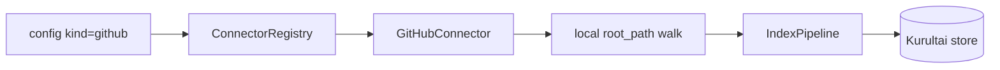

# feat: Phase 4 GitHub filesystem code connector

**Target repo:** `duketopceo/kurultai`  
**Audience:** solo (local repos on disk)  
**Base:** `main` after Phase 4 Dayflow + Pond (#62)  
**Process:** PR-only

## Goal Capsule

Solo users can index a **local git/checkout tree** (Pace-Server, luke-agents, kurultai itself, etc.) into the same SQLite brain via `kind = "github"` — FTS-first, no GitHub API key, no CodeGraph/Composio.

**Stop when:** fixture repo indexes to searchable atoms; missing/invalid `root_path` errors clearly; registry wires `SourceKind::GitHub`; tests + CI green on a PR; README notes GitHub filesystem slice.

**Do not:** Composio, WASM/Python plugins (#14), AppFlowy (#4), CodeGraph symbol graph, live GitHub REST clone, coverage % hard gate, Phase 5 prod work.

**Assumption (LFG headless):** “next phase” = continue **Phase 4** with the next deferred #8 item (GitHub/code), not jump to Phase 5. Pond/Dayflow already shipped; closeout of #8 waits until more slices land.

**Product Contract preservation:** new bootstrap (no prior requirements-only sibling).

---

## Product Contract

### Summary

Phase 4 second slice of [#8](https://github.com/duketopceo/kurultai/issues/8): ship a **local filesystem code connector** registered as `SourceKind::GitHub` (name matches roadmap “GitHub/Code”; transport is disk walk like markdown, not the GitHub API).

### Requirements

| ID | Requirement |
|----|-------------|
| R1 | **GitHubConnector** walks `root_path`, emits `KnowledgeAtom` with `source` = config source name (or `"github"` convention consistent with other connectors — use config `name` on atoms like markdown). |
| R2 | Config: `kind = "github"` + required `root_path` in `extra`; optional `extensions` (comma list) and `max_file_bytes` (skip larger files). |
| R3 | Skip VCS/build junk dirs: `.git`, `target`, `node_modules`, `dist`, `build`, `vendor`, `__pycache__`, `.venv`, and other hidden dirs (same spirit as markdown). |
| R4 | Default extensions cover common code/docs: `rs,py,ts,tsx,js,jsx,go,java,c,cpp,h,hpp,rb,sh,md,toml,yaml,yml,json`. Binary/non-UTF8 → skip with debug log, no panic. |
| R5 | Chunk oversized files by word budget (~400 words) with path+chunk title prefix; `source_id` = relative path (+ chunk index when split). |
| R6 | `poll` uses mtime watermark; `full_sync` clears watermark semantics like markdown. |
| R7 | Register in `ConnectorRegistry`; remove “not implemented” error for `SourceKind::GitHub`. |
| R8 | Tests: unit fixture tree + integration index→FTS (extend `tests/phase4_connectors_test.rs` or sibling); CI green. |
| R9 | README: GitHub listed as live (filesystem); Phase 4 row notes GitHub slice; #8 still open for Composio/plugins. |

### Actors / flows

- A1 Solo user · F1 `kurultai index` with github source · F2 `search`/`ask` over code atoms · F3 CI fixture

### Scope boundaries

**In:** R1–R9 — `src/connectors/github.rs`, registry/mod wiring, fixture + tests, light README.

**Deferred for later**

- Composio meta-connector (#8)
- Plugin system / marketplace (#14)
- CodeGraph / tree-sitter symbol edges (Phoenixrr2113/codebase-graph)
- CocoIndex sidecar integrate
- GitHub REST API / remote clone without local checkout
- AppFlowy (#4), distillation (#12)
- TechTracker composite (#8 remnant)

**Outside identity:** Chat UI, multi-tenant RBAC, treating git as brain truth (connector only).

### Acceptance examples

- AE1. Fixture tree with `src/lib.rs` containing `KNOWN_GITHUB_PHRASE_42` → `full_sync` ≥1 atom; index → FTS search hits phrase.
- AE2. Missing `root_path` → init error mentioning `root_path`.
- AE3. Path under skipped `node_modules/` never produces atoms.
- AE4. Registry `from_config` with enabled github + valid root succeeds (replaces prior unimplemented error).

---

## Planning Contract

### Assumptions

| Decision | Class | Rejected | Why |
|----------|-------|----------|-----|
| PR-only landing | user-directed | push to main | process |
| Next phase = Phase 4 GitHub slice | LFG headless | Phase 5 / Composio first | #8 sequence after Pond/Dayflow; local-first solo |
| Disk walk, not GitHub API | inferred | REST clone | No token; matches markdown pattern; repos already on disk |
| No tree-sitter this slice | inferred | CodeGraph in same PR | Ship FTS path; symbol graph later |
| Keep enum name `GitHub` | convention | rename to `Code` | Already in types/config; roadmap says GitHub |

### Key Technical Decisions

| KTD | Decision | Why |
|-----|----------|-----|
| KTD1 | Mirror `MarkdownConnector` structure (walk + mtime poll + validate_readable_path) | Proven pattern; minimal new surface |
| KTD2 | Atom `source` field = config source **name** (e.g. `pace`) like markdown | Delete-by-source + multi-repo configs |
| KTD3 | Title = relative path; content prefix `[path]` for search context | Token doctrine / AgentAtomView |
| KTD4 | Cap file size (default ~256 KiB) before read | Avoid giant lockfiles / generated blobs |
| KTD5 | Reuse word-split chunking idea; no language AST | Enough for FTS; AST deferred |

### High-Level Technical Design



### Risks

| Risk | Mitigation |
|------|------------|
| Huge monorepo first index | `max_file_bytes` + skip dirs + chunk cap |
| Binary false positives | UTF-8 lossy skip / invalid utf8 skip |
| Name confusion “GitHub” vs API | Docs: filesystem checkout; API later |

### Implementation Units

### U1. Unified plan artifact (this file)

**Verify:** Frontmatter `implementation-ready` + `execution: code`.

### U2. GitHubConnector + registry

**Files:** `src/connectors/github.rs`, `src/connectors/mod.rs`, `src/connectors/registry.rs`

**Verify:** Unit tests in `github.rs`; registry accepts `SourceKind::GitHub`; old unimplemented test updated to success path or split.

### U3. Phase 4 integration + README

**Files:** `tests/phase4_connectors_test.rs` (or `tests/fixtures/code_repo/`), `README.md`

**Verify:** AE1–AE4; `cargo test --locked` / clippy green.

---

## Verification Contract

```bash
cargo fmt --check
cargo clippy --all-targets -- -D warnings
cargo test --locked
# or CI: cargo nextest run --locked
```

---

## Definition of Done

- [ ] GitHubConnector registered and fixture-searchable
- [ ] Unimplemented GitHub registry error gone
- [ ] README Phase 4 / components reflect filesystem GitHub
- [ ] PR open, CI green
- [ ] #8 remains open (Composio/plugins still pending); no false close
