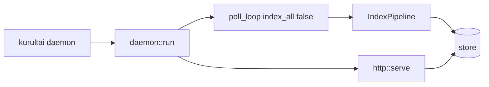

# feat: Phase 5 daemon background poll loop

**Target repo:** `duketopceo/kurultai`  
**Audience:** team (shared local/self-hosted daemon)  
**Base:** `main` after Phase 4 closeout (#64)  
**Process:** PR-only

## Goal Capsule

`kurultai daemon` actually **keeps the brain fresh**: while serving HTTP on localhost, periodically run incremental `index_all(..., full=false)` on the configured `poll_interval_secs` — matching the CLI help text that already claims the daemon polls sources.

**Stop when:** daemon spawns a poll loop + HTTP; `--no-poll` disables it; interval overridable; soft-fail per poll cycle (log + continue); tests + CI green; README Phase 5 row notes this slice.

**Do not:** llama.cpp local embed; ARC/#20 self-hosted runners; notify file-watch (follow-up); auth/bind beyond localhost; Windows CI; coverage hard gate; Phase 5 closeout.

**Assumption (LFG headless):** “/lfg 5” = first Phase 5 product slice, not full #9/#20 epic. Closing Milestone 4 failed with agent 403 — out of scope for this PR; maintainer still runs `gh api -X PATCH .../milestones/4 -f state=closed`.

**Product Contract preservation:** new bootstrap.

---

## Product Contract

### Summary

Phase 5 first slice of [#9](https://github.com/duketopceo/kurultai/issues/9): make the existing daemon a **shared poll + HTTP** process so teams don’t need cron for incremental re-index.

### Requirements

| ID | Requirement |
|----|-------------|
| R1 | Daemon runs HTTP serve **and** a background poll loop (default on). |
| R2 | Poll uses incremental index (`full=false`) across enabled connectors via existing `IndexPipeline::index_all`. |
| R3 | Interval from `Config.poll_interval_secs` (default already 300); CLI `--poll-interval <secs>` overrides; `--no-poll` disables. |
| R4 | Poll errors soft-fail: log + continue next tick; do not tear down HTTP. |
| R5 | **Immediate first poll**, then sleep the configured interval between cycles (hard contract). |
| R6 | Tests cover: immediate first cycle, `--no-poll` still serves `/health`, connector-error soft-fail while HTTP stays up. |
| R7 | README Phase 5 row + Quality/daemon blurb updated; plan linked. |

### Actors / flows

- A1 Solo/team operator · F1 `kurultai daemon` · F2 HTTP search while sources re-index · F3 CI

### Scope boundaries

**In:** R1–R7 — `src/main.rs`, small `src/daemon/` (or `http` helper), tests, README.

**Deferred for later**

- `notify` filesystem watch (#9)
- Local llama.cpp embeddings (#9)
- ARC self-hosted CI (#20)
- Bind address / auth / TLS
- Example config pack / full docs site
- cargo-deny / coverage ≥75%

**Outside identity:** Multi-tenant cloud hosting, managed SaaS.

### Acceptance examples

- AE1. Daemon with `--poll-interval 1` and a fixture markdown source eventually indexes new/changed files without a second `kurultai index` (or unit test proves `index_all(false)` invoked ≥1).  
- AE2. `--no-poll` serves `/health` and never calls index (mock/counter).  
- AE3. Forced connector error during poll does not stop HTTP `/health` → 200.

---

## Planning Contract

### Assumptions

| Decision | Class | Rejected | Why |
|----------|-------|----------|-----|
| Poll loop first, not notify | LFG headless | Full #9 in one PR | Unblocks cron-free freshness; notify later |
| Soft-fail poll | inferred | Crash daemon on index err | Production readiness |
| Keep localhost-only HTTP | prior (#60) | Open bind | Security; auth later |

### Key Technical Decisions

| KTD | Decision | Why |
|-----|----------|-----|
| KTD1 | `tokio::select!` HTTP serve vs never-ending poll task (or JoinSet) | Clean shutdown when serve ends |
| KTD2 | **Immediate first poll**, then sleep | Cold start freshness; tested |
| KTD3 | New `src/daemon/mod.rs` owning poll+serve orchestration; `http::serve` stays pure | Surgical, testable |
| KTD4 | Share `App` pieces via `Arc` for poll task | Avoid cloning heavy state |

### High-Level Technical Design



### Risks

| Risk | Mitigation |
|------|------------|
| Long index blocks tokio | `index_all` already async; connectors use spawn_blocking where needed |
| Overlap polls | Single-flight: skip/wait if previous poll still running |

### Implementation Units

### U1. Plan artifact (this file)

**Verify:** `implementation-ready` + `execution: code`.

### U2. daemon module + CLI flags

**Files:** `src/daemon/mod.rs`, `src/lib.rs`, `src/main.rs`

**Verify:** `--no-poll`, `--poll-interval`; AE2/AE3.

### U3. Tests + README

**Files:** `tests/phase5_daemon_test.rs` (or unit tests in `daemon`), `README.md`

**Verify:** AE1–AE3; `cargo test` / clippy green.

---

## Verification Contract

```bash
cargo fmt --check
cargo clippy --all-targets -- -D warnings
cargo test --locked
```

---

## Definition of Done

- [ ] Daemon polls by default; flags work  
- [ ] Soft-fail + single-flight  
- [ ] Tests + CI green  
- [ ] README Phase 5 notes slice  
- [ ] #9 remains open (more Phase 5 work)  
