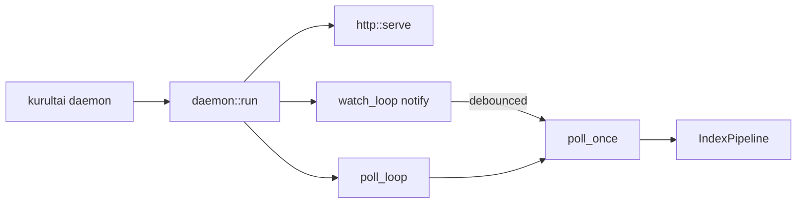

# feat: Phase 5 notify filesystem watch

**Target repo:** `duketopceo/kurultai`  
**Audience:** team (shared local/self-hosted daemon)  
**Base:** `main` after daemon poll (#65)  
**Process:** PR-only

## Goal Capsule

While `kurultai daemon` serves HTTP (and optionally polls on an interval), also **watch filesystem roots** for enabled markdown/github sources via the already-declared `notify` crate, and trigger a **debounced incremental** `index_all(..., false)` when files change — so edits show up without waiting for the next poll tick.

**Stop when:** watch runs beside poll/HTTP; debounce + soft-fail; `--no-watch` disables; roots from config (`root_path` / `vault_path`); tests + CI green; README Phase 5 row notes this slice.

**Do not:** llama.cpp / local ONNX embeddings; ARC/#20; GlitchTip/#35; env hardening/#29 beyond what exists; per-source poll intervals; pond CLI watching; auth/bind beyond localhost; Windows CI; Phase 5 closeout / closing Milestone 5.

**Assumption (LFG headless):** “/lfg on phase 5” = next product slice after daemon poll = **notify watch**, not full Milestone 5 epic. #9 closed early with #65; track against Milestone 5 + this plan.

**Product Contract preservation:** new bootstrap.

---

## Product Contract

### Summary

Second Phase 5 product slice: real-time (debounced) re-index of local FS-backed sources so the shared daemon stays fresh between poll intervals.

### Requirements

| ID | Requirement |
|----|-------------|
| R1 | Daemon optionally runs a notify watcher on enabled markdown/github `root_path` (and markdown deprecated `vault_path`) directories. |
| R2 | File change events debounce (≥250ms, single-flight with poll) then call incremental `poll_once` / `index_all(false)`. |
| R3 | Watch on by default when at least one watchable root exists; `--no-watch` disables. |
| R4 | Watch errors / index errors soft-fail: log + continue; do not tear down HTTP. |
| R5 | Pond stays poll-only; Dayflow optional later (SQLite file watch) — **out of this PR**. |
| R6 | Tests: event → index; `--no-watch` still serves `/health`; abort cancels watch; debounce/single-flight does not panic under burst. |
| R7 | README Phase 5 row + plan linked. |

### Actors / flows

- A1 Operator · F1 edit markdown under watched root · F2 HTTP search sees update · F3 CI

### Scope boundaries

**In:** R1–R7 — `src/daemon/` (+ optional `watch.rs`), `src/main.rs`, config root discovery helper, tests, README.

**Deferred**

- llama.cpp / ONNX embeddings
- Dayflow SQLite file watch
- Per-source watch enable flags
- ARC / GlitchTip / env milestone issues
- Phase 5 closeout

### Acceptance examples

- AE1. Temp markdown root under daemon with watch: write/update `.md` → after debounce, FTS finds new phrase (or unit test proves poll triggered by notify event).  
- AE2. `--no-watch` serves `/health` and does not register watchers.  
- AE3. Burst of events + soft-fail index error does not stop HTTP.

---

## Planning Contract

### Assumptions

| Decision | Class | Rejected | Why |
|----------|-------|----------|-----|
| Notify next, not llama.cpp | LFG headless | Embeddings first | README sequence; notify already in Cargo.toml unused |
| Config-derived roots | inferred | New Connector::watch_paths API | Surgical; no trait churn |
| Coarse `poll_once` on any event | inferred | Per-file reindex API | Reuses mtime incremental poll |
| Debounce + single-flight mutex | inferred | Fire every event | Avoid stampede |

### Key Technical Decisions

| KTD | Decision | Why |
|-----|----------|-----|
| KTD1 | `notify::recommended_watcher` recursive on each root | Crate already pinned at 6 |
| KTD2 | Hand-rolled debounce via `tokio::sync` channel + sleep (no new dep) | Keep Cargo.toml lean |
| KTD3 | Shared `Arc<tokio::sync::Mutex<()>>` (or similar) so poll loop and watch cannot overlap `poll_once` | Matches prior poll plan risk |
| KTD4 | Extend `daemon::run` with `watch: bool` + `watch_roots: Vec<PathBuf>` from main | Keep connectors Arc-shared |
| KTD5 | `AbortOnDrop` / abort watch join handle with poll | Same lifecycle as #65 |

### High-Level Technical Design



### Risks

| Risk | Mitigation |
|------|------------|
| Event stampede | Debounce window; single-flight |
| Missing roots / nonexistent path | Skip + warn at start; do not fail daemon |
| Cross-platform notify quirks | Unit-test with tempfile; CI Linux+macOS already |

### Implementation Units

### U1. Plan artifact (this file)

**Verify:** `implementation-ready` + `execution: code`.

### U2. Watch roots helper + daemon watch loop

**Files:** `src/daemon/mod.rs` (and/or `src/daemon/watch.rs`), `src/lib.rs` if needed, `src/main.rs`, config types if a tiny helper lives near config

**Verify:** R1–R5; AE2/AE3.

### U3. Tests + README

**Files:** `src/daemon/*.rs` tests and/or `tests/phase5_notify_test.rs`, `README.md`

**Verify:** AE1–AE3; fmt/clippy/test green.

---

## Verification Contract

```bash
cargo fmt --check
cargo clippy --all-targets -- -D warnings
cargo test --locked
```

---

## Definition of Done

- [ ] Watch on by default for markdown/github roots; `--no-watch` works  
- [ ] Debounce + single-flight + soft-fail  
- [ ] Tests + CI green  
- [ ] README Phase 5 notes notify slice  
- [ ] Milestone 5 remains open (llama.cpp / #20 / etc.)  
