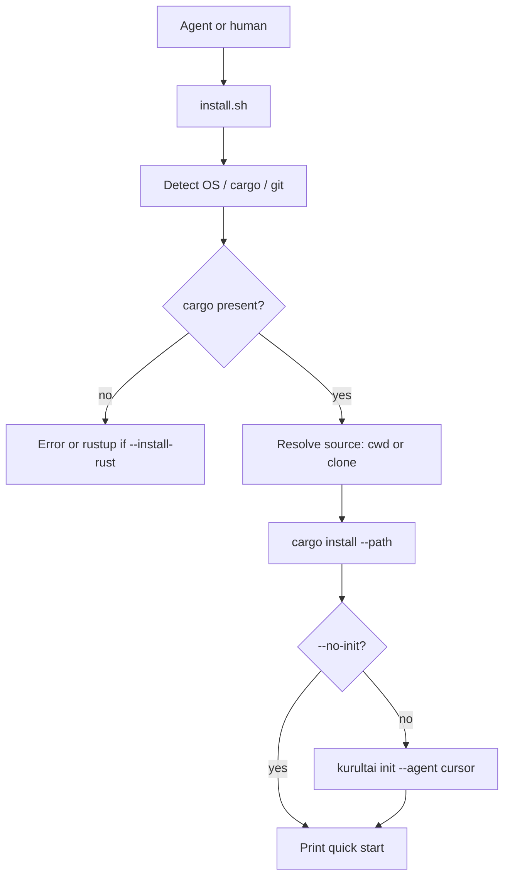

# feat: v1 personal agent installer (#72)

**Target repo:** `duketopceo/kurultai`  
**Audience:** developer / solo  
**Base:** `main` (includes local `docs(agent-zero)` commit if present)  
**Process:** PR-only

## Goal Capsule

Ship a **personal one-command install path** so an agent or human can bootstrap Kurultai without a multi-step manual dance: detect environment → ensure Rust toolchain → build/install binary → ensure default config → optionally wire MCP (`cursor`) → print quick start.

**Stop when:** `scripts/install/install.sh` works on macOS/Linux; idempotent re-run; dry-run/help; tests cover key branches; README + `docs/agent-zero` point at the installer and #72; CI green.

**Do not:** team/company installer modes (#72 later phases); Windows install.ps1; auto-install system Rust via unattended rustup without user-visible flags; team shared daemon; PostgreSQL/SSO/Helm; full #73–#76 product work in this PR.

**Assumption (LFG headless):** “/lfg on new issues you just added” = **first P0 from Agent Zero v1 pack** = personal installer **#72**, not all five issues in one PR. #73–#76 remain open follow-ups (work-relationships).

**Product Contract preservation:** new bootstrap from #72 + `docs/agent-zero/ISSUE-004-agent-installer.md`.

---

## Product Contract

### Summary

Lower the barrier to entry for developer/solo: a documented, scriptable personal install that agents can run (“install kurultai brain from github”) using the existing Rust CLI (`init`, `index`, `search`) rather than inventing a second binary.

### Requirements

| ID | Requirement |
|----|-------------|
| R1 | Provide `scripts/install/install.sh` for Linux/macOS personal install. |
| R2 | Detect OS/shell; require or offer Rust toolchain (`rustc`/`cargo`); fail with clear message if missing and `--install-rust` not set. |
| R3 | Build or install `kurultai` binary (default: `cargo install --path . --locked` from a clone or current repo). |
| R4 | Ensure default config exists (reuse `kurultai init` / `ensure_default_config` path — invoke installed binary). |
| R5 | Optional MCP wire: `--agent cursor` (default on) calls `kurultai init --agent cursor`. |
| R6 | Flags: `--help`, `--dry-run`, `--skip-build`, `--no-init`, `--repo-url`, `--install-dir` / use cargo default bin dir. |
| R7 | Idempotent: second run does not corrupt existing `mcp.json` / config (existing `wire_agent` / `ensure_default_config` semantics). |
| R8 | Tests: unit/integration or shell tests for dry-run path and argument parsing; CI still `cargo test --locked`. |
| R9 | README documents agent one-liner + link to #72 / `docs/agent-zero`. |

### Actors / flows

- A1 Developer · A2 Coding agent · F1 first-time install · F2 re-run · F3 CI

### Scope boundaries

**In:** R1–R9 — shell installer, tests, README, agent-zero INDEX status if needed.

**Deferred to Follow-Up Work (work-relationships)**

| Area | Issue | Relationship |
|------|-------|--------------|
| Scheduled background indexing (nightly/idle gaps) | #73 | After personal install; builds on Phase 5 poll/notify |
| Multi-hop graph orchestration | #74 | Search depth; independent of installer |
| Citations contract completion | #75 | Trust surface; independent |
| Dev dashboard UI + WS | #76 | Stretch; needs HTTP daemon already present |

**Outside this product identity**

- Team/company install modes, Helm, SSO, multi-node cluster

### Acceptance examples

- AE1. `./scripts/install/install.sh --dry-run` prints planned steps without mutating system.  
- AE2. With cargo available, install from repo path builds/installs binary and `kurultai --help` succeeds.  
- AE3. Re-run with config already present does not wipe sources; init/wire remains safe.  
- AE4. `--no-init` skips MCP wire.

---

## Planning Contract

### Assumptions

| Decision | Class | Rejected | Why |
|----------|-------|----------|-----|
| One P0 slice (#72) not all five issues | LFG headless + INDEX | Mega-PR | Matches prior Phase 5 LFG slice size |
| Shell script not new Rust installer binary | inferred | `bin/kurultai-installer` crate | Faster ship; issue draft’s Rust binary is later polish |
| Delegate config/MCP to existing `kurultai init` | inferred | Reimplement TOML/MCP in bash | DRY; tested Rust path |
| Optional rustup via `--install-rust` only | inferred | Always curl rustup | Safer for agents/CI |

### Key Technical Decisions

| KTD | Decision | Why |
|-----|----------|-----|
| KTD1 | Bash installer under `scripts/install/install.sh` with `set -euo pipefail` | Homelab/agent standards; no new crate |
| KTD2 | Prefer operating on **current checkout** when script is run from a clone; else clone `REPO_URL` to temp or `KURULTAI_SRC` | Agent “from github” and dev “from tree” both work |
| KTD3 | Install via `cargo install --path <src> --locked --force` | Puts binary on `~/.cargo/bin` path agents already use |
| KTD4 | After install: `kurultai init --agent cursor` unless `--no-init` | Reuses `src/mcp/init.rs` |
| KTD5 | Test with `tests/install_script_test.rs` using `assert_cmd` / temp dirs **or** a pure bash test invoked from a small Rust test / script under `scripts/install/test-install.sh` called from CI docs — prefer **Rust-driven** dry-run that executes bash `-n` + dry-run | Matches existing `assert_cmd` patterns in `tests/cli_smoke.rs` |

### High-Level Technical Design



### Risks

| Risk | Mitigation |
|------|------------|
| Long build times | Document; `--skip-build` for re-wire only |
| Overwrite MCP | Existing merge semantics in `wire_agent` |
| CI without network clone | Test dry-run + bash -n; full install optional offline on tree |

### Implementation Units

### U1. Plan artifact (this file)

**Verify:** `implementation-ready` + `execution: code`.

### U2. Personal install script

**Goal:** Ship `scripts/install/install.sh` implementing R1–R7.

**Requirements:** R1–R7  
**Dependencies:** none  
**Files:** `scripts/install/install.sh`, optionally `scripts/install/README.md` (skip if README root enough)

**Approach:**
1. Parse flags (`--dry-run`, `--no-init`, `--skip-build`, `--install-rust`, `--agent`, `--repo-url`, `--src`).
2. Resolve source directory.
3. Build/install or skip.
4. Run init unless disabled.
5. Print next steps (`kurultai index --full`, `kurultai search …`).

**Patterns to follow:** `scripts/phase-*-closeout.sh` style (`set -euo pipefail`, log helpers); `src/mcp/init.rs` for post-install.

**Test scenarios:**
- Dry-run exits 0 and does not write config.
- Missing cargo without `--install-rust` exits non-zero with message.
- Help flag prints usage.

**Verification:** Script is executable; dry-run works from repo root.

### U3. Tests + README + agent-zero linkage

**Goal:** Prove installer contract and document for agents.

**Requirements:** R8–R9  
**Dependencies:** U2  
**Files:** `tests/install_script_test.rs` (or equivalent), `README.md`, `docs/agent-zero/INDEX.md` (status line for #72 in progress)

**Approach:**
- Rust test: `bash -n scripts/install/install.sh`; run `--dry-run` / `--help`.
- README: “Agent install” section with one-liner curl|bash **or** clone+script (prefer clone path for trust).
- INDEX: note LFG slice for #72.

**Test scenarios:**
- Covers AE1–AE4 at least as automated dry-run/help + documented manual AE2.
- `cargo test --locked` includes new test module.

**Verification:** fmt/clippy/test green; README links #72.

---

## Verification Contract

```bash
cargo fmt --check
cargo clippy --all-targets -- -D warnings
cargo test --locked
bash -n scripts/install/install.sh
```

---

## Definition of Done

- [ ] Personal install script ships and is documented  
- [ ] Idempotent init path via existing CLI  
- [ ] Tests for help/dry-run/syntax  
- [ ] README + agent-zero INDEX updated  
- [ ] #73–#76 not closed by this PR  
- [ ] PR references #72  

---

## Sources & Research

- `docs/agent-zero/ISSUE-004-agent-installer.md`, `docs/agent-zero/INDEX.md`
- GitHub #72, #27
- Existing: `src/mcp/init.rs`, `src/main.rs` Init command, `tests/cli_smoke.rs`
- Prior LFG slice pattern: `docs/plans/2026-07-25-004-feat-phase-5-notify-watch-plan.md`
