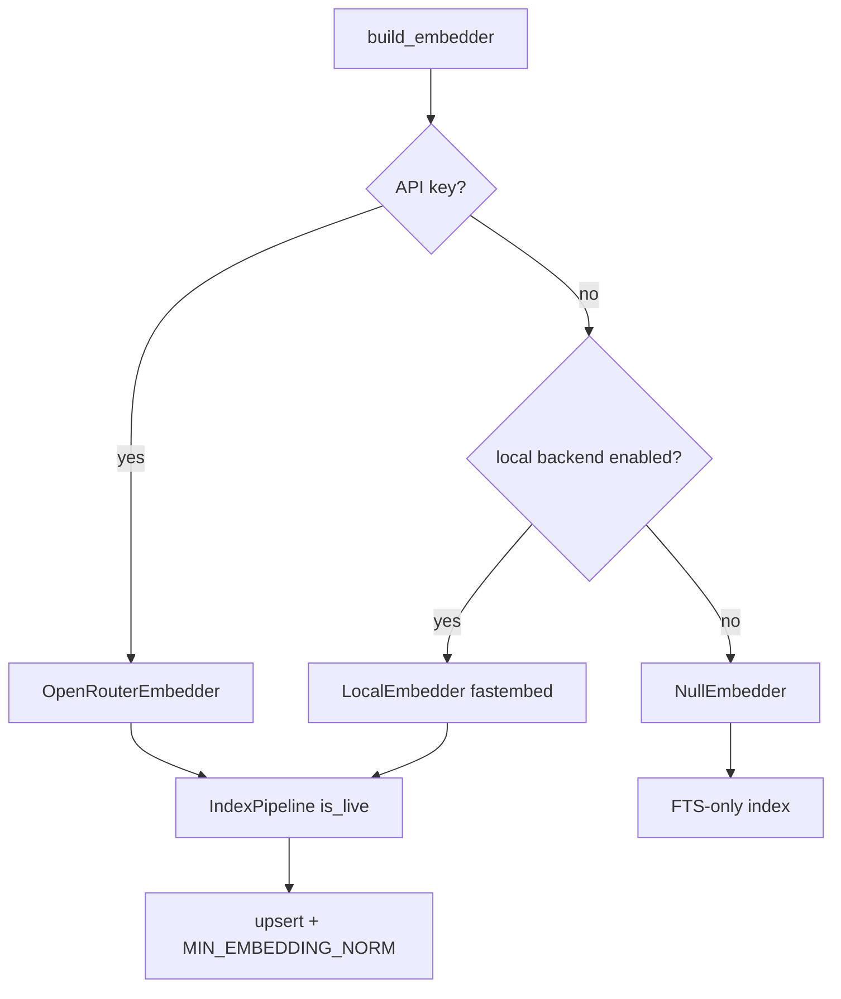

# feat: Phase 5 local embeddings (fastembed/ONNX)

**Target repo:** `duketopceo/kurultai`  
**Audience:** team / privacy-sensitive solo  
**Base:** `main` after PR #77 merge (v1 Agent Zero)  
**Process:** PR-only

## Goal Capsule

Ship an **opt-in local embedder** so indexing and hybrid search can write/query real vectors **without** OpenRouter, while **FTS-first** stays the default: no API key and no local backend configured → `NullEmbedder` / FTS-only. Preserve store `MIN_EMBEDDING_NORM` zero-vector guard and CI key-clearing for FTS fixtures.

**Stop when:** config selects local backend; `LocalEmbedder` implements `Embedder` with `is_live() == true`; bootstrap prefers OpenRouter key → else local when enabled → else Null; dim mismatch fails fast via existing `ensure_vec_table` / embed dim checks; tests cover live/local/null paths without network; README Phase 5 row updated; learning `docs/solutions/architecture-patterns/fts-first-null-embedder-no-zero-vectors.md` still true.

**Do not:** ARC/#20; GlitchTip/#35; envs deploy/#29; MCP source-scope product work; llama.cpp bindings; auto-download of multi-GB models in CI; changing default cloud model; Phase 5 closeout / closing Milestone 5; hardcore tag taxonomies.

**Assumption (LFG headless):** Prefer **fastembed (ONNX in-process)** over llama.cpp — matches `docs/upstream-inspiration.md` (Stratum nomic / remembrallmcp MiniLM) and Cargo/CI friendliness. Local models typically use **384 or 768 dims**, not 3072 — require matching `embed.dimension` + storage path (or full reindex); never silent dim mix.

**Product Contract preservation:** new bootstrap.

---

## Product Contract

### Summary

Phase 5 embeddings slice from [#9](https://github.com/duketopceo/kurultai/issues/9) (issue closed early; work remains on Milestone 5): optional offline vectors via ONNX/fastembed behind the existing `Embedder` trait.

### Requirements

| ID | Requirement |
|----|-------------|
| R1 | Config can enable a **local** embed backend (explicit opt-in). |
| R2 | `LocalEmbedder` implements `Embedder`: `is_live() == true`, `dim()` matches config, `embed` / `embed_batch` return finite non-zero-norm vectors for non-empty text. |
| R3 | Bootstrap order: **OpenRouter when API key present** → else **local when enabled** → else **NullEmbedder**. |
| R4 | Empty/whitespace text still errors (same contract as OpenRouter path). |
| R5 | Dimension mismatch against opened store still fails via existing migration/`ensure_vec_table` rules — document operator steps (new storage path or full reindex). |
| R6 | CI / default tests stay FTS-only (no ambient local model download required for `cargo test`). |
| R7 | At least one unit/integration test uses a **fake or tiny fixture local embedder** (or feature-gated real fastembed) proving pipeline indexes vectors when live. |
| R8 | README Phase 5 row + short config example; status CLI names the local embedder when live. |
| R9 | FTS-first learning remains accurate (NullEmbedder when neither key nor local). |

### Actors / flows

- A1 Solo/offline operator · F1 `kurultai index` with local backend · F2 hybrid search with vectors · F3 CI FTS-only · F4 Operator with existing 3072 OpenRouter store switching to local

### Scope boundaries

**In:** R1–R9 — `src/embed/`, `src/app/context.rs`, config loader/types, tests, README, optional `Cargo.toml` feature.

**Deferred**

- llama.cpp / GGUF path
- Auto model download UX beyond what fastembed already does (cache dir docs only)
- Reranker local ONNX
- MCP `ask`/`search` source-scope filters (separate ops concern)
- ARC, GlitchTip, env deploy model

**Outside identity:** Managed SaaS embeddings.

### Acceptance examples

- AE1. No API key, local disabled → status shows FTS-only NullEmbedder; index writes no `atoms_vec` rows for new atoms.
- AE2. No API key, local enabled with dim matching empty/new store → index writes vec rows; search can return vector arm hits (or unit proves `is_live` + upsert norm).
- AE3. API key set overrides local for bootstrap (OpenRouter used).
- AE4. Config local dim ≠ store `embed_dim` meta → clear error (no silent KNN corruption).

---

## Planning Contract

### Assumptions

| Decision | Class | Rejected | Why |
|----------|-------|----------|-----|
| fastembed/ONNX first, not llama.cpp | LFG headless | llama.cpp as first local path | Cargo/CI; upstream inspiration |
| Opt-in local; Null default | session-settled: FTS-first | Always-on local download | Never block core loop |
| Embeddings-only slice | session-settled: workstream #2 | Full M5 epic | Independently shippable |
| MCP scope filters out of scope | session-settled: ops advice | Bundle knowledge IA into this PR | Separate product surface |

### Key Technical Decisions

| KTD | Decision | Why |
|-----|----------|-----|
| KTD1 | Backend enum/string: `openrouter` (implicit via key) / `local` / default none | Explicit opt-in; no magic |
| KTD2 | Default local model: small MiniLM-class via fastembed (e.g. `all-MiniLM-L6-v2`, dim 384) **or** document nomic-768 if research prefers quality — pick one in U2 and pin dim in config example | Ship something; avoid 3072 local fantasy |
| KTD3 | `embed.dimension` must equal model output; refuse start/upsert on mismatch | Existing store guard pattern |
| KTD4 | Optional Cargo feature `local-embed` if fastembed is heavy — default **on for normal builds** or **off with clear README**; choose lighter of (always-dep vs feature). Prefer **optional feature off by default in CI** if download/link cost breaks CI; unit tests use a `FakeLiveEmbedder` already-pattern from pipeline tests | CI green without network |
| KTD5 | OpenRouter key wins over local when both set | Predictable; cloud intentional when keyed |
| KTD6 | session-settled: FTS-first NullEmbedder when neither key nor local | Doctrine learning |

### High-Level Technical Design



### Risks

| Risk | Mitigation |
|------|------------|
| Dim 384 vs existing 3072 stores | Docs + fail-fast; recommend new `storage.path` for local profile |
| fastembed download in CI | Feature gate / FakeLiveEmbedder; never require network in default tests |
| Large binary size | Optional feature; document |
| Model quality vs OpenRouter 3072 | Local is privacy/offline tier, not parity claim |

### Implementation Units

### U1. Plan artifact (this file)

**Verify:** `implementation-ready` + `execution: code`.

### U2. Config + LocalEmbedder + bootstrap

**Files:** `src/embed/mod.rs` (or `src/embed/local.rs`), `src/app/context.rs`, `src/config/file.rs`, `src/config/loader.rs`, `src/types.rs`, `Cargo.toml`

**Verify:** AE1–AE4; unit tests for bootstrap selection; FakeLiveEmbedder path if feature off.

### U3. Tests + README + learning touch (if wording drifts)

**Files:** `src/embed/mod.rs` tests, `tests/` as needed, `README.md`, optionally one line in FTS-first learning “local opt-in remains live; absence → Null”

**Verify:** `cargo fmt`, `clippy -D warnings`, `cargo test --locked` (default features); optional `--features local-embed` smoke if enabled.

---

## Verification Contract

```bash
cargo fmt --check
cargo clippy --all-targets -- -D warnings
cargo test --locked
# if feature exists:
# cargo test --locked --features local-embed
```

---

## Definition of Done

- [ ] Local embed opt-in works; Null default preserved  
- [ ] Bootstrap priority key → local → null  
- [ ] Dim / zero-vector guards intact  
- [ ] Tests + CI green without mandatory model download  
- [ ] README Phase 5 updated  
- [ ] Milestone 5 remains open (ARC/ops follow)  

## Work relationships

- **Depends on:** main including daemon poll (#65), notify (#66), Agent Zero v1 (#77)  
- **Unblocks:** offline hybrid search demos; privacy-sensitive installs  
- **Separate later:** MCP source scopes; llama.cpp; release `v0.1.0`; CodeGraph #78  
