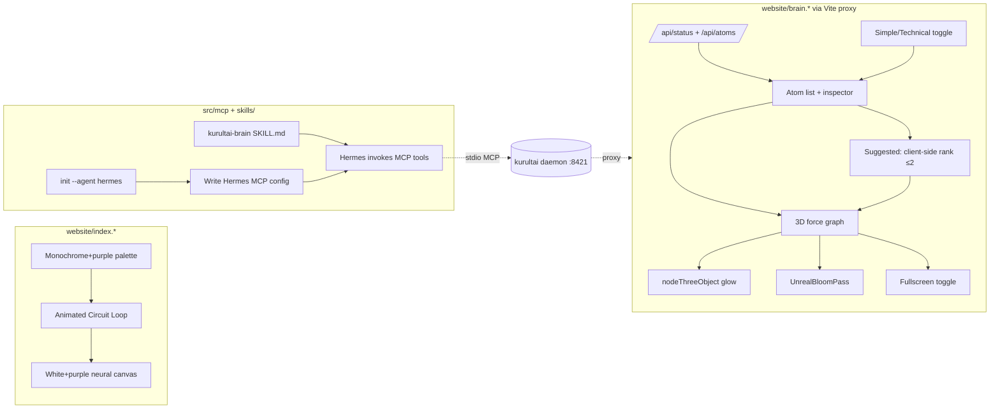

# feat: website wow-brain + Simple/Technical toggle + Hermes MCP/SKILL

**Target repo:** `duketopceo/kurultai`
**Base:** `main`
**Process:** PR-only · branch `feat/website-wow-brain-hermes-mcp`

## Goal Capsule

Turn the `website/` folder into a high-contrast black/white + purple "wow" experience wired to the live kurultai daemon, add a Simple/Technical view toggle so non-technical users can explore the brain, upgrade the 3D synaptic map to a glowing electric bloom scene with fullscreen + frequency-based suggestions, and make kurultai usable from NousResearch's Hermes Agent via `init --agent hermes` MCP wiring plus a portable SKILL.md plugin.

**Stop when:** landing is monochrome+purple with an upgraded neural circuit loop; brain.html has a working Simple/Technical toggle defaulting to Simple; the 3D graph renders glowing nodes with bloom, fewer/tuned particles, fullscreen, and a 2-max Suggested action that animates the map; `kurultai init --agent hermes` writes Hermes MCP config idempotently; a `kurultai-brain` SKILL.md ships; tests + browser smoke green; PR open.

**Do not:** regenerate the `neural_tech_banner.jpg` asset (deferred); rebuild the Rust daemon for new endpoints (suggestions are client-side); build a Hermes-native Python plugin; ship a Hermes memory provider; change the MCP tool surface (search/cite/ask/who_knows/remember stays); touch the daemon's embedded `/ui` dashboard.

**Product Contract preservation:** N/A (bootstrap plan).

---

## Product Contract

### Requirements

| ID | Requirement |
|----|-------------|
| R1 | Landing (`website/index.html`, `index.css`, `index.js`) uses only black/white + purple (`#a855f7`/`#c084fc`) accents; all blue (`#38bdf8`/`rgba(56,189,248,...)`) and green (`#10b981`) references removed |
| R2 | Landing keeps the logo, Syncopate/Share Tech Mono/Inter fonts, big hero fonts, MIT License footer, OpenRouter footer link, and "Initialize Brain" CTA unchanged in intent |
| R3 | Landing "Neural Circuit Loop" section (`#architecture`) is upgraded to catch the eye — animated/electric, not static nodes with a pulsing arrow |
| R4 | Landing background neural canvas (`#neural-canvas`, `index.js`) keeps white + purple particles only (currently blue+purple); stays performant on web |
| R5 | `brain.html` exposes a Simple/Technical view toggle pill; Simple is the default |
| R6 | Simple View: simplified labels ("Stored Memories", "Data Sources", "Server Mode", "Memory Origin"), hides atom IDs, routing Q/A, and technical detail rows; Technical View: shows IDs, `question`/`resolution`, file paths, raw labels |
| R7 | 3D synapse graph (`brain.js`) renders glowing nodes via `nodeThreeObject` + `UnrealBloomPass` postprocessing on `Graph.scene()`; black background, white default nodes, purple (`#c084fc`) for tagged atoms, purple link particles |
| R8 | 3D particle/electron density is tuned down from current so it reads as electric, not cluttered, on web |
| R9 | 3D graph has a fullscreen toggle that expands the container to viewport and resizes the graph |
| R10 | 3D graph has a "Suggested" action (max 2 results) that ranks loaded atoms by a frequency/connectivity score derived client-side, then animates the map (`centerAt`/`zoomToFit`) to focus the top suggestion |
| R11 | 3D layout no longer strands white nodes far out in the distance — tighten force charge/centering so the graph stays compact |
| R12 | `kurultai init --agent hermes` writes the kurultai stdio MCP server into the Hermes Agent MCP config at the documented Hermes config path/format (resolve exact format from `hermes-agent.nousresearch.com/docs/user-guide/features/mcp` at implement time) |
| R13 | `kurultai init --agent all` now wires cursor + claude + codex + hermes |
| R14 | A portable `kurultai-brain` SKILL.md (agentskills.io-compatible) ships in the repo, teaching Hermes how to use the kurultai MCP tools (`search`/`cite`/`ask`/`who_knows`/`remember`) |
| R15 | README Agents section + `docs/mac-dev.md` list Hermes in the agent matrix with the restart note |
| R16 | Hermes config writer is idempotent, preserves sibling MCP servers, and refuses to overwrite malformed existing config (parity with existing Cursor/Claude/Codex writers) |

### Actors / Flows

| ID | Actor / flow |
|----|----------------|
| A1 | Non-technical visitor (the "English teacher") opening the brain explorer and switching to Simple View |
| A2 | Developer running `kurultai init --agent hermes` then restarting Hermes to get the kurultai tools |
| A3 | Hermes Agent invoking the kurultai SKILL.md to decide which MCP tool to call |
| F1 | Land on `index.html` → monochrome+purple, animated circuit loop → click "Initialize Brain" → quickstart |
| F2 | Open `brain.html` → Simple View default → browse atoms → click 3D "Suggested" → map animates → fullscreen |
| F3 | `init --agent hermes` → Hermes config written → restart Hermes → `search`/`cite`/`ask`/`who_knows`/`remember` available |

### Acceptance Examples

| ID | Example |
|----|---------|
| AE1 | A visitor switches to Simple View and sees no atom IDs, no routing Q/A, and friendly labels |
| AE2 | On `brain.html`, the 3D graph shows glowing purple/white nodes with a bloom halo and no scattered far-out white dots |
| AE3 | Clicking "Suggested" highlights ≤2 atoms and the camera moves to frame the top one |
| AE4 | `kurultai init --agent hermes` on a fresh home creates the Hermes MCP config with a `kurultai` server entry and no others removed |
| AE5 | Re-running `init --agent hermes` updates only the `kurultai` entry; sibling servers survive |

---

## Key Technical Decisions

### KTD1 — Monochrome + purple-only palette (session-settled: user-directed)
Chosen over multi-color (blue/green): the user wants high-contrast deep linear black and white with purple labels/things only. Enforced across `index.css`, `index.js`, `brain.html`, `brain.js`. Governs R1, R4, R7.

### KTD2 — Brain explorer wired to live daemon API via Vite proxy (session-settled: user-directed)
Chosen over hardcoded mock `brainAtoms`: the UI must reflect the actual local brain. `/api/*` proxied to `127.0.0.1:8421` by `website/vite.config.js` (already shipped this session). Governs R5–R11.

### KTD3 — 3D "wow" via `nodeThreeObject` + `UnrealBloomPass` (session-settled: user-approved)
Chosen over default `3d-force-graph` spheres: the user said current nodes look like "really simple photons," not electric/wow. Route: custom `nodeThreeObject` returning glowing Three.js sprites/icosahedrons + `EffectComposer` with `UnrealBloomPass` on `Graph.scene()`. Governs R7, R8. Reference: vasturiano/3d-force-graph `nodeThreeObject` + SO glow thread + DeepWiki node-visualization page.

### KTD4 — Suggested-atoms ranked client-side from `/api/atoms`
Chosen over a new daemon `/api/suggest` endpoint: avoids a Rust rebuild and keeps suggestions instant. Score = tag/source co-occurrence degree computed over the loaded atom list; top 2 returned. Governs R10.

### KTD5 — Hermes integration = MCP config wiring + portable SKILL.md
Chosen over a Hermes-native Python plugin/memory provider: kurultai is Rust and already ships a stdio MCP server; MCP is transport-agnostic and Hermes documents native MCP integration; the agentskills.io SKILL.md standard is cross-agent (Hermes/Claude Code/Cursor/Codex). Governs R12–R16.

### KTD6 — Simple View default, Technical View opt-in (session-settled: user-directed)
Chosen over Technical default: "extremely simple to get in, look around." Simple View hides IDs/routing/raw labels; Technical View restores them. Reuses the daemon embedded dashboard's view-mode toggle pattern as inspiration. Governs R5, R6.

---

## High-Level Technical Design

Three independent workstreams (Landing, Brain, Hermes) sharing only the palette discipline (KTD1). Landing and Brain are pure frontend (`website/`); Hermes is Rust + a new skill file + docs.

---

## Implementation Units

### U1. Landing monochrome+purple palette + animated circuit loop

**Goal:** Convert all blue/green accents in `website/index.*` to purple, keep logo/fonts/CTAs, and upgrade the Neural Circuit Loop into an animated electric scene.

**Requirements:** R1, R2, R3, R4

**Dependencies:** none

**Files:**
- `website/index.css` — modify
- `website/index.js` — modify
- `website/index.html` — modify

**Approach:**
1. Sweep `index.css` for `#38bdf8`, `rgba(56, 189, 248, ...)`, `#10b981`, `rgba(16, 185, 129, ...)` and replace with purple equivalents (`#a855f7`/`#c084fc`/`rgba(168,85,247,...)`). Affected: `.badge`, `.glass-panel:hover`, `.feature-icon`, `.node-kurultai`, `.node-source`, `.terminal-body` color, `.terminal-input::before` (already purple, keep), CTA radial gradient.
2. Keep `.logo` (Syncopate), hero `h1` 4.5rem, `.btn-primary` white-on-black, MIT footer, OpenRouter link, "Initialize Brain" CTA — intent unchanged.
3. `index.js` `Particle.color`: change `"rgba(56, 189, 248, "` to `"rgba(168, 85, 247, "`; keep the purple variant; tune `numParticles` divisor if density needs trimming for web perf.
4. Upgrade `#architecture` Neural Circuit Loop: replace the static `.flow-nodes` + pulsing `⇄` arrows with an animated SVG/Canvas loop — glowing nodes with animated electron particles traveling the edges (purple/white), reusing the `index.js` canvas particle idiom or a small dedicated canvas. Keep the three-node concept (Agent ↔ Kurultai Brain ↔ CodeGraph/DB).

**Patterns to follow:** existing `index.js` canvas particle system; existing `.badge`/`.feature-icon` purple-ready structure.

**Test scenarios:**
- Happy path: `index.html` loads with no blue/green color values remaining (grep assertion in a smoke test or visual check).
- Edge: particle canvas still animates on resize and mouse-move after color swap.
- Integration: nav pills (Showcase, Brain Stats, Atom Explorer, Vector Mapping, Circuit Loop, Developer Setup) all render and scroll to their sections; the "Brain Explorer" pill links to `brain.html`.

**Verification:** `grep -E "38bdf8|56, 189, 248|10b981|16, 185, 129" website/index.*` returns no matches; browser smoke shows an animated circuit loop.

**Execution note:** Frontend styling/animation — prefer browser smoke verification over unit tests.

---

### U2. Brain Explorer Simple/Technical view toggle

**Goal:** Add a default-Simple view toggle so a non-technical visitor can explore without raw IDs/routing, while Technical view keeps the raw data.

**Requirements:** R5, R6

**Dependencies:** none (independent of U1; can land in parallel)

**Files:**
- `website/brain.html` — modify (add toggle pill markup + stat-label IDs)
- `website/brain.js` — modify (toggle state, label/row visibility)

**Approach:**
1. Add a view-mode pill button near the brain header (reuse the daemon embedded dashboard's `view-mode-btn` pattern: `Executive View` ↔ `Technical View`).
2. Stat labels get IDs so JS can swap text: "Stored Memories" ↔ "Indexed Atoms"; "Data Sources" ↔ "Active Sources"; "Server Mode" ↔ "Environment".
3. `inspectAtom`: in Simple View, hide the "ID:" header, the "Routing Queries (question/resolution)" row, and rename "Source Context" → "Memory Origin", "Raw Database Content" → "Excerpt / Content", "LLM-Distilled Summary" → "Summary". In Technical View, show everything including `file_path` and the Open File button.
4. Default state: Simple (`isTechnical = false`).
5. Persist the choice in `localStorage` (`kurultai-brain-view`).

**Patterns to follow:** daemon embedded `DASHBOARD_HTML` `viewModeBtn` + `updateDashboardMode` (in `src/http/mod.rs`).

**Test scenarios:**
- Happy path: on load, toggle reads "Technical View" (meaning current is Simple) and IDs are hidden.
- Happy path: clicking the toggle reveals atom IDs, routing Q/A, and the Open File button.
- Edge: an atom with empty `question`/`resolution` shows the routing row in Technical View only and never in Simple View.
- Integration: toggling re-renders the active atom inspector without re-fetching.

**Verification:** browser smoke on `brain.html` confirms both modes; `localStorage` survives reload.

---

### U3. 3D "wow" map: glowing nodes + bloom + tuned density + compact layout

**Goal:** Replace the flat sphere graph with a glowing, bloomed, electric synaptic scene that reads as "wow" and stays compact.

**Requirements:** R7, R8, R11

**Dependencies:** U2 shares `brain.js` — land after U2 or coordinate the merge.

**Files:**
- `website/brain.js` — modify (`update3DGraph` rewrite + bloom composer)
- `website/brain.html` — modify (load three.js addons for `UnrealBloomPass`, or import via the `3d-force-graph` CDN's bundled three)

**Approach:**
1. Pull `UnrealBloomPass` + `EffectComposer` + `RenderPass` from a CDN (`three.js` r150+ addons). After `ForceGraph3D()` construction, access `Graph.scene()` and set up a composer with `RenderPass` + `UnrealBloomPass` (tune `strength` ~1.2, `radius` ~0.6, `threshold` ~0.1 for purple/white glow on black).
2. `nodeThreeObject`: return a `THREE.Sprite` with a radial-gradient glow texture (white for untagged, `#c084fc` for tagged atoms) OR a small `THREE.Mesh` icosahedron with an emissive material + a sprite halo. Size by `atom.tags.length`.
3. Tune `linkDirectionalParticles` count down (e.g. 1 particle, speed 0.004) so electrons read as intentional, not cluttered.
4. Tighten the force layout: increase `chargeStrength` negativity dampening / set `graphData` with a `dagMode` or `centerAt` + `zoomToFit(2000, 80)` on load so nodes don't drift to the far distance. Constrain `d3Force('charge')` and `d3Force('center')`.
5. Keep `backgroundColor('#000000')`, purple link particles, white default nodes.

**Patterns to follow:** vasturiano/3d-force-graph `nodeThreeObject` examples; SO "3d-force-graph and Three.js glow" thread; DeepWiki 3.2 Node Visualization.

**Test scenarios:**
- Happy path: graph renders with visible bloom halos around nodes on a black background.
- Edge: an atom list with 1 node still renders a single glowing node without errors.
- Edge: an atom list with 0 nodes shows an empty black panel, no three.js errors.
- Integration: clicking a node still selects the atom in the list/inspector (preserve existing `onNodeClick`).
- Performance: graph stays ≥30fps with the 259-atom dev brain on a typical laptop.

**Verification:** browser smoke; no three.js console errors; bloom visible; nodes compact (no far-out white dots).

**Execution note:** Bloom postprocessing can be fragile to wire — start with a minimal `EffectComposer`+`UnrealBloomPass` proof on the existing graph before customizing `nodeThreeObject`.

---

### U4. 3D fullscreen + Suggested-atoms action

**Goal:** Let the user fullscreen the 3D map and click a "Suggested" button that surfaces ≤2 high-signal atoms and flies the camera to them.

**Requirements:** R9, R10

**Dependencies:** U3 (graph instance + composer must exist)

**Files:**
- `website/brain.js` — modify
- `website/brain.html` — modify (fullscreen button + Suggested button markup)

**Approach:**
1. Fullscreen: add a button that toggles a `.fullscreen` class on the `#3d-synapse-graph` container (`position:fixed; inset:0; z-index:9999; height:100vh`), then call `Graph.width(container.clientWidth)` + `Graph.height(container.clientHeight)` and re-run `Graph.onResize()` (or the existing resize handler). Exit restores the inline layout.
2. Suggested: add a "Suggested" button above the graph. On click, compute a score over `currentAtoms`: `score = (tagCoOccurrenceDegree + sourceCoOccurrenceDegree)` — count how many other loaded atoms share a tag or `source_id` with each atom. Sort desc, take top 2.
3. Animate: `Graph.centerAt(topAtom.x, topAtom.y, topAtom.z, 1000)` then `Graph.zoomToFit(1000, 60)` framing the top 2; highlight them (temporarily bump their `nodeRelSize` or halo opacity).
4. Pull from the brain: operate on whatever `currentAtoms` was loaded from `/api/atoms` (or the last `/api/search` result). No new backend endpoint.

**Patterns to follow:** existing `Graph.centerAt`/`Graph.zoomToFit` usage in the prior `brain.js`; existing button styling in `brain.html`.

**Test scenarios:**
- Happy path: clicking Suggested highlights ≤2 atoms and the camera frames them.
- Edge: with 0 atoms loaded, Suggested is a no-op (disabled or graceful empty state).
- Edge: with 1 atom, Suggested highlights just that one.
- Integration: fullscreen toggles, graph resizes to fill viewport, exit restores layout, and bloom/composer still render correctly at the new size.

**Verification:** browser smoke — fullscreen enter/exit; Suggested click moves the camera.

---

### U5. `kurultai init --agent hermes` MCP wiring

**Goal:** Extend the existing agent-init matrix so one command wires kurultai's stdio MCP server into Hermes Agent's config.

**Requirements:** R12, R13, R16

**Dependencies:** none (Rust + docs; independent of U1–U4)

**Files:**
- `src/mcp/init.rs` — modify (add `Hermes` variant + writer)
- `src/main.rs` — modify if the `--agent` arg value enum needs the new variant exposed (likely just works via `clap::ValueEnum`)
- `tests/` — add/extend init tests (Rust unit tests in `init.rs` `mod tests` + an integration if the suite uses one)
- `README.md` — modify (Agents matrix)
- `docs/mac-dev.md` — modify (agent matrix + restart note)

**Approach:**
1. Resolve the exact Hermes MCP config path + format at implement time from `https://hermes-agent.nousresearch.com/docs/user-guide/features/mcp` and the configuration page. Hermes is Python/YAML-configured; expect a `~/.hermes/config.yaml` (or `config.toml`) `mcp_servers` / `mcpServers` section. If Hermes uses a JSON/TOML shape close to Cursor/Codex, reuse the existing `wire_json_mcp_at`/`wire_codex_at` helpers; otherwise add a `wire_hermes_at` YAML writer (pull `serde_yaml` only if the format is YAML — check `Cargo.toml` first).
2. Add `Hermes` to `AgentTarget` (`#[value(rename_all = "lower")]` keeps `hermes`), update `FromStr`, and add the `AgentTarget::Hermes` arm in `wire_agent`. `AgentTarget::All` now includes Hermes.
3. Match the refuse-on-malformed and preserve-siblings semantics of the existing writers (R16).
4. README Agents table + `docs/mac-dev.md`: add the Hermes row with config path + restart note.

**Patterns to follow:** existing `wire_json_mcp_at` / `wire_codex_at` in `src/mcp/init.rs`; existing `parse_agent_targets` / `json_merge_creates_and_preserves_siblings` tests.

**Test scenarios:**
- Happy path: `wire_hermes_at` on a missing config creates it with a `kurultai` server entry.
- Happy path: on an existing config with a sibling server, the sibling survives and `kurultai` is upserted.
- Edge: malformed existing config → refuse overwrite (parity with `json_malformed_refuses_overwrite` / `codex_invalid_toml_refuses`).
- Edge: re-running updates only `kurultai` (idempotent).
- Integration: `AgentTarget::All` writes cursor + claude + codex + hermes paths.

**Verification:** `cargo test -p kurultai mcp::init`; `kurultai init --agent hermes` on a scratch `HOME` writes the expected file.

**Execution note:** Fetch the Hermes MCP docs page first to nail the config format before writing the writer — do not guess the path.

---

### U6. `kurultai-brain` SKILL.md plugin (agentskills.io-compatible)

**Goal:** Ship a portable skill that teaches Hermes (and other agentskills.io hosts) how to use the kurultai MCP tools.

**Requirements:** R14, R15

**Dependencies:** U5 (references the same tool surface and the `init --agent hermes` path)

**Files:**
- `skills/kurultai-brain/SKILL.md` — create
- `skills/kurultai-brain/README.md` — create (short install + `hermes skills tap add` style note)
- `README.md` — modify (mention the skill)
- `docs/mac-dev.md` — modify (mention the skill)

**Approach:**
1. Write `SKILL.md` following the agentskills.io standard (frontmatter `name`, `description`, trigger phrases) and the pattern used by awesome-hermes-agent community skills. Document the five MCP tools (`search`, `cite`, `ask`, `who_knows`, `remember`) with when-to-use guidance: `search` for excerpts, `cite` for one grounding slice, `ask` sparingly (higher cost), `who_knows` for source coverage, `remember` for distilled facts only (never raw dumps).
2. Include the `kurultai init --agent hermes` setup step and the `kurultai mcp` stdio server as the transport.
3. Keep it agent-agnostic (works on Hermes, Claude Code, Cursor, Codex per agentskills.io) — the Hermes-specific note is just the `init --agent hermes` config step.
4. `README.md` + `docs/mac-dev.md`: add a one-line pointer to the skill under the Agents section.

**Patterns to follow:** awesome-hermes-agent community skill `SKILL.md` shape; existing kurultai README Agents table.

**Test scenarios:**
- Test expectation: none — `SKILL.md` is documentation/config with no runtime behavior. Verify by loading the file and confirming frontmatter + tool sections parse.

**Verification:** `SKILL.md` exists with valid frontmatter and documents all five tools; README links to it.

---

## Verification Contract

| Gate | How |
|-----|-----|
| Landing palette | `grep -E "38bdf8|56, 189, 248|10b981|16, 185, 129" website/index.*` → no matches |
| Landing + Brain browser smoke | `ce-test-browser` on `index.html` and `brain.html` (load, toggle, 3D render, fullscreen, Suggested) |
| Hermes init | `cargo test mcp::init` green; scratch-HOME `init --agent hermes` writes config |
| Daemon proxy | `/api/status` + `/api/atoms` reachable via `localhost:5174` (Vite proxy) |
| No daemon rebuild | no `src/http/mod.rs` route changes in the diff |
| CI green | `ce-babysit-pr` to CI-decided |

## Definition of Done

- R1–R16 satisfied; all 6 units landed on the PR branch.
- Landing is monochrome+purple with an animated circuit loop.
- `brain.html` defaults to Simple View and toggles to Technical.
- 3D graph glows (bloom), is compact, has fullscreen + working Suggested (≤2).
- `kurultai init --agent hermes` writes Hermes MCP config idempotently; `--agent all` includes it.
- `skills/kurultai-brain/SKILL.md` ships; README + mac-dev updated.
- Tests + browser smoke green; PR open; CI decided.

---

## Scope Boundaries

### In scope
- `website/` frontend (index + brain) palette, toggle, 3D wow, fullscreen, suggestions.
- `src/mcp/init.rs` Hermes variant + writer + tests.
- `skills/kurultai-brain/SKILL.md` + README/mac-dev docs.

### Deferred to Follow-Up Work
- Regenerating `website/neural_tech_banner.jpg` (separate image-gen asset workflow).
- A Hermes-native Python plugin or memory provider (KTD5 chose MCP + SKILL.md instead).
- A daemon-side `/api/suggest` endpoint (KTD4 chose client-side ranking).
- Making the daemon's embedded `/ui` dashboard match the `website/` brain experience.
- Submitting the skill to `awesome-hermes-agent` / `agentskills.io` registry (separate PR).

### Non-goals
- Changing the MCP tool surface (`search`/`cite`/`ask`/`who_knows`/`remember`).
- Rebuilding the Rust daemon for new endpoints.
- Touching the SQLite store, connectors, or embeddings.

---

## Open Questions

| ID | Question | Owner |
|----|----------|-------|
| OQ1 | Exact Hermes MCP config path + format (YAML vs TOML vs JSON, section key name) | Resolve at U5 implement time by fetching `hermes-agent.nousresearch.com/docs/user-guide/features/mcp` |
| OQ2 | Whether `UnrealBloomPass` loads cleanly from the `3d-force-graph` CDN's bundled three or needs a separate `three.js` addons CDN import | Resolve at U3 implement time with a minimal composer proof |
| OQ3 | Final particle density number that reads as "electric not cluttered" on web | Tune in U3 via browser smoke |

---

## System-Wide Impact

- **End users (visitors):** get a polished, monochrome+purple "wow" brain explorer that is approachable in Simple View.
- **Hermes Agent users:** can `init --agent hermes` and use the kurultai brain as an MCP knowledge source + skill.
- **Existing Cursor/Claude/Codex users:** unaffected except `--agent all` now also writes Hermes (additive).
- **Ops:** no daemon or store changes; no new endpoints; Vite proxy already shipped this session.

---

## Sources & Research

- vasturiano/3d-force-graph (v1.80.0) — `nodeThreeObject`, `nodeThreeExtendObject`, bloom postprocessing pattern.
- SO "3d-force-graph and Three.js — Add geometric glow / atmospheric" (Q60072100).
- DeepWiki "Node Visualization | vasturiano/3d-force-graph" (3.2).
- NousResearch/hermes-agent — MCP Integration docs + Skills System + agentskills.io standard.
- 0xNyk/awesome-hermes-agent — plugin / memory-provider / skill ecosystem map.
- Existing kurultai `src/mcp/init.rs` (Cursor/Claude/Codex writers) and `src/http/mod.rs` (daemon API + embedded dashboard view-mode toggle).
