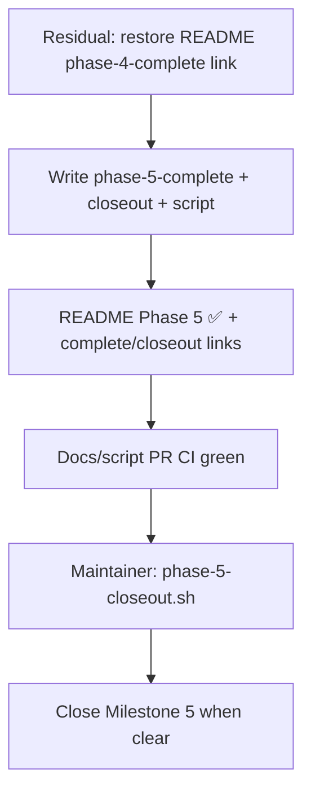

# Phase 4 Residual + Phase 5 LFG Closeout - Plan

## Goal Capsule

**Objective:** Finish residual Phase 4 README/tracker hygiene and close Phase 5 **product** production-readiness under LFG by landing wrap + closeout docs/script, updating the README roadmap to ✅ Phase 5 product exit, and documenting maintainer commands to remilestone remaining ops issues and close Milestone 5.

**Authority:** This plan > shipped [#65](https://github.com/duketopceo/kurultai/pull/65) / [#66](https://github.com/duketopceo/kurultai/pull/66) / [#84](https://github.com/duketopceo/kurultai/pull/84) / [#83](https://github.com/duketopceo/kurultai/pull/83) > [#9](https://github.com/duketopceo/kurultai/issues/9) > prior closeout pattern ([phase-4-complete.md](phase-4-complete.md) / [2026-07-25-002-chore-phase4-lfg-closeout-plan.md](2026-07-25-002-chore-phase4-lfg-closeout-plan.md)).

**Stop when:** `phase-5-complete.md` + `phase-5-closeout.md` + `scripts/phase-5-closeout.sh` on a green PR; README marks Phase 5 product exit ✅ (embeddings no longer listed as pending); Phase 4 complete link restored if missing; maintainer can remilestone [#20](https://github.com/duketopceo/kurultai/issues/20) / [#29](https://github.com/duketopceo/kurultai/issues/29) / [#35](https://github.com/duketopceo/kurultai/issues/35) and close Milestone 5.

**Do not:** Rebuild Dayflow/Pond/GitHub FS or other Expansion connectors; implement ARC (#20), GlitchTip (#35), or environments hardening (#29); reopen Milestone 4; start Phase 6 product work in this PR.

**Assumption:** Solo Phase 4 exit and Phase 5 product slices already shipped on `main`. This LFG slice is **hygiene closeout**, not product rebuild.

**Product Contract preservation:** new bootstrap.

**Execution profile:** Docs/script/README only; open PR via LFG; skip simplify/browser.

**Tail ownership:** LFG / `ce-work` after this plan; maintainer runs closeout script (agent often lacks `closeIssue` / milestone write).

---

## Product Contract

### Summary

Milestone 4 is already closed (0 open). Phase 4 wrap docs and `scripts/phase-4-closeout.sh` exist, but a later README rewrite dropped the `phase-4-complete.md` link while the compact roadmap still shows Phase 4 ✅. Phase 5 product exit is on `main` via daemon poll (#65), notify watch (#66), local ONNX embeddings (#84), and multi-agent MCP init (#83); umbrella [#9](https://github.com/duketopceo/kurultai/issues/9) is already closed. The README roadmap still shows Phase 5 as 🚧 with “local embeddings / ARC / ops follow,” so the phase looks unfinished. Remaining Milestone 5 open issues (#20 ARC, #29 env hardening, #35 GlitchTip) are ops/infra, not product-exit blockers.

### Problem Frame

Without wrap docs, README sync, and tracker remilestoning, Milestone 5 stays open with three ops issues while product readiness already shipped — the same tracker-vs-product mismatch prior phase closeouts fixed.

### Requirements

#### Phase 4 residual hygiene

- R1. README again contains a Markdown link targeting `docs/plans/phase-4-complete.md` (restore after compact rewrite), without restoring the old mega-roadmap table.
- R2. Do not rewrite Phase 4 connectors, `phase-4-complete.md` substance, or `scripts/phase-4-closeout.sh` unless a broken relative link is found.

#### Phase 5 product closeout package

- R3. `docs/plans/phase-5-complete.md` lists shipped PRs (#65, #66, #84, #83), notes #9 closed early, and names deferred ops (#20, #29 hardening remnant, #35).
- R4. `docs/plans/phase-5-closeout.md` + executable `scripts/phase-5-closeout.sh` for maintainer tracker hygiene.
- R5. README Phase 5 row ✅ for product exit (daemon poll + watch + local embeddings + multi-agent MCP init), with links to complete/closeout; Status/Embeddings already mentioning local ONNX must not contradict the roadmap.

#### Tracker handoff

- R6. Closeout script preflights that #65/#66/#83/#84 are MERGED into `main`, that wrap docs + README link exist on canonical `main`, then remilestones #20/#29/#35 to **Milestone 6** with deferred-ops comments (does not implement them).
- R7. Script prints the Milestone 5 close command; does not require re-closing #9.
- R8. PR is docs/script/README only and CI green.

### Actors

- A1. Maintainer — merge closeout PR, run script, close Milestone 5
- A2. LFG / implementing agent — land docs/script/README on a PR
- A3. CI — Lint & Test / macOS / audit on docs-only PR

### Flows

- F1. Merge closeout PR to `main`
  - **Actors:** A2, A3, A1
  - **Outcome:** Wrap docs + README sync on `main`
- F2. Maintainer runs `./scripts/phase-5-closeout.sh`
  - **Actors:** A1
  - **Outcome:** #20/#29/#35 remilestoned; M5 closable
- F3. Maintainer closes Milestone 5
  - **Actors:** A1
  - **Covered by:** R6, R7

### Acceptance Examples

- AE1. Covers R3 — Given closeout PR merged, When a reader opens `phase-5-complete.md`, Then it links #65/#66/#84/#83 and lists #20/#29/#35 as deferred ops.
- AE2. Covers R1, R5 — Given README on the PR, When grepping, Then `phase-4-complete` and `phase-5-complete` links exist and Phase 5 is ✅ not 🚧.
- AE3. Covers R4, R6 — Given script executable and maintainer rights, When run after merge, Then it aborts if product PRs are not on `main`, otherwise remilestones #20/#29/#35 to Milestone 6 and prints the M5 close command.

### Scope Boundaries

**In:** Residual Phase 4 README link hygiene; Phase 5 complete/closeout docs; `scripts/phase-5-closeout.sh`; README Phase 5 ✅; maintainer remilestone/close commands.

**Deferred for later (still tracked):** #20 ARC self-hosted CI; #29 deployment hardening beyond foundation (#30); #35 GlitchTip; Composio/plugins/#14 and other Expansion leftovers already deferred in Phase 4 wrap.

**Outside this product's identity for this PR:** Implementing ops/infra; rebuilding shipped connectors or daemon/embed/MCP features.

### Dependencies

- Milestone 4 closed; Phase 4 wrap docs on `main` ✅
- Product PRs #65/#66/#83/#84 MERGED ✅
- #9 CLOSED ✅
- Maintainer rights for issue milestone edit + milestone close (same as prior closeouts)

### Sources

- [phase-4-complete.md](phase-4-complete.md), [phase-4-closeout.md](phase-4-closeout.md), `scripts/phase-4-closeout.sh`
- [2026-07-25-002-chore-phase4-lfg-closeout-plan.md](2026-07-25-002-chore-phase4-lfg-closeout-plan.md)
- Phase 5 product plans: daemon poll, notify watch, local embeddings, multi-agent MCP init
- GitHub Milestone 5 · issues #9/#20/#29/#35 · PRs #65/#66/#83/#84

---

## Planning Contract

### Assumptions

- A1. Remilestone #20, #29, and #35 to **Milestone 6** (`Phase 6: Open Source Launch`) with comments that Phase 5 **product** exit shipped and these remain deferred ops/infra — do not close those issues in the script. *(session-inferred headless default for open remilestone wording)*
- A2. Tiny README Phase 4 link restore counts as **Phase 4 residual cleanup** in the same PR as Phase 5 wrap; no new `phase-4-*` files. *(session-inferred headless default for open “P4 vs P5 wrap” fork)*
- A3. Keep the current compact README roadmap shape; do not resurrect the pre-cleanup mega work-order table.
- A4. #29 stays open after remilestone because foundation (#30) shipped but hardening checklist remains; closeout does not invent a replacement issue.
- A5. Docs-only PR → skip simplify/browser in LFG execution.

### Key Technical Decisions

- KTD1. Execute as full LFG pipeline to an open PR (plan is an intermediate artifact). `(session-settled: user-directed — chosen over stop-after-planning / human check-ins each step: user invoked /lfg … Begin)`
- KTD2. Phase 4 “cleanup” means residual docs/README/tracker hygiene consistency with shipped Expansion (#62/#63/#64; M4 closed) — not reimplementing connectors. `(session-settled: user-directed — chosen over rebuild Dayflow/Pond/GitHub FS: product already on main; M4 closed with 0 open issues)`
- KTD3. This Phase 5 LFG slice is **product closeout** of shipped slices (#65/#66/#84/#83), not implementing ARC (#20) or GlitchTip (#35) in this PR. `(session-settled: user-approved — chosen over full Milestone 5 epic (ARC/GlitchTip/deploy hardening) in one PR: #9 product exit shipped; remaining open M5 issues are ops/infra; mirrors prior LFG headless closeouts)`
- KTD4. Mirror Phase 4 closeout package shape: `phase-5-complete.md` + `phase-5-closeout.md` + `scripts/phase-5-closeout.sh` with main-ref preflights.
- KTD5. Script remilestones ops issues to Milestone 6 rather than closing them; #9 is already closed so the script’s durable action is remilestone + print M5 close.
- KTD6. Agent often cannot mutate issues/milestones — script remains the maintainer handoff.

### High-Level Technical Design

### Risks & Dependencies

| Risk | Mitigation |
|------|------------|
| Agent cannot remilestone/close | Script + human run (phase-1/2/4 pattern) |
| README rewrite again drops links | Script preflight requires `phase-5-complete` link on `main` |
| Someone treats closeout as license to build ARC | Scope Boundaries + R6 deferred comments name ops explicitly |
| #29 remilestone contested as “should close” | A4: leave open for hardening checklist |

### Open Questions

None blocking. Remilestone target and P4-link-vs-P5-wrap forks resolved as Assumptions A1–A2 for headless LFG.

---

## Implementation Units

### U1. Unified plan artifact (this file)

- **Goal:** Implementation-ready plan on disk for LFG/`ce-work`.
- **Requirements:** R1–R8 (traceability)
- **Files:** `docs/plans/2026-07-26-002-chore-phase5-lfg-closeout-plan.md`
- **Approach:** Bootstrap Product Contract from shipped PRs + prior closeout pattern; no product code.
- **Test scenarios:** Frontmatter has `artifact_readiness: implementation-ready` and `execution: code`.
- **Verification:** `rg -n 'artifact_readiness: implementation-ready' docs/plans/2026-07-26-002-chore-phase5-lfg-closeout-plan.md`
- **Dependencies:** none

### U2. Phase 4 residual README hygiene

- **Goal:** Restore tracker-doc discoverability for Phase 4 without undoing compact README.
- **Requirements:** R1, R2
- **Files:** `README.md` (and only fix a broken link in `docs/plans/phase-4-complete.md` if found)
- **Approach:** Add a compact Markdown link to `docs/plans/phase-4-complete.md` near the Roadmap Phase 4 ✅ row or a one-line “Phase 4 complete” pointer; leave connectors/status tables alone.
- **Test scenarios:** `rg -n 'phase-4-complete' README.md` matches a markdown link; Phase 4 row remains ✅.
- **Verification:** `rg -n '\]\([^)]*phase-4-complete\.md\)' README.md`
- **Dependencies:** U1

### U3. Phase 5 complete + closeout package

- **Goal:** Durable wrap + maintainer tracker handoff.
- **Requirements:** R3, R4, R6, R7
- **Files:** `docs/plans/phase-5-complete.md`, `docs/plans/phase-5-closeout.md`, `scripts/phase-5-closeout.sh`
- **Approach:** Mirror `phase-4-complete.md` / `phase-4-closeout.md` / `scripts/phase-4-closeout.sh`: shipped table (#65/#66/#84/#83), deferred ops table (#20/#29/#35), preflight merged PRs + files on `main` + README link, remilestone those issues to Milestone 6 with comments (by issue number; do not rely on milestone list search), print `gh api -X PATCH repos/duketopceo/kurultai/milestones/5 -f state=closed`.
- **Test scenarios:** Script is executable; references issues 20/29/35, PRs 65/66/83/84, and Milestone 6; abort path when a required file is missing on `main`.
- **Verification:** `test -x scripts/phase-5-closeout.sh`; `rg -n '65|66|83|84|20|29|35|milestones/6|Milestone 6' scripts/phase-5-closeout.sh docs/plans/phase-5-complete.md docs/plans/phase-5-closeout.md`
- **Dependencies:** U1

### U4. README Phase 5 product-exit sync

- **Goal:** Roadmap matches shipped product.
- **Requirements:** R5, R8
- **Files:** `README.md`
- **Approach:** Change Phase 5 row from 🚧 embeddings/ARC/ops to ✅ product exit naming daemon poll + watch + local embeddings + multi-agent MCP; link `phase-5-complete.md` / `phase-5-closeout.md`; keep ARC/ops as deferred note if space allows, not as the phase status.
- **Test scenarios:** AE2; Status Embeddings line and Roadmap Phase 5 do not disagree.
- **Verification:** `rg -n 'phase-5-complete' README.md`; Phase 5 row contains ✅ and does not claim embeddings still pending.
- **Dependencies:** U3

### U5. Open PR + CI green

- **Goal:** Land closeout on a reviewable green PR for maintainer merge.
- **Requirements:** R8
- **Files:** none beyond U2–U4 diff
- **Approach:** Single chore PR; no product code; run repo verification commands if CI expects them on docs PRs.
- **Test scenarios:** Required CI checks pass.
- **Verification:** PR checks green (Lint & Test / macOS / audit as applicable).
- **Dependencies:** U2, U3, U4

---

## Verification Contract

| Gate | Command / signal | Applies |
|------|------------------|---------|
| Phase 4 link restored | `rg -n '\]\([^)]*phase-4-complete\.md\)' README.md` | U2 |
| Phase 5 package present | `test -f docs/plans/phase-5-complete.md && test -f docs/plans/phase-5-closeout.md && test -x scripts/phase-5-closeout.sh` | U3 |
| Phase 5 README sync | `rg -n 'phase-5-complete' README.md` and Phase 5 row shows ✅ | U4 |
| No product regression | `cargo test --locked` · `cargo clippy --all-targets -- -D warnings` | U5 |
| Maintainer tracker hygiene | `./scripts/phase-5-closeout.sh` then `gh api -X PATCH repos/duketopceo/kurultai/milestones/5 -f state=closed` | post-merge; A1 only |

Behavioral skill evaluation: not required (docs/tracker hygiene; no new runtime behavior).

---

## Definition of Done

### Global

- [ ] `phase-5-complete.md`, `phase-5-closeout.md`, and executable `scripts/phase-5-closeout.sh` on `main` via green PR
- [ ] README Phase 5 ✅ with complete/closeout links; embeddings not listed as still-pending roadmap work
- [ ] README again links `phase-4-complete.md`
- [ ] Maintainer can remilestone #20/#29/#35 to Milestone 6 and close Milestone 5
- [ ] No abandoned experimental product code in the closeout diff

### Per unit

- [ ] U1 — this plan committed with implementation-ready frontmatter
- [ ] U2 — Phase 4 complete link present in README
- [ ] U3 — wrap + script match AE1/AE3
- [ ] U4 — README Phase 5 matches AE2
- [ ] U5 — CI green on closeout PR
