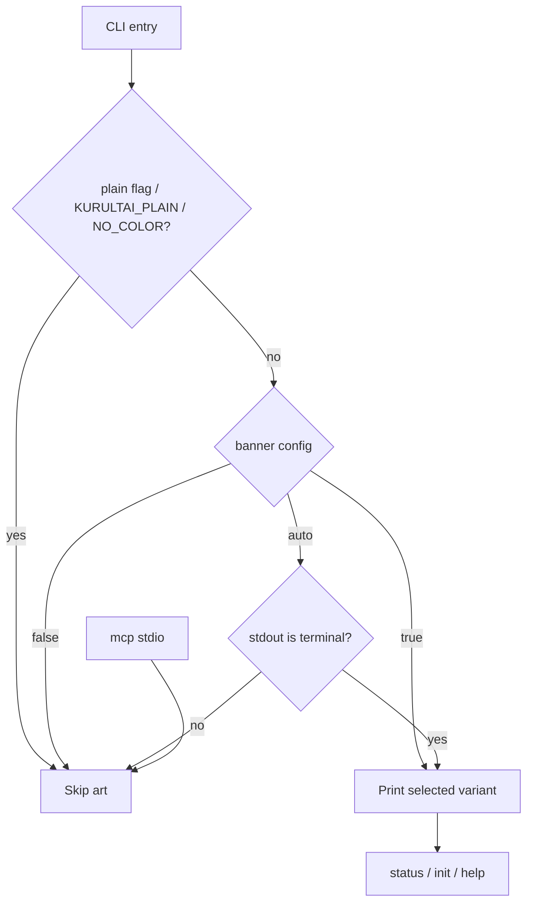

# feat: Phase 6 first slice — Yurt terminal art + Launch signal

**Target repo:** `duketopceo/kurultai`  
**Base:** `origin/main` @ `3d20bad` (v0.3.0; README rewrite #98) — **new branch only; do not base on #97 or #99**  
**Process:** PR-only · LFG pipeline

## Goal Capsule

**Objective:** Begin Phase 6 ([#10](https://github.com/duketopceo/kurultai/issues/10)) with one shippable Launch polish slice: **Yurt terminal art** ([#22](https://github.com/duketopceo/kurultai/issues/22)) plus a minimal README/roadmap Phase 6 status signal.

**Authority:** This plan > [#22](https://github.com/duketopceo/kurultai/issues/22) acceptance > [#10](https://github.com/duketopceo/kurultai/issues/10) umbrella > README brand header.

**Stop when:** `src/art.rs` exports compact/wide/plain yurt variants; `[cli] banner` + `--plain` / `NO_COLOR` / `KURULTAI_PLAIN` gate art; `status` / `init` / optional `--help` show art when allowed; unit tests lock art strings; smoke covers suppress paths; README carries a Phase 6 in-progress signal without restoring a full phase table; PR CI green on a branch from `main`.

**Do not:** Enterprise surfaces [#12](https://github.com/duketopceo/kurultai/issues/12)–[#15](https://github.com/duketopceo/kurultai/issues/15) / CodeGraph [#78](https://github.com/duketopceo/kurultai/issues/78) / Anthropic auth [#79](https://github.com/duketopceo/kurultai/issues/79) / cloud sync [#80](https://github.com/duketopceo/kurultai/issues/80); Show HN / launch prose as product code; Phase 5 closeout merge fights (#97 CONFLICTING) or Jul 25–26 cleanup (#99); Brain UI redesign (AGENTS.md — CLI yurt art is fine); ARC / GlitchTip; Docker / Homebrew / crates.io publish; full Milestone 6 closeout package.

**Execution profile:** Small Rust CLI + config + docs. Prefer characterization via exact string asserts and `tests/cli_smoke.rs` extensions over new frameworks.

**Assumption (LFG headless):** “Final phase” means Phase 6 Launch, not redoing Phases 1–5. First LFG WO = #22 + README signal only. Thin roadmap note — defer `phase-6-complete` / closeout scripts until more Launch slices land.

**Product Contract preservation:** new bootstrap (`product_contract_source: ce-plan-bootstrap`).

---

## Product Contract

### Summary

Release packaging, CI, CONTRIBUTING, and issue templates already exist on `main`. The historically named Launch polish still open is **yurt CLI branding** (#22). This slice ships that joy feature and marks Phase 6 started in the README without claiming the full [#10](https://github.com/duketopceo/kurultai/issues/10) epic done.

### Problem Frame

Operators open `kurultai status` / `init` / `--help` and see bare text. README already carries the ASCII yurt; the CLI should match when a human TTY is present, and stay silent for agents, pipes, and plain/NO_COLOR environments.

### Requirements

| ID | Requirement |
|----|-------------|
| R1 | `src/art.rs` provides yurt/kurultai ASCII variants: **compact**, **wide**, **plain** (caller-selected; no terminal-width auto-layout). |
| R2 | Config `[cli] banner = true \| false \| auto` (default **auto** = TTY only). Documented in default config comment and README Configuration. |
| R3 | Art is suppressed when any of: `--plain`, `KURULTAI_PLAIN=1`, `NO_COLOR` set (any value), `banner = false`, or non-TTY under `auto`. |
| R4 | Surfaces: compact banner above `kurultai status` output; welcome line/banner on `kurultai init`; optional compact/wide header on `kurultai --help` when policy allows. |
| R5 | Never print art on `kurultai mcp` (stdio) or any future JSON/machine stdout mode. |
| R6 | Unit tests lock art string contents (exact equality; no width assumptions). |
| R7 | CLI smoke (or equivalent) proves `--plain` and `NO_COLOR` suppress art on `status`. |
| R8 | README: minimal Phase 6 roadmap signal (in progress → #10 / #22) without restoring a full phase table that would fight #97’s Phase 4/5 links if that PR lands later. |

### Actors / flows

- A1 Human operator on a TTY · F1 `status` / `init` / `--help` with art · F2 `--plain` or `NO_COLOR` without art · F3 Agent/`mcp` never sees art

### Acceptance examples

- AE1. Interactive TTY, default config → `kurultai status` prints compact yurt above “Kurultai status”.
- AE2. `kurultai status --plain` → no art; status body unchanged.
- AE3. `NO_COLOR=1 kurultai status` → no art.
- AE4. `banner = false` in config → no art even on TTY.
- AE5. `kurultai mcp` stdout contains no yurt/box-drawing art (stdio stays clean).

### Scope boundaries

**In:** R1–R8 — `src/art.rs`, CLI wiring in `src/main.rs`, `[cli]` on `FileConfig` / loader / `default_config_toml`, tests, thin README signal.

**Deferred**

- Full Phase 6 closeout (`phase-6-complete.md` / closeout script / closing Milestone 6 / #10)
- Docker, Homebrew, crates.io publish
- Show HN / pricing / managed hosting copy
- Animation/spinners
- Brain UI / website / web visual work
- Restoring a multi-phase README table (#97 may add Phase 4/5 links separately)

**Outside identity:** Enterprise SSO / multi-tenant / CodeGraph / cloud sync.

### Sources

- [#22](https://github.com/duketopceo/kurultai/issues/22) · [#10](https://github.com/duketopceo/kurultai/issues/10) · README yurt header · `src/main.rs` Status/Init · `src/config/file.rs` · `tests/cli_smoke.rs`
- Glossary: `CONCEPTS.md` **Yurt** entry (added with this plan)

---

## Planning Contract

### Assumptions

| ID | Assumption | Class |
|----|------------|-------|
| A1 | First Phase 6 LFG slice is #22 + README signal, not full #10 | session-settled: user-approved — chosen over full Launch epic: matches prior one-WO-per-phase LFG; many #10 items are non-code/enterprise |
| A2 | “Final phase” = Phase 6 Open Source Launch, not Phase 5 closeout | session-settled: user-directed — chosen over finishing only #97: maps to Milestone 6 / #10; Phase 5 product already shipped |
| A3 | Thin README Phase 6 signal only; no closeout package this PR | LFG headless default for open area |
| A4 | No `kurultai install` subcommand on main — map issue “install welcome” to **`kurultai init`** (and leave shell install scripts alone unless a one-line stderr tip is trivial) | inferred from `Commands` enum |
| A5 | Prefer exact `assert_eq!` on art constants over adding `insta` unless implementer chooses insta for ergonomics | inferred — repo has no insta today |
| A6 | New git branch from `main` only; never rebase onto #97/#99 | session-settled: user-directed collision avoidance |

### Key Technical Decisions

| KTD | Decision | Rationale |
|-----|----------|-----------|
| KTD1 | (session-settled: user-approved — chosen over full #10 epic: one focused shippable Launch polish) Ship **yurt art + README signal** as the Phase 6 first slice | Matches prior phase LFG scoping |
| KTD2 | (session-settled: user-directed — chosen over Phase 5 closeout-only: “final phase” = Milestone 6) Treat this as Phase 6 start, not #97 hygiene | Avoid CONFLICTING closeout PR |
| KTD3 | Central `should_show_banner(...)` policy used by all surfaces | One place for TTY / plain / NO_COLOR / config |
| KTD4 | Art variants are **caller-selected** (`compact` for status/init; `wide` optional for help; `plain` = ASCII-lighter sibling) — **no** auto width / circle / brain-shape layouts | Honors #22 “no terminal width assumptions”; AGENTS.md layout bans are Brain-UI-specific but reinforce “don’t invent layouts” |
| KTD5 | `--plain` is a **global** clap flag; `KURULTAI_PLAIN=1` mirrors it; `NO_COLOR` follows standard “env present ⇒ off” | Matches #22 checklist; CI/smoke can force off |
| KTD6 | Help banner is **best-effort**: if argv contains `-h`/`--help` and policy allows (env + TTY; config only if cheaply readable without store open; else `auto`), print art **before** clap emits help. Do not force a derive-macro `before_help = "..."` static string (ignores NO_COLOR). If pre-parse intercept is awkward, ship status+init first and keep help art optional | `--help` must not bootstrap SQLite; R4 already marks help optional |
| KTD7 | `mcp` path never calls art printers | Stdio protocol integrity |
| KTD8 | README: one short Phase 6 sentence/link block under Docs & contributing or Roadmap — **do not** resurrect full phase table | Coexists with future #97 Phase 4/5 links |

### High-Level Technical Design



### Risks

| Risk | Mitigation |
|------|------------|
| Art leaks into MCP/agent stdout | Never call banner from `Commands::Mcp`; smoke/AE5 |
| `--help` tries to open store | KTD6 — no App bootstrap for help art |
| README merge conflict with #97 | Minimal additive Phase 6 line only; no phase-table rewrite |
| Unicode/box drawing in dumb terminals | Provide `plain` variant; default still compact (issue joy); `--plain` / NO_COLOR escape hatch |

### Implementation constraints

- Keep `cargo clippy --all-targets -- -D warnings` clean; no new runtime deps required (use `std::io::IsTerminal`).
- Do not redesign Brain UI assets under `ui/` / `website/`.

---

## Implementation Units

### U1. Art module + banner policy

- **Goal:** Add `src/art.rs` with compact/wide/plain string constants and `should_show_banner` + print helpers.
- **Requirements:** R1, R3, R5, R6
- **Files:** `src/art.rs` (new), `src/lib.rs` (`pub mod art`), optionally tiny unit tests in `src/art.rs`
- **Approach:** Export `&'static str` (or functions returning them) for three variants. Policy inputs: `BannerMode { Auto, Always, Never }`, `plain: bool`, `no_color: bool`, `stdout_is_tty: bool`. Print helpers write to a passed `impl Write` so tests can capture. Do not detect terminal width.
- **Test scenarios:**
  - TS1. Compact/wide/plain strings are stable (`assert_eq!` full expected multiline or single-line fixtures).
  - TS2. Policy matrix: auto+tty → show; auto+!tty → hide; Always → show; Never → hide; plain/NO_COLOR → hide regardless of Always (document: plain/NO_COLOR win over `banner = true`).
  - TS3. Helpers write expected bytes and nothing when suppressed.
- **Verification:** Unit tests in `src/art.rs` pass under `cargo test --locked art::`.
- **Dependencies:** none

### U2. Config `[cli]` + CLI wiring

- **Goal:** Wire banner config and global `--plain` into status, init, and optional help; keep mcp clean.
- **Requirements:** R2, R3, R4, R5
- **Files:** `src/config/file.rs`, `src/config/mod.rs` (`default_config_toml`), `src/config/loader.rs` / runtime config path as needed, `src/types.rs` or thin CLI-only parse if banner stays file-only, `src/main.rs`
- **Approach:** Add `FileCliConfig { banner: BannerSetting }` with serde default `auto`; thread `banner` into whatever runtime path status/init already use (extend `Config` or pass a small `CliPresentation` alongside — either is fine). Global `--plain` on `Cli` OR `KURULTAI_PLAIN` truthy OR `NO_COLOR` present ⇒ `plain` in policy. Before status/init human output, if policy allows, print compact. Init welcome: print without breaking path lines. Help: follow KTD6 pre-parse intercept (no DB). **Never** print from `Commands::Mcp`.
- **Test scenarios:**
  - TS4. Default toml comment documents `[cli] banner`.
  - TS5. Invalid banner value fails config load with clear error (if serde/custom parse used).
  - TS6. Manual/dev: TTY status shows art; `--plain` does not (covered formally in U3).
- **Verification:** `cargo build`; existing `cli_smoke` still green before U3 asserts.
- **Dependencies:** U1

### U3. Smoke tests + README Phase 6 signal

- **Goal:** Prove suppress paths in automation; publish minimal Phase 6 roadmap signal.
- **Requirements:** R7, R8
- **Files:** `tests/cli_smoke.rs`, `README.md`
- **Approach:** Extend smoke: `status --plain` and `NO_COLOR=1 status` assert stdout lacks distinctive art markers (e.g. box-drawing `╭` / yurt `⌂` / “assemble what” art line — pick stable markers from U1 fixtures). Prefer forcing non-TTY via assert_cmd (no TTY by default) so default smoke may not show art — assert suppress flags still succeed and do not introduce art; optional separate test with `banner = true` in fixture config to force art even without TTY for positive proof. README: one Phase 6 in-progress line linking #10 and #22 near Docs & contributing / Roadmap; keep ASCII header; do not rebuild phase table.
- **Test scenarios:**
  - TS7. Fixture config `banner = true` → status stdout contains compact art marker.
  - TS8. Same + `--plain` → no art marker.
  - TS9. Same + `NO_COLOR=1` → no art marker.
  - TS10. README contains Phase 6 / #10 / #22 signal; no full historical phase table reintroduced.
- **Verification:** `cargo test --locked --test cli_smoke`; visual README skim.
- **Dependencies:** U2

---

## Verification Contract

```bash
cargo fmt --all -- --check
cargo clippy --all-targets -- -D warnings
cargo test --locked
# focused:
cargo test --locked art::
cargo test --locked --test cli_smoke
```

Manual (human TTY, optional):

```bash
kurultai status
kurultai status --plain
NO_COLOR=1 kurultai status
kurultai init --agent cursor   # welcome art when policy allows
kurultai --help                # optional header
```

CI: Lint & Test / macOS / audit on the feature PR. No release tag required for this polish slice.

---

## Definition of Done

**Global**

- [ ] U1–U3 merged intent satisfied on a PR branched from `main` (not #97/#99)
- [ ] R1–R8 + AE1–AE5 covered by code and/or tests
- [ ] Verification Contract commands pass
- [ ] No Brain UI / enterprise / Show HN / closeout-script scope creep
- [ ] Abandoned experiment code removed from the diff
- [ ] #22 can be closed by maintainer after merge (comment linking PR); #10 stays open

**Per unit**

- [ ] U1: `art` module + policy tests green
- [ ] U2: config + CLI surfaces wired; mcp clean
- [ ] U3: smoke suppress/force cases + README Phase 6 signal
