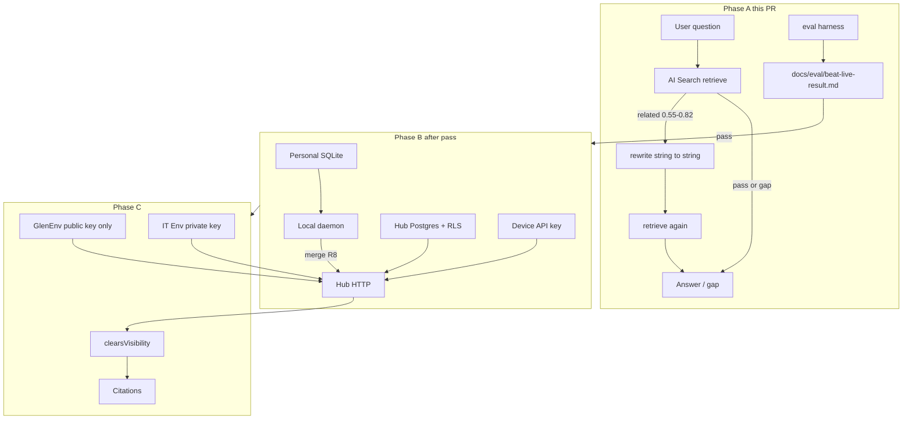
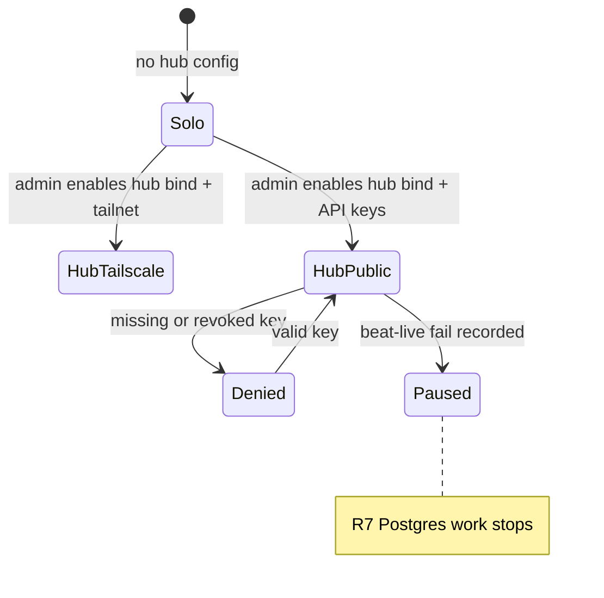

# feat: Company brain hub — beat-live, then Postgres scopes, then Workers

**Home repo:** `duketopceo/kurultai` (this plan)
**Companion repo:** `Bartlett-Roofs/help-dashboard`
**Audience:** kurultai maintainers + Bartlett IT brain operators
**Base:** `main`
**Process:** PR-only · branch `feature/company-brain-hub`

## Goal Capsule

Make kurultai a **one-org hosted hub** (personal SQLite + shared Postgres) that help-dashboard Workers can call, **only after** a measurable beat-live proof on today's AI Search stack. "Big company brain" and "tiered access" are the same architecture: `personal | team | company` scopes, not two products.

**Stop when (this LFG / first PR):** Phase A is green — bounded query rewrite exists with compile-time isolation proofs; an eval harness can record pass/fail vs live AI Search; the help-dashboard roadmap Fork 3 recommendation is updated. Phase B/C units are specified here but **must not ship in the same PR** unless a recorded eval pass exists.

**Do not:** multi-tenant SaaS across unrelated orgs; password/session accounts on the hub; Brain UI redesign; vendor hybrid FTS+RRF into brain-worker as the primary path; rewrite Otto gap→PR; markdown hashtag convention, doctor CLI, or container packaging as this PR's acceptance.

**Product Contract preservation:** Carried from origin R1–R10 / A1–A4 / F1–F5 / AE1–AE5. Added R11–R16 for the help-dashboard beat-live and Workers isolation constraints (session-settled, not origin). Origin "Deferred" and "Outside" preserved below.

---

## Product Contract

### Requirements

| ID | Requirement |
|----|-------------|
| R1 | Every knowledge atom carries a visibility scope: `personal \| team \| company` (origin) |
| R2 | `personal`-scoped atoms never leave the originating device; never written to the shared store (origin) |
| R3 | A deployment supports zero, one, or two shared tiers; `team` without `company` is first-class (origin) |
| R4 | Shared store reachable via Tailscale-only **or** public URL, selectable per deployment (origin) |
| R5 | Public transport authenticates every device via per-device API key (bearer); no password/session in v1 (origin) |
| R6 | Tailscale transport relies on tailnet membership; no extra app auth required in that mode (origin) |
| R7 | `Store` trait gains Postgres+pgvector for the shared tier without breaking SQLite personal (origin) |
| R8 | Local daemon `ask`/`search` merges personal SQLite + remote hub results in one call (origin) |
| R9 | Connectors tag visibility at ingest; scope is never inferred after the fact (origin) |
| R10 | Admin CLI: issue/revoke device API keys, define `team_id`/`org_id` boundaries, list hub scopes (origin) |
| R11 | Beat-live gate: bounded query rewrite on help-dashboard **before** betting retrieval on kurultai |
| R12 | Fail of the beat-live eval **pauses** Postgres/hub spend; do not implement R7 in the same PR as a failed or unrun eval |
| R13 | Glen/IT isolation remains enforceable when retrieval is a network call (separate keys/endpoints or equivalent; `GlenEnv` still cannot reach private corpus) |
| R14 | Post-retrieval `clearsVisibility()` stays mandatory; hub must return `visibility` metadata |
| R15 | D1 provenance (`questions`, `retrieval_runs`, `model_calls`) stays; `search_instance` may name kurultai corpora |
| R16 | Hub REST is not loopback-secret: every hub `/api/*` in public mode requires a valid key (extends R5 to the existing unauthenticated localhost API) |

### Actors / Flows

| ID | Actor / flow |
|----|--------------|
| A1 | Solo operator — local SQLite only; must not regress (origin) |
| A2 | Team member on a shared hub (origin) |
| A3 | Hub admin — keys and org boundaries (origin) |
| A4 | External self-hoster — public transport (origin) |
| A5 | Help-dashboard brain-worker (Glen, IT chat, Otto) calling retrieval |
| A6 | Eval operator running beat-live vs live AI Search |

| ID | Flow |
|----|------|
| F1 | Solo, no hub — `kurultai ask` identical to today (origin) |
| F2 | Two people, Tailscale hub, `team` only (origin) |
| F3 | Company public hub, per-device keys, team isolation + shared company (origin) |
| F4 | Connector ingest: channel → `team`; DM → `personal`, never hub (origin) |
| F5 | Key revoked → hub 401; local personal queries unaffected (origin) |
| F6 | Ambiguous retrieval (score 0.55–0.82) → synonym-append rewrite → second retrieve; pass/gap skip rewrite |
| F7 | Worker with public-only credentials cannot retrieve `bartlett-private` / `company` private atoms |

### Acceptance Examples

| ID | Example |
|----|---------|
| AE1 | Fresh install, no hub → local SQLite only (origin) |
| AE2 | Hub Tailscale-only → off-tailnet cannot connect (origin) |
| AE3 | Public hub, missing/revoked key → 401/403, no team/company data (origin) |
| AE4 | `personal` atom absent from hub Postgres on direct inspection (origin) |
| AE5 | `team_id=eng` never receives `sales` team atoms; both receive `company` (origin) |
| AE6 | Rewrite function accepts/returns only a string; TypeScript rejects passing `GlenEnv` |
| AE7 | First retrieve `pass` or `gap` → no rewrite call |
| AE8 | First retrieve in 0.55–0.82 → rewrite appends aliases only; logged `rewrite_used` |
| AE9 | Eval harness writes `docs/eval/beat-live-result.md` with gap-rate delta vs baseline |
| AE10 | Glen worker env has no private hub URL/token field |

### Scope boundaries

**In:** R1–R16 sequenced as Phase A (R11–R12, F6, AE6–AE9, roadmap) then Phase B (R1–R10, R16, F1–F5, AE1–AE5) then Phase C (R13–R15, F7, AE10).

**Out (origin — Outside this product's identity)**

- Multi-tenant SaaS across unrelated companies on shared infrastructure
- Full user accounts (login/password/session) for public mode
- UI changes of any kind

**Deferred for later (origin)**

- Exact ACL config file format (this plan picks API-key rows + scope claims; file format still not a product)
- Which connector ships first for team-tier ingestion
- Tailscale Funnel as public escape hatch

### Deferred to Follow-Up Work

- Markdown hashtag-line convention for `kb-it-docs` (trust-lane untagged quarantine)
- Doctor CLI for CPU / merge-backlog anomalies
- Dockerfile / Railway / Fly packaging (after Postgres lands)
- Query rewrite **inside** kurultai (help-dashboard rewrite is the beat-live proof)
- Vendoring FTS+RRF into brain-worker (fallback if Phase A fails or Phase B stalls)
- Otto gap→draft→PR rewrite
- Federated router over personal kurultai atoms + D1 (ideation idea 12)

---

## Planning Contract

### Key Technical Decisions

| KTD | Decision | Why |
|-----|----------|-----|
| KTD1 | **Three gates, one architecture** `(session-settled: user-approved — chosen over treating "big brain" vs "tiered" as two options: they are the same at scale)` | Matches origin R1–R3 and help-dashboard `bartlett-private` / `bartlett-public` |
| KTD2 | **Beat-live first; fail pauses Postgres** `(session-settled: user-approved — chosen over building hub in parallel: do not spend R7 until rewrite eval can beat live AI Search)` | Strongest testable reason to migrate |
| KTD3 | **Fork 3 flips to "network brain behind proof"** `(session-settled: user-approved — chosen over "port the algorithm, not the project": deploy kurultai as hub if gates pass; port-algorithm is fallback)` | User challenged the 2026-08-12 recommendation |
| KTD4 | **Origin R1–R10 / F1–F5 / AE1–AE5 are Phase B backbone** `(session-settled: user-approved — chosen over a parallel multi-user spec)` | One product contract |
| KTD5 | **Roadmap HTML is a companion edit in help-dashboard, not a second plan** `(session-settled: user-approved)` | Single planning unit |
| KTD6 | **Items 5–9 (hashtags, embed keys, volume, kurultai-side rewrite, doctor) are follow-ons** `(session-settled: user-approved)` | Keep first milestone shippable |
| KTD7 | **This PR implements Phase A only** unless `docs/eval/beat-live-result.md` records a pass | Prevents LFG from landing Postgres without proof |
| KTD8 | **Rewrite is synonym-append, gated to related band 0.55–0.82**, signature is `string → string` with `@ts-expect-error` isolation proof | Matches ideation idea 5; cannot retarget corpus |
| KTD9 | **Hub mode extends existing axum daemon** — bind 0.0.0.0 or Tailscale iface; public mode = bearer middleware on `/api/*`; solo default remains 127.0.0.1 unauthenticated | Origin architecture notes; F1 must not regress |
| KTD10 | **Postgres implements `Store`; SQLite unchanged for personal.** Scope columns on hub atoms; RLS as defense in depth; app still filters by caller claims | Origin R7; doctor-hard-fail is follow-on |
| KTD11 | **One deployment per org** — not a Kurultai-operated SaaS | Origin rejected alternative |
| KTD12 | **Workers call hub via `fetch` + timeout + bearer**, mirroring `providers.ts` / `github.ts`; Glen env carries only public hub credentials | R13, AE10 |
| KTD13 | **Eval can be PENDING** in CI (no live AI Search). Harness + unit proofs ship; operator fills result file. PENDING ≠ pass for KTD7 | CI cannot hit production Glen |

### Assumptions

- Beat-live "pass" means gap rate on the ambiguous band drops vs a recorded baseline of ≥20 questions, without rewrite similarity falling below 0.9 when embeddings are available; if embeddings unavailable, human spot-check that rewrites only append aliases.
- Help-dashboard stays on Cloudflare AI Search until Phase C; Phase A does not swap the retrieval backend.
- `sqlx` + `pgvector` is the Postgres stack unless implementation finds an existing Rust store crate already in-tree (none today).
- Device API keys are hashed at rest (SHA-256 of token) with prefix display; plaintext shown once at issue time.

### High-Level Technical Design

---

## Implementation Units

### U1. Bounded query rewrite + isolation proof (help-dashboard)

**Goal:** Insert synonym-append rewrite on the ambiguous band without letting rewrite retarget corpus.
**Requirements:** R11, F6, AE6–AE8, KTD8
**Dependencies:** none
**Files:** `brain-worker/src/rewrite.ts` (create), `brain-worker/src/knowledge.ts`, `brain-worker/src/glen.ts`, `brain-worker/test/rewrite.test.ts` (create), `brain-worker/test/glen.test.ts`
**Approach:**
1. Pure `rewriteQuery(question: string): Promise<string>` — no `Env`, no tier.
2. Call only when first `classify()` is `related` in 0.55–0.82; skip on pass/gap.
3. Log `rewrite_used` on the retrieval_run metadata or existing D1 columns if present without migration; otherwise a boolean in `outcome_detail` / JSON metadata already written.
4. Add `@ts-expect-error` that `rewriteQuery` cannot take `GlenEnv`.
**Patterns to follow:** `brain-worker/src/visibility.ts` purity; `test/glen.test.ts` KTD4 proofs; `providers.ts` generate with timeout.
**Execution note:** Implement test-first for skip-on-pass/gap and type isolation.
**Test scenarios:**
- Covers AE7. First retrieve classified `pass` → rewrite not invoked.
- Covers AE7. First retrieve classified `gap` → rewrite not invoked.
- Covers AE8. Score 0.60 `related` → rewrite invoked; second retrieve uses rewritten string.
- Covers AE6. Type test: passing `GlenEnv` into rewrite is a compile error (`@ts-expect-error`).
- Rewrite output contains original tokens plus aliases; does not contain a corpus/tier name.
**Verification:** `brain-worker` typecheck + rewrite tests pass.

### U2. Beat-live eval harness + roadmap Fork 3 update (help-dashboard)

**Goal:** Record pass/fail vs live AI Search; update ideation HTML so Fork 3 matches KTD3.
**Requirements:** R12, AE9, KTD3, KTD5, KTD13
**Dependencies:** U1
**Files:** `scripts/eval-beat-live.mjs` (create) or `brain-worker/test/eval-beat-live.md` instructions + script, `docs/eval/beat-live-result.md` (create, PENDING until operator run), `docs/ideation/2026-08-12-nimrod-brain-roadmap-ideation.html`
**Approach:**
1. Script accepts a JSONL of questions; hits Glen or IT retrieve as configured by env; writes gap-rate, rewrite_used count, optional similarity.
2. Commit result file as `status: PENDING` if live endpoint not available in this checkout.
3. Update Fork 3: recommended option = make kurultai the network brain **after** beat-live; "port algorithm" becomes fallback; leave-alone remains valid if eval fails.
4. Update grounding paragraph that claimed "project is not worth running live" to "blocked on auth+Postgres+eval, sequenced."
5. Update rejection-table row that rejected Railway fork — replace with sequenced-hub path.
**Test scenarios:**
- Covers AE9. Harness with fixture responses produces a result markdown containing baseline_gap_rate and candidate_gap_rate.
- HTML Fork 3 recommended option is the sequenced hub path, not "port the algorithm."
**Verification:** Result file exists; HTML grep shows the new recommendation.

### U3. Hub bind + public-mode API key middleware (kurultai) — scaffolding only this PR

**Goal:** Config + tests for hub bind and bearer auth **without** Postgres. Default solo bind stays 127.0.0.1 with no auth.
**Requirements:** R4–R6, R16, F1, AE1, AE3 (auth layer only), KTD9
**Dependencies:** none (parallel with U1)
**Files:** `src/http/mod.rs`, `src/http/auth.rs` (create), `src/config.rs` or equivalent config module, `src/http/mod.rs` tests, `config.example.toml`
**Approach:**
1. Config: `hub.bind` default loopback; `hub.auth = none | api_key`; `hub.api_keys` hashed list or env `KURULTAI_HUB_API_KEYS`.
2. When `auth = api_key`, reject `/api/*` without `Authorization: Bearer`.
3. MCP HTTP secret path stays independent.
4. Do **not** add scope columns or Postgres in this unit.
**Patterns to follow:** `src/http/mcp.rs` bearer check; loopback comment in `src/http/mod.rs`.
**Test scenarios:**
- Covers AE1. Default config: unauthenticated `/api/status` on 127.0.0.1 still works.
- Covers AE3. `auth = api_key`, no header → 401 on `/api/search`.
- Valid key → 200 on `/api/status`.
- Revoked/wrong key → 401.
**Verification:** `cargo test` http auth tests pass; solo default unchanged.

### U4. Postgres `Store` + visibility scope + RLS (kurultai)

**Goal:** Shared-tier store. **Do not start unless beat-live result is `pass`.**
**Requirements:** R1–R3, R7, AE4–AE5, KTD2, KTD7, KTD10
**Dependencies:** U2 (pass), U3
**Files:** `src/store/postgres.rs` (create), `src/store/mod.rs`, `src/store/migrations.rs` (SQLite scope column for local tagged atoms that never sync), `src/types.rs`, tests under `src/store/`
**Approach:** Implement `Store` for Postgres; atoms on hub require `scope` + optional `team_id`; RLS policies using session `SET` of caller claims; personal scope rejected on hub upsert.
**Execution note:** If `docs/eval/beat-live-result.md` is not `pass`, skip this unit entirely and record skip in the PR — do not stub Postgres.
**Test scenarios:**
- Covers AE4. Insert `personal` on hub → error; table empty.
- Covers AE5. Two team ids; search as eng does not return sales team atoms; company atoms return.
- SQLite personal path still upserts without scope column required (default personal).
**Verification:** Postgres tests against testcontainer or documented local postgres; SQLite tests still green.

### U5. Admin CLI keys + merged search (kurultai)

**Goal:** Issue/revoke keys; daemon merges local + hub.
**Requirements:** R8, R10, F5, AE3, AE5
**Dependencies:** U4
**Files:** `src/main.rs`, new `src/hub/` or CLI subcommands, `src/daemon/mod.rs`, `src/query/`
**Approach:** `kurultai hub key issue|revoke|list`; merged search concatenates then RRF or score merge consistent with existing hybrid.
**Test scenarios:**
- Covers F5. Revoked key → hub 401; local search still returns personal atoms.
- Covers R8. Both stores configured → results include both scopes the caller may see.
**Verification:** CLI + merge tests.

### U6. Workers hub client with narrowed env (help-dashboard)

**Goal:** Optional retrieval backend behind flag; Glen cannot hold private credentials.
**Requirements:** R13–R15, F7, AE10, KTD12
**Dependencies:** U4, U5, U2 pass
**Files:** `brain-worker/src/kurultai.ts` (create), `brain-worker/src/glen.ts`, `brain-worker/src/knowledge.ts`, `brain-worker/wrangler.jsonc`, `brain-worker/test/glen.test.ts`
**Approach:** Feature flag default off (AI Search remains production). GlenEnv picks only public hub URL/token. Map hub hits to existing `Evidence[]`. Keep `clearsVisibility`. Keep D1 writes.
**Execution note:** Skip if U4 skipped.
**Test scenarios:**
- Covers AE10. `GlenEnv` has no private hub token field (`@ts-expect-error`).
- Covers F7. Public client request does not include private corpus id.
- Flag off → existing AI Search path unchanged.
**Verification:** typecheck + glen isolation tests.

---

## Verification Contract

- **kurultai:** `cargo test` for units touched; no production bind in tests.
- **help-dashboard:** `brain-worker` tests + `tsc` / existing package test script.
- **Phase A DoD:** U1–U3 green; U2 result file present (PENDING allowed); HTML Fork 3 updated.
- **Phase B/C DoD:** only if result file `status: pass`.
- **Regression:** solo loopback unauthenticated API still works (AE1).

## Definition of Done

- Phase A units merged or ready to PR: rewrite + eval harness + Fork 3 HTML + hub auth scaffolding.
- U4–U6 not merged without eval pass.
- Origin F1 does not regress.
- Companion HTML no longer recommends "port the algorithm" as the primary Fork 3 path.

## System-Wide Impact

Help-dashboard retrieval quality (Glen/IT/Otto) changes in Phase A (extra model call on related band). Kurultai operators gain optional hub auth. Bartlett Workers cannot embed Rust; Phase C is HTTP. Isolation model shifts from compile-time missing binding to credentials + RLS — tests must keep proving Glen cannot see private.

## Risk Analysis & Mitigation

| Risk | Mitigation |
|------|------------|
| Eval never run → Postgres never starts | Intentional (KTD2). Auth scaffolding (U3) still lands. |
| Rewrite hurts good queries | Gate to related band only; skip pass/gap. |
| Hub auth on by default breaks local agents | Default `auth = none` + loopback. |
| RLS bypass via Store trait | App filter + RLS; tests on both. |
| LFG tries to implement U4 anyway | KTD7 + U4 execution note: skip without pass file. |

## Alternatives Considered

- **Port algorithm into brain-worker now** — rejected as primary (KTD3); remains fallback.
- **Build Postgres in parallel with eval** — rejected (KTD2).
- **Full HyDE rewrite** — rejected for first cut (origin ideation Fork 4); synonym-append only.

## Documentation Plan

- Update `docs/multi-user-kurultai.md` status table when U3/U4 land (U4 follow-on PR).
- This plan is canonical for sequencing; HTML is the operator-facing Fork 3 record.

## Open Questions

| Q | Blocking? | Resolution |
|---|-----------|------------|
| Exact Postgres image / testcontainer vs CI service | deferred | Implementer picks from repo CI conventions |
| Whether Otto grading uses rewrite | deferred | Phase A: IT+Glen retrieve only unless cheap |
| Token hash algorithm | deferred | SHA-256 assumed |

<!-- ce-section: work-relationships -->
## Work relationships

This plan owns Phase A (rewrite, eval, Fork 3, hub auth scaffolding). Separately planned later: Phase B Postgres+RLS (U4–U5), Phase C Workers client (U6), hashtag ingest, doctor CLI, container deploy.
