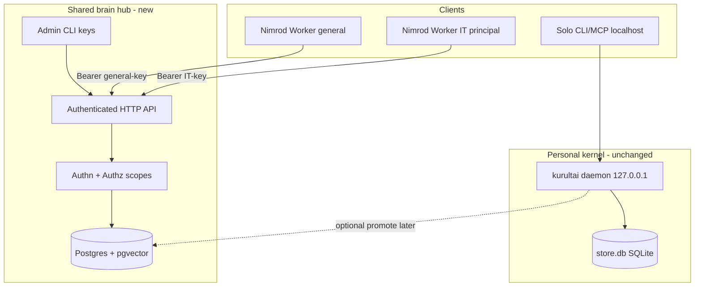

# feat: Nimrod shared brain path — hub kernel around Kurultai retrieval

**Target repo:** `duketopceo/kurultai`  
**Consumer:** Nimrod / brain-worker (Cloudflare Workers) + multi-employee IT corpus  
**Audience:** team (Bartlett / Nimrod) on top of solo kernel  
**Process:** multi-PR stack; do not ship as one mega-merge  
**Base:** `main` @ v0.3.x–0.4.x product surface

> **Program authority (2026-08-12):** Bartlett constraints and rival-GBrain sequencing live in
> [003 rival GBrain under Bartlett constraints](2026-08-12-003-feat-rival-gbrain-bartlett-hub-plan.md).
> This file remains the gap inventory (items 1–9 → R1–R16). Prefer 003 for tenant size,
> Railway private-default, Gate 0 rewrite-first, hashtag P0, and day-one ops.

## Goal Capsule

Turn Kurultai from **a good personal retrieval tool** (localhost SQLite, no identity) into a **shared, multi-employee, network-exposed retrieval backend** that Nimrod can call without regressing compile-time isolation guarantees currently enforced by `GlenEnv` (PRIVATE_SEARCH unbound for non-IT paths).

**Stop when:** a Worker can call authenticated HTTP `search`/`ask` against a Postgres-backed hub; results are scoped by principal + visibility; IT private corpus cannot leak to non-IT principals (acceptance suite AE1–AE5); personal SQLite path still works for solo; kb-it-docs-style corpora are searchable without wholesale quarantine; deploy story is Railway (or equivalent) with durable store + health.

**Do not:** replace the solo laptop kernel; force all knowledge into a GBrain-style git brain repo; implement full company multi-Org VPC compliance; ship unauthenticated bind-to-world; weaken GlenEnv isolation without an explicit equivalent at the authz layer.

**Product Contract preservation:** new bootstrap from user assessment + existing tiered-access brainstorm. Aligns with Kurultai mission (*assemble from wherever it lives*) by adding **who may see what** and **where the shared index lives** — not by abandoning connectors.

---

## Assessment revalidation (2026-08-12)

Flagged: original audit date **2026-08-04**. Spot-check against `origin/main` + open issues:

| # | Claim (2026-08-04) | Status 2026-08-12 | Notes |
|---|--------------------|-------------------|--------|
| 1 | No tenant/user model | **Still true** | Zero tenant columns; atoms have no principal. Related open: #178, #180. |
| 2 | No real auth on `/api/*`; bind 127.0.0.1 | **Still true for product API** | MCP HTTP/SSE has **optional bearer secret** only; general `/api/*` unauthenticated; bind still localhost. |
| 3 | SQLite only; cannot share file | **Still true** | #111 / #176 open; docs still forbid shared `store.db`. |
| 4 | RBAC/audit design-only | **Still true** | #115 open; `docs/multi-user-kurultai.md` says design + partial Clerk UI only. |
| 5 | Markdown ≥1 YAML tag → quarantine | **Still true** | Frontmatter `tags:`; hashtag-line corpora quarantine. |
| 6 | FTS-only without embed key | **Still true** (by design) | Operational, not a code gap. |
| 7 | Deploy needs durable volume or Postgres | **Still true** | Railway OK for binary; SQLite needs volume **or** Postgres removes concern. |
| 8 | GlenEnv compile-time isolation vs network authz | **Still true** (architecture) | Must not quietly regress. |
| 9 | Ops health (CPU, backlog, version) | **Environment-local** | Re-check before production cutover; not a design unit. |

**Bottom line stands:** items **1–4 are the real program**; 5–9 are real but smaller. This is **a second system around the retrieval kernel**, not “point Nimrod at today’s binary.”

---

## Product Contract

### Problem frame

| Today | “The brain” (Nimrod) |
|-------|----------------------|
| One Mac, one `store.db`, no identity | Many employees, one shared backend |
| Agents on-box via MCP stdio / localhost HTTP | Workers on Cloudflare call over network |
| Everyone sees all local atoms | Principal-scoped visibility (IT private vs company-wide) |
| Isolation = network loopback | Isolation = authn + authz (match GlenEnv strength) |

### Actors

| ID | Actor |
|----|--------|
| A1 | Solo operator (existing path — must not break) |
| A2 | Employee client via Nimrod (Worker) |
| A3 | Hub admin (keys, scopes, deploy) |
| A4 | IT private corpus consumer (privileged principal) |
| A5 | Non-IT employee (must never see private corpus) |

### Requirements

| ID | Source item | Requirement |
|----|-------------|-------------|
| R1 | #1 · #178 | Every atom carries visibility scope: `personal \| team \| company` (and optional `tenant_id` / `team_id` for multi-team hubs). |
| R2 | #1 · #178 | Queries are scoped to the requesting principal’s allowed scopes; default deny. |
| R3 | #1 | Migration path for existing unscoped atoms (default `personal` or hub-configured `company` — **decision KTD-MIG**). |
| R4 | #2 · #177 | Network-facing HTTP API supports non-loopback bind only when auth is configured. |
| R5 | #2 | Every request authenticates a principal (device API key / mTLS / JWT — **KTD-AUTH**). |
| R6 | #2 · #4 · #115 | Authorization uses principal → allowed scopes; no “auth means full dump.” |
| R7 | #3 · #111 · #176 | Shared index uses Postgres + pgvector `Store` implementation; SQLite remains personal kernel. |
| R8 | #3 | Config switch: `store.backend = sqlite \| postgres`. |
| R9 | #4 · #115 | ACLs on `search` / `ask` / `cite` / `who_knows` (and MCP equivalents). |
| R10 | #4 · #179 | Admin CLI: issue/revoke device API keys; define team/org boundaries. |
| R11 | #5 | Markdown ingest accepts hashtag-line tags (or equivalent) without YAML frontmatter; docs corpus not quarantined wholesale. |
| R12 | #6 | Document + deploy checklist: embed/rerank keys for hybrid path on hub. |
| R13 | #7 | Deploy recipe: Railway (or equiv) with Postgres; health/ready endpoints. |
| R14 | #8 | Isolation threat model doc: GlenEnv compile-time vs hub network-time; Nimrod must only hold credentials for allowed scopes. |
| R15 | #8 · #181 | Acceptance suite AE1–AE5 (tiered access brainstorm) automated. |
| R16 | #9 | Pre-prod health gate: version match, quarantine backlog, CPU/daemon sanity. |

### Acceptance examples (from tiered-access brainstorm + Nimrod)

- **AE1** — Unscoped legacy atoms migrate; search still works under default policy.  
- **AE2** — Tailscale-only or public+key: unauthenticated client gets 401/403, never team data.  
- **AE3** — Principal without IT/private scope cannot retrieve private-corpus atoms even if ids known.  
- **AE4** — Local SQLite solo path unchanged for A1.  
- **AE5** — Two teams on one hub: eng never sees sales-scoped atoms; both see company-scoped.  
- **AE-N1** — Nimrod Worker with IT-scoped key can search IT docs; Worker with general key cannot.

### Scope boundaries

**In (this program):** R1–R16 as a **phased stack** (units below).

**Deferred / non-goals**

- Full multi-Org enterprise RBAC, retention, SOC2 packaging  
- Replacing connectors with GBrain markdown-SoR  
- Live encrypted device sync (#80 full)  
- Real-time Slack/DM isolation product (pattern only via ingest tags)  
- Closing every Phase 6 UI work order

### Related GitHub work orders (do not re-invent)

| Issue | Role |
|-------|------|
| #111 / #176 | Postgres + pgvector Store |
| #115 | ACL on search/ask |
| #177 | Hub dual transport (Tailscale / public+key) |
| #178 | Scope on atom + merged local+remote query |
| #179 | Admin API keys / boundaries |
| #180 | Visibility tagging at ingest |
| #181 | AE1–AE5 acceptance suite |
| #188 | Claim-level permissions (later hardening) |

---

## Planning Contract

### Assumptions (session / pipeline)

| Decision | Class | Rejected | Why |
|----------|-------|----------|-----|
| Shared brain = **second deploy path**, not solo default | user-directed | “Just Railway the SQLite file” | WAL/race + no authz |
| Postgres is **prerequisite** for multi-writer hub | assessment + #111 | Shared SQLite volume | Explicit product warning |
| Nimrod isolation must remain **as strong as GlenEnv** at trust boundary | user-directed | “Auth later” | Explicit non-regression |
| Scope model matches brainstorm `personal \| team \| company` | existing product docs | Full tenant_id graph first | Ship R1–R3 without over-modeling |
| Hashtag ingest is a **small connector patch** parallel to hub | assessment item 5 | “Only YAML forever” | kb-it-docs compatibility |

### Key Technical Decisions

| KTD | Decision | Why |
|-----|----------|-----|
| KTD-MIG | Unscoped atoms → `visibility = company` **or** `personal` configurable at migrate; hub default **`company`** for existing single-operator corpora; solo migrate default **`personal`** | Existing ~3.7k atoms are one operator’s brain; hub import is “shared IT brain” |
| KTD-AUTH | Hub uses **device API keys** (hashed at rest) bound to principal + allowed scopes; Workers hold one key per trust class (IT vs general) | Matches #179; mTLS optional later; simpler than full OIDC in v1 hub |
| KTD-BIND | Daemon: `bind = 127.0.0.1` default; `0.0.0.0` / public only if `auth.mode != none` | Prevents accidental open world |
| KTD-STORE | `Store` trait stays; `PostgresVecStore` for hub; personal keeps `SqliteVecStore` | #111 acceptance; no dual-write on laptop |
| KTD-QUERY | `search`/`ask` take `AuthContext`; store filters by visibility ⊆ allowed | Default deny; no post-filter only |
| KTD-NIMROD | Nimrod never holds a superuser key; compile-time GlenEnv **plus** key scope | No silent isolation regression |
| KTD-TAG | Markdown connector: YAML `tags:` **or** trailing/body hashtag line `#a #b` → tags | Item 5 |
| KTD-DEPLOY | Hub target: Railway Postgres + kurultai daemon container; secrets via platform env | Item 7 |

### High-Level Technical Design



**Isolation story (R14):**  
GlenEnv = compile-time “no binding.” Hub = runtime “key cannot list private scope.” Nimrod keeps GlenEnv **and** only injects keys whose scopes match the Worker’s trust class. Superuser keys stay in 1Password/admin only.

### Risks

| Risk | Mitigation |
|------|------------|
| Scope filter bugs leak private atoms | AE suite #181; property tests; deny-by-default |
| Postgres FTS/vector parity gap vs SQLite | Explicit acceptance: hybrid path must match on fixture corpus |
| Workers hold over-broad secrets | Separate keys; short rotation; no root key in CF env |
| Migration destroys solo semantics | Dual backend; migrate opt-in; backup first |
| CPU/backlog ops debt | R16 pre-prod gate |
| Scope creep into full GBrain | Stay retrieval kernel + hub; no dream skillpack rewrite |

---

## Implementation Units

### U1. Plan artifact (this file)

**Verify:** `implementation-ready` + `execution: code`.

### U2. Visibility model on atoms + SQLite migration

**Goal:** Schema + types for scope; backfill existing atoms.  
**Requirements:** R1, R3  
**Issues:** #178 (slice)  
**Files:** `src/types.rs`, `src/store/mod.rs` (migrations), pipeline upsert paths, tests  
**Approach:**
1. Add `visibility` enum + optional `team_id` on `KnowledgeAtom`.  
2. SQLite migration: columns + index; backfill per KTD-MIG.  
3. Default new local ingest → `personal` unless connector/config says otherwise.  
**Test scenarios:**
- Migrate empty + fixture DB; all rows have visibility.  
- Upsert preserves visibility.  
**Verify:** migration idempotent; solo search unchanged when policy = “all local.”

### U3. AuthContext + request auth for HTTP API

**Goal:** Principal on every hub request; localhost can remain open for solo.  
**Requirements:** R4, R5, R6 (auth half)  
**Issues:** #177 (auth part), #179 (key storage slice)  
**Files:** `src/http/mod.rs`, new `src/auth/` or `src/security/hub_auth.rs`, config, tests  
**Approach:**
1. `AuthContext { principal_id, allowed_scopes, team_ids }`.  
2. Middleware: if hub mode / non-loopback / `auth.required`, demand `Authorization: Bearer`.  
3. Key verify against hashed table (SQLite first for solo-admin, Postgres when U5 lands).  
**Test scenarios:**
- Missing bearer → 401 on hub mode.  
- Valid key → context populated.  
- Localhost + auth.required=false → existing tests pass.  
**Verify:** no unauthenticated `/api/search` when hub auth on.

### U4. Query-path authorization (ACL on search/ask)

**Goal:** Store/query filters by allowed scopes.  
**Requirements:** R2, R6, R9  
**Issues:** #115, #178  
**Files:** `src/query/*`, `src/mcp/brain.rs`, `src/store/*`, MCP tools  
**Approach:**
1. Thread `AuthContext` into hybrid_search / ask.  
2. SQL/predicate: `visibility IN allowed` AND team_id match when team-scoped.  
3. MCP stdio: map to “local full personal” context; hub MCP uses same auth as HTTP.  
**Test scenarios:**
- AE3: general principal never sees `team=it_private` or equivalent.  
- AE5: eng vs sales (fixture).  
**Verify:** no post-hoc only filtering of full result sets (push down).

### U5. Postgres + pgvector Store backend

**Goal:** Multi-writer shared index.  
**Requirements:** R7, R8  
**Issues:** #111, #176  
**Files:** `src/store/postgres.rs` (new), trait, config, CI Postgres service, docs  
**Approach:**
1. Implement `Store` for Postgres (upsert, FTS or tsvector, pgvector KNN).  
2. Config `store.backend` + connection string from env.  
3. CI: docker Postgres + pgvector.  
**Test scenarios:**
- Upsert + FTS + vector path on fixture.  
- Concurrent writers smoke.  
**Verify:** SQLite path still default for solo.

### U6. Hub mode daemon + transport

**Goal:** Network exposure with dual transport story.  
**Requirements:** R4, R13  
**Issues:** #177  
**Files:** `src/main.rs`, `src/daemon/mod.rs`, `src/http/mod.rs`, deploy docs  
**Approach:**
1. Flags/config: `--bind`, hub mode, auth required when bind public.  
2. Health/ready including DB.  
3. Railway compose/docs: Postgres + daemon + secrets.  
**Test scenarios:**
- Public bind without auth refused at startup.  
- Ready fails if Postgres down.  
**Verify:** README hub section.

### U7. Admin CLI for keys and boundaries

**Goal:** Operators can issue scoped keys without SQL.  
**Requirements:** R10  
**Issues:** #179  
**Files:** `src/main.rs` subcommands, store key tables  
**Approach:** `kurultai admin key create --scopes …`, `revoke`, `list`.  
**Test scenarios:** create → use → revoke → 401.  
**Verify:** keys never logged in plaintext.

### U8. Connector: hashtag-line tags (kb-it-docs)

**Goal:** Ingest IT docs corpus without quarantine.  
**Requirements:** R11  
**Issues:** complements #180  
**Files:** `src/connectors/markdown.rs`, tests/fixtures  
**Approach:**
1. After frontmatter parse, if tags empty, scan body for `#tag` tokens (line or trailing convention).  
2. Document behavior; optional config `tags_from_hashtags = true` default on.  
**Test scenarios:**
- File with only hashtag tags → not quarantine.  
- YAML tags still win when present.  
**Verify:** fixture corpus searchable.

### U9. Ingest visibility tagging config

**Goal:** Sources declare default visibility at ingest.  
**Requirements:** R1, R11 related  
**Issues:** #180  
**Files:** source config, connectors, pipeline  
**Approach:** `[sources.it_docs] default_visibility = "team"` + `team_id = "it"`.  
**Test scenarios:** ingested atoms inherit defaults.  
**Verify:** private source cannot default to company without explicit config.

### U10. Nimrod isolation contract + AE suite

**Goal:** Document + test isolation; no quiet regression.  
**Requirements:** R14, R15, R16  
**Issues:** #181  
**Files:** `docs/nimrod-isolation.md` (or under docs/), `tests/tiered_access.rs`  
**Approach:**
1. Threat model: GlenEnv + scoped keys.  
2. Automate AE1–AE5 + AE-N1.  
3. Pre-prod checklist (version, quarantine count, backlog, embed keys).  
**Test scenarios:** AE table green in CI against Postgres hub fixture.  
**Verify:** failing AE fails CI.

### U11. Operational embed path for hub (docs + config)

**Goal:** Hybrid search on in production hub.  
**Requirements:** R12  
**Files:** deploy docs, `.env.example`, hub config template  
**Approach:** Require embed key in hub checklist; document NullEmbedder degradation.  
**Test expectation:** none (ops) — checklist item.

---

## Phased delivery (PR stack)

| Phase | Units | Outcome |
|-------|-------|---------|
| **P0 — Model** | U2, U8, U9 | Scoped atoms + IT corpus ingestable locally |
| **P1 — Authz on SQLite hub-dev** | U3, U4, U7 | Can demo scoped HTTP on single writer (dev only) |
| **P2 — Shared store** | U5 | Real multi-writer |
| **P3 — Network hub** | U6, U10, U11 | Nimrod-ready deploy + isolation proof |

**Do not** put Nimrod production traffic on P1 (SQLite multi-client still unsafe). P1 is for authz logic tests only.

---

## Verification Contract

```bash
cargo fmt --check
cargo clippy --all-targets -- -D warnings
cargo test --locked
# hub CI job:
# cargo test --locked --features postgres -- --include-ignored tiered_access
```

Deploy smoke (manual):

```bash
# hub
kurultai daemon --bind 0.0.0.0 --port 8421   # fails without auth
# with auth + postgres env
curl -H "Authorization: Bearer $IT_KEY" "$HUB/api/search?q=permit"
curl -H "Authorization: Bearer $GENERAL_KEY" "$HUB/api/search?q=permit"  # must not return IT-private
```

---

## Definition of Done (program)

- [ ] R1–R16 covered or explicitly deferred with issue links  
- [ ] AE1–AE5 + AE-N1 green  
- [ ] Solo SQLite path green  
- [ ] Nimrod isolation doc accepted by owner  
- [ ] Hub deploy recipe validated once on Railway (or chosen host)  
- [ ] Open issues #111/#115/#176–#181 linked from shipped PRs  

---

## Sources & Research

- User gap assessment (items 1–9), 2026-08-04; revalidated 2026-08-12  
- `docs/brainstorms/2026-08-07---tiered-access-hosted-hub-requirements.md`  
- `docs/multi-user-kurultai.md`  
- Issues #111, #115, #176–#181, #188  
- Kurultai mission: *assemble from wherever it lives* (contrast GBrain: markdown SoR + dream cycle)  
- GlenEnv / brain-worker: compile-time PRIVATE_SEARCH absence  

---

## What this plan is not

This is **not** “install Kurultai on Railway and point Nimrod at it.”  
This is **building the hub system** (identity, authz, Postgres, keys, corpus ingest, isolation tests) **around** the existing retrieval kernel.

When ready to execute: start **P0 (U2+U8+U9)** or full **`/lfg`** on U2 only if you want thinner slices.
