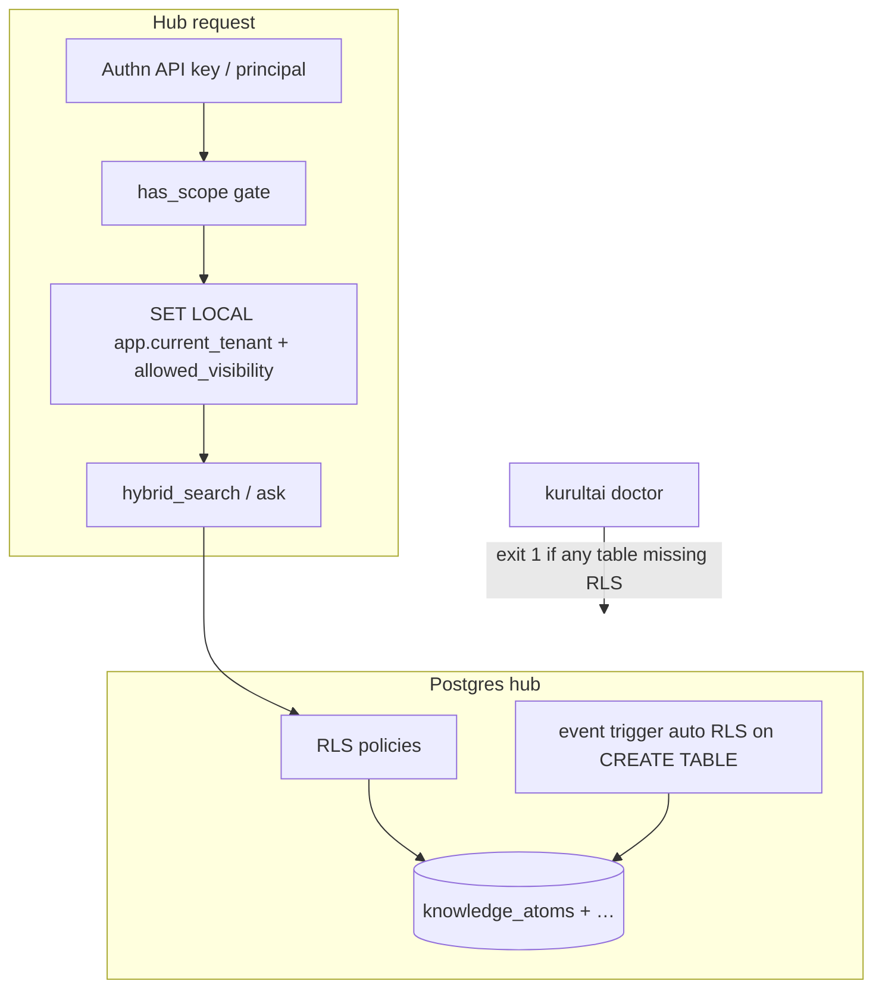

# feat: GBrain design patterns → Kurultai (Rust approach port)

**Target repo:** `duketopceo/kurultai`  
**Parent program:** [Nimrod shared brain path](2026-08-12-001-feat-nimrod-shared-brain-path-plan.md)  
**Program authority:** [003 rival GBrain under Bartlett constraints](2026-08-12-003-feat-rival-gbrain-bartlett-hub-plan.md) — applies these patterns with **2–3 RLS shapes** (private/public + KTD15), not multi-person SaaS.  
**Constraint:** **Port of approach, not TypeScript.** Patterns below are implemented natively in Rust + SQL migrations + CLI.  
**Process:** PR stack; Postgres+RLS is one migration program, not two.

## Goal Capsule

Steal **seven high-leverage GBrain isolation/ops/retrieval patterns** and express them in Kurultai’s stack (Rust, `Store` trait, daemon, MCP) so the hub path is **DB-enforced multi-tenant**, **scope-gated at every boundary**, **fail-closed under `doctor`**, and slightly stronger on ranking — **without** porting GBrain’s CRM-shaped knowledge-graph entity model (`attended` / `works_at` / …).

**Stop when:** Postgres backend exists; every hub table has RLS (event trigger + backfill + doctor hard-fail); per-request `SET` of tenant/session GUC; OAuth-style scope hierarchy with CI drift check; `kurultai doctor` exits 1 on invariant break; exemptions require greppable markers; query rewrite + source-tier boost land on hybrid path; docs state CRM graph is out of scope.

**Do not:** Copy gbrain Bun/TS, PGLite-as-default for solo, skillpack/dream cycle wholesale, or typed CRM edges. Do not remove SQLite personal kernel. Do not implement isolation only in application `if`s.

**Product Contract preservation:** Extends Nimrod plan R1–R16 with **how** isolation is enforced (RLS + scopes + doctor), not a new product identity.

---

## Relationship to prior plan

| Prior (Nimrod path) | This plan adds |
|---------------------|----------------|
| Need tenant model + Postgres + authz | **RLS as primary enforcement**, app layer sets GUC only |
| Device API keys + scopes | **Explicit IMPLIES hierarchy + CI drift guard** (gbrain `scope.ts` pattern) |
| Pre-prod health checklist | **Standing `kurultai doctor` fail-closed CLI** |
| Query ACL push-down | Prefer **Postgres RLS** so store methods can’t “forget” to filter |
| Soft-label boost already exists | **Query rewrite + source-tier boost** as net-new ranking knobs |
| Graph multi-hop deferred | **Wikilink auto-link only** if cross-article refs appear; no CRM types |

---

## Product Contract

### Summary

Port seven GBrain **design patterns** into Kurultai as the isolation and ops spine of the shared hub. Bartlett/Nimrod needs FAQ/IT corpus isolation and support retrieval quality — not an executive people-graph.

### Requirements

| ID | Pattern | Requirement |
|----|---------|-------------|
| P1 | RLS event trigger | On Postgres hub: event trigger auto-enables RLS on every new `public.*` table (or Kurultai schema). |
| P2 | RLS backfill | One-time migration enables RLS + policies on all existing hub tables. |
| P3 | doctor RLS | `kurultai doctor` hard-fails (exit 1) if any non-exempt table lacks RLS or required policy. |
| P4 | Tenant column | Every knowledge row has `tenant_id` (and/or principal + visibility — see KTD-TENANT). |
| P5 | Session GUC | Per-request: `SET LOCAL app.current_tenant` / `app.allowed_scopes` from authenticated principal (transaction-scoped). |
| P6 | RLS policy | Policies filter atoms by tenant + visibility using current settings; superuser/bypass role only for migrations. |
| P7 | Scope hierarchy | Fixed scopes with explicit `IMPLIES` (e.g. admin→write→read; `*_admin` siblings); single `has_scope()` gate. |
| P8 | Scope CI | CI script fails if hand-maintained scope mirror (docs/OpenAPI/TS client if any) drifts from Rust source of truth. |
| P9 | doctor suite | `kurultai doctor` checks: schema version, RLS, quarantine backlog threshold, optional CPU/backlog heuristics, embed config on hub. |
| P10 | Painful exempt | RLS/tenant exemptions require SQL comment marker `KURULTAI:RLS_EXEMPT` (or table registry entry that doctor greps); no quiet config flag. |
| P11 | Query rewrite | Optional cheap rewrite step before hybrid search (feature-flagged; no-op without LLM key). |
| P12 | Source-tier boost | Ranking multiplies scores by configurable source tier weights (not only filter in/out). |
| P13 | Auto-link (optional) | If `[[slug]]` / internal refs appear in content, write lightweight edges at index time without LLM. |
| P14 | Non-goal | **No** port of GBrain typed CRM graph (`attended`, `works_at`, `invested_in`, …). |

### Actors / flows

- A1 Hub admin · A2 Employee via Nimrod · A3 Solo (SQLite, no RLS path)  
- F1 Request → auth → SET LOCAL → query under RLS  
- F2 `kurultai doctor` in CI/deploy · F3 Schema migration adds table → event trigger enables RLS  

### Scope boundaries

**In:** P1–P14 as phased units below.

**Out:**

- GBrain skillpack, dream cycle, bootstrap SOUL/USER  
- CRM entity ontology  
- Silent `rls_disabled=true` config  
- Replacing solo SQLite with Postgres  

---

## Planning Contract

### Key Technical Decisions

| KTD | Decision | Why |
|-----|----------|-----|
| KTD-ONE-MIG | **Postgres Store + tenant columns + RLS trigger/policies = one program** (user: “really one migration, not two”) | Partial ship (Postgres without RLS) is worse than SQLite for multi-tenant |
| KTD-TENANT | Columns: `tenant_id` (UUID/text) **and** `visibility` (`personal\|team\|company`) **and** optional `team_id`; RLS uses **both** GUC tenant and allowed visibility list | Matches Nimrod multi-employee + IT private slice; pure tenant_id alone doesn’t express IT vs company FAQ |
| KTD-GUC | Use `SET LOCAL` inside each request transaction on a dedicated pool connection; never rely on process-global session | Safe under async pool |
| KTD-SOLO | SQLite path: **no RLS** (not possible); enforce visibility only if local multi-profile ever appears; hub-only RLS | Solo remains one-operator |
| KTD-SCOPE | Scopes (hub v1): `read`, `write`, `admin`, `sources_admin`, `users_admin`, `agent` + optional `corpus:it` style **resource scopes** as tags on keys | Mirror gbrain shape; map Nimrod IT private to a corpus/resource scope |
| KTD-IMPLIES | `admin ⊃ write ⊃ read`; `sources_admin` / `users_admin` / `agent` are **siblings** of admin (not implied by each other) | User-specified pattern |
| KTD-SOURCE | Single Rust module `src/auth/scope.rs` is SoT; CI checks `docs/scopes.md` or generated JSON mirrors it | Drift script pattern |
| KTD-REWRITE | Query rewrite is **optional** post-hybrid; off by default; uses existing OpenRouter path when keyed | Don’t break FTS-first / no-key doctrine |
| KTD-TIER | Source tier = config map `source_name → weight` applied after RRF (before or after soft-label boost) | Cheap; corpus priority without graph |
| KTD-LINK | Auto-link deferred until cross-ref demand; design only stub trait if U-order allows | User: less relevant to FAQ |
| KTD-EXEMPT | Marker string `KURULTAI:RLS_EXEMPT` in migration comments; doctor scans `pg_description` / migration files | Painful by design |

### High-Level Technical Design



**Request boundary (every hub path):**

1. Authenticate principal → `AuthContext`  
2. `has_scope(required)` or 403  
3. Open transaction; `SET LOCAL` tenant + allowed visibility  
4. Call `Store` methods with **no extra tenant WHERE** required for safety (RLS is backstop); app may still push filters for performance  

**Doctor (fail-closed):**

| Check | Fail if |
|-------|---------|
| `schema_version` | Behind head |
| `rls_enabled` | Any non-exempt table without RLS |
| `rls_policy` | Knowledge table missing tenant/visibility policy |
| `quarantine_ratio` | Optional threshold (config) |
| `hub_embed` | Hub mode without live embedder when policy requires hybrid |

### Risks

| Risk | Mitigation |
|------|------------|
| RLS + pooler (Supabase/PgBouncer) drops SET | Use transaction pooling carefully; prefer session mode or set on every checkout |
| App bypasses SET and sees nothing / everything | Integration tests; doctor; role without BYPASSRLS for app user |
| Double filter complexity | RLS authoritative; app filters optional optimize |
| Query rewrite latency/cost | Feature flag; skip under `search.mode=fts_only` |
| Over-building scopes | Start with fixed enum + IMPLIES table only |

---

## Implementation Units

### U1. Plan (this file)

**Verify:** ready for `ce-work` / PR stack.

### U2. Postgres `Store` foundation (prerequisite)

**Goal:** `store.backend = postgres` implements trait enough for hub (upsert, FTS/tsvector, vector KNN).  
**Requirements:** enables P1–P6  
**Issues:** #111, #176  
**Files:** `src/store/postgres.rs`, config, CI Postgres  
**Patterns:** existing `SqliteVecStore` / `Store` trait  
**Test scenarios:** fixture upsert + search against ephemeral Postgres.  
**Execution note:** Land **before or with** U3; never ship public hub on Postgres without U3.

### U3. Tenant columns + RLS trigger + policies + backfill (one migration)

**Goal:** DB-enforced isolation spine (patterns 1–2, 5).  
**Requirements:** P1–P6, P10  
**Issues:** #178, #111  
**Files:** SQL migrations under store/postgres, `src/store/postgres.rs` connection wrapper, types  
**Approach:**
1. Add `tenant_id`, `visibility`, optional `team_id` columns; backfill.  
2. Create app role **without** `BYPASSRLS`.  
3. Event trigger `auto_rls_on_create_table` for schema.  
4. Policies: e.g. `tenant_id = current_setting('app.current_tenant', true)` AND visibility ∈ allowed list from setting.  
5. Exempt only with `KURULTAI:RLS_EXEMPT` + doctor allowlist.  
**Test scenarios:**
- Two tenants: A cannot read B’s rows even if app forgets WHERE.  
- New table created in migration gets RLS auto-enabled (or doctor fails until policy added).  
- Exempt table documented and greppable.  
**Verify:** CI Postgres tests; solo SQLite unaffected.

### U4. Per-request GUC + AuthContext integration

**Goal:** Authenticated request sets session variables for RLS.  
**Requirements:** P5, P6  
**Issues:** #177 auth, #115  
**Files:** `src/http/*`, `src/auth/*`, store connection acquire  
**Approach:**
1. After bearer auth, begin txn → SET LOCAL → run handlers → commit.  
2. MCP hub path same.  
**Test scenarios:** wrong tenant GUC → empty results; correct → hits.  
**Verify:** no connection reuse with stale GUC (txn-scoped SET LOCAL).

### U5. Scope hierarchy + boundary gate + CI drift

**Goal:** Pattern 3.  
**Requirements:** P7, P8  
**Files:** `src/auth/scope.rs`, keys table, `scripts/check-scope-drift.sh`, `docs/scopes.md` (generated or hand-mirrored)  
**Approach:**
1. Enum scopes + static IMPLIES table.  
2. `has_scope(have, need)`.  
3. CI: rustc test exports expected list; script diffs docs.  
**Test scenarios:** admin implies read; sources_admin does not imply users_admin.  
**Verify:** CI red on drift.

### U6. `kurultai doctor` fail-closed

**Goal:** Pattern 4 (+ ops debt).  
**Requirements:** P3, P9  
**Files:** `src/doctor/mod.rs`, `src/main.rs` subcommand, CI job optional  
**Approach:**
1. `kurultai doctor` / `kurultai doctor --hub` (Postgres URL).  
2. Exit 1 on any hard check fail; exit 0 with warnings for soft.  
3. Include RLS suite when backend=postgres.  
**Test scenarios:** synthetic DB missing RLS → exit 1.  
**Verify:** documented in README deploy checklist.

### U7. Query rewrite + source-tier boost

**Goal:** Pattern 6 (net-new ranking).  
**Requirements:** P11, P12  
**Files:** `src/query/hybrid.rs` (or `rewrite.rs`), config `[search]`, tests  
**Approach:**
1. Optional rewrite: raw query → rewritten string (LLM or rule-based stub).  
2. After RRF (+ existing soft-label boost): multiply by `source_tiers[source]`.  
3. Config example: `it_docs = 1.2`, `chatter = 0.7`.  
**Test scenarios:**
- Rewrite off → identical to baseline.  
- Tier boost reorders two equal-RRF hits.  
**Verify:** FTS-first path without keys still works (rewrite skipped).

### U8. Wikilink auto-link (optional / low priority)

**Goal:** Pattern 7, design-light.  
**Requirements:** P13  
**Files:** pipeline index hook, optional `atom_links` table  
**Approach:** Regex `[[...]]` at write; store edge list; **no** CRM relation types.  
**Test scenarios:** body with `[[other-slug]]` creates link row.  
**Verify:** disabled by default if no demand.

### U9. Docs: isolation contract + non-goals

**Goal:** Align Nimrod + GBrain port narrative.  
**Requirements:** P14  
**Files:** `docs/hub-isolation.md`, update multi-user doc  
**Approach:** RLS + scopes + doctor + GlenEnv dual guarantee; explicit “no CRM graph.”  
**Test expectation:** none.

---

## Phased PR stack

| Phase | Units | Outcome |
|-------|-------|---------|
| **A** | U2 + U3 | Postgres + RLS + tenant (atomic) |
| **B** | U4 + U5 | Request auth sets GUC; scope gates |
| **C** | U6 | doctor fail-closed in CI/deploy |
| **D** | U7 | rewrite + source tiers |
| **E** | U8–U9 | optional auto-link + docs |

**Ordering rule:** Do not merge **B** to production without **A**. Do not open bind-to-world without **B+C**.

---

## Mapping: user patterns → units

| # | Pattern | Units |
|---|---------|-------|
| 1 | RLS via Postgres event trigger + backfill + doctor | U2, U3, U6 |
| 2 | Tenant column + RLS on GUC | U3, U4 |
| 3 | OAuth scope hierarchy + CI drift | U5 |
| 4 | doctor fail-closed | U6 |
| 5 | Painful exemption marker | U3, U6 |
| 6 | Query rewrite + source-tier boost | U7 |
| 7 | Auto-link pattern match | U8 (optional) |
| — | **Not** CRM graph | P14 / U9 |

---

## Verification Contract

```bash
cargo fmt --check
cargo clippy --all-targets -- -D warnings
cargo test --locked
# with Postgres:
cargo test --locked --features postgres
scripts/check-scope-drift.sh
kurultai doctor --hub   # exit 1 if RLS missing
```

---

## Definition of Done

- [ ] Hub Postgres path: RLS on all non-exempt tables; doctor enforces  
- [ ] Per-request SET LOCAL from auth; dual-tenant fixture proves isolation without app WHERE  
- [ ] Scope IMPLIES + CI drift check  
- [ ] Query rewrite optional + source-tier boost tested  
- [ ] Docs forbid silent RLS off; forbid CRM graph port  
- [ ] Solo SQLite path green  
- [ ] Linked to #111 / #115 / Nimrod parent plan  

---

## Sources

- User pattern list (this invocation)  
- Parent: `docs/plans/2026-08-12-001-feat-nimrod-shared-brain-path-plan.md`  
- GBrain: RLS event trigger + doctor (approach); `scope` IMPLIES pattern  
- Kurultai: hybrid RRF + soft-label boost already in `src/query/hybrid.rs`  
- Issues: #111, #115, #176–#181  

---

## What this plan is not

Not a GBrain clone. Not a TypeScript port. Not “enable a multi_tenant feature flag.”  
It is **DB-enforced multi-tenant hub isolation + standing doctor + ranking polish**, as the concrete design layer under the Nimrod shared-brain program.
