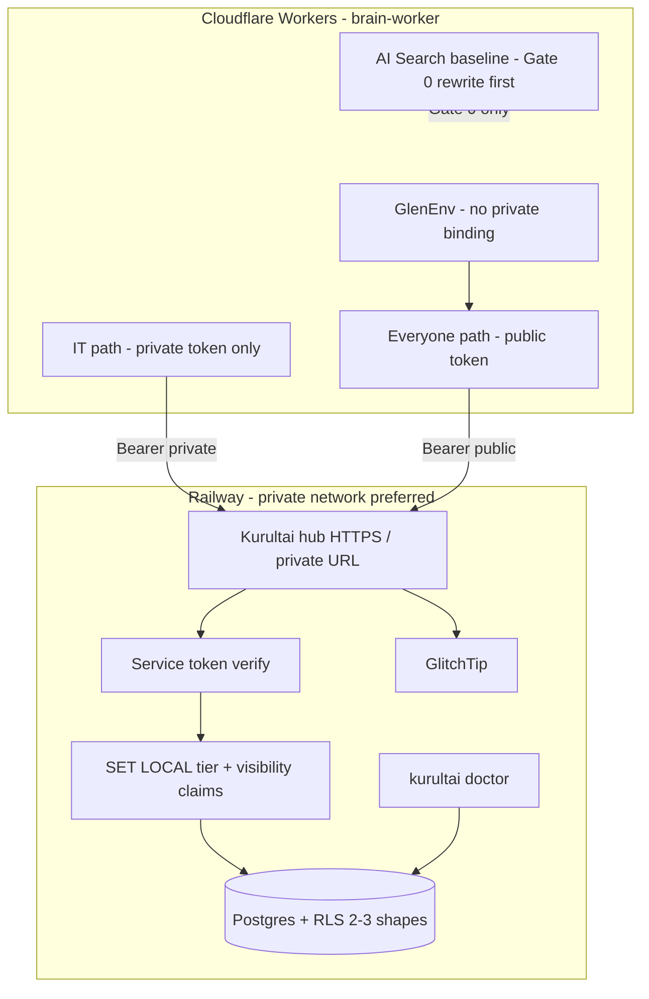

# Rival GBrain under Bartlett constraints

**Target repo:** `duketopceo/kurultai` (personal / duketopceo)  
**Consumer:** Nimrod `brain-worker` (Cloudflare Workers, Bartlett work org)  
**Identity rule:** Bartlett Roofs logins and `Bartlett-Roofs/*` repos = work. `duketopceo` / personal email = this Kurultai product work. Do not mix deploy accounts or PR identity.

**Parents (still valid as depth):**

| Doc | Role after this plan |
|-----|----------------------|
| [001 Nimrod shared brain path](2026-08-12-001-feat-nimrod-shared-brain-path-plan.md) | Gap list R1–R16, AE suite, phased hub program — **scoped down** by KTD-TENANT-SMALL |
| [002 GBrain patterns Rust port](2026-08-12-002-feat-gbrain-patterns-rust-port-plan.md) | RLS/doctor/scopes/rewrite palette — **apply with 2–3 policy shapes**, not multi-person SaaS |

---

## Goal Capsule

Build a **Bartlett-sized shared brain hub** that rivals GBrain’s *isolation + ops + retrieval quality* outcomes — not GBrain’s multi-team SaaS shape — so Ask Bartlett can eventually route through Kurultai with **stronger answers and honest isolation**, without pretending Workers can embed a Rust binary.

**Stop when:**

1. **Gate 0 (cheap path):** query rewriting is proven on the *live* AI Search pipeline (or proven already-on and insufficient) with a scored before/after on “Ask Bartlett feels dumb” fixtures.
2. **Hub v1:** Kurultai runs as a **separate** Railway (or equivalent) service with **Postgres + 2–3 RLS policy shapes** (`bartlett-private` / `bartlett-public` + KTD15 doc visibility), service-token auth, **no default public domain**, hashtag-line ingest for `kb-it-docs`, `kurultai doctor` + GlitchTip + CI boot-gates + domain-exposure checks from day one.
3. **Isolation honesty:** docs and AE suite state that GlenEnv compile-time “no binding” is **replaced at the retrieval boundary** by **RLS + scoped service tokens**; Nimrod still never injects a private-capable token into GlenEnv/general paths.
4. **Beat criterion:** hub retrieval wins a fixed eval set vs AI Search baseline on relevance *or* Gate 0 alone closes the dumb-answers problem and migration is **paused** with evidence (not abandoned on vibes).

**Do not:**

- Port GBrain multi-person / multi-team slice model, CRM graph, dream cycle, or Bun/TS stack.
- Embed Rust in Workers, or put the hub on a public Railway domain by default.
- Ship Postgres without RLS, or RLS without doctor.
- Migrate Nimrod production traffic before Gate 0 decision + AE suite green.
- Quarantine `kb-it-docs` wholesale for missing YAML frontmatter.

---

## Product Contract

### Problem frame

GBrain’s end product is a **markdown source-of-truth brain** with Postgres RLS, scope hierarchy, doctor fail-closed, synthesis/gap loops, and per-person multi-tenant slices for many teams on one instance.

Kurultai’s mission is **assemble knowledge from wherever it lives** (connectors + hybrid retrieval + token budget). The rival is not “become GBrain.” The rival is **match GBrain’s isolation and ops rigor**, and **beat live Cloudflare AI Search** on Ask Bartlett quality, under Bartlett’s **one-company** reality.

Live today: AI Search already hybrid; D1 provenance; Otto gap-detection; GlenEnv proves Glen cannot call private search. That bar is high. Full hub migration is only justified if Kurultai delivers something AI Search structurally cannot — strongest candidate: **query rewriting + open ranking control + DB-enforced visibility** — or Gate 0 shows rewrite alone is enough and migration waits.

### Actors

| ID | Actor |
|----|--------|
| A1 | Solo operator (local SQLite kernel — must not break) |
| A2 | Nimrod Worker (IT / private principal) |
| A3 | Nimrod Worker (public / everyone principal) |
| A4 | Human roles under KTD15 (e.g. CFO sees more than QC rep) via doc visibility, not new tenants |
| A5 | Hub operator (keys, doctor, Railway, GlitchTip) — duketopceo deploy identity for kurultai service |

### Requirements

#### Isolation (smaller than GBrain)

- R1. Two corpus tiers only: **`bartlett-private`** (IT) and **`bartlett-public`** (everyone). Not per-person SaaS slices.
- R2. Per-document **visibility** (KTD15) for “CFO > QC rep” within a tier — labels on atoms, not a third tenant graph.
- R3. RLS is primary enforcement: **2–3 policy shapes** total (tier membership; doc visibility ⊆ principal claims; admin/migration exempt only with painful marker).
- R4. App sets `SET LOCAL` GUCs from authenticated principal; policies do not trust client-supplied filters alone.

#### Deploy boundary (Workers cannot host Rust)

- R5. Kurultai hub is a **separate long-lived service** (Railway preferred) with HTTPS (or private network URL) callable like OpenRouter/Workers AI today.
- R6. Default exposure: **Railway private networking** (or Tailscale-only) if Workers can reach it that way; **no accidental public `*.up.railway.app` default** (session lesson: domain exposure is a P0).
- R7. Auth: **service tokens** (hashed) bound to tier + visibility claims; one token class per Worker trust class. No superuser token in CF env.

#### Guarantee relocation (honest)

- R8. Document and test: routing retrieval through Kurultai moves isolation from **compile-time unbound binding** (GlenEnv) to **network call + RLS + token scope**. Strength returns via RLS + dual keys; it is not a wash.
- R9. Nimrod keeps GlenEnv (no private binding on general paths) **and** only injects tokens whose claims match that path.

#### Ingest (non-negotiable)

- R10. Markdown connector accepts **hashtag-line tags** (no YAML frontmatter required). `kb-it-docs` as it exists is fully searchable day one of hub ingest. Not optional polish.

#### Beat live AI Search

- R11. **Gate 0 before full migration:** implement or enable query rewriting on the **existing** AI Search / brain-worker path; score fixed “dumb answer” fixtures before/after.
- R12. Kurultai hub must deliver at least one structural win AI Search cannot match cheaply: open query rewrite + source-tier boost + RLS visibility + doctor — and win the eval set **or** Gate 0 closes the quality gap (then pause migration with writeup).

#### Ops rigor (day one, not after incident)

- R13. GlitchTip (or equivalent Sentry-class) wired on hub process before any Nimrod traffic.
- R14. CI boot-gates: tests + `kurultai doctor --hub` fail-closed on RLS/schema.
- R15. Domain-exposure check in deploy/CI: fail if public hostname published without explicit allowlist config.
- R16. Health/ready endpoints; version and quarantine backlog visible to ops.

### Acceptance examples

- AE1. `bartlett-public` token never returns `bartlett-private` atoms (even by id).
- AE2. KTD15: principal with `visibility ⊆ {public, finance}` sees finance docs; QC principal with `{public}` does not.
- AE3. Missing/invalid service token → 401; never empty-auth data dump.
- AE4. Hashtag-only markdown fixture from kb-it-docs shape → indexed, not quarantine.
- AE5. `kurultai doctor --hub` exits 1 if any non-exempt table lacks RLS.
- AE6. Public bind / public domain without auth config → process refuses start or deploy check fails.
- AE7. Gate 0: rewrite on/off eval recorded; migration go/no-go written in `docs/` from numbers.
- AE8. Solo SQLite path: unchanged for A1 (no RLS required).

### Scope boundaries

**In:** R1–R16; Gate 0; hub v1 on Railway private + service tokens; hashtag ingest; small RLS; doctor; GlitchTip; domain checks; query rewrite + source tiers on Kurultai; isolation honesty docs.

**Deferred to follow-up (not this program’s v1):**

- Full multi-org SaaS tenancy, OAuth user SSO on hub (device/service tokens first)
- GBrain dream cycle / skillpack / CRM graph
- Replacing Otto gap pipeline wholesale (may keep D1 provenance alongside)
- Claim-level permissions (#188) beyond KTD15 labels
- Shared SQLite volume “hub”

**Outside product identity:**

- Becoming a multi-tenant commercial brain SaaS
- Bartlett work identity owning the kurultai GitHub product (product is duketopceo; *usage* is Bartlett)

---

## Planning Contract

### Session-settled decisions

| ID | Decision | Annotation |
|----|----------|------------|
| KTD1 | Tenant model is **two tiers + doc visibility**, not GBrain multi-person slices | `(session-settled: user-directed — chosen over full per-person RLS SaaS: cheaper; matches brain-worker private/public split + KTD15)` |
| KTD2 | Hub is **separate service** for Workers; not in-process Rust | `(session-settled: user-directed — Workers are V8 isolates; call like OpenRouter)` |
| KTD3 | Prefer **Railway private networking**; no public domain by default | `(session-settled: user-directed — accidental public domain was tonight’s hard lesson)` |
| KTD4 | GlenEnv guarantee **moves** to RLS+token; call that out; dual-key Nimrod | `(session-settled: user-directed — not a wash; RLS restores strength)` |
| KTD5 | Hashtag-line ingest is **P0 / non-negotiable** | `(session-settled: user-directed — kb-it-docs has no YAML frontmatter)` |
| KTD6 | **Gate 0:** query rewrite on live AI Search first; full kurultai migration only if beat or structural win needed | `(session-settled: user-directed — cheaper to fix dumb answers before migration risk)` |
| KTD7 | Ops: GlitchTip + CI boot-gates + domain-exposure checks **day one** | `(session-settled: user-directed — match CLAUDE.md traps, not bolt-on later)` |
| KTD8 | Product work on **duketopceo/kurultai**; Bartlett logins stay work | `(session-settled: user-directed — identity split)` |

### Key Technical Decisions (implementation)

- KTD9. **Postgres + RLS + tier columns = one migration program.** Never ship hub Postgres without policies + doctor. (Aligns 002 KTD-ONE-MIG.)
- KTD10. **Schema shape (v1):** `corpus_tier ∈ {private, public}` (map names `bartlett-private` / `bartlett-public` in config); `visibility_labels text[]` (or JSON) for KTD15; principal claims = `allowed_tiers` + `allowed_visibility[]`. No `team_id` mesh unless a third real org appears.
- KTD11. **RLS policy shapes (exactly three):** (1) tier match; (2) visibility overlap (`visibility_labels && allowed` OR empty labels = public-within-tier); (3) service role for migrations with `KURULTAI:RLS_EXEMPT` marker + doctor allowlist. No fourth policy without a new R.
- KTD12. **Auth:** hashed service tokens; claims baked at mint time; Workers hold `KURULTAI_TOKEN_PUBLIC` and (IT-only binding) `KURULTAI_TOKEN_PRIVATE`. Admin mint via CLI.
- KTD13. **Network:** config `network.public_host = false` default; start fails if `bind=0.0.0.0` and `auth.mode=none`; deploy recipe documents private DNS / Tailscale / Railway private domain only.
- KTD14. **Query rewrite on Kurultai:** feature-flagged; uses existing OpenRouter path when keyed; off under FTS-only; lands after Gate 0 decision so we don’t dual-build blindly.
- KTD15. **Doc visibility labels** are the fine-grained axis (finance, hr, ops, …) stored on atom + principal; not new tenants. Name preserved as product concept “KTD15.”
- KTD16. **Gate 0 lives primarily in brain-worker / AI Search config** (Bartlett work repo); this plan tracks go/no-go criteria and Kurultai-side rewrite parity. Implementation PRs for Gate 0 may be cross-repo; decision artifact lands in kurultai `docs/eval/gate0-rewrite.md`.
- KTD17. **SQLite personal path:** no RLS; solo unchanged. Hub-only Postgres.

### High-Level Technical Design



**Isolation strength after cutover:**

| Layer | Before (today) | After hub cutover |
|-------|----------------|-------------------|
| Compile-time | GlenEnv: no PRIVATE_SEARCH binding | Still true for GlenEnv code paths that never get private token |
| Network | N/A / AI Search index ACLs | Token claims + HTTPS only from Worker |
| Database | N/A | RLS tier + visibility; doctor fail-closed |
| Failure mode | Wrong binding typecheck | Wrong token / missing SET / policy bug — **must be AE-tested** |

### Risks

| Risk | Mitigation |
|------|------------|
| Migration without quality win | Gate 0 mandatory; eval set freeze; pause if rewrite fixes dumb answers |
| Guarantee feels weaker than GlenEnv | Dual keys + RLS AE1–AE2 + written isolation contract |
| Accidental public domain | Default private; CI domain-exposure check; start-time bind+auth guard |
| Pooler drops `SET LOCAL` | Transaction-scoped SET every request; app role without BYPASSRLS |
| Hashtag false positives | Document convention; prefer trailing hashtag line; fixtures from real kb-it-docs samples |
| Ops bolt-on later | U-units for GlitchTip/doctor/domain in same phase as first network listen |
| Over-building scopes | Fixed scopes: `read`, `write`, `admin`, `corpus:private` claim on token — not full OAuth product |

### Alternatives considered

| Approach | Why not default |
|----------|-----------------|
| Full GBrain-style multi-person RLS | Overkill for one company; cost > benefit (user) |
| SQLite on Railway volume as hub | Multi-writer unsafe; product already warns |
| Embed retrieval in Worker only | No open ranking control; hard to match doctor/RLS story |
| Migrate to Kurultai before rewrite experiment | Higher risk; user: beat path may be cheaper on AI Search first |
| Public Railway URL + CF Access only | Acceptable later hardening; default still private network |

---

## Implementation Units

### Unit index

| U-ID | Title | Depends | Primary paths |
|------|-------|---------|---------------|
| U1 | This plan + parent cross-links | — | `docs/plans/2026-08-12-003-…` |
| U2 | Gate 0: rewrite on live AI Search + eval writeup | U1 | brain-worker (work) + `docs/eval/gate0-rewrite.md` |
| U3 | Hashtag-line markdown ingest | U1 | `src/connectors/markdown.rs`, fixtures |
| U4 | Corpus tier + KTD15 visibility on atoms | U1 | types, SQLite migrate, pipeline |
| U5 | Postgres Store foundation | U1 | `src/store/postgres.rs`, CI |
| U6 | RLS 2–3 shapes + backfill + exempt marker | U5, U4 | SQL migrations, postgres wrapper |
| U7 | Service tokens + SET LOCAL + HTTP authz | U6 | `src/auth/`, `src/http/` |
| U8 | Hub daemon: private-default network + health | U7 | daemon, config, deploy docs |
| U9 | `kurultai doctor` fail-closed | U6 | `src/doctor/`, CI |
| U10 | Day-one ops: GlitchTip + domain-exposure CI | U8, U9 | deploy, CI scripts, logging |
| U11 | Query rewrite + source-tier boost (Kurultai) | U2 decision, hybrid | `src/query/` |
| U12 | Isolation contract + AE suite | U7–U10 | `docs/hub-isolation.md`, `tests/tiered_access.rs` |
| U13 | Admin CLI mint/revoke tokens | U7 | admin subcommands |
| U14 | Nimrod client integration (work repo) | U2 go, U8–U12 | brain-worker call sites |

### U1. Plan artifact

- **Goal:** Canonical program doc; parents mark 003 as authority for Bartlett constraints.
- **Requirements:** meta
- **Files:** this file; short pointer paragraphs on 001/002
- **Test expectation:** none — docs
- **Verification:** implementers open 003 first for hub work

### U2. Gate 0 — query rewrite on live AI Search

- **Goal:** Prove whether “Ask Bartlett feels dumb” dies with rewrite alone before betting on full hub migration.
- **Requirements:** R11, R12, KTD6, KTD16
- **Dependencies:** U1
- **Files:** Bartlett work: brain-worker AI Search query path (exact paths in work repo); kurultai: `docs/eval/gate0-rewrite.md`, fixture question set under `docs/eval/fixtures/`
- **Approach:**
  1. Freeze 20–50 real dumb/good questions with expected doc ids or keywords.
  2. Enable or implement rewrite on AI Search pipeline (confirm CF “query rewriting” setting if already present).
  3. Score baseline vs rewrite (hit@k, human 1–5, or side-by-side).
  4. Write go/no-go: **pause migration** / **continue hub for isolation+ops** / **continue hub for quality**.
- **Execution note:** Cross-repo; use Bartlett work identity for brain-worker PRs; duketopceo for kurultai eval doc only.
- **Test scenarios:**
  - Rewrite off reproduces baseline scores.
  - Rewrite on improves ≥ agreed threshold **or** no material gain (either result is success of the gate).
- **Verification:** `docs/eval/gate0-rewrite.md` has numbers and a one-line decision.

### U3. Hashtag-line markdown ingest

- **Goal:** `kb-it-docs` style files never wholesale-quarantine for missing YAML tags.
- **Requirements:** R10, AE4
- **Dependencies:** U1
- **Files:** `src/connectors/markdown.rs`, connector tests, `tests/fixtures/hashtag_tags.md`, AGENTS.md/README note
- **Approach:**
  1. If YAML `tags:` empty/missing, parse hashtag tokens from body (prefer dedicated hashtag line convention used by kb-it-docs).
  2. Tags present → trust_lane normal path; still require ≥1 tag after hashtag parse.
  3. YAML tags win when present.
- **Execution note:** Can ship on main independent of Postgres; unblocks local IT corpus now.
- **Test scenarios:**
  - Hashtag-only file → not quarantine; tags stored.
  - YAML + hashtags → YAML authoritative (or merge — pick one; default YAML wins).
  - No tags at all → still quarantine (preserve existing invariant).
- **Verification:** fixture corpus searchable via CLI search.

### U4. Corpus tier + KTD15 visibility model

- **Goal:** Schema for two tiers + doc labels; backfill solo defaults.
- **Requirements:** R1, R2, KTD10, KTD15
- **Dependencies:** U1
- **Files:** `src/types.rs`, store migrations, pipeline upsert, source config `default_corpus_tier` / `default_visibility_labels`
- **Approach:**
  1. Columns: `corpus_tier`, `visibility_labels`.
  2. Solo default: tier `public` or config; hub import for IT source defaults `private`.
  3. Source config maps kb-it-docs → private + label set.
- **Test scenarios:**
  - Migrate existing atoms: all rows non-null tier.
  - Upsert preserves labels.
- **Verification:** SQLite search still works with no principal (solo treats as full local).

### U5. Postgres Store foundation

- **Goal:** Multi-writer hub store implementing `Store` (upsert, FTS/tsvector, vector).
- **Requirements:** enables R3–R5 store path
- **Dependencies:** U1
- **Files:** `src/store/postgres.rs`, config `store.backend`, CI Postgres+pgvector, feature flag
- **Issues:** #111, #176
- **Test scenarios:** upsert + search on ephemeral Postgres; concurrent writers smoke.
- **Verification:** SQLite remains default solo; feature-gated CI job green.
- **Execution note:** Do not expose network hub until U6–U10 land.

### U6. RLS — two tiers + visibility (2–3 shapes)

- **Goal:** DB-enforced isolation spine sized for Bartlett, not GBrain SaaS.
- **Requirements:** R3, R4, AE1, AE2, AE5, KTD9–KTD11
- **Dependencies:** U4, U5
- **Files:** Postgres migrations, connection wrapper, `KURULTAI:RLS_EXEMPT` convention
- **Approach:**
  1. App role without BYPASSRLS.
  2. Event trigger auto-enable RLS on new tables (002 pattern).
  3. Policies only for the three shapes in KTD11.
  4. Backfill + doctor registration of exempt list.
- **Test scenarios:**
  - Public GUC cannot read private tier rows without app WHERE.
  - Visibility label mismatch → no row.
  - New table without policy → doctor fails (U9) or trigger forces RLS on.
- **Verification:** CI postgres isolation tests; solo SQLite unaffected.

### U7. Service tokens + SET LOCAL + request authz

- **Goal:** Workers authenticate; every query runs under claim GUCs.
- **Requirements:** R5, R7, R8, R9, AE3, KTD12
- **Dependencies:** U6
- **Files:** `src/auth/` (tokens, claims, scope), HTTP middleware, MCP hub path if exposed
- **Approach:**
  1. Bearer token → claims `{allowed_tiers, allowed_visibility}`.
  2. Transaction: SET LOCAL → handler → commit.
  3. No superuser token for Workers.
- **Test scenarios:**
  - Invalid token 401.
  - Private token sees private; public does not.
  - Connection reuse cannot leak prior GUC (SET LOCAL txn-scoped).
- **Verification:** integration tests against Postgres fixture.

### U8. Hub daemon — private-default network

- **Goal:** Long-lived service Workers can call; refuse accidental open world.
- **Requirements:** R5, R6, R16, AE6, KTD13
- **Dependencies:** U7
- **Files:** `src/daemon/`, `src/http/`, config, `docs/deploy/railway-hub.md`
- **Approach:**
  1. Health/live + ready (DB ping).
  2. Bind public only if auth configured; document private networking recipe.
  3. Railway: Postgres plugin + service; private domain preferred; env for tokens/DSN/GlitchTip.
- **Test scenarios:**
  - `auth.mode=none` + non-loopback bind → startup error.
  - Ready fails if Postgres down.
- **Verification:** deploy doc reviewed; local docker-compose optional smoke.

### U9. `kurultai doctor` fail-closed

- **Goal:** Standing ops invariant CLI (GBrain doctor pattern, hub-sized).
- **Requirements:** R14, AE5
- **Dependencies:** U6
- **Files:** `src/doctor/`, main subcommand, CI step
- **Approach:** schema version; RLS enabled; required policies; exempt greps; optional quarantine ratio.
- **Test scenarios:** DB missing RLS → exit 1; healthy fixture → exit 0.
- **Verification:** CI runs doctor against ephemeral hub DB.

### U10. Day-one ops rigor

- **Goal:** GlitchTip + domain-exposure checks before any real traffic.
- **Requirements:** R13, R14, R15, KTD7
- **Dependencies:** U8, U9
- **Files:** error reporting init, `scripts/check-domain-exposure.sh` (or CI job), deploy checklist in `docs/deploy/railway-hub.md`
- **Approach:**
  1. GlitchTip DSN from env; no-op if unset in solo; **required** in hub deploy profile.
  2. CI/deploy: refuse known public Railway default hostname unless `ALLOW_PUBLIC_HUB=1` explicit.
  3. Boot-gate job: test + doctor + domain check.
- **Test scenarios:**
  - Domain check fails on disallowed public host config fixture.
  - Hub profile without DSN fails ready or doctor soft/hard per policy (prefer hard in prod profile).
- **Verification:** checklist matches CLAUDE.md-class traps (exposure, boot, error sink).

### U11. Query rewrite + source-tier boost (Kurultai)

- **Goal:** Structural ranking controls AI Search may not expose fully.
- **Requirements:** R12, KTD14
- **Dependencies:** U2 decision (if Gate 0 says “quality still needs hub” or “hub for isolation anyway, still want rewrite parity”)
- **Files:** `src/query/` rewrite + hybrid, config `[search]`
- **Approach:** optional rewrite pre-hybrid; source_tier weights post-RRF; flag default off without key.
- **Test scenarios:** rewrite off = baseline; tier boost reorders equal RRF; FTS-only skips rewrite.
- **Verification:** unit tests; optional eval reuse from Gate 0 fixtures against hub.

### U12. Isolation contract + AE suite

- **Goal:** Written honesty about GlenEnv → RLS move; automated AE1–AE8.
- **Requirements:** R8, R9, AE1–AE8
- **Dependencies:** U7–U10
- **Files:** `docs/hub-isolation.md`, `tests/tiered_access.rs` (or similar)
- **Approach:** threat model table; dual-key Nimrod rules; CI gate on AE.
- **Test scenarios:** each AE as named test.
- **Verification:** failing AE fails CI.

### U13. Admin CLI for tokens

- **Goal:** Mint/revoke scoped service tokens without SQL.
- **Requirements:** R7
- **Dependencies:** U7
- **Files:** admin subcommands, key store
- **Test scenarios:** create → use → revoke → 401; plaintext never logged.
- **Verification:** CLI help + integration test.

### U14. Nimrod client integration (work repo)

- **Goal:** brain-worker calls hub like OpenRouter; GlenEnv still blocks private binding on general paths; IT path holds private token only.
- **Requirements:** R5, R9, R12
- **Dependencies:** U2 go decision, U8–U13
- **Files:** brain-worker (Bartlett-Roofs work identity)
- **Approach:** feature flag dual-run or cutover; compare provenance; never put private token on GlenEnv.
- **Execution note:** Separate PRs under work GitHub identity; link back to this plan.
- **Test scenarios:** worker-level mocks: public path 403/empty on private corpus; IT path hits.
- **Verification:** staging Worker against private hub URL.

---

## Phased delivery

| Phase | Units | Outcome | Nimrod traffic? |
|-------|-------|---------|-----------------|
| **G0** | U1, U2 | Rewrite verdict on live AI Search | No hub |
| **P0** | U3, U4 | IT corpus + model on solo kernel | No |
| **P1** | U5, U6, U9 | Postgres + small RLS + doctor | No |
| **P2** | U7, U8, U10, U13 | Private hub + tokens + ops day one | Staging only |
| **P3** | U11, U12 | Ranking parity + AE suite | Staging eval |
| **P4** | U14 | Worker cutover if Gate 0 + eval allow | Yes (flagged) |

**Hard rules:**

- No P4 without G0 written decision.
- No P2 production public hostname without explicit allow + auth.
- No merge of P1 without doctor green in CI.

---

## Verification Contract

**Kurultai (duketopceo):**

```bash
cargo fmt --check
cargo clippy --all-targets -- -D warnings
cargo test --locked
cargo test --locked --features postgres   # when feature exists
kurultai doctor --hub                     # exit 1 on RLS/schema fail
scripts/check-domain-exposure.sh          # or CI equivalent
```

**Gate 0 / Nimrod (work repo):** project’s own test + staging Ask Bartlett fixture run; results copied to `docs/eval/gate0-rewrite.md`.

**Deploy smoke (staging, private URL):**

- Ready green; GlitchTip receives test error.
- Public token cannot retrieve private fixture docs.
- Hashtag kb-it-docs sample searchable under private token.

---

## Definition of Done

- [ ] Gate 0 decision file with scores and go/no-go
- [ ] Hashtag ingest green; kb-it-docs sample not quarantined
- [ ] Postgres hub: 2–3 RLS shapes; doctor fail-closed in CI
- [ ] Service tokens + SET LOCAL; AE1–AE3 green
- [ ] Private-default network; domain-exposure check green
- [ ] GlitchTip + health/ready on hub profile
- [ ] Isolation doc states GlenEnv → RLS guarantee move
- [ ] Solo SQLite path green
- [ ] Either: hub beats AI Search on eval set, **or** migration paused with Gate 0 evidence
- [ ] Parents 001/002 linked; this file is program authority for Bartlett constraints

---

## System-wide impact

- **Nimrod / brain-worker:** new outbound dependency; secret layout; dual-run period; GlenEnv remains.
- **Ops:** Railway project under personal deploy identity for kurultai product; Bartlett uses tokens only.
- **Security:** isolation trust moves to DB+token; AE suite becomes release gate.
- **Product narrative:** Kurultai rivals GBrain on isolation/ops/retrieval control while staying multi-source assembly — not markdown-SoR mono-repo.

---

## Documentation / operational notes

| Doc | Purpose |
|-----|---------|
| `docs/hub-isolation.md` | GlenEnv vs RLS honesty, dual keys |
| `docs/deploy/railway-hub.md` | Private network, env vars, GlitchTip, doctor |
| `docs/eval/gate0-rewrite.md` | Gate 0 scores + decision |
| `docs/scopes.md` | Token claims + IMPLIES if scopes grow |
| README hub section | Point solo users away from hub defaults |

Secrets: never commit tokens/DSN; personal 1Password for duketopceo deploy; Bartlett Bitwarden/work vault for Worker tokens if issued to the company.

---

## Open questions (deferred, non-blocking)

| Q | Notes |
|---|-------|
| Exact Railway private reachability from CF Workers | Validate in P2 spike; fallback Tailscale/Cloudflare Tunnel **with** Access, still not naked public |
| Whether CF AI Search rewrite is already on | Gate 0 step 1 |
| Visibility label taxonomy (finance vs cfo vs …) | Start minimal set from KTD15; extend without new tenants |
| Keep AI Search as hot cache after cutover | Product choice post-eval |

---

## Sources

- User six constraints (this session) — tenant small, separate service, GlenEnv shift, hashtags, beat AI Search, ops day one
- [001](2026-08-12-001-feat-nimrod-shared-brain-path-plan.md) Nimrod gaps R1–R16
- [002](2026-08-12-002-feat-gbrain-patterns-rust-port-plan.md) GBrain patterns P1–P14
- GBrain (garrytan/gbrain): RLS event trigger, scope IMPLIES, doctor fail-closed — approach only
- Kurultai: hybrid RRF, soft-label boost, quarantine-on-untagged markdown, localhost daemon
- brain-worker: GlenEnv, AI Search hybrid, D1 provenance, Otto gap pipeline
- Issues: #111, #115, #176–#181

---

## What this plan is not

Not a GBrain clone. Not multi-tenant SaaS. Not “Railway the SQLite file.” Not “turn off GlenEnv and hope.” Not a migration before Gate 0.

It is **Bartlett-sized DB isolation + Workers-reachable private hub + day-one ops + hashtag corpus truth + a forced cheap quality experiment before migration risk** — the concrete path for Kurultai to **rival GBrain** where it matters.
