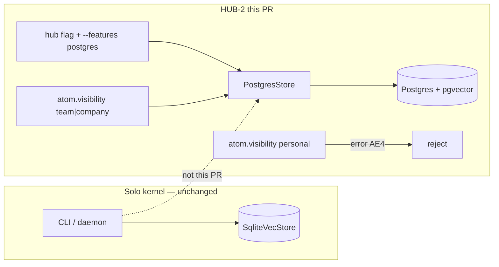

# feat: Postgres+pgvector Store for shared hub (HUB-2)

**Target repo:** `duketopceo/kurultai`
**Audience:** solo (must not regress) → team (shared store foundation)
**Base:** `main` after #195 / #196
**Tracking:** [#176](https://github.com/duketopceo/kurultai/issues/176) · Linear [KHAN-256](https://linear.app/imluketheduke/issue/KHAN-256/hub-2-postgrespgvector-store-gh-176) (shipped `#197`) · milestone [Tiered Access + Hosted Hub](https://github.com/duketopceo/kurultai/milestone/8)
**Process:** PR-only

## Goal Capsule

**Objective:** Add a second `Store` implementation backed by Postgres + pgvector for **shared** (`team` / `company`) atoms, without changing the SQLite personal kernel.

**Authority:** This plan > [phase-6-next-work-orders.md](phase-6-next-work-orders.md) > [docs/brainstorms/2026-08-07---tiered-access-hosted-hub-requirements.md](../brainstorms/2026-08-07---tiered-access-hosted-hub-requirements.md) > [#176](https://github.com/duketopceo/kurultai/issues/176).

**Stop when:** `PostgresStore` implements `Store`; personal upserts are refused (AE4); default `cargo test --locked` stays SQLite-only and green; `--features postgres` tests cover round-trip + reject-personal when a URL is set; docs name isolation (one org per database) and SQLite→hub copy rules; product flag `hub` remains default **off**.

**Do not:** Replace SQLite; dual-store merge in `ask`/`search` (R8); Tailscale/public bind (HUB-3); admin keys / `team_id` enforcement (HUB-4); connector tagging (HUB-5); Brain UI; tag `v0.4.1`; crates.io; multi-tenant SaaS.

## Product Contract

### Summary

Shared-tier backend only. Solo installs keep one SQLite file. Personal atoms never land in Postgres.

### Requirements

| ID | Requirement | Origin |
|----|-------------|--------|
| R1 | Additive Postgres+pgvector `Store` impl; SQLite `SqliteVecStore` unchanged. | brainstorm R7 |
| R2 | Cargo feature `postgres` plus product flag `hub` (v0.5.0, default off) both required to construct the hub store. | next-queue / `src/features.rs` |
| R3 | `personal` atoms are never written to Postgres (error, not silent skip of other fields). | AE4 · R2 |
| R4 | Visibility column round-trips `team` / `company` (HUB-1 field). Do not invent `corpus_tier` as the hub key. | HUB-1 · Karpathy #7 |
| R5 | Isolation documented: **one Postgres database per organization**, not many orgs on one Kurultai-operated platform. | brainstorm rejected SaaS |
| R6 | `team_id` nullable column exists for later AE5; this slice does **not** filter by it. | R10 / HUB-4 later |
| R7 | SQLite → Postgres story is **copy of team/company atoms only**, never personal, never in-place file convert. | #176 acceptance |
| R8 | Default App/CLI `open_store` remains SQLite. Hub store is a separate constructor. | F1 / AE1 |

### Actors

- A1. Solo operator (must not regress)
- A2. Future hub admin / team member (store exists; transport is HUB-3)
- A3. Implementer / CI

### Scope boundaries

**In:** `src/store/postgres.rs`, optional deps, schema, tests behind feature, CI postgres job, docs.
**Out:** daemon dual-query, auth, admin CLI, UI, closing #177–#181.

## Planning Contract

### Key Technical Decisions

- KTD1. **SQLite remains the only store `App` and `open_store` open.** Postgres is `PostgresStore::connect` for hub callers. `(session-settled: user-directed — chosen over swapping the solo backend: SQLite is the personal kernel forever)`
- KTD2. **Construct Postgres only when cargo `--features postgres` AND `features::enabled("hub")`.** Missing either → clear error, never silent SQLite. `(session-settled: user-approved — chosen over shipping hub-on in v0.4.x: cashflow version is v0.5.0)`
- KTD3. **sqlx 0.8 (runtime `query` / `query_as`, not `query!` macros) + `pgvector` crate.** No compile-time DATABASE_URL. Diesel / tokio-postgres-without-pool rejected: `Store` is already `async_trait`; sqlx pool matches. External docs lookup this run hit Context7 quota — stack matches prior company-brain plan assumption.
- KTD4. **Reject `VisibilityScope::Personal` on upsert/upsert_batch** with `KurultaiError::Store`. Covers AE4 by construction. `(session-settled: user-directed — chosen over writing personal rows then filtering: personal never leaves the device)`
- KTD5. **One database = one org.** No RLS in this slice (needs HUB-3 caller identity). `team_id TEXT NULL` reserved; unused in queries here.
- KTD6. **R8 merge (local SQLite + remote hub in one ask) is out.** This PR only proves the shared `Store`.
- KTD7. **Do not average `CorpusTier` (#189) with `VisibilityScope`.** Hub tables use `visibility` text check (`team`/`company` only).
- KTD8. **Default CI job stays sqlite-only.** Separate job `Postgres store` with `pgvector/pgvector:pg16` + `cargo nextest run --locked --features postgres`. Local tests skip Postgres unless `KURULTAI_TEST_DATABASE_URL` is set (`#[ignore]` or skip helper) so contributors without Docker still pass `cargo test --locked`.
- KTD9. **No Brain UI / 3D graph changes.** `(session-settled: user-directed — chosen over hub chrome in the lattice: current Brain design is liked; brainstorm excluded UI)`

### Assumptions

- Headless `/lfg` with empty args after naming HUB-2 as next work = this slice, not HUB-5 restart.
- sqlx runtime queries are acceptable vs compile-time checked SQL (matches rusqlite string SQL in `src/store/mod.rs`).
- Embedding dimension for pgvector is `config.embed_dim` (same as sqlite-vec). Zero/stub vectors stay unindexed (mirror `MIN_EMBEDDING_NORM`).
- FTS on Postgres uses `tsvector` + `plainto_tsquery('english', …)` — good enough for hub; not FTS5-identical ranking.
- Export/import `.kurultai` packs stay SQLite-only this slice (R7 copy can be a documented `kurultai` note, not a new CLI).

### High-Level Technical Design

### Risks

| Risk | Mitigation |
|------|------------|
| Full `Store` trait is large (~40 methods) | Implement all methods; keep postgres module parallel to sqlite helpers rather than rewriting `mod.rs` |
| sqlx compile time / lockfile churn | Optional dep behind `postgres` feature; default CI does not enable it |
| pgvector image unavailable in some envs | Skip tests without URL; GHA service container is the proof |
| Dual-store callers accidentally use Postgres for solo | `open_store` never selects postgres |

## Implementation Units

### U1. Feature gate, deps, constructor

**Goal:** Optional Postgres stack compiles; constructor respects cargo feature + `hub` flag.
**Requirements:** R1, R2, R8
**Dependencies:** none
**Files:** `Cargo.toml`, `Cargo.lock`, `src/store/mod.rs`, `src/store/postgres.rs` (new), `src/lib.rs` if needed, `src/features.rs` (comment only if needed)
**Approach:** `postgres = ["dep:sqlx", "dep:pgvector"]`. `PostgresStore` holds `sqlx::PgPool` + `embed_dim`. `connect(url)` runs migrations. Public `open_hub_store(url)` returns `Err` unless `cfg!(feature = "postgres")` and `features::enabled("hub")`.
**Patterns to follow:** `local-embed` optional dep in `Cargo.toml`; `features::enabled("hub")` in `src/features.rs`.
**Test scenarios:**
- Default build: `PostgresStore` type is not required; `open_hub_store` errors with a message naming `--features postgres` and `KURULTAI_FEATURE_HUB`.
- With feature + `KURULTAI_FEATURE_HUB=1` + URL: connect succeeds against test DB (or skip).
- With feature but hub flag off: connect errors, does not open a pool.
**Verification:** `cargo clippy --all-targets -- -D warnings` (default features) still clean.

### U2. Schema and AE4 write gate

**Goal:** Hub schema holds shared atoms; personal writes fail before INSERT.
**Requirements:** R3, R4, R5, R6
**Dependencies:** U1
**Files:** `src/store/postgres.rs`, `src/store/postgres/migrations.sql` or inline SQL in the module (match sqlite `migrations.rs` style if a second file stays clearer)
**Approach:** Tables: `knowledge_atoms` (same logical columns as SQLite v8, plus `team_id TEXT NULL`), `atoms_fts` via generated `tsvector` column + GIN, `atoms_vec` as `vector(dim)` (create with actual dim from config; fail if dim mismatch on open), quality_audit / merge_candidates / ingestion_jobs mirrors. CHECK (`visibility IN ('team','company')`). Upsert maps `VisibilityScope` and returns error on `Personal`.
**Patterns to follow:** `src/store/migrations.rs` v8 `visibility`; `row_to_atom` in `src/store/mod.rs`.
**Test scenarios:**
- Covers AE4. Upsert personal atom → error; `SELECT count(*) FROM knowledge_atoms` is 0.
- Upsert team atom → get-by-id round-trips visibility `team`, tags, content, trust_lane.
- Upsert company atom → round-trip `company`.
- Unknown visibility on read fail-closes in Rust via `VisibilityScope::parse` (should not appear due to CHECK).
**Verification:** Postgres test module only compiled with `--features postgres`.

### U3. Retrieval: FTS, vector, list, delete

**Goal:** Shared-tier search paths work on Postgres.
**Requirements:** R1
**Dependencies:** U2
**Files:** `src/store/postgres.rs`, `src/store/postgres.rs` tests or `src/store/postgres_tests.rs`
**Approach:** `fts_search` / `fts_search_ids` use tsvector. `vector_search` / `vector_search_ids` use `pgvector` cosine/L2 consistent with sqlite-vec (document which; prefer cosine if sqlite-vec is cosine — check `vector_search` in `src/store/mod.rs` and match). Omit zero-norm embeddings. `get` / `get_many` / `delete_atom` / `delete_source` / `count` / `count_by_lane` / `list_atoms` / `SearchFilter.trusted_only`.
**Patterns to follow:** sqlite `vector_search` skip-zero behavior; trusted_only default.
**Test scenarios:**
- Index two team atoms; FTS query hits the matching title/content.
- Vector search returns nearest neighbor when a non-zero embedding is stored; zero vector is not indexed.
- `trusted_only` excludes quarantine rows.
- Delete source removes atoms + vec rows.
**Verification:** Same skip-without-URL helper as U2.

### U4. Remaining `Store` methods

**Goal:** Trait completeness so hub callers do not hit `todo!`.
**Requirements:** R1
**Dependencies:** U3
**Files:** `src/store/postgres.rs`
**Approach:** Implement ingestion_jobs, quality_audit, merge_candidates, apply_auto_merge, touch_access, memory-tier counts, graph stubs, chunk meta, content-hash helpers. Keep SQL boring and transactional where sqlite uses `BEGIN IMMEDIATE`.
**Patterns to follow:** sqlite method bodies in `impl Store for SqliteVecStore`.
**Test scenarios:**
- `record_ingestion_start` + `list_pending_ingestion_jobs` + finish success/failure.
- `apply_auto_merge` leaves one atom, deletes loser, writes audit.
- `has_fresh_embedding` true only when hash matches and vec exists.
**Verification:** `cargo test --locked --features postgres` exercises these when URL set.

### U5. CI Postgres job + docs

**Goal:** Proof in CI; operators know how isolation and copy work.
**Requirements:** R5, R7
**Dependencies:** U1–U4
**Files:** `.github/workflows/ci.yml`, `docs/multi-user-kurultai.md`, `CONCEPTS.md`, `config.example.toml`, `docs/plans/phase-6-next-work-orders.md`, `CHANGELOG.md` (0.4.1 unreleased or a v0.5.0 note — prefer a **v0.5.0 unreleased** heading so 0.4.1 tag stays solo-kernel)
**Approach:** GHA service `pgvector/pgvector:pg16`, env `KURULTAI_TEST_DATABASE_URL` + `KURULTAI_FEATURE_HUB=1`. Docs: one DB per org; copy only team/company; personal stays on device; hub flag off; no UI.
**Test expectation:** none beyond the job going green — docs-only unit.
**Verification:** CI job `Postgres store` is required on PRs to `main`. Default Lint & Test job still does not pass `--features postgres`.

## Verification Contract

- `cargo fmt --all -- --check`
- `cargo clippy --all-targets -- -D warnings`
- `cargo test --locked` (no postgres feature) — AE1/F1: solo unchanged
- `cargo clippy --all-targets --features postgres -- -D warnings`
- `cargo test --locked --features postgres` with `KURULTAI_TEST_DATABASE_URL` in CI
- Do not require Docker for default contributor tests

## Definition of Done

- U1–U5 complete; SQLite tests still pass; AE4 covered by a Postgres test that inspects row count
- `hub` flag still default off; crate version stays **0.4.1** (hub is v0.5.0 track, not a crate bump in this PR)
- PR against `main`; `@coderabbitai ignore`; no git tag
- Linear [KHAN-256](https://linear.app/imluketheduke/issue/KHAN-256/hub-2-postgrespgvector-store-gh-176) is Done (`#197`)

## Appendix

- Origin: `docs/brainstorms/2026-08-07---tiered-access-hosted-hub-requirements.md`
- Prior sqlx note: `docs/plans/2026-08-12-001-feat-company-brain-hub-plan.md` (assumption, not this PR's product contract)
- Rival schema not to blend: #189 `corpus_tier` vs HUB-1 `visibility`
- External research this run: Context7 quota exceeded; no live sqlx docs fetch. Assumption recorded on KTD3.
