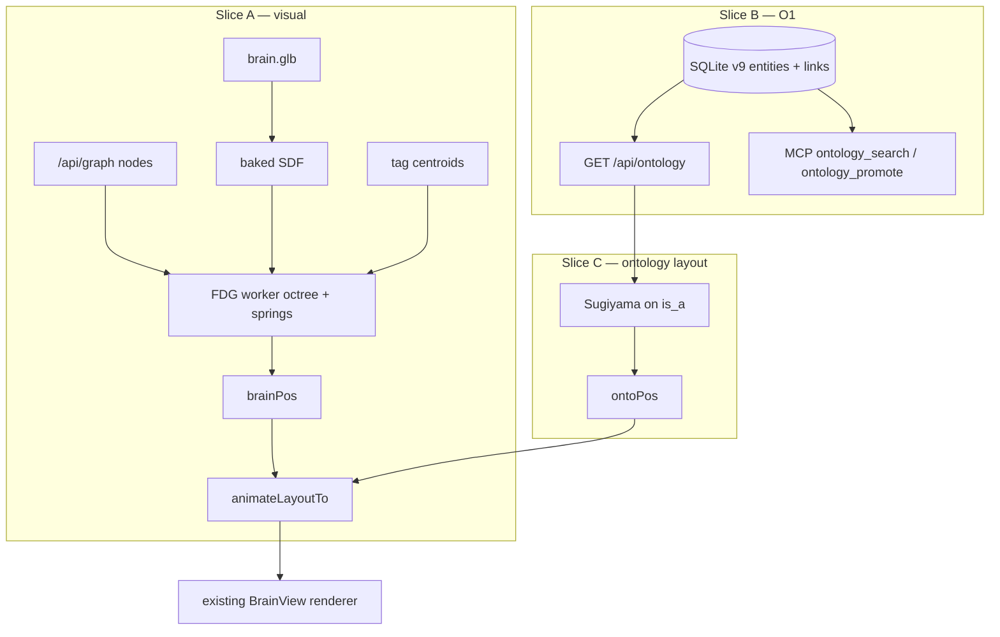

# feat: brain-shape FDG + algorithmic ontology

> **LFG execution pin (2026-08-14, third run):** this `/lfg` ships **Slice C only (U7–U8)** — Sugiyama `is_a` layers + ontology mode (classes default, instances on expand). Slice A (volumetric FDG + galaxy removal, #200) and Slice B (O1 / #201) are already on `main`. Do not revert FDG. Do not implement O3.

> **For later agentic workers:** implement **one slice per PR**. Do not mix O1 schema with the first visual PR.

**Target repo:** `duketopceo/kurultai`  
**Base:** `main` after v0.4.1 (`bab103a`+)  
**Tracking:** [#116](https://github.com/duketopceo/kurultai/issues/116) O1 · [#117](https://github.com/duketopceo/kurultai/issues/117) O2 · [#118](https://github.com/duketopceo/kurultai/issues/118) O3 (later)  
**Research:** [2026-08-13---brain-shape-algorithmic-ontology.md](../brainstorms/2026-08-13---brain-shape-algorithmic-ontology.md)  
**Process:** PR-only · `scripts/build-ui.sh` after every `website/` change

## Goal Capsule

**Objective:** Two honest Brain layouts on one canvas. Default **brain** is a volumetric force-directed cloud **inside the existing cortex GLB**. **Ontology** is a typed hierarchy (schema scaffold, instances on expand). Remove **galaxy**.

**Authority:** This plan > research brainstorm > Wave E (`phase-6-work-orders.md`: do not LFG O2–O5 before O1) > [#116](https://github.com/duketopceo/kurultai/issues/116) / [#117](https://github.com/duketopceo/kurultai/issues/117).

**Stop when (whole program):**

- Toggle is only `brain` | `ontology`. Persisted `galaxy` maps to `brain`.
- Brain mode: nodes fill the hull (not pinned to surface vertices); tag clusters form; sim runs off the render thread; hover/electric look unchanged.
- O1: SQLite schema v9 holds entities + typed links; atoms unchanged; MCP/HTTP can read the graph; empty ontology is valid.
- Ontology mode: Sugiyama-style layers on `is-a` for **classes**; atoms attach under `instance-of` when expanded; transversal edges are directed and toggleable. Not a second spring blob.

**Do not:** OWL/SPARQL; WebGPU sim; parametric \(F(x,y,z)\) cartoon brain; Brodmann/lobe tag table; 3d-force-graph / unpkg; second Vite app; hub-on by default; O3 silent writes; keep galaxy as a peer mode; dump 7,000 atoms into one Sugiyama drawing as the default ontology camera.

## Product Contract

### Summary

Memories stay `KnowledgeAtom`. Structure is a **labeled property graph** beside them. Layout is a pure function of (atoms, tags, entities, links) plus the GLB hull. Humans (later agents) approve typed edges; co-occurrence never becomes `is-a`.

### Requirements

| ID | Requirement | Origin |
|----|-------------|--------|
| R1 | Default layout is volumetric FDG constrained to the **existing GLB**, not hash-pin-to-vertex. | research / user |
| R2 | Barnes–Hut (octree) repulsion in a **Web Worker**; main thread only applies positions. Target: interactive at mid/high load tiers (~500–2500 shown). 7k is max-tier + progressive, not a main-thread n² sim. | research |
| R3 | Tag (and optional soft-label) **centroids** are attractors inside the hull. No neuroanatomy map in v1. | research |
| R4 | Brain-mode edges stay low-opacity / hover-star. Do not draw every tag clique. | current Brain doctrine |
| R5 | Layout modes: `brain` \| `ontology` only. Remove galaxy UI + solar code path. | user |
| R6 | Palette, camera whole-graph framing, electric hover, dashboard chrome: **unchanged**. | AGENTS.md |
| R7 | O1 primitives: Entity + directed typed Link + non-destructive atom→entity promote. Metrics are an entity `kind`, not a third store. | #116 · YAGNI |
| R8 | Property graph in SQLite (schema v9). Not RDF/OWL. Postgres `Store` must compile: implement new trait methods (empty/error OK until T1b). | research · HUB-2 |
| R9 | Starter class tree seeded on migrate: `Memory` → `Note`, `Code`, `Decision`, `Person`, `System`. | research |
| R10 | Link types v1 (closed enum): `is_a`, `instance_of`, `associates_with`, `triggered_by`, `contradicts`. Unknown type on read → skip row, log, do not crash layout. | research |
| R11 | Ontology canvas **C**: schema is the default scaffold; instances fan out under a class on demand. | research (user-facing fork) |
| R12 | Tween: reuse `animateLayoutTo` (~850ms). Two target fields (`brainPos`, `ontoPos`). No dual physics during fade. `prefers-reduced-motion` → snap. | existing `BrainView` |
| R13 | O3 (propose/approve queue) is **out of this plan**. No unsupervised `is_a` writes. | #118 · Wave E |
| R14 | Version/tag before Slice A merge so hull experiments roll back. | AGENTS.md |

### Actors

- A1. Solo operator — default `/ui/` must still make sense with only tagged markdown.
- A2. Agent via MCP — read entities/links; write promote-to-entity only (no silent ontology mutation).
- A3. Implementer / CI.

### Scope by slice (LFG boundaries)

| Slice | Ships | Blocked on | First LFG? |
|-------|--------|------------|------------|
| **A** | Brain-shape FDG + kill galaxy | nothing | **Yes** if the next work is visual |
| **B** | O1 schema + store + MCP/HTTP + inspector list | nothing | **Yes** if the next work is knowledge model |
| **C** | Ontology 3D layered layout | **B** | After B |
| **D** | O3 proposal queue | B + C | **Not this plan** |

Recommended order if doing the whole program: **A → B → C**. A is visible without waiting on schema. B can land in parallel as a second PR. C must not start until B’s API exists.

Wave G hub work remains a competing queue; this plan does not steal HUB-3…6.

## Planning Contract

### Key Technical Decisions

- KTD1. **GLB signed-distance / inside test, not \(F(x,y,z)\le 1\).** Bake a coarse SDF (or occupancy grid) from `website/src/assets/brain.glb` once after load. Occupancy uses even-odd +X winding plus a cheap distance transform — not a naive \(48^3\times T\) raycast. `(session-settled: user-approved — chosen over a parametric envelope: the cortex mesh is already the product shape)`
- KTD2. **No new layout npm deps in Slice A.** Octree + Verlet live in `website/src/brain/layout/` and a worker. Do not add `d3-force-3d` or `3d-force-graph`. `(session-settled: user-approved — wrapping 3d-force-graph rejected: AGENTS.md unpkg/egress; custom Three renderer stays)`
- KTD3. **Extract layout out of `BrainView.ts`.** File is already ~1800 lines. `BrainView` renders and tweens; it does not own n-body math. `(Karpathy #8 — don't keep growing the god file)`
- KTD4. **Tag cliques stay client-side for Slice A.** `/api/graph` stays nodes-only until Slice B adds `/api/ontology`. `(YAGNI)`
- KTD5. **`LayoutMode = 'brain' \| 'ontology'`.** `localStorage['kurultai-layout'] === 'galaxy'` → `'brain'`. `(session-settled: user-directed — galaxy sucks; rejected keeping galaxy as a peer mode)`
- KTD6. **SQLite schema v9 = `ontology_entities` + `ontology_links`.** Seed six class entities (`Memory` + five children) and five `is_a` edges in the migration. `(#116)`
- KTD7. **Promote-to-entity does not delete or un-index the atom.** Link `instance_of` from a new or existing entity; atom id stays in `knowledge_atoms`. Distinct from trust-lane `promote`. `(#116 acceptance)`
- KTD8. **Suggest, don't write:** tags/soft-labels may propose `instance_of` in the inspector as *suggestions* (Slice B UI copy only). Persistence of those links is explicit MCP/CLI. `(#118 boundary)`
- KTD9. **Postgres:** new `Store` methods must exist on `PostgresStore` so `--features postgres` compiles. Body may `Err(Store("ontology not on hub store yet"))` until T1b. `(HUB-2 compile gate)`
- KTD10. **Ontology default camera is classes only** (≤ tens of nodes). Expanding a class loads `instance_of` children up to a cap (e.g. 80), not the whole corpus. `(session-settled: user-approved — ontology canvas C; rejected dumping 7k leaves into one Sugiyama drawing)`
- KTD11. **Typed edges in ontology mode are visible and directed.** `is_a` / `instance_of` use the existing purple/white language; transversal types differ by dash/opacity, not a fourth hue. `(AGENTS.md three colors)`
- KTD12. **Node 22 test runner** for layout math: `node --experimental-strip-types --test website/src/brain/layout/*.test.ts`. No vitest unless already present. `(CONTRIBUTING / .nvmrc)`

### Assumptions

- Headless “write the plan” = this document, not Slice A code in the same PR.
- Starter classes are enough for empty brains; users do not need a class editor in Slice B (inspector + MCP upsert is enough).
- Soft labels remain unused by Slice A except as extra attractor keys when `name` is present on the graph node (graph API today may omit them — attractors use `tags` only until graph payload grows).
- `MAX` load tier at 7k still uses existing `LOAD_TIER_CAPS`; layout must time-slice, not raise the cap.

### High-Level Technical Design



### Risks

| Risk | Mitigation |
|------|------------|
| SDF too coarse → nodes leak or hug the surface | Occupancy + restore force; visual check at mid tier; keep lattice positions as fallback if SDF bake fails |
| Worker + existing sprite path desync | `atomPositions` remains authoritative; worker posts Float32Array; main thread copies then tweens |
| `BrainView.ts` merge conflicts | Extract layout first in Slice A before force-constant edits |
| Store trait churn breaks postgres feature | KTD9: stub methods in the same PR as the trait |
| Ontology mode empty/ugly before users promote | Seeded classes (R9) so the scaffold always has five nodes |
| Hub queue vs this work | Slices are optional LFGs; do not block HUB-3 |

### File map

**Slice A**

| File | Role |
|------|------|
| `website/src/brain/layout/octree.ts` | Barnes–Hut octree |
| `website/src/brain/layout/fdg.ts` | One sim tick: repel, spring, center, tag attract, SDF restore |
| `website/src/brain/layout/sdf.ts` | Bake occupancy/SDF from THREE.BufferGeometry |
| `website/src/brain/layout/fdg.worker.ts` | Worker loop; posts positions |
| `website/src/brain/layout/*.test.ts` | Node test runner |
| `website/src/brain/BrainView.ts` | Consume worker; drop solar; two-mode tween |
| `website/src/types.ts` / `state.ts` / `CommandStrip.tsx` | `LayoutMode` without galaxy |
| `scripts/build-ui.sh` → `ui/` | Embed |

**Slice B**

| File | Role |
|------|------|
| `src/types.rs` | `OntologyEntity`, `OntologyLink`, `OntologyLinkType` |
| `src/store/migrations.rs` | v9 |
| `src/store/mod.rs` | trait + sqlite impl |
| `src/store/postgres.rs` | stub trait methods |
| `src/ontology/mod.rs` | seed ids, promote-to-entity, suggest (no write) |
| `src/http/mod.rs` | `GET /api/ontology` |
| `src/mcp/server.rs` | tools |
| `CONCEPTS.md` | Entity / Link |
| `website/src/api.ts` + inspector | list links for selected atom |

**Slice C**

| File | Role |
|------|------|
| `website/src/brain/layout/sugiyama.ts` | Layer assign + barycenter sweep (3D: Y=layer, XZ=order) |
| `website/src/brain/BrainView.ts` | `ontoPos` from schema + expanded instances |
| `website/src/api.ts` | fetch ontology document |

## Implementation Units

### U1. Kill galaxy; lock two modes *(Slice A)*

**Goal:** UI and persisted state only know `brain` | `ontology`. Solar code gone.
**Requirements:** R5, R6
**Dependencies:** none
**Files:** `website/src/types.ts`, `website/src/state.ts`, `website/src/components/CommandStrip.tsx`, `website/src/brain/BrainView.ts`, `website/src/components/BrainStage.tsx` if layout prop union changes
**Approach:**

```ts
export type LayoutMode = 'brain' | 'ontology';
const VALID_LAYOUTS: readonly LayoutMode[] = ['brain', 'ontology'];

function initialLayout(): LayoutMode {
  try {
    const stored = localStorage.getItem('kurultai-layout');
    if (stored === 'ontology') return 'ontology';
    return 'brain'; // includes missing, corrupt, and legacy 'galaxy'
  } catch {
    return 'brain';
  }
}
```

Delete `applySolarLayout`, `solarPos`, `_solarSunId`, `_solarPlanets`, `_solarMoons`, `_solarAsteroids`. Command strip: two buttons. After this unit, **ontology still uses the existing n² blob** until U3 — acceptable for one commit, not for the Slice A PR as a whole (U2–U3 must land in the same PR or immediately after).

**Test scenarios:**

- `initialLayout` with `kurultai-layout=galaxy` → `'brain'` (extract the helper if needed so Node tests can import it, or keep the mapping next to `VALID_LAYOUTS` in `state.ts` and test via a tiny exported `normalizeLayout(raw: string | null): LayoutMode`).
- `normalizeLayout('ontology') === 'ontology'`; `normalizeLayout('lattice') === 'brain'`.

**Verification:** `npx tsc --noEmit` in `website/`. No galaxy string in `CommandStrip.tsx`.

### U2. Layout math + SDF + worker *(Slice A)*

**Goal:** Off-thread FDG that stays inside a test hull and clusters by tag.
**Requirements:** R1, R2, R3, R12
**Dependencies:** U1 (can start in parallel; merge after)
**Files:** create `website/src/brain/layout/{octree,fdg,sdf,fdg.worker,types}.ts` and `*.test.ts`

**Interfaces:**

```ts
export interface FdgNode {
  id: string;
  x: number; y: number; z: number;
  vx: number; vy: number; vz: number;
  tags: string[];
}

export interface FdgLink {
  a: number; // index into nodes
  b: number;
  strength: number;
}

export interface FdgParams {
  theta: number;          // Barnes–Hut, 0.8
  repulsion: number;
  springK: number;
  springRest: number;
  centerK: number;
  tagK: number;           // pull toward tag centroid
  hullK: number;          // restore if outside
  damping: number;        // 0.85
  minTagMembers: number;  // 3
}

export function tickFdg(
  nodes: FdgNode[],
  links: FdgLink[],
  sdf: SignedDistanceField | null,
  params: FdgParams,
): void; // mutates x/v in place

export class Octree {
  constructor(bodies: { x: number; y: number; z: number }[], theta: number);
  accumulate(i: number, out: { x: number; y: number; z: number }): void;
}
```

**SDF bake (main thread, once):**

- Input: `THREE.BufferGeometry` from the loaded GLB.
- Build a grid (~48³) over the mesh AABB padded 5%.
- Inside test: raycast +X even-odd against triangles (or sample closest-point sign via vertex normals if cheaper). Exact method may be a distance-to-surface with inside from winding; pick one and test with a point at the AABB center (inside) and a point at `max + 1` (outside).
- Worker receives a transferable `Float32Array` of grid values + AABB; it does **not** import Three.

**Worker protocol:**

```ts
type In = { type: 'init'; nodes: FdgNode[]; links: FdgLink[]; sdf: ArrayBuffer; aabb: number[] }
  | { type: 'tick'; steps: number }
  | { type: 'setLinks'; links: FdgLink[] };
type Out = { type: 'positions'; xyz: Float32Array; ids: string[] };
```

Cap `steps` per message so one burst < 8ms on a 2500-node graph (time-slice like current `forceItersPerSlice`).

**Test scenarios (Node test runner):**

- Octree: two far clusters; force on a particle from the far cluster approximates center-of-mass (error < 20% vs naive for θ=0.8).
- `tickFdg` with a spherical SDF of radius 1: after 80 ticks, all nodes have `x²+y²+z² <= 1.05`.
- Two tags `a`/`b` with 8 nodes each, no cross links: centroid distance increases vs a no-`tagK` control after 80 ticks.
- Worker not required in Node tests — test `tickFdg` directly.

**Verification:**

```bash
node --experimental-strip-types --test website/src/brain/layout/*.test.ts
```

Expected: all pass.

### U3. Wire BrainView to worker; keep electric look *(Slice A)*

**Goal:** Default `/ui/` is the hull cloud. Ontology button still exists but may keep old blob until Slice C (see stop-when: Slice A PR should at least not call the n² main-thread sim for brain mode).
**Requirements:** R1–R6, R12, R14
**Dependencies:** U2
**Files:** `website/src/brain/BrainView.ts`, `website/src/components/BrainStage.tsx` (`buildLinks` unchanged), `scripts/build-ui.sh` output `ui/`

**Approach:**

- After GLB load + `classifyVertices` (keep mesh for the cortex *particle* background), bake SDF.
- `setData`: seed `FdgNode` from current lattice positions (warm start) or last `brainPos`.
- Post `init` to worker; on `positions`, write `brainPos` map; if `layoutMode === 'brain'` and not mid-tween, copy into `atomPositions` (or tween only on mode switch).
- **While sim is running in brain mode, do not lerp every tick** — snap to worker positions after intro. Tween only on mode change (R12).
- Remove `computeForceLayout` / n² pair loop from the brain path. Until Slice C, ontology may: (1) freeze last brain positions, or (2) still use a cheap layered placeholder (random Y by first tag). Prefer **freeze last brainPos** so we do not keep the useless blob. Inspector copy: ontology “structure arrives after O1” is optional; do not add chrome callouts (R6).
- `prefers-reduced-motion`: skip tween; jump to target.
- Rebuild `ui/` via `bash scripts/build-ui.sh`.

**Manual verification:**

- `kurultai daemon --port 8421` → `http://127.0.0.1:8421/ui/`
- Camera still shows the whole cortex at start.
- Nodes sit **inside** the volume, not as a surface crust.
- Shared-tag memories form visible clumps.
- Hover still highlights connections; colors stay black/white/slight purple.
- Toggle ontology → lerp; galaxy control absent.
- Hard-refresh after `localStorage.kurultai-layout='galaxy'` boots in brain mode.

**Repo gates:** `cargo test --locked` (embed still compiles); CI Brain UI build `git diff --exit-code ui/`.

**Commit message example:** `feat(ui): volumetric brain-shape FDG; remove galaxy layout`

Tag `main` (R14) **before** this merge if `main` has no post-v0.4.1 visual tag yet (`v0.4.1` is sufficient rollback).

---

### U4. Types + schema v9 + sqlite store *(Slice B)*

**Goal:** Entities and typed links persist. Atom FTS/vector paths unchanged.
**Requirements:** R7, R8, R9, R10
**Dependencies:** none
**Files:** `src/types.rs`, `src/store/migrations.rs`, `src/store/mod.rs`, `src/ontology/mod.rs` (new), tests in `src/store/mod.rs` / `src/ontology/`

**Types (exact):**

```rust
#[derive(Debug, Clone, Copy, PartialEq, Eq, Serialize, Deserialize)]
#[serde(rename_all = "snake_case")]
pub enum OntologyLinkType {
    IsA,
    InstanceOf,
    AssociatesWith,
    TriggeredBy,
    Contradicts,
}

impl OntologyLinkType {
    pub fn as_str(self) -> &'static str { /* is_a, instance_of, ... */ }
    pub fn parse(raw: &str) -> Option<Self> { /* None if unknown */ }
}

#[derive(Debug, Clone, Serialize, Deserialize, PartialEq)]
pub struct OntologyEntity {
    pub id: String,
    pub kind: String,       // "class" | "instance" | "metric"
    pub name: String,
    pub atom_id: Option<String>,
    pub attributes: serde_json::Value, // object, default {}
}

#[derive(Debug, Clone, Serialize, Deserialize, PartialEq)]
pub struct OntologyLink {
    pub id: String,
    pub from_id: String,
    pub to_id: String,
    pub rel: OntologyLinkType,
    pub confidence: f32,    // 0..=1
    pub status: String,     // "approved" in this slice; no "proposed" until O3
    pub actor: String,
}
```

**Migration 009 SQL (sketch):**

```sql
CREATE TABLE IF NOT EXISTS ontology_entities (
    id TEXT PRIMARY KEY,
    kind TEXT NOT NULL,
    name TEXT NOT NULL,
    atom_id TEXT,
    attributes_json TEXT NOT NULL DEFAULT '{}',
    FOREIGN KEY (atom_id) REFERENCES knowledge_atoms(id) ON DELETE SET NULL
);
CREATE TABLE IF NOT EXISTS ontology_links (
    id TEXT PRIMARY KEY,
    from_id TEXT NOT NULL,
    to_id TEXT NOT NULL,
    rel TEXT NOT NULL,
    confidence REAL NOT NULL DEFAULT 1.0,
    status TEXT NOT NULL DEFAULT 'approved',
    actor TEXT NOT NULL DEFAULT 'system',
    UNIQUE(from_id, to_id, rel)
);
CREATE INDEX IF NOT EXISTS idx_ontology_links_from ON ontology_links(from_id);
CREATE INDEX IF NOT EXISTS idx_ontology_links_to ON ontology_links(to_id);
```

Seed (stable ids): `class:memory`, `class:note`, `class:code`, `class:decision`, `class:person`, `class:system` with `is_a` from each child to `class:memory` except memory itself.

Bump `CURRENT_SCHEMA_VERSION` to **9**.

**Store trait additions:**

```rust
async fn upsert_ontology_entity(&self, e: &OntologyEntity) -> Result<()>;
async fn get_ontology_entity(&self, id: &str) -> Result<Option<OntologyEntity>>;
async fn list_ontology_entities(&self, limit: usize) -> Result<Vec<OntologyEntity>>;
async fn upsert_ontology_link(&self, l: &OntologyLink) -> Result<()>;
async fn list_ontology_links(&self, endpoint: Option<&str>) -> Result<Vec<OntologyLink>>;
```

Unknown `rel` on read: skip (KTD / R10). Duplicate `(from,to,rel)` upsert updates confidence/actor.

**Test scenarios:**

- Fresh store `schema_version == 9`; six class entities present; five `is_a` links (note, code, decision, person, system → memory).
- Upsert instance entity with `atom_id`; get round-trips.
- Upsert `instance_of` link; `list_ontology_links(Some(atom_or_entity_id))` returns it.
- Atom-only corpus: `fts_search` still hits fixture phrase (existing smoke).
- `OntologyLinkType::parse("nope")` is `None`.

**Verification:** `cargo test --locked ontology -- --nocapture` plus existing `store::tests::upsert_and_get_by_id`.

### U5. Postgres trait stubs + promote-to-entity *(Slice B)*

**Goal:** `--features postgres` still builds. Trust-lane `promote` unchanged. New `ontology_promote` maps an atom onto an entity + `instance_of`.
**Requirements:** R7, R8, KTD7, KTD9
**Dependencies:** U4
**Files:** `src/store/postgres.rs`, `src/ontology/mod.rs`, `src/quality/promote.rs` (do **not** overload), `src/mcp/brain.rs`

```rust
pub async fn promote_atom_to_entity(
    store: &dyn Store,
    atom_id: &str,
    class_id: &str, // must exist, kind=class
    actor: &str,
) -> Result<OntologyEntity>;
```

Rules: atom must exist; class must exist; create entity id `ent:{atom_id}` if missing; link `instance_of` → class; do not change `trust_lane`.

**Postgres:** each new trait method returns `Err(KurultaiError::Store("ontology not on hub store yet".into()))`.

**Test scenarios:**

- SQLite: promote fixture atom to `class:note`; entity + link exist; atom still `get()`-able and FTS-visible.
- Missing class id → error, no entity row.
- `cargo check --features postgres --locked` succeeds.

### U6. HTTP + MCP + inspector *(Slice B)*

**Goal:** Operators and agents can see structure. Empty graph is the seeded classes, not an error.
**Requirements:** R7, R11 (data only)
**Dependencies:** U4, U5
**Files:** `src/http/mod.rs`, `src/mcp/server.rs`, `website/src/api.ts`, `website/src/types.ts`, `website/src/components/InspectorPanel.tsx`, `CONCEPTS.md`, `tests/cli_smoke.rs` if a CLI `ontology` subcommand is added — **YAGNI: no CLI subcommand**; MCP + HTTP only.

**HTTP:** `GET /api/ontology` → `{ ok, entities, links }` (seeded classes always). Optional `?class=class:note` later in Slice C; Slice B may ignore query.

`Cache-Control: no-store` already applies to `/api/*`.

**MCP tools (full surface; read-only surface gets get only):**

- `ontology_get` — `{ entity_id? }` list or one
- `ontology_promote` — `{ atom_id, class_id }` (write; reject on read-only MCP HTTP)

Do not add `ontology_link` write in this slice (O3).

**Inspector:** when an atom is selected, show approved links (`rel` + other name) from `/api/ontology` filtered client-side by `atom_id` / entity `atom_id`. Suggestions from shared tags: **text only** (“could be Note”), no write button that persists (KTD8). If that is too easy to fake as a write, omit the suggestion line.

**Test scenarios:**

- HTTP test: `/api/ontology` 200, `entities` length ≥ 6.
- MCP: `tool_defs` includes `ontology_get`; read-only surface excludes `ontology_promote`.
- `cargo test --locked` http + mcp modules.

**Commit message example:** `feat(store): ontology entities and typed links (O1 / #116)`

---

### U7. Sugiyama layout module *(Slice C)*

**Goal:** Deterministic 3D coordinates for a directed `is_a` DAG.
**Requirements:** R11, R12
**Dependencies:** Slice B on `main`
**Files:** `website/src/brain/layout/sugiyama.ts`, `website/src/brain/layout/sugiyama.test.ts`

```ts
export interface HierNode { id: string; layer?: number }
export interface HierEdge { from: string; to: string } // from subclass → to superclass

export function assignLayers(nodes: HierNode[], edges: HierEdge[]): Map<string, number>;
export function orderLayers(
  layers: string[][],
  edges: HierEdge[],
): string[][];
export function hierPositions(
  ordered: string[][],
  yStep: number,
  xzStep: number,
): Map<string, { x: number; y: number; z: number }>;
```

Cycle: reverse a back-edge for layering only (do not mutate store). Long edges: dummy nodes optional if class count < 32 — skip dummies in v1.

**Test scenarios:**

- Chain A→B→C: layers 2,1,0 (C superclass at y=0).
- Two subclasses of Memory: same layer, distinct x.
- Cycle A→B→A: still terminates; both get finite layers.

**Verification:** same Node test runner as U2.

### U8. Ontology mode uses hierPositions + expand *(Slice C)*

**Goal:** Ontology toggle is a readable scaffold, not a blob.
**Requirements:** R4, R6, R10–R12
**Dependencies:** U6, U7
**Files:** `website/src/brain/BrainView.ts`, `website/src/api.ts`, `website/src/App.tsx` (fetch ontology with graph)

**Approach:**

- Fetch `/api/ontology` alongside `/api/graph`.
- Default `ontoPos`: classes only via `hierPositions`.
- Click/expand class: add up to 80 `instance_of` entities (and their atoms) as a child ring/layer below that class (Y -= yStep). Collapse on second click.
- Draw directed edges for visible nodes; transversal `rel` dashed; `is_a` solid. Hover still highlights incident edges.
- Tween brainPos ↔ ontoPos; disable FDG worker ticks during ontology (or keep worker running in background without applying — prefer **pause worker** to save CPU).

**Manual verification:**

- Empty personal brain: six class nodes in layers, Memory at the base.
- After `ontology_promote` of a note: expand Note → instance appears; atom inspector still works.
- 2000-atom corpus: ontology default view still ~6 nodes, 60fps orbit.
- Brain toggle returns to hull cloud.

**Repo gates:** `bash scripts/build-ui.sh`; `cargo test --locked`; clippy `-D warnings`.

**Commit message example:** `feat(ui): layered ontology scaffold (O2 / #117)`

---

## Out of scope (explicit)

| Item | Where it lives |
|------|----------------|
| O3 proposal queue / audit UI | #118, later plan |
| Postgres objects+edges | T1b / #131 |
| OWL export | Atlas E′ |
| GPU Barnes–Hut | later if max-tier 7k janks on worker |
| Class editor UX | after C, if seed+MCP is insufficient |
| Galaxy resurrection | do not |

## Slice A PR checklist

- [ ] `LayoutMode` has no `galaxy`
- [ ] Worker FDG + SDF tests pass
- [ ] `ui/` rebuilt and committed
- [ ] Manual hull + hover + colors
- [ ] No Brain chrome added
- [ ] `@coderabbitai ignore`

## Slice B PR checklist

- [ ] Schema v9 + seed classes
- [ ] Atom search regressions green
- [ ] `cargo check --features postgres --locked`
- [ ] `/api/ontology` + MCP tools
- [ ] CONCEPTS.md
- [ ] Does not change 3D layout (C is next)

## Slice C PR checklist

- [ ] Ontology default = classes only
- [ ] Expand cap documented in code constant
- [ ] Tween + reduced motion
- [ ] `ui/` rebuilt

## Confidence check

Standard plan + load-bearing layout research. Section scores (trigger + critical-section bonus): Implementation Units 2, Key Technical Decisions 2, Risks 2. No section needed a deepening rewrite after the Slice A pin and occupancy-bake note. **Confidence check passed.**

## Stop / handoff

After A: Brain looks like a volume of memories. Ontology button is a placeholder freeze.  
After B: structure exists even if the canvas ignores it.  
After C: dual-mode matches the research verdict.

O3, hub ontology, and Atlas projections are new plans.
