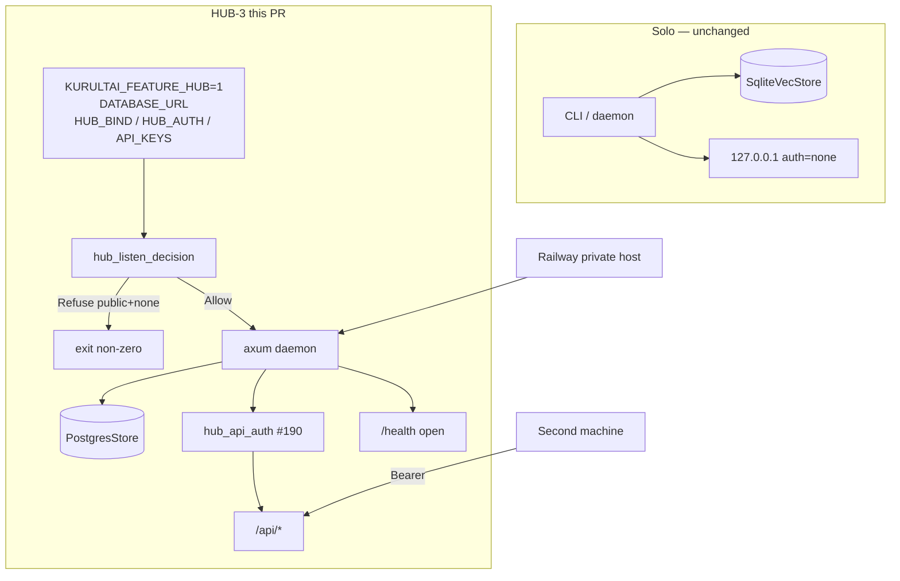

# feat: HUB-3 Railway transport — public/Tailscale bind + Postgres hub daemon

**Target repo:** `duketopceo/kurultai`
**Audience:** solo (must not regress) → team (one hosted hub every machine can reach)
**Base:** `main` after HUB-1 (#178) + HUB-2 (#176) + API-key scaffold (#190) + write-policy (#221)
**Tracking:** [#177](https://github.com/duketopceo/kurultai/issues/177) · Linear [PRO-763](https://linear.app/bartlettroofs-it/issue/PRO-763/hub-3-authenticated-hub-transport) / KHAN-255 · milestone [Tiered Access + Hosted Hub](https://github.com/duketopceo/kurultai/milestone/8)
**Queue:** [000 Wave G sequence](2026-08-15-000-chore-wave-g-railway-sequence-plan.md) — **this is the next LFG**
**Process:** PR-only

## Goal Capsule

**Objective:** One Kurultai hub on Railway (or docker-compose). Personal SQLite stays on each machine. Only `team` / `company` atoms live in hub Postgres. Machines talk to that hub over HTTP with bearer keys (public) or Tailscale (private).

**Authority:** This plan > [000 sequence](2026-08-15-000-chore-wave-g-railway-sequence-plan.md) > [phase-6-next-work-orders.md](phase-6-next-work-orders.md) > [tiered-access brainstorm](../brainstorms/2026-08-07---tiered-access-hosted-hub-requirements.md) > [#177](https://github.com/duketopceo/kurultai/issues/177).

**Stop when:**

- Railway (or docker-compose) hub boots with `KURULTAI_FEATURE_HUB=1` + `--features postgres`
- Non-loopback bind refuses to start unless `hub.auth=api_key` and at least one key is configured
- `/health` stays open; `/api/*` and MCP HTTP require bearer in public mode
- A second machine can `search` / `ask` against the hub with that key
- `docs/deploy/railway-hub.md` exists
- Solo `127.0.0.1` + `auth=none` is unchanged

**Do not:**

- Re-implement #190 `hub_api_auth` middleware
- HUB-4 CLI (`kurultai hub key …`)
- `team_id` enforcement (AE5) — that is 002
- R8 merge (local SQLite + remote hub in one ask)
- Desktop wrap (003)
- Password / session / JWT accounts
- Multi-tenant SaaS
- Mounting `store.db` on a Railway volume

## Product Contract

### Summary

Extend the existing axum daemon into hub mode: bind policy + Postgres store for shared atoms + Railway recipe. Auth middleware already shipped in #190 — wire it to start-fail rules and a deploy path.

### Requirements

| ID | Requirement | Origin |
|----|-------------|--------|
| R4 | Shared store reachable via Tailscale-only **or** public URL, selectable per deployment. | brainstorm R4 |
| R5 | Public transport authenticates every device via per-device API key (bearer). No password/session in v1. | brainstorm R5 · #190 |
| R6 | Tailscale transport relies on tailnet membership/ACLs; no separate app-level auth required in that mode. | brainstorm R6 |
| R16 | Every hub `/api/*` in public mode requires a valid key (health exempt). Extends R5 to the existing localhost API surface. | company-brain R16 · #190 |
| R17 | Non-loopback bind + `auth=none` is a **hard start error** (never silent open hub). | session · rival KTD13 |
| R18 | Railway v1 defaults to **private hostname**; public `*.up.railway.app` (or custom public domain) requires explicit `ALLOW_PUBLIC_HUB=1`. | session · rival R6 / KTD3 |
| R19 | Hub process opens `PostgresStore` only (`open_hub_store`); never opens personal SQLite as the hub store. | AE4 · HUB-2 |
| R20 | MCP HTTP on the hub uses existing `KURULTAI_MCP_HTTP_SECRET` (same bearer surface as today); v1 REST keys stay env `KURULTAI_HUB_API_KEYS`. | #190 · mcp_http |

### Actors

- A1. Solo operator — loopback daemon, SQLite, `auth=none` (must not regress)
- A2. Team member / second machine — calls remote hub with bearer key
- A3. Hub admin — provisions Railway/Postgres, sets env keys, chooses Tailscale vs public
- A4. External self-hoster — public transport with `ALLOW_PUBLIC_HUB=1`

### Acceptance Examples

| ID | Example |
|----|---------|
| AE1 | Fresh install, no hub → local SQLite ask/search identical to today. |
| AE2 | Tailscale-only bind → off-tailnet cannot connect; on-tailnet reaches hub (auth=none allowed). |
| AE3 | Public mode, missing/wrong key → 401 on `/api/*`; no team/company data returned. |
| AE4 | `personal` upsert on hub Postgres still errors (HUB-2); hub daemon never writes personal atoms. |
| AE6 | Hub process with `KURULTAI_FEATURE_HUB=1` + Postgres URL starts and serves `/health` 200. |
| AE11 | Bind `0.0.0.0` / `KURULTAI_HUB_BIND=all` with `KURULTAI_HUB_AUTH` unset or `none` → process exits non-zero before listen. |
| AE12 | Second machine with valid bearer can search/ask hub team atoms; without key cannot. |

### Scope boundaries

**In:** bind decision pure function + daemon wiring; hub opens PostgresStore; Dockerfile; `docs/deploy/railway-hub.md`; docs pointers in phase-6 / multi-user / CONCEPTS; tests for start-fail and auth reuse.

**Out:** HUB-4 issue/revoke CLI; `team_id` filter; R8 dual-store merge; desktop; Brain UI redesign; HUB-5 connector tagging; closing #179–#181.

## Planning Contract

### Key Technical Decisions

- KTD1. **Extend existing axum daemon** (`src/http/`, `src/daemon/`) — different bind + store + start gates, not a second server binary. `(session-settled: user-directed — brainstorm architecture notes; #177)`
- KTD2. **Do not re-implement `hub_api_auth`.** Reuse `src/http/auth.rs` from #190. This PR only adds start-fail policy and hub store wiring. `(session-settled: user-directed — #177 scope trim)`
- KTD3. **Public bind + `auth=none` is a hard start error.** Pure function `hub_listen_decision` (or equivalent) returns `Refuse` before `TcpListener::bind`. `(session-settled: user-approved — chosen over warn-and-continue: accidental open hub is P0)`
- KTD4. **Tailscale mode = bind to tailnet address (or interface); `auth=none` allowed.** Trust Tailscale ACLs for AE2. Document `tailscale serve` / bind to `100.x` as the recipe; do not invent Funnel in this slice.
- KTD5. **Railway is public-transport v1; private hostname is the default.** Refuse known public Railway default hostnames unless `ALLOW_PUBLIC_HUB=1`. `(session-settled: user-directed — accidental public domain lesson from rival plan)`
- KTD6. **Hub process opens `PostgresStore` only** via `open_hub_store` when hub mode is active. Solo path still uses `open_store` → SQLite.
- KTD7. **R8 merge is out.** Second machine talks to hub only for shared atoms; local personal brain stays local. No dual-query in one ask this PR.
- KTD8. **v1 keys stay env `KURULTAI_HUB_API_KEYS`** (CSV plaintext or sha256 hex, as #190). Issued/revoked rows are HUB-4 (002).
- KTD9. **MCP HTTP uses existing `KURULTAI_MCP_HTTP_SECRET`.** Do not invent a second MCP auth stack in this slice.
- KTD10. **One Postgres database = one org.** Document isolation; no RLS / multi-tenant SaaS.

### Assumptions

- #190 middleware already gates `/api/*` when `KURULTAI_HUB_AUTH=api_key`; `/health` and static `/ui/` paths remain as today unless this PR explicitly documents otherwise (prefer: health open, `/ui/` behind same gate when public — document the chosen path; default = health open, `/api/*` gated, `/ui/` gated when `auth=api_key` if middleware already covers path prefixes — match existing `hub_api_auth` path check).
- `DATABASE_URL` (or `KURULTAI_DATABASE_URL`) is how Railway injects Postgres; map to `open_hub_store`.
- Dockerfile multi-stage: rust build with `--features postgres`, slim runtime image; no SQLite volume.
- docker-compose is acceptable local proof of the same recipe when Railway credentials are unavailable in CI.
- Contributors without Docker still pass default `cargo test --locked` (pure `hub_listen_decision` unit tests; integration behind feature/env).

### High-Level Technical Design

### Risks

| Risk | Mitigation |
|------|------------|
| Accidental public open hub | Hard start-fail (AE11) + `ALLOW_PUBLIC_HUB` gate (R18) |
| Rebuilding #190 | KTD2; tests assert existing middleware still used |
| Scope creep into HUB-4 / R8 / desktop | Explicit Do not list; 000 sequence owns order |
| Railway private networking quirks | Document compose fallback; private hostname default |
| Hub accidentally opens SQLite | KTD6; constructor only `open_hub_store` |

## Implementation Units

### U1. Start-fail bind policy (pure `hub_listen_decision`)

**Goal:** Deterministic allow/refuse for bind × auth × keys × public-allow before listen.
**Requirements:** R4, R5, R6, R17, R18 · AE2, AE11
**Dependencies:** none
**Files:** `src/http/auth.rs` (or new `src/http/hub_listen.rs`), unit tests colocated
**Approach:** Pure function inputs: bind target (loopback / all / explicit IP), `HubAuth`, key count, `ALLOW_PUBLIC_HUB`, optional detected public hostname. Outputs: `Allow { addr, auth }` or `Refuse { reason }`. Rules:
1. Loopback + any auth → Allow (solo unchanged).
2. Non-loopback + `ApiKey` + ≥1 key → Allow.
3. Non-loopback + `None` → Refuse unless Tailscale/tailnet bind mode is explicitly selected (document env, e.g. `KURULTAI_HUB_BIND=tailscale` or bind to `100.x` without `all`).
4. Known public Railway hostname without `ALLOW_PUBLIC_HUB=1` → Refuse even if keys present (force explicit opt-in).
**Patterns to follow:** `parse_hub_auth` / `parse_hub_bind_all` in `src/http/auth.rs`.
**Test scenarios:**
- Covers AE11. `bind_all` + `auth=none` + empty keys → Refuse.
- `bind_all` + `api_key` + one key → Allow.
- Loopback + `auth=none` → Allow.
- Public hostname + keys + no `ALLOW_PUBLIC_HUB` → Refuse; with flag → Allow.
- Tailscale mode + `auth=none` → Allow.
**Verification:** `cargo test --locked` covers pure function without Postgres.

### U2. Hub daemon opens PostgresStore

**Goal:** When hub mode is active, daemon serves shared store from Postgres, not SQLite.
**Requirements:** R16, R19, R20 · AE1, AE3, AE4, AE6, AE12
**Dependencies:** U1
**Files:** `src/daemon/mod.rs`, `src/http/mod.rs`, `src/main.rs` (hub env wiring / messaging), possibly `src/lib.rs` re-exports
**Approach:** When `features::enabled("hub")` and hub bind/auth decision Allows non-loopback (or explicit hub flag + `DATABASE_URL`), call `open_hub_store` and pass that `BrainService`/store into `daemon::run`. Keep solo path on `bootstrap_app` → SQLite. Wire existing `resolve_hub_gate_from_env` + `hub_api_auth`. Ensure MCP HTTP still uses `KURULTAI_MCP_HTTP_SECRET`. Print clear startup lines: bind addr, auth mode, hub vs solo.
**Patterns to follow:** `open_hub_store` in `src/store/mod.rs`; daemon options `bind_all` / `hub` in `src/daemon/mod.rs` and `src/http/mod.rs`.
**Test scenarios:**
- Covers AE1. Default daemon without hub env still loopback SQLite.
- Covers AE6. With hub flag + postgres feature + URL (skip without URL): `/health` 200.
- Covers AE3. Public hub gate: `/api/status` without bearer → 401; with valid key → 200.
- Covers AE4. Personal upsert still rejected by PostgresStore (existing test; do not regress).
- Covers AE12. Integration or documented manual: second client with key can search.
**Verification:** `cargo test --locked`; `cargo test --locked --features postgres` when URL set.

### U3. Dockerfile + `docs/deploy/railway-hub.md`

**Goal:** Operators can boot one org hub on Railway (or compose) without inventing config.
**Requirements:** R4, R5, R18, R19, R20 · AE6
**Dependencies:** U1–U2
**Files:** `Dockerfile` (new or extend if one exists), `docker-compose.hub.yml` (optional but preferred for local proof), `docs/deploy/railway-hub.md` (new), maybe `.dockerignore`
**Approach:** Multi-stage build `cargo build --release --locked --features postgres`. Runtime env table: `KURULTAI_FEATURE_HUB=1`, `DATABASE_URL`, `KURULTAI_HUB_AUTH=api_key`, `KURULTAI_HUB_API_KEYS`, `KURULTAI_HUB_BIND=all`, `PORT`, optional `KURULTAI_MCP_HTTP_SECRET`, `ALLOW_PUBLIC_HUB`. Document: private Railway hostname default; never mount `store.db`; personal stays on devices; one DB = one org; Tailscale alternative bind recipe.
**Patterns to follow:** rival plan deploy notes; HUB-2 docs isolation language in `docs/multi-user-kurultai.md`.
**Test scenarios:**
- Docs-only review: recipe lists refuse-unauth-public and ALLOW_PUBLIC_HUB.
- Optional: compose `up` smoke in CI is **not** required this slice if too heavy — prefer local manual + pure unit tests.
**Verification:** File exists; links from U4 resolve.

### U4. Docs pointers

**Goal:** Queue and concepts point at this transport as the next Wave G ship.
**Requirements:** R18, R19
**Dependencies:** U3
**Files:** `docs/plans/phase-6-next-work-orders.md` (HUB-3 row note only — do not reorder/close issues), `docs/multi-user-kurultai.md` and/or `CONCEPTS.md` short hub-transport pointer, `CHANGELOG.md` under v0.5.0 unreleased if that heading exists
**Approach:** One-line pointers to `docs/deploy/railway-hub.md` and this plan. Do not close #177 in docs; leave issue open until code PR merges.
**Test expectation:** none — docs-only unit.
**Verification:** Links resolve in-repo.

## Verification Contract

- `cargo fmt --all -- --check`
- `cargo clippy --all-targets -- -D warnings`
- `cargo test --locked` (solo path + pure bind decision)
- `cargo clippy --all-targets --features postgres -- -D warnings`
- `cargo test --locked --features postgres` when `KURULTAI_TEST_DATABASE_URL` set (CI postgres job already exists from HUB-2)
- Manual or compose: hub boots; second curl with/without bearer proves AE3/AE12
- No Brain UI visual changes; no CI workflow redesign beyond what U2/U3 strictly need

## Definition of Done

- U1–U4 complete; AE1, AE2 (documented + bind allow), AE3, AE4, AE6, AE11, AE12 covered or explicitly documented for manual Tailscale proof
- Solo `127.0.0.1` + `auth=none` unchanged
- `docs/deploy/railway-hub.md` merged
- PR against `main`; `@coderabbitai ignore`; does not implement 002/003
- #177 can close when this code PR lands (not from the plans-only PR)

## Appendix

- Sequence owner: [2026-08-15-000-chore-wave-g-railway-sequence-plan.md](2026-08-15-000-chore-wave-g-railway-sequence-plan.md)
- Prior store: [2026-08-13-003-feat-hub2-postgres-store-plan.md](2026-08-13-003-feat-hub2-postgres-store-plan.md)
- Auth scaffold: PR #190 · `src/http/auth.rs`
- Next (do not start): [002 HUB-4](2026-08-15-002-feat-hub4-agent-ids-write-log-plan.md)
