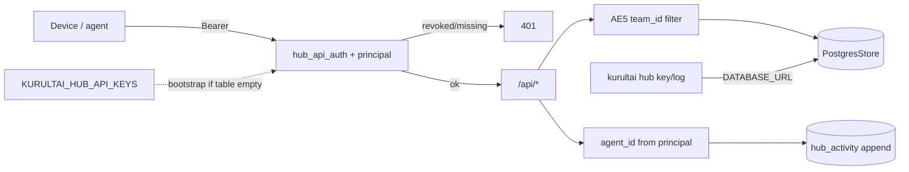

# feat: HUB-4 agent IDs + write log — issued keys, team_id filter, activity

**Target repo:** `duketopceo/kurultai`
**Audience:** hub admin (A3) + team members (A2); solo unchanged
**Base:** `main` **after** [001 HUB-3 Railway transport](2026-08-15-001-feat-hub3-railway-transport-plan.md) merges
**Tracking:** [#179](https://github.com/duketopceo/kurultai/issues/179) · milestone [Tiered Access + Hosted Hub](https://github.com/duketopceo/kurultai/milestone/8)
**Queue:** [000 Wave G sequence](2026-08-15-000-chore-wave-g-railway-sequence-plan.md) — **do not LFG until 001 is on main**
**Process:** PR-only

## Goal Capsule

**Objective:** Replace env CSV as the long-term identity story with **issued** device/agent keys. Bearer maps to a principal. Revoked keys → 401. Enforce AE5 `team_id` isolation at the app layer. Expose a queryable write log (`GET /api/activity` and/or `kurultai hub log`). Hub writes stamp `agent_id` from the **authenticated key**, not from client-supplied `KURULTAI_AGENT_ID`.

**Authority:** This plan > [000 sequence](2026-08-15-000-chore-wave-g-railway-sequence-plan.md) > brainstorm R10/AE5 > [#179](https://github.com/duketopceo/kurultai/issues/179).

**Stop when:**

- `kurultai hub key issue|revoke|list` works against hub Postgres (`DATABASE_URL` on admin host)
- Bearer resolves to principal; revoked → 401 (AE3 extended)
- AE5: `team_id=eng` never receives `sales` team atoms; both receive `company`
- Hub writes stamp `agent_id` from key principal
- `GET /api/activity` or `kurultai hub log` returns append-only write history
- Env CSV still bootstraps (migration path), then issued keys take over

**Do not:**

- Start before 001 merges
- Claim local same-box `KURULTAI_AGENT_ID` is authentication (it remains a stamp for solo/shared-box write-policy only)
- Password / session / JWT accounts
- Postgres RLS in this slice (app-level `team_id` filter only)
- Desktop wrap; R8 merge; HUB-5 ingest tagging; multi-tenant SaaS

## Product Contract

### Summary

Issued identities + write log on the hub. Network principal is authoritative for hub writes and team filtering.

### Requirements

| ID | Requirement | Origin |
|----|-------------|--------|
| R10 | Admin CLI: issue/revoke device API keys; define `team_id` / `org_id` boundaries; list scopes on a hub. | brainstorm R10 |
| R21 | Keys stored in Postgres; env `KURULTAI_HUB_API_KEYS` remains a bootstrap/fallback for empty table. | session · #190 bridge |
| R22 | Plaintext key shown **once** at issue; at rest store sha256 only (prefix for display). | company-brain assumption |
| R23 | Network principal from bearer is authoritative for hub `agent_id` stamps; ignore/override client `KURULTAI_AGENT_ID` on hub writes. | session · #221 honesty |
| R24 | AE5 team isolation: filter `team`-scoped atoms by caller's `team_id`; `company`-scoped atoms visible to all principals on the hub. App-level filter; no RLS this slice. | brainstorm AE5 |
| R25 | Append-only activity / write log: who (principal), what (namespace + transport), optional ≤200-char reason, when. Query via `GET /api/activity` and/or `kurultai hub log`. | session · sequence 000 |

### Actors

- A1. Solo operator — unaffected (no hub keys required locally)
- A2. Team member — presents issued bearer; sees own team + company
- A3. Hub admin — issues/revokes keys via CLI with `DATABASE_URL`
- A4. Revoked device — next hub call 401; local personal SQLite still works

### Acceptance Examples

| ID | Example |
|----|---------|
| AE3 | Missing or revoked key → 401/403; no team/company data. |
| AE5 | `team_id=eng` ask never returns `sales` team atoms; both receive `company` atoms. |
| AE13 | `kurultai hub key issue --agent alice --team eng` prints plaintext once; list shows prefix + team, not full secret. |
| AE14 | Hub write (remember/promote/ingest) stamps `agent_id` from key principal even if client sends a different `KURULTAI_AGENT_ID`. |
| AE15 | After revoke, same bearer → 401; activity log still shows prior writes by that principal. |

### Scope boundaries

**In:** Postgres key + activity schema; admin CLI; middleware principal resolution + AE5 filter; write-path stamp from principal; activity API/CLI.

**Out:** RLS; SaaS multi-org; desktop; connector visibility tagging (HUB-5); Brain UI redesign; starting before 001.

## Planning Contract

### Key Technical Decisions

- KTD1. **Keys in Postgres with env CSV bootstrap.** On auth lookup: try hashed table first; if no active rows, fall back to #190 env CSV so 001 deploys keep working. `(session-settled: user-directed — bridge, not big-bang cutover)`
- KTD2. **Plaintext once; sha256 at rest.** Issue returns full token to stdout once; DB stores `key_hash`, `key_prefix`, `agent_id`, `team_id`, `created_at`, `revoked_at NULL`.
- KTD3. **Network principal is authoritative** on hub. Middleware attaches principal to request extensions; write paths read that, not client env. `(session-settled: user-directed — do not claim local agent_id is auth)`
- KTD4. **`team_id` app-level filter; no RLS this slice.** Filter in search/ask/list queries: `(visibility = 'company') OR (visibility = 'team' AND team_id = $caller_team)`.
- KTD5. **Append-only activity.** Inserts only; no update/delete API in v1. `why` = namespace + transport + optional ≤200-char reason.
- KTD6. **Admin CLI uses `DATABASE_URL` on the operator host** (sqlx), not a remote admin HTTP surface in v1. Commands: `kurultai hub key issue|revoke|list`, `kurultai hub log`.
- KTD7. **Do not start before 001.** Plans-only may land earlier; code LFG waits for Railway transport on `main`.

### Assumptions

- HUB-2 already has nullable `team_id` on hub atoms; this slice populates/filters it.
- Org boundary = one database (from 001 KTD10); `org_id` in R10 is documented as “the database,” not a second column unless already present.
- Activity can reuse/extend `quality_audit` **or** a dedicated `hub_activity` table — prefer dedicated append-only table to avoid overloading audit semantics (document choice in U1).
- Solo/shared-box write-policy (#221) remains for local multi-session; this plan does not weaken it.

### High-Level Technical Design

### Risks

| Risk | Mitigation |
|------|------------|
| Cutting over before 001 | KTD7 hard gate |
| Confusing local agent_id with auth | R23 + docs honesty note |
| RLS scope creep | KTD4 explicit app filter only |
| Env CSV forever | Bootstrap-only; docs say issue keys for real deployments |

## Implementation Units

### U1. Schema — keys + activity

**Goal:** Durable issued keys and append-only write log in hub Postgres.
**Requirements:** R21, R22, R25
**Dependencies:** 001 on main (Postgres hub exists)
**Files:** `src/store/postgres.rs` (migrations / DDL), maybe `src/hub/keys.rs` types
**Approach:** Tables e.g. `hub_api_keys (id, key_hash, key_prefix, agent_id, team_id, created_at, revoked_at)` and `hub_activity (id, at, agent_id, team_id, namespace, transport, reason, atom_id NULL)`. Migrate on `open_hub_store` / connect.
**Patterns to follow:** HUB-2 migration style in `src/store/postgres.rs`.
**Test scenarios:**
- Insert key hash; lookup by sha256 of plaintext succeeds; revoked_at set → lookup fails.
- Activity insert then list ordered by time desc.
**Verification:** `--features postgres` tests with URL.

### U2. Admin CLI — `kurultai hub key` / `hub log`

**Goal:** Operators can issue/revoke/list keys and read the write log without a web UI.
**Requirements:** R10, R22, R25 · AE13, AE15
**Dependencies:** U1
**Files:** `src/main.rs` (clap subcommands), new `src/hub/cli.rs` or `src/commands/hub.rs`
**Approach:** `hub key issue --agent <id> --team <team_id>`; `hub key revoke --prefix|--id`; `hub key list`; `hub log [--limit N]`. Requires `DATABASE_URL`. Print plaintext once on issue (AE13).
**Patterns to follow:** existing clap command structure in `src/main.rs`.
**Test scenarios:**
- Covers AE13. Issue → stdout contains token once; DB has hash only.
- Revoke → list shows revoked; auth lookup fails (with U3).
**Verification:** CLI unit/integration with test DB.

### U3. Middleware principal + AE5 filter

**Goal:** Bearer → principal; revoked 401; search/ask honor team_id.
**Requirements:** R10, R21, R23, R24 · AE3, AE5, AE14
**Dependencies:** U1
**Files:** `src/http/auth.rs`, hub query paths in `src/http/mod.rs` / brain service, write paths that stamp actor
**Approach:** Extend `hub_api_auth` (or adjacent middleware) to resolve principal from Postgres (env CSV bootstrap if table empty). Attach to request. Filter list/search/ask results per R24. On writes, set `agent_id` from principal (AE14).
**Patterns to follow:** existing `hub_api_auth` + `token_accepted`; write-policy actor stamping.
**Test scenarios:**
- Covers AE3/AE15. Revoked key → 401.
- Covers AE5. Two teams; eng caller never sees sales team atoms; both see company.
- Covers AE14. Client `KURULTAI_AGENT_ID=mallory` but key is `alice` → stamp `alice`.
**Verification:** postgres-featured HTTP tests.

### U4. Write log API / CLI surface

**Goal:** Queryable “who wrote what when.”
**Requirements:** R25 · AE15
**Dependencies:** U1–U3
**Files:** `src/http/mod.rs` (`GET /api/activity`), CLI `hub log` if not fully in U2, docs
**Approach:** Authenticated activity endpoint (admin or any valid principal — pick least privilege: any valid hub principal can read activity for their team + company writes; document). Append on successful mutating hub routes.
**Patterns to follow:** existing `/api/*` JSON handlers.
**Test scenarios:**
- Write then GET `/api/activity` includes principal + namespace + timestamp.
- Reason longer than 200 chars rejected or truncated (document; prefer reject).
**Verification:** HTTP + CLI tests.

## Verification Contract

- Do not open code PR until 001 is on `main`
- `cargo fmt` / `clippy -D warnings` / `cargo test --locked`
- `cargo test --locked --features postgres` with test DB for U1–U4
- AE5 covered by an automated test that seeds eng/sales/company atoms
- Docs: honesty note that local `KURULTAI_AGENT_ID` ≠ hub auth

## Definition of Done

- U1–U4 complete; R10, R21–R25, AE3, AE5, AE13–AE15 satisfied
- Env CSV bootstrap documented; issued keys are the real path
- PR against `main` after 001; `@coderabbitai ignore`
- #179 closable when this code PR merges

## Appendix

- Depends on: [001 HUB-3](2026-08-15-001-feat-hub3-railway-transport-plan.md)
- Sequence: [000](2026-08-15-000-chore-wave-g-railway-sequence-plan.md)
- Follow-on (do not steal): HUB-5 [#180](https://github.com/duketopceo/kurultai/issues/180)
- Related: write-policy #221 · API-key scaffold #190
