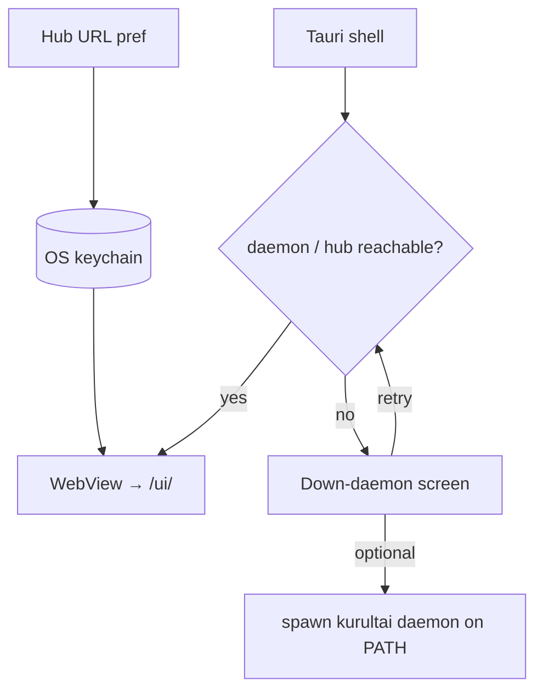

# feat: desktop Brain UI wrap — thin Tauri window over /ui/

**Target repo:** `duketopceo/kurultai`
**Audience:** solo / team operators who want a window, not a browser tab
**Base:** `main` **after** [001 HUB-3](2026-08-15-001-feat-hub3-railway-transport-plan.md) ships (002 may still be open)
**Tracking:** none (Brain UI packaging was explicitly out of the hub brainstorm)
**Queue:** [000 Wave G sequence](2026-08-15-000-chore-wave-g-railway-sequence-plan.md) — **LAST. Do not LFG until 001 is on main. Does not block Railway.**
**Process:** PR-only

## Goal Capsule

**Objective:** Thin Tauri 2 (preferred) or Wails window that loads the **existing** embedded Brain UI. Local default `http://127.0.0.1:8421/ui/`. Optional hub URL + OS keychain for API key. Down-daemon screen when the target is unreachable. No UI redesign. No App Store. Prefer spawning system `kurultai` on PATH; do **not** embed the daemon binary in v1.

**Authority:** This plan > [000 sequence](2026-08-15-000-chore-wave-g-railway-sequence-plan.md) > AGENTS.md Brain visual prefs (do not restyle).

**Stop when:**

- Desktop shell opens `/ui/` against local daemon by default
- If daemon is down, a clear down-screen with retry (and optional “start kurultai daemon” if spawn path is implemented)
- Optional remote hub URL + keychain-stored bearer for public hub
- README covers macOS Gatekeeper / unsigned build honesty
- No changes to `ui/` visual language

**Do not:**

- LFG before 001 ships
- Redesign Brain UI / synaptic chrome / palette
- App Store / Play Store / code-signed distribution program in v1
- Embed or vendor the Rust daemon inside the desktop app in v1
- Spend more than a short slice if this eats a week — **stop**

### Honest note

GBrain does not ship a custom desktop app — Claude Desktop / Cursor as an MCP client is the GBrain-shaped path. This wrap is convenience only. If it expands into a product fork, cancel and keep browser → `/ui/`.

## Product Contract

### Summary

A native window around the daemon UI we already have. Packaging, not a second dashboard.

### Requirements

| ID | Requirement |
|----|-------------|
| D1 | Thin desktop shell (Tauri 2 preferred; Wails acceptable if Tauri tooling blocks) loads existing `/ui/` — no parallel website/dashboard. |
| D2 | Default target `http://127.0.0.1:8421/ui/` (trailing slash). |
| D3 | When target unreachable: down-daemon screen with retry; no blank WebView fail. |
| D4 | Optional hub base URL + API key stored in OS keychain (not plaintext config committed to disk by default). |
| D5 | Prefer `kurultai` on PATH to start local daemon; do not embed daemon binary in v1. Document Gatekeeper / unsigned builds. |

### Actors

- A1. Solo operator — local daemon + window
- A2. Team member — optional remote hub URL + key
- A3. Implementer — stops if scope expands into UI redesign or signing program

### Acceptance Examples

| ID | Example |
|----|---------|
| AE-D1 | With daemon on 8421, app shows Brain UI content (stats / explorer — graph may still need unpkg egress). |
| AE-D2 | With daemon stopped, app shows down-screen, not an empty window. |
| AE-D3 | Saving a hub URL + key persists key in keychain; restart still authenticates (manual or automated). |
| AE-D4 | No diff to `ui/` CSS/Three palette/layout in the PR. |

### Scope boundaries

**In:** new `desktop/` (or `apps/brain-desktop/`) crate/app; README; down screen; keychain helper; optional spawn of `kurultai daemon`.

**Out:** UI redesign; App Store; embedding daemon; rewriting MCP clients; implementing 001/002 in this PR; closing hub issues.

## Planning Contract

### Key Technical Decisions

- KTD1. **Tauri 2 first.** Small WebView wrapper; Rust side only for window, keychain, spawn. `(session-settled: user-directed — thin wrap)`
- KTD2. **Do not embed daemon.** Spawn `kurultai` from PATH or tell the user to start it. Embedding doubles release matrix.
- KTD3. **No UI redesign.** AGENTS.md: ask before Brain visual changes — this plan forbids them.
- KTD4. **Keychain for hub keys.** macOS Keychain / secret-service / Windows Credential Manager via a maintained crate; never commit secrets.
- KTD5. **Stop-if-out-of-hand.** If packaging/signing/WebView bugs eat a week, ship docs-only “use the browser” and close the experiment. `(session-settled: user-directed — sequence 000 honesty)`

### Assumptions

- Daemon already serves `/ui/` when running; desktop does not rebuild UI assets into a second tree.
- Cloud agents may not be able to GUI-test Tauri; verification is local/manual + unit tests for keychain/spawn helpers.
- Unsigned macOS builds will Gatekeeper-nag; README says so (D5).

### High-Level Technical Design

### Risks

| Risk | Mitigation |
|------|------------|
| Becomes a week-long packaging sink | KTD5 stop rule |
| Accidental UI redesign | D1/D3/AE-D4; review diff excludes `ui/` visuals |
| Secret leakage in prefs JSON | KTD4 keychain only for keys |
| Users think desktop replaces hub work | 000 sequence: last; does not block Railway |

## Implementation Units

### U1. Shell — Tauri window → `/ui/`

**Goal:** Native window loads default local Brain UI.
**Requirements:** D1, D2 · AE-D1, AE-D4
**Dependencies:** 001 on main (product sequencing); technically only needs a running daemon
**Files:** new `desktop/` Tauri project (`src-tauri/`, minimal frontend shell if needed), workspace/docs pointers
**Approach:** Create Tauri 2 app; start URL `http://127.0.0.1:8421/ui/`; no vendored copy of `ui/`.
**Patterns to follow:** keep repo Brain assets single-sourced under `ui/` / `website/` as today.
**Test scenarios:**
- Manual AE-D1 with daemon running.
- PR file list has no Brain visual CSS/Three edits.
**Verification:** build desktop on at least one platform in CI **or** document manual-only if CI images lack WebView deps (prefer document rather than flaky CI).

### U2. Down-daemon screen

**Goal:** Clear failure when nothing is listening.
**Requirements:** D3 · AE-D2
**Dependencies:** U1
**Files:** desktop frontend down-state component; optional Tauri command `probe_health`
**Approach:** Probe `GET /health` (or `/ui/`); on failure show down-screen with Retry. Optional button to spawn daemon (U1/U5 overlap — keep spawn in U1 or here, not both).
**Test scenarios:**
- Covers AE-D2. Stop daemon → down-screen visible.
**Verification:** manual or mocked probe unit test.

### U3. Keychain + hub URL

**Goal:** Optional remote hub without plaintext key files.
**Requirements:** D4 · AE-D3
**Dependencies:** U1
**Files:** Tauri commands `set_hub_target`, `get_hub_target`; keychain integration
**Approach:** Store base URL in app config; store API key in keychain keyed by URL. Inject Authorization header for WebView requests **only if** Tauri allows request interception; otherwise document “paste key into browser session” fallback and keep keychain for future — prefer real injection if Tauri 2 supports it without heroic hacks. If injection is heroic, **stop** (KTD5) and ship URL-only + browser for hub auth.
**Patterns to follow:** least surprise; do not log secrets.
**Test scenarios:**
- Save/load key round-trip in keychain mock.
**Verification:** unit tests with mock; manual on one OS.

### U4. README Gatekeeper / PATH spawn

**Goal:** Honest install story; local start without embedding.
**Requirements:** D5
**Dependencies:** U1–U3
**Files:** `desktop/README.md`, maybe root README one-liner pointer
**Approach:** Document: install `kurultai` on PATH; unsigned macOS Gatekeeper steps; how to point at hub; link to `docs/deploy/railway-hub.md` for hub side. Prefer spawn `kurultai daemon --port 8421` from the app when user clicks Start.
**Test expectation:** docs review.
**Verification:** README exists; no App Store claims.

## Verification Contract

- Do not LFG until 001 is on `main`
- No `ui/` visual diffs
- Manual AE-D1–AE-D3 on one developer machine
- If blocked > short slice, stop and leave plan + honesty note (do not force a half-signed app)

## Definition of Done

- U1–U4 complete **or** explicit stop recorded in PR with browser-only guidance
- D1–D5 addressed
- Does not block or reopen 001/002 scope
- `@coderabbitai ignore`

## Appendix

- Sequence: [000](2026-08-15-000-chore-wave-g-railway-sequence-plan.md)
- Prerequisite ship: [001](2026-08-15-001-feat-hub3-railway-transport-plan.md)
- Brain prefs: `AGENTS.md` — do not change visuals without asking
- GBrain-shaped alternative: Claude Desktop / Cursor → remote MCP (no custom app)
