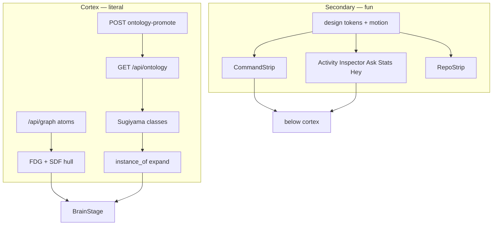

# feat: Brain UX — ontology cortex + dashboard rework

**Target repo:** `duketopceo/kurultai`  
**Authority:** This plan > Aug 13 dual-mode plan (foundation) > AGENTS.md Brain doctrine > #116 / #117 / #118  
**Product Contract preservation:** Bootstrap with session-settled scope (1A full program · 2A schema-first · 3B secondary ThreeUI-ish chrome only). Aug 13 R1–R14 remain in force where still applicable; this plan does not reopen galaxy or OWL.

## Goal Capsule

**Objective:** Treat the **3D cortex as literal ontology + memory space** (brain-shape FDG for atoms; Sugiyama schema scaffold for classes, instances on expand). Treat **everything outside BrainStage** as a **fun, secondary visual system** (ThreeUI-inspired energy — not a second brain, not literal ontology chrome). Redesign the **command strip and dashboard panels** under that rule without stealing focus from the cortex.

**Stop when:**

- Ontology mode reads as a typed hierarchy (classes default; expand instances; directed edges), not a second organic cloud — and has enough promoted structure that empty scaffold is rare on a dogfood brain.
- Brain mode stays volumetric FDG in the GLB hull; code/`repos` stay off cortex.
- Below-brain UI uses a distinct secondary design language (tokens + motion + composition) while BrainStage palette/camera/electric look are unchanged.
- CommandStrip + dashboard grid (Activity, Inspector, Ask, Stats, Hey, RepoStrip) are one-job sections, playful, and do not dump ontology schema into panel chrome.
- O3 proposal queue remains deferred (follow-up), but inspector can **suggest** and **explicitly promote** atoms into the seeded class tree.

**Do not:** Touch BrainStage three-color electric doctrine; vendor MengTo/ThreeUI into the Three renderer; make panels look like ontology diagrams; resurrect galaxy; dump 7k instances into default ontology camera; full-viewport chrome redesign that demotes the brain.

---

## Product Contract

### Summary

Foundation from Aug 13 (FDG worker, SDF, O1 tables, Sugiyama ontology mode) is largely **on main**. This program is the **product layer on top**: make ontology *literal in the cortex*, make the *rest of the UI fun*, and clean the *buttons and panels below* so they serve retrieval and promotion without competing with the graph.

### Requirements

| ID | Requirement |
|----|-------------|
| R1 | Cortex remains the hero: brain-shape FDG default; ontology mode = typed hierarchy (schema scaffold first, instances on expand). |
| R2 | Ontology layout stays a pure function of entities + links (+ expanded instance set). No fake ontology from unconstrained FDG. |
| R3 | Seeded class tree (Memory → Note/Code/Decision/Person/System) remains the default scaffold; empty ontology is valid but dogfood path must make promote friction low. |
| R4 | Inspector shows approved links and offers **suggest + explicit promote** into a class (not silent writes; not full O3 queue). |
| R5 | BrainStage visuals unchanged: deep black; B/W + slight purple; electric synapses; whole-graph framing on load. |
| R6 | Secondary chrome (TopBar, CommandStrip, dashboard grid, RepoStrip, Access, Hey) uses a **distinct playful language** inspired by ThreeUI-class motion/composition — CSS/React only in v1. |
| R7 | Code sources (`code`/`github`/`repos`) never render on cortex; Repos strip / `#/repos` own them. |
| R8 | One Brain UI surface: `website/` → `ui/` via `scripts/build-ui.sh`; no parallel dashboard. |
| R9 | Version/tag before risky cortex experiments. |
| R10 | O3 agent propose → human approve queue is **out of this plan** (#118 follow-up). |

### Actors

- A1. Solo / dogfood operator on knowledge.shippedit.dev — primary.
- A2. Agent via MCP — `ontology_get` / `ontology_promote`; no silent ontology mutation.
- A3. Implementer — slice PRs; rebuild `ui/` against `origin/main`.

### Acceptance Examples

- AE1. Toggle Ontology → see ≤ tens of class nodes layered; expand Note → ≤80 instances; brain mode restores FDG cloud.
- AE2. Select a note atom → Inspector suggests class → promote → new `instance_of` appears in ontology expand without deleting the atom.
- AE3. Hard refresh dashboard → cortex still electric black/purple; strip/panels look like a different (fun) system; brain still fills first viewport.
- AE4. Search hits code → cortex unchanged; Repos strip / `#/repos` shows duketopceo lattices.

### Scope Boundaries

**In:** Cortex polish + promote UX; secondary design system for non-Brain chrome; CommandStrip + panel redesign; Hey/Access/Repos restyle (already on `origin/main` via #268–#270).

**Deferred to Follow-Up Work:** O3 proposal queue (#118); Postgres ontology (T1b); class editor; WebGPU FDG; OWL export; vendoring ThreeUI into Three.js scene.

**Outside identity:** Replacing BrainStage with a generic network viz; making ontology mode another spring blob; Clerk `web/` as a second brain.

---

## Planning Contract

### Key Technical Decisions

- KTD1. **Do not re-implement Aug 13 Slices A–C.** Treat FDG/SDF/Sugiyama/O1 schema as landed; this plan builds product UX and secondary chrome on top. `(session-settled: user-approved — 1A full program means complete the product story, not redo the math)`
- KTD2. **Literal ontology lives only in cortex + inspector data.** Panel headers, buttons, and strip controls stay metaphorical / playful — never a mini class-tree widget competing with ontology mode. `(session-settled: user-directed — UI fun, not literal)`
- KTD3. **Secondary language = CSS variables + motion + composition in `website/src/`, not a Three.js UI library in BrainView.** ThreeUI is inspiration and optional later experiment for non-Brain surfaces only; v1 ships tokens + components without adding `three-ui` npm. `(session-settled: user-approved — 3B heavier secondary; rejected putting ThreeUI inside BrainStage)`
- KTD4. **Promote path = MCP `ontology_promote` semantics + new HTTP write for the Brain UI (must not reuse trust-lane `/api/promote`).** Suggestions from tags/soft-labels are client-side hints only until the user confirms. `(#116 · #118 boundary · doc-review: GET `/api/ontology` exists; ontology write HTTP does not)`
- KTD5. **Dashboard grid keeps brain-above / chrome-below.** May restyle and reorder panels; must not collapse brain into a card or side pane. `(AGENTS.md)`
- KTD6. **Slice PRs:** (1) HTTP ontology promote + Inspector + empty-state polish, (2) secondary tokens + CommandStrip, (3) dashboard panels + Hey/Access/Repos, (4) dogfood verify on knowledge. Version/tag before cortex renderer math changes.
- KTD8. **Plan naming frames the full Brain UX program** (ontology cortex + promote + dashboard), not chrome-only. Secondary chrome is one slice (3B), not the product identity. `(session-settled: user-directed — chosen over filename/title centered on "secondary chrome": user corrected that framing as underselling the UI fix + larger-scale rework)`
- KTD7. **Empty-ontology cue stays out of the GL scene.** Non-interactive empty-state copy in existing stage chrome or Inspector-only; no new on-canvas buttons/widgets. `(AGENTS.md three-color / avoid-extra-chrome)`

### Assumptions

- Implement against `origin/main` (local trees often lag — #268–#271 land Hey, Access, and `repos?` in `isCodeSource`).
- Dogfood brains still lack enough `instance_of` links; without U2 promote UX, ontology mode stays a five-node toy.
- “ThreeUI-ish” does not require matching MengTo’s API — match energy: spatial hierarchy, intentional motion, low clutter.
- Optional dogfood seed script (if used) must require an explicit operator action — never silent ontology writes.

### High-Level Technical Design

### Risks

| Risk | Mitigation |
|------|------------|
| Secondary redesign bleeds into BrainStage | Hard rule: no BrainView palette/camera changes in chrome PRs; visual review checklist |
| Ontology still empty after UI | U2 promote + optional explicit seed; AE2 |
| Scope balloons into O3 | Keep suggestions non-persistent; #118 deferred |
| ThreeUI rabbit hole | KTD3: tokens first; library later only if needed |
| Confusing trust-lane promote with ontology promote | Distinct HTTP path + copy; KTD4 |

### Product Contract preservation note

Product Contract newly authored from session scope + Aug 13 meaning. Aug 13 R1–R14 unchanged in force; this plan adds R1–R10 for the product/chrome layer without silent rewrite of hull/O1/Sugiyama decisions.

---

## Implementation Units

### U1. Cortex ontology literalness pass

**Goal:** Ontology mode and brain mode read as intended products; empty/expand states honest.  
**Requirements:** R1, R2, R3, R5, R7, R9  
**Dependencies:** none  
**Files:** `website/src/brain/BrainView.ts`, `website/src/brain/layout/sugiyama.ts`, `website/src/components/BrainStage.tsx`, `website/src/repoLattice.ts`, `website/src/repoLattice.test.ts`, `website/src/brain/layout/*.test.ts`, `ui/` (rebuild)  
**Approach:**
1. Audit ontology expand/collapse + edge drawing against AE1; fix regressions only.
2. Verify `isCodeSource` still matches `repos?` (#271 on main); add/keep regression test — do not reopen the `\brepo\b` miss.
3. Empty ontology: non-interactive empty-state copy (stage chrome or Inspector) pointing at promote — no fake nodes, no new GL widgets (KTD7).
4. Tag before merge if renderer math changes.
**Execution note:** Prefer characterization screenshots + existing layout tests before behavior changes.  
**Test scenarios:**
- Happy: ontology classes layer; expand Note adds ≤80 instances; toggle brain restores FDG.
- Edge: zero links → scaffold classes only, no crash.
- Error: unknown `rel` skipped without breaking layout.
- Integration: atoms with `source=repos` absent from cortex atom list (`repoLattice.test.ts`).
**Verification:** Layout + `repoLattice` unit tests green; manual AE1 on mid tier.

### U2. Inspector suggest + promote into ontology

**Goal:** Low-friction path from atom → `instance_of` seeded class without O3.  
**Requirements:** R3, R4, R10  
**Dependencies:** U1  
**Files:** `website/src/components/InspectorPanel.tsx`, `website/src/api.ts`, `src/http/mod.rs` (add ontology-promote write), `src/ontology/mod.rs`, `tests/acceptance_http.rs`, `tests/acceptance_ontology.rs`, `tests/acceptance_mcp.rs`  
**Approach:**
1. Add HTTP write that calls the same `promote_atom_to_entity` path as MCP `ontology_promote` (`ent:{atom_id}`, non-destructive). Do **not** call trust-lane `/api/promote`.
2. Wire Inspector: client-side class suggestions from tags; user must confirm; call the new HTTP route.
3. After promote, refresh ontology payload so expand shows the instance.
**Test scenarios:**
- Happy: promote note → entity + `instance_of` Note; atom remains searchable; trust_lane unchanged.
- Edge: already promoted → idempotent or clear message.
- Error: API 401/5xx → visible failure, no partial UI state.
- Integration: ontology expand on that class lists the new instance; MCP `ontology_get` agrees.
**Verification:** AE2; HTTP + MCP acceptance suites green.

### U3. Secondary design tokens + shell primitives

**Goal:** Shared playful language for all non-Brain chrome.  
**Requirements:** R6, R8  
**Dependencies:** none (parallel with U1)  
**Files:** `website/src/styles.css` (or `website/src/chrome/tokens.css`), small primitives under `website/src/components/chrome/`, `website/src/components/INDEX.md`  
**Approach:**
1. Define CSS variables for secondary surface (distinct from cortex black/purple doctrine — clearer hierarchy, intentional motion, still restrained).
2. Primitives: panel frame, strip control, ghost/primary actions — motion 2–3 intentional transitions.
3. Document “BrainStage forbidden zone” in component INDEX.
**Test scenarios:**
- Happy: tokens apply to a sample panel without changing canvas colors.
- Edge: reduced-motion disables secondary transitions.
- Test expectation: visual checklist + lint only unless the repo already has CSS snapshot patterns.
**Verification:** Side-by-side screenshot cortex vs strip; AGENTS three-color cortex intact.

### U4. CommandStrip redesign (secondary language)

**Goal:** Search, timeline, layout toggle, load tier, random — fun, one job, clear reset.  
**Requirements:** R5, R6  
**Dependencies:** U3  
**Files:** `website/src/components/CommandStrip.tsx`, `website/src/styles.css`  
**Approach:** Restyle/recompose strip using U3 primitives; keep layout toggle `brain` \| `ontology`; search clear/reset control remains obvious. Coverage is manual AE3 unless a strip test already exists.  
**Test scenarios:**
- Happy: search → clear resets cortex selection/filter behavior as today.
- Edge: ontology layout selected → strip still usable; worker paused as today.
- Integration: load tier change still caps cortex atoms.
**Verification:** AE3 strip portion; no new layout modes.

### U5. Dashboard grid panels redesign

**Goal:** Activity, Inspector, Ask, Stats as one-job playful panels.  
**Requirements:** R4, R6  
**Dependencies:** U3, U2 (Inspector promote UI)  
**Files:** `website/src/App.tsx`, `website/src/components/ActivityPanel.tsx`, `website/src/components/AskPanel.tsx`, `website/src/components/StatsPanel.tsx`, `website/src/components/InspectorPanel.tsx`, `website/src/styles.css`  
**Approach:** Apply secondary language; avoid ontology tree widgets in panels; Inspector hosts promote (U2).  
**Test scenarios:**
- Happy: each panel still performs its API job.
- Edge: empty activity / failed ask show calm empty states.
- Integration: selecting cortex node still drives Inspector.
**Verification:** AE3; brain still first viewport.

### U6. Hey, Access, RepoStrip under secondary language

**Goal:** Non-cortex surfaces share the fun system; Repos remains code lattice entry.  
**Requirements:** R6, R7  
**Dependencies:** U3  
**Files:** `website/src/components/HeyPanel.tsx`, `website/src/components/HumanAccess.tsx`, `website/src/components/TopBar.tsx`, `website/src/components/RepoBrain.tsx`, `website/src/auth.ts`, `website/src/styles.css`  
**Approach:** Restyle only against `origin/main` components (#268–#270); do not change auth or hey API contracts.  
**Test scenarios:**
- Happy: Access sign-in form still 1Password-friendly; Hey lists threads.
- Edge: locked instance gate unchanged functionally.
- Integration: RepoStrip counts match code sources; cortex still excludes them.
**Verification:** AE4; login + repos smoke on knowledge.

### U7. Dogfood verify + docs index

**Goal:** Hosted knowledge brain proves AE1–AE4; plans/INDEX updated.  
**Requirements:** R8, R9  
**Dependencies:** U1–U6  
**Files:** `docs/plans/INDEX.md`, deploy notes if needed, optional `docs/solutions/` note  
**Approach:** Rebuild `ui/`, deploy solo image, hard-refresh checks; capture short verification notes. Prefer U1+U2 on knowledge before heavy chrome polish if ontology is still empty.  
**Test scenarios:**
- Integration: AE1–AE4 on knowledge.shippedit.dev after deploy.
**Verification:** Checklist signed in PR; `scripts/audit-agent-index.py` green if INDEX touched.

---

## Verification Contract

- `node --experimental-strip-types --test website/src/brain/layout/*.test.ts` (and `website/src/repoLattice.test.ts` when touching code-source filters)
- `cargo test --test acceptance_http --test acceptance_ontology --test acceptance_mcp` (when U2 touches promote)
- `bash scripts/build-ui.sh` then commit `ui/`
- `python3 scripts/audit-agent-index.py` when INDEX files change
- Manual: AE1–AE4 local daemon `:8421/ui/` then knowledge after deploy
- Do not regress BrainStage three-color / electric hover / whole-graph camera

## Definition of Done

- All U1–U7 complete or explicitly deferred with reason
- Cortex = literal ontology + memory; chrome = fun secondary; no ThreeUI inside BrainStage
- Promote path works from Inspector via dedicated HTTP (not trust-lane promote) without O3
- `repos` still off cortex
- Plan checklist / PR description references this file

## Sources & Research

- `docs/brainstorms/2026-08-13---brain-shape-algorithmic-ontology.md`
- `docs/plans/2026-08-13-004-feat-brain-shape-algorithmic-ontology-plan.md` (foundation; Slices A–C largely shipped)
- CONCEPTS.md — Entity, Link, Brain UI
- AGENTS.md — Brain visual doctrine
- #116 O1 · #117 graph UI · #118 O3 (deferred)
- #268–#271 — hey board, human access, `repos` cortex filter (on `origin/main`)
- Session scope 2026-09-05: 1A / 2A / 3B
- Session note: ThreeUI as secondary reference only (inspiration; no vendored package in v1)

## Appendix — foundation already on main

| Slice (Aug 13) | Status |
|----------------|--------|
| A FDG + SDF + galaxy removal | Shipped |
| B O1 schema + GET `/api/ontology` + MCP get/promote | Shipped; **HTTP ontology promote missing — U2** |
| C Sugiyama ontology mode | Shipped |
| D O3 proposals | Not this plan |
