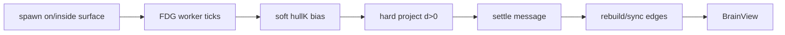

# fix: Brain FDG hull containment + render cost

**Target repo:** `duketopceo/kurultai`  
**Authority:** This plan > AGENTS.md Brain doctrine > Aug 13 brain-shape plan  
**Product Contract preservation:** Bootstrap from session option **1** (containment + perf only). Visual redesign of node/connector look is **out of scope**.

## Goal Capsule

**Objective:** In **brain** layout mode, memory nodes stay **inside** the cortex SDF hull (hard project after soft force), synapse edges track settled positions without ballooning outside the head, and render/`setData` cost drops without changing the three-color electric look.

**Stop when:**

- After FDG settle on mid-tier graphs, ≥95% of node positions sample `sdf ≤ 0` (inside / on surface).
- Brain-mode edges rebuild or sync after layout settle (no frozen arcs from spawn positions).
- Sprite-mode edges no longer use the outward `length()*0.18` lift that pushes mass outside the silhouette.
- Measurable cost cut: fewer raycasts on edge build and/or lower default edge budget; existing layout unit tests still pass.
- AGENTS doctrine unchanged: deep black; B/W + slight purple; electric synapses; whole-graph camera; no intro zoom; BrainStage palette/camera not restyled as secondary chrome.

**Do not:** Full node/connector visual redesign; change ontology Sugiyama to force-into-hull; vendor ThreeUI into BrainStage; raise default load tier; Matrix-green / cyberpunk palette.

---

## Product Contract

### Summary

Soft `hullK` FDG + outward spawn + one-shot edges (and sprite outward lift) leave most nodes/arcs outside the GLB cortex. Fix containment and edge sync; trim expensive edge geometry. Keep look doctrine-identical.

### Requirements

| ID | Requirement |
|----|-------------|
| R1 | Brain-mode FDG ends with nodes inside or on the SDF hull (hard project after integrate when `d > 0`). |
| R2 | Soft `hullK` may remain as a bias during ticks; hard project is authoritative at tick end (and after final settle). |
| R3 | Initial spawn places nodes on/inside the surface (no net outward normal push that starts them exterior). |
| R4 | Brain-mode edges rebuild or position-sync after FDG settle so arcs match final node positions. |
| R5 | Sprite-mode edges must not intentionally lift intermediates outside the hull. |
| R6 | Cut edge-build cost: reduce CatmullRom+raycast work and/or `MAX_EDGES` (document new budget). |
| R7 | AGENTS Brain visual doctrine preserved (colors, electric hover highlight, whole-graph framing). |
| R8 | Ontology layout remains non-hull Sugiyama; no fake ontology from FDG. |
| R9 | Version/tag or feature-branch before merge; `website/` → `ui/` rebuild. |
| R10 | Layout unit tests cover hard project / inside-hull invariant for a small SDF fixture. |

### Actors

- A1. Dogfood operator on knowledge.shippedit.dev / local `:8421/ui/`
- A2. Implementer

### Acceptance Examples

- AE1. Load tier mid, layout `brain`: after settle, inspector/debug or unit harness shows vast majority of nodes with `sampleSdf ≤ 0`.
- AE2. Hard refresh: synapses connect in-cortex nodes; no large exterior arc cloud in brain mode.
- AE3. Toggle ontology → hierarchy still non-hull; toggle brain → containment restored.
- AE4. `setData` with ~800–1500 atoms completes without pathological main-thread raycast spike (raycasts skipped or capped).

### Scope Boundaries

**In:** `fdg.ts` / params / worker settle hook; `BrainView` spawn, edges, edge budget; layout tests; `build-ui.sh`.

**Deferred:** Full visual redesign of node/halo shaders; camera AABB auto-fit (optional micro if trivial); InstancedMesh mesh-path rewrite; WebGPU FDG.

**Outside identity:** Replacing BrainView with R3F/`3d-force-graph`; secondary chrome redesign.

---

## Planning Contract

### Key Technical Decisions

- KTD1. **Ship containment + perf only** — not a full node/connector visual redesign. `(session-settled: user-directed — chosen over option 2 full visual redesign in one PR: user invoked LFG with "1")`
- KTD2. **Hard SDF project after each FDG integrate** (when `d > 0`, move along −∇ to surface/inside). Soft `hullK` can stay as bias. `(session-settled: user-approved — research ranked soft hull as primary leak)`
- KTD3. **Preserve AGENTS three-color electric doctrine** — no palette/camera chrome restyle in this PR. `(session-settled: user-approved — option 1 keeps visuals mostly unchanged)`
- KTD4. **Brain edges resync after FDG settle**; remove sprite outward lift. Prefer fewer raycasts (straight segments or 1 midpoint without 4× proxy casts) over prettier exterior arcs.
- KTD5. **Lower or smarter `MAX_EDGES`** (e.g. 3000 → 1200 or top-N by strength already — tighten N) and skip CatmullRom raycast path when `n > NODE_SPRITE_CUTOFF` or always for brain mode v1 of this fix.
- KTD6. **Tag before merge** / feature branch; rebuild `ui/`.

### Assumptions

- Hosted mid/low tiers are the dogfood path; max tier remains capped by `MAX_NODES`.
- Empty SDF bake failure must fail loud in tests / keep prior soft-only behavior without silent “no hull.”

### High-Level Technical Design

### Risks

| Risk | Mitigation |
|------|------------|
| Hard project collapses graph to surface shell | Project only when exterior; keep repulsion; tune `hullK` |
| Edge rebuild every settle frame is expensive | Rebuild once on worker completion / layout idle, not every tick |
| Ontology regression | Mode guard: hard project + brain-edge path only when `layout === 'brain'` |

### Product Contract preservation note

Product Contract newly authored from session option 1 + research. Aug 13 dual-mode meaning unchanged; this plan does not reopen galaxy or ontology-as-FDG.

---

## Implementation Units

### U1. Hard SDF project in FDG tick

**Goal:** Exterior nodes are projected back each tick.  
**Requirements:** R1, R2, R10  
**Files:** `website/src/brain/layout/fdg.ts`, `website/src/brain/layout/types.ts` (params comment / optional `hardProject: true`), `website/src/brain/layout/*.test.ts`  
**Approach:** After position integrate, if `sdf` and `d = sampleSdf > 0`, move position along −normalized gradient by `d` (or clamp into cell). Keep soft `hullK` velocity bias.  
**Test scenarios:**
- Happy: node outside fixture SDF ends inside after ticks.
- Edge: `d ≤ 0` unchanged; null SDF no-op.
- Integration: existing `tickFdg keeps nodes inside a spherical SDF` strengthened or sibling for hard project.

### U2. Spawn inside / on surface

**Goal:** Initial positions are not biased exterior.  
**Requirements:** R3  
**Files:** `website/src/brain/BrainView.ts` (`vertexForRegion`)  
**Approach:** Remove or invert outward normal offset (`+0.018`); prefer slight inward or zero.  
**Test scenarios:** Characterization via layout test if spawn exported; else manual AE1 + comment in code.

### U3. Brain edges after settle + cheaper geometry

**Goal:** Edges match final positions; less raycast cost; no sprite exterior lift.  
**Requirements:** R4, R5, R6, R7  
**Files:** `website/src/brain/BrainView.ts` (`buildEdges`, worker settle / `snapLayoutTo` / positions handler)  
**Approach:** On FDG settle (or first idle after `setData`), rebuild edges once. Sprite path: drop `p.length()*0.18` lift. Prefer line segments without 4 raycasts when spriteMode or always for this PR. Tighten `MAX_EDGES`.  
**Test scenarios:**
- Happy: after settle, edge endpoints ≈ node positions.
- Edge: ontology still uses `syncOntologyEdges`.
- Perf: AE4 — no 4× raycast × 3000 on sprite path.

### U4. Build UI + dogfood verify notes

**Goal:** Embedded `ui/` matches source; INDEX if needed.  
**Requirements:** R9  
**Files:** `ui/` via `scripts/build-ui.sh`, optional short note in PR  
**Verification:** AE1–AE3 on local `:8421/ui/` then knowledge after deploy.

---

## Verification Contract

- `node --experimental-strip-types --test website/src/brain/layout/*.test.ts`
- `bash scripts/build-ui.sh`
- Manual AE1–AE3 brain vs ontology toggle
- Do not regress BrainStage three-color / electric hover / whole-graph camera

## Definition of Done

- U1–U4 done
- Nodes in cortex in brain mode; edges not exterior balloons
- Render path cheaper on mid tier
- Doctrine intact; no full visual redesign

## Sources & Research

- Session research 2026-09-05 (FDG soft hull, sprite edge lift, one-shot edges)
- AGENTS.md Brain doctrine
- `docs/brainstorms/2026-08-13---brain-shape-algorithmic-ontology.md`
- Skills: deslop, design-taste (metaphor fidelity), ui-ux-pro-max (reduced-motion / stop offscreen — palette rejected)
