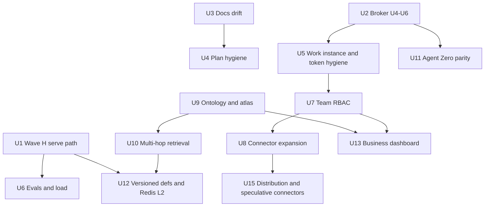

# Kurultai Program Roadmap - Plan

## Goal Capsule

- **Objective:** Anyone picking up Kurultai (Luke, a teammate, or an agent) can see in one document what is shipped, what is in flight, what comes next and what is deliberately later, with the evidence for each claim and the plan that owns the detail.
- **Authority:** the `Product Contract` requirements below; `ROADMAP.md` keeps the audience-stage framing (solo, team, company) and links here first; child plans in `docs/plans/` own unit-level detail; git history and GitHub issues are the status evidence.
- **Execution profile:** this plan is the program index. Each unit below is a workstream that is executed through its own child plan or issue. Landing this plan itself changes docs only.
- **Stop conditions:** any status that cannot be verified from git, a merged PR, an issue state or a file on `main` is labeled `unverified` rather than guessed; no unit starts paid model spend (see KTD3).
- **Baseline:** `origin/main` at 4442fd8, crate v0.7.0, researched 2026-10-05.

---

## Product Contract

### Summary

Kurultai is a local-first knowledge store for agents and humans: it indexes notes, chats, JSON exports and code checkouts into one SQLite store with hybrid search (FTS5 plus optional vectors), and serves it over CLI, a daemon with an embedded Brain UI, REST, and MCP. This plan sequences the whole program into Now, Next and Later workstreams, links every workstream to its child plan or issue, and classifies all 72 dated plan files in `docs/plans/` and `plans/` as done, active, stale, superseded or not started.

### Problem Frame

Planning has accumulated faster than it has been reconciled. `docs/plans/` holds 85 files (67 dated plans, 16 phase documents, `YEAR-1-MILESTONES.md` and an index) and `plans/` holds 6 more. Most dated plans have shipped but still carry `status: draft` or `status: implementation-ready`, or carry the retired `artifact_readiness` field, so frontmatter cannot answer "is this done". `ROADMAP.md` still lists closed issues as open (#101, #102) and says the product has 8 MCP tools when `src/mcp/server.rs` defines 16. `AGENTS.md` repeats the 8-tool figure and `SECURITY.md` names v0.1.0 as the supported version. Work is split across a public repo, an archived private repo, a public Agent Zero plugin repo and a host-deployed pair of instances, and no document ties them together.

### Requirements

**Roadmap content**

- R1. The roadmap lists every workstream as a unit with a stable U-ID, a time horizon (Now, Next, Later or Delivered), a status of done, in progress, next, later or blocked, and evidence for that status.
- R2. Each unit links its child plan or plans in `docs/plans/` and its open issues, so detail is never restated here.
- R3. Every dated plan in `docs/plans/` and `plans/` is classified exactly once in the appendix with evidence.
- R4. The roadmap covers ingestion sources, search quality and evals, the MCP surface, ontology, Hey messaging, deployment on server-001, the public/private repo split, the Agent Zero plugin, privacy and security, testing and CI, and docs.

**Truthfulness**

- R5. Every fact states only what was verified against the repo, `gh`, or a named file. Anything else is marked `unverified`.
- R6. Known documentation drift is recorded as work (U3, U4), not silently corrected inside unrelated edits.

**Repo conventions**

- R7. `ROADMAP.md` lists this plan first and keeps its existing content below. `docs/plans/INDEX.md` and the root `INDEX.md` Recent list are updated per the `AGENTS.md` index ritual, and `scripts/audit-agent-index.py` stays green.

### Success Criteria

- A new reader can name the three in-flight workstreams (U1, U2, U6) and the first Next item (U7) after reading only the Goal Capsule and the unit table.
- The stale-plan list in the appendix can be acted on without re-researching: each row names its evidence and the follow-up unit.

### Scope Boundaries

**Deferred to follow-up work**

- Editing the frontmatter of the stale plans, deleting the `plans/` duplicates, and correcting `ROADMAP.md` body drift, `AGENTS.md` and `SECURITY.md` (all owned by U3 and U4, one follow-up PR).
- Closing, relabeling or retitling GitHub issues.

**Not built (considered)**

- A machine-readable roadmap (YAML or JSON) generated from plan frontmatter. Plans carry no status field by contract, so a generator would have nothing authoritative to read; revisit if U4 adds a status convention.
- Dates or revenue targets. `docs/plans/YEAR-1-MILESTONES.md` already owns those and this plan does not restate them.

---

## Planning Contract

### Key Technical Decisions

- KTD1. **One program index, many child plans.** This file owns sequencing and status; child plans own implementation detail. Chosen over folding detail in because 67 existing plans already carry it, and `docs/plans/2026-08-12-003-feat-rival-gbrain-bartlett-hub-plan.md` shows the failure mode of a "canonical program plan" that goes stale in its own frontmatter.
- KTD2. **Status is derived from git and issues, recorded with a pointer.** Each unit cites a PR number, issue state or file path. Plans carry no status field by the artifact contract, so unit status lives in this body and is refreshed when a stage flips, matching the `ROADMAP.md` rule "update when a stage flips, not per PR".
- KTD3. **No paid model calls in any unit's verification.** Tests run FTS-only with `NullEmbedder` when `OPENROUTER_API_KEY` is unset (`CONCEPTS.md`, FTS-first). Eval and review spend, where a unit needs it, goes through the dedicated `orch` wrapper and the cheaper-model ceiling in the project's preferences. Hosted embeddings (pplx-embed, OpenRouter) are production configuration, not test inputs.
- KTD4. **Solo kernel stays SQLite; shared tier stays Postgres/pgvector** behind the `hub` feature flag, never a converted personal `store.db` (carried from `ROADMAP.md` Stage 2).
- KTD5. **Ontology writes are human-decided.** Agents propose through `ontology_propose`, humans decide in the Brain UI (carried from `ROADMAP.md` Stage 3; shipped as O3 #313).
- KTD6. **Brain visuals are not changed by roadmap work** without asking first (`AGENTS.md`). UI units here are scoped to function, data and performance.
- KTD7. **Public repo is the source of truth.** `duketopceo/kurultai-private` is archived and read-only; deploy recipes live in `deploy/server-001/` of the public repo; secrets live only in the host `.env`.

### Verified Current State

| Area | Verified state | Evidence |
|------|----------------|----------|
| Release | Crate v0.7.0 on `main`; tags v0.2.0 through v0.7.0 (v0.7.0 = 4442fd8) plus `v0.pre-brain-atlas` | `Cargo.toml`; `git tag`; release PR #415 |
| Open PRs | #418 README label and dep bump, #417 and #416 source-map-js bumps, #414 launch film v3 | `gh pr list --state open` |
| Open issues | 30; 29 are placed under the units that own them and #122 is the `ROADMAP.md` tracker | `gh issue list --state open` |
| Ingestion | Connectors: dayflow, pond, github (filesystem), inbox, json, markdown, registry; stub connectors removed in v0.5.0 debloat #377; remote `/ingest` behind a flag #406 | `src/connectors/`, #377, #406 |
| Embeddings | Local fastembed #84, OpenRouter, Perplexity `pplx-embed-v1` #400 | `src/embed/`, PRs |
| Search quality | RRF hybrid search, soft labels and trust lanes #86, gap-aware ask #401, supersede chains with `--as-of` #405, nightly consolidation sweep #407, zero-LLM ontology edge extraction #403 | PRs; `src/sweep.rs` |
| Evals | `evals/golden.json` with `kurultai eval` #350, `tests/evals_search.rs`, `scripts/recall-harness.py` #296 #297, Jev judge #351 #352 #354, Argus reviewer lane #353 | files, PRs |
| MCP surface | 16 tools: search, recall, cite, remember, ask, who_knows, promote, ontology_get, ontology_promote, ontology_propose, ontology_proposals, hey_threads, hey_read, hey_post, hey_react, hey_poll; stdio plus HTTP/SSE; device broker proxy U1-U3 #381 | `src/mcp/server.rs` (16 `TOOL_` constants) |
| Ontology | O1 entities and links #201, O2 scaffold #202, O3 proposals #313, Flowsint 2D board #319 #321 #322 | PRs |
| Hey | Board and agent identity #267 #268, repo and instance claims #274, admin kanban #334, MCP `hey_*` tools, `hey.md` | PRs; `hey.md` |
| Hub | HUB-1 scopes #192, HUB-2 Postgres #197, HUB-3 Railway transport #246, HUB-4 device keys and write log #247, HUB-5 ingest visibility #250, behind `KURULTAI_FEATURE_HUB` | PRs |
| Deployment | `deploy/server-001/` ported from the private repo #378; compose services `kurultai-personal` (8421), `kurultai-work` (8422), `landing`; image `kurultai:solo`; demo stack `docker-compose.demo.yml` #379 #388 #390 #391; `deploy-server-001.yml` deploys on push to `main` | files; PRs |
| Repo split | `duketopceo/kurultai-private`: PRIVATE and archived; `duketopceo/kurultai_people`: PUBLIC, active, last push 2026-09-30 | `gh repo view` |
| Agent Zero | In-repo `plugin/` shipped #234; separate `kurultai_people` repo exposes `kurultai_search`, `kurultai_recall`, `kurultai_cite`, merged PRs #2-#5 including a sync from the monorepo | `plugin/`, `gh` |
| CI | `ci.yml` jobs: agent-index, check, ui, macos-smoke, security, postgres-store, container-build; plus `argus-reviewer.yml`, `release.yml`, `deploy.yml`, `deploy-server-001.yml`; `self-hosted.yml` is disabled with `if: false` | `.github/workflows/` |

### Sequencing

Now units (U1-U6) have no mutual blockers except as drawn. Next units open once their named dependency is done or explicitly waived.

### Assumptions

- The `hub` feature flag stays default-off until U7 lands; team features are not user-visible on the hosted solo instances.
- `knowledge.shippedit.dev` remains the dogfood target. The `work` instance is not dogfooded yet (`AGENTS.md`); this is taken as the current state, not re-verified against the live host.
- The Devin agent may be using the main clone; nothing in this plan requires touching it.

### Risks

| Risk | Mitigation |
|------|------------|
| Roadmap status rots like earlier plans | KTD2 pointers make each row checkable in one command; U4 adds a refresh step when a release ships |
| llama-style resource pressure on server-001 when both instances index | unverified for this host; U5 records measured memory before enabling work dogfooding |
| Hosted API token exposure | U5 owns #333 token audit; deploy compose already refuses to start without secrets (`:?` guards, #386) |
| Closed issues referenced as open mislead planning | U3 corrects `ROADMAP.md` against live issue state |

---

## Implementation Units

| Unit | Title | Horizon | Status | Depends on |
|------|-------|---------|--------|------------|
| U1 | Wave H serve-path closeout | Now | in progress | none |
| U2 | Device broker U4-U6 | Now | in progress | none |
| U3 | Docs drift correction | Now | next | none |
| U4 | Plan frontmatter and duplicate hygiene | Now | next | U3 |
| U5 | Work instance dogfood and hosted token hygiene | Now | next | U2 for broker-keyed access |
| U6 | Evals, load and chaos upkeep | Now | in progress | U1 |
| U7 | Team RBAC and claim-level permissions | Next | next | U5 |
| U8 | Connector expansion | Next | next | U7 for scoped sources |
| U9 | Ontology primitives and atlas | Next | next | none |
| U10 | Multi-hop graph retrieval | Next | next | U9 |
| U11 | Agent Zero plugin parity | Next | next | U2 |
| U12 | Versioned definitions and Redis L2 cache | Later | later | U10, U1 |
| U13 | Business dashboard and Brain Explorer to 100% | Later | later | U7, U9 |
| U14 | Desktop Brain wrap | Later | later | none |
| U15 | Distribution, auth and speculative connectors | Later | later | U8 |
| U16 | Delivered: ingestion, retrieval and quality baseline | Delivered | done | none |
| U17 | Delivered: MCP surface | Delivered | done | none |
| U18 | Delivered: hub kernel and hosted deployment | Delivered | done | none |
| U19 | Delivered: Hey messaging and agent identity | Delivered | done | none |
| U20 | Delivered: release, CI and docs infrastructure | Delivered | done | none |
| U21 | Delivered: public/private repo split | Delivered | done | none |

### U1. Wave H serve-path closeout

- **Status:** in progress.
- **Goal:** finish the serve-path hardening queue so the Brain and API stay fast at real corpus size.
- **Child plans:** `docs/plans/2026-09-20-001-feat-wave-h-serve-path-plan.md`, `docs/plans/2026-09-15-002-feat-declarative-tier-policy-plan.md`.
- **Requirements:** R1, R2.
- **Evidence:** #364 client perf telemetry and #365 prepared `/api/graph` payload are merged; #325 and #324 are closed; #323 (version embedding and chunk representations for replayable re-embed) and #326 (durable reindex outbox) are open.
- **Files:** `src/store/`, `src/ingest/`, `src/daemon/`, `src/metrics.rs`, `tests/`.
- **Approach:**
  - Land #326 first: connector ingestion writes through a durable outbox so a crash mid-index can replay.
  - Land #323 second: embeddings and chunks carry a representation version so an embedder change (as with #400) triggers a replayable re-embed instead of a full reindex.
- **Test scenarios:**
  - Happy path: indexing a fixture directory records outbox rows and drains them to zero.
  - Failure path: killing the process mid-drain and restarting replays the remaining rows without duplicate atoms.
  - Integration: changing the configured embedder version marks existing chunks stale and re-embeds only those, covered in FTS-only mode by asserting the stale flag without a live embedder.
- **Verification:** `tests/chaos.rs` kill-mid-write case stays green; `cargo nextest run --locked` passes.

### U2. Device broker U4-U6

- **Status:** in progress.
- **Goal:** every agent on a machine reaches the hosted brain through one local broker with a per-chat minted key.
- **Child plan:** `docs/plans/2026-09-28-001-feat-device-broker-agent-onboarding-plan.md` (source brainstorm `docs/brainstorms/2026-09-28---device-broker-agent-onboarding-requirements.md`).
- **Requirements:** R1, R2.
- **Evidence:** #381 merged U1-U3 (`src/broker/`, `src/mcp/broker_stdio.rs`). U4 upstream identity stamping, U5 agent wiring with offline queue and U6 remote bootstrap and revocation are not confirmed on `main` (unverified: no PR title references them), though `src/broker/board.rs` already has a `/revoke` route, so part of U6 may exist. Issue #413 (mcp-bridge processes accumulate without parent-death reaping) is open and touches this surface.
- **Files:** `src/broker/`, `src/http/`, `src/mcp/init.rs`, `tests/`.
- **Approach:**
  - Confirm U4-U6 state by diffing the plan's unit list against `src/broker/`; implement only what is missing.
  - Fix #413 as part of U5: the stdio bridge exits when its parent exits.
- **Test scenarios:**
  - Happy path: boarding with agent, chat name and chat id returns a session key; a second boarding with the same chat id keeps identity and rotates the key.
  - Failure path: upstream unreachable queues a write in the outbox and flushes on reconnect.
  - Edge case: killing the parent agent leaves no orphaned bridge process (covers #413).
- **Verification:** broker tests pass offline; no upstream token appears in any generated agent config.

### U3. Docs drift correction

- **Status:** next.
- **Goal:** the top-level docs state what is true on `main`.
- **Child plans:** `docs/plans/phase-6-next-work-orders.md` (live queue), `docs/plans/YEAR-1-MILESTONES.md`.
- **Requirements:** R6.
- **Evidence of drift:**
  - `ROADMAP.md` lists #101 and #102 as open work; both are closed. It also cites "8 MCP tools"; `src/mcp/server.rs` defines 16.
  - `ROADMAP.md` names `docs/plans/2026-08-13-004-feat-brain-shape-algorithmic-ontology-plan.md` as the Brain gate with Slice C pending; the Flowsint board (#319) replaced that layout.
  - `AGENTS.md` says "Kurultai provides 8 tools".
  - `SECURITY.md` says the project is "v0.1.0".
  - #418 (README label fix) is open.
- **Files:** `ROADMAP.md`, `AGENTS.md`, `SECURITY.md`, `README.md`, `INDEX.md`.
- **Approach:** one docs PR that fixes each item against live evidence, plus a changelog row per touched folder `INDEX.md`.
- **Test expectation:** none -- documentation only.
- **Verification:** `python3 scripts/audit-agent-index.py` exits 0; every corrected count is re-derived from `src/mcp/server.rs` in the PR description.

### U4. Plan frontmatter and duplicate hygiene

- **Status:** next.
- **Goal:** plan files stop contradicting git.
- **Child plans:** every row marked `stale-status`, `superseded` or `duplicate` in the appendix.
- **Requirements:** R3, R6.
- **Evidence:** appendix rows owned by U4: 5 `stale-status`, 3 `superseded`, 2 `duplicate`, 1 `not-started` (11 rows); the other 4 `stale-status` rows are owned by U7, the `partial` row by U9 and the other `not-started` row by U14. The `artifact_readiness` field appears in 49 plans regardless of class.
- **Files:** the listed plan files, `plans/`, `docs/plans/INDEX.md`, `plans/INDEX.md`.
- **Approach:**
  - Remove stale `status:` fields from the stale-status rows, and the retired `artifact_readiness:` field from every plan that still carries it (49 files under `docs/plans/` at 2026-10-05, found by grep); add a one-line superseded-by pointer to superseded ones.
  - Delete the two `plans/` duplicates and update `plans/INDEX.md`; decide whether the remaining three `plans/` files move into `docs/plans/` or stay (Open Question 2).
- **Test expectation:** none -- documentation only.
- **Verification:** `scripts/audit-agent-index.py` exits 0; a grep for `^status:` under `docs/plans/` returns only plans still in flight.

### U5. Work instance dogfood and hosted token hygiene

- **Status:** next.
- **Goal:** the `work` instance on server-001 is used daily with the same retrieval quality as `personal`, and hosted credentials are audited.
- **Child plans:** `docs/plans/2026-09-16-001-feat-hey-admin-kanban-plan.md` (hosted redeploy slice); runbooks `deploy/server-001/INDEX.md`, `deploy/server-001/REINDEX-FROM-OTHER-REPOS.md`.
- **Requirements:** R4.
- **Evidence:** `deploy/server-001/docker-compose.kurultai.yml` defines `kurultai-work` on 8422 behind `work.shippedit.dev`; `AGENTS.md` records it as not dogfooded. Open issues: #333 (Cloudflare service token and stale token audit), #362 (bare UI host fails unhelpfully on a Cloudflare Access 302).
- **Files:** `deploy/server-001/`, `.github/workflows/deploy-server-001.yml`, `src/http/`.
- **Approach:**
  - Index a real work corpus into `kurultai-work` and run `scripts/recall-harness.py` against it using the MCP transport added in #297.
  - Complete the #333 audit; fix #362 with a human-readable response.
  - Keep secrets in the host `.env` at `/home/khan/kurultai` and always redeploy through `deploy/server-001/redeploy.sh`.
- **Test scenarios:**
  - Happy path: harness recall on the work corpus meets the same thresholds as `evals/golden.json` for personal.
  - Failure path: compose refuses to start with a missing secret (the `:?` guard).
  - Edge case: a bare UI host request behind Access returns an explanatory page, not a bare 302 (covers #362).
- **Verification:** harness run recorded in the PR; token audit list attached; no secret values appear in the PR.

### U6. Evals, load and chaos upkeep

- **Status:** in progress.
- **Goal:** retrieval quality and serve-path robustness are measured, repeatable and offline.
- **Child plans:** `docs/plans/2026-09-17-001-feat-retrieval-evals-harness-plan.md`, `docs/plans/2026-09-30-001-feat-load-chaos-harness-plan.md`, `docs/eval/gate0-rewrite.md`.
- **Requirements:** R1, R4.
- **Evidence:** `kurultai eval` and `evals/golden.json` shipped #350; `tests/evals_search.rs`, `tests/stress_http.rs` (earlier hardening work), `tests/chaos.rs`, `scripts/hammer.mjs`, `scripts/hammer-mcp.mjs` (the last three landed with #379) on `main`. Plan U6 (soak and report) is not confirmed: `scripts/hammer.mjs` contains a soak lane but no recorded report was found (unverified).
- **Files:** `evals/`, `src/eval/`, `scripts/`, `tests/`.
- **Approach:**
  - Grow the golden set with queries drawn from the competitive-sweep features (supersede, gap-aware ask) so those features have regression coverage.
  - Record a soak result for server-001 sizing once U1 lands.
  - Keep model-judged runs behind the Jev judge circuit breaker (#351) and out of CI (KTD3).
- **Test scenarios:**
  - Happy path: `--as-of` query returns the superseded atom only for dates before `superseded_at`.
  - Edge case: a gap-aware ask on an empty topic reports the gap and does not fabricate a citation.
  - Failure path: judge unavailable degrades to labels-only (the #351 breaker).
- **Verification:** `cargo nextest run --locked` passes without any API key.

### U7. Team RBAC and claim-level permissions

- **Status:** next.
- **Goal:** a second person joins a hub with a per-device key and sees only `team` and `company` atoms.
- **Child plans:** `docs/plans/2026-08-12-002-feat-tiered-access-atom-scope-plan.md` (HUB-1, done), `docs/plans/2026-08-12-001-feat-company-brain-hub-plan.md`, `docs/plans/2026-08-12-003-feat-rival-gbrain-bartlett-hub-plan.md`, `docs/plans/2026-07-25-009-feat-web-github-login-multiuser-plan.md`.
- **Requirements:** R1, R4.
- **Evidence:** HUB-1..5 merged; open: #115 (RBAC on search and ask), #188 (claim-level permissions), #79 (sign-in, owned by U15). `web/` Next.js and Clerk scaffold shipped but protected routes need keys.
- **Files:** `src/hub/`, `src/security/`, `src/store/`, `web/`, `tests/acceptance_visibility.rs`.
- **Approach:**
  - Enforce personal, promoted-shared and company visibility at query time for search, ask and recall, reusing the HUB-5 ingest-time tags.
  - Add claim-level permission so an excerpt cannot leave its source object's scope.
- **Test scenarios:**
  - Happy path: a team key sees team and company atoms and none tagged personal.
  - Failure path: a revoked device key is rejected on its next request.
  - Integration: an `ask` answer never cites an atom outside the caller's scope.
- **Verification:** acceptance suite AE1-AE5 stays green; `cargo nextest run --locked --features postgres` passes (CI job `postgres-store`).

### U8. Connector expansion

- **Status:** next.
- **Goal:** the highest-value organizational sources feed the brain under explicit access rules.
- **Child plans:** `docs/plans/2026-08-12-002-feat-config-not-code-adapters-plan.md` (adapter pattern, shipped), `docs/plans/2026-07-31-002-chore-phase6-atlas-gaps-plan.md`.
- **Requirements:** R4.
- **Evidence:** open issues #114 (Slack with channel allowlist), #134 (webhook runtime), #135 (Notion), #133 (structured source contract), #130 (schema and lineage catalog), #121 (more sources). `AGENTS.md` upstream data rule: cron-generated data flows into Kurultai through `src/connectors/`.
- **Files:** `src/connectors/`, `src/ingest/`, `tests/phase4_connectors_test.rs`, `tests/inbox_adapter_test.rs`.
- **Approach:**
  - Settle the structured source contract (#133) first; Slack, Notion and webhook connectors implement it.
  - Every new connector tags visibility at ingest (HUB-5) and must pass the sequester rule for noisy transcript sources.
- **Test scenarios:**
  - Happy path: a fixture Slack export ingests only allowlisted channels.
  - Edge case: a generated or minified file is skipped (pattern from #144).
  - Failure path: a malformed webhook payload is rejected and not queued.
- **Verification:** connector tests run on fixtures with no network.

### U9. Ontology primitives and atlas

- **Status:** next.
- **Goal:** the typed graph has complete primitives and the Brain can browse it by class and projection.
- **Child plans:** `docs/plans/2026-08-13-004-feat-brain-shape-algorithmic-ontology-plan.md` (partial), `docs/plans/2026-09-14-001-feat-ontology-flowsint-board-plan.md`, `docs/plans/2026-09-15-001-feat-ontology-board-delete-plan.md`, `docs/plans/2026-09-05-001-feat-brain-ux-ontology-dashboard-plan.md`.
- **Requirements:** R4.
- **Evidence:** O1 #201, O2 #202, O3 #313, board #319 #321 #322 and edge extraction #403 merged; #118 closed. Open: #116 (ontology primitives), #132 (promote to typed object with audit), #131 (typed edge index and bulk import), #128 (object class registry and corpus stats), #129 (projection views).
- **Files:** `src/ontology/`, `src/store/`, `src/http/`, `website/src/`.
- **Approach:** finish primitives and audit on promote, then the class registry and projection endpoints; the UI work stays within the Flowsint board (KTD5, KTD6).
- **Test scenarios:**
  - Happy path: promoting an atom to a typed object writes an audit row naming the decider.
  - Edge case: promoting the same atom twice is idempotent.
  - Failure path: `ontology_propose` without approval changes no entity.
- **Verification:** `tests/acceptance_ontology.rs` stays green.

### U10. Multi-hop graph retrieval

- **Status:** next.
- **Goal:** `ask` answers can cite through entities and links.
- **Child plans:** `docs/plans/2026-10-01-001-feat-competitive-feature-sweep-plan.md` (edge extraction U3, done); `docs/plans/2026-07-21-001-feat-search-retrieval-rrf-plan.md` (search baseline).
- **Requirements:** R4.
- **Evidence:** open #120; zero-LLM edge extraction at index time shipped #403, giving the graph the edges to traverse.
- **Files:** `src/query/`, `src/ontology/`, `src/synthesize/`, `tests/`.
- **Approach:** expand a bounded neighborhood from top-k hits along typed edges, then re-rank and cite each hop; keep the hop limit configurable and off by default until evals show gain.
- **Test scenarios:**
  - Happy path: a two-hop question over fixture entities cites both atoms.
  - Edge case: a cycle in the graph terminates at the hop limit.
  - Integration: golden-set queries with multi-hop answers improve recall without lowering single-hop scores.
- **Verification:** `kurultai eval` on the golden set shows no regression.

### U11. Agent Zero plugin parity

- **Status:** next.
- **Goal:** the Agent Zero plugin exposes the retrieval and memory surface agents actually use, and the two copies cannot drift.
- **Child plans:** `docs/plans/2026-07-25-006-feat-v1-agent-zero-batch-plan.md` (done); `docs/agent-zero/`.
- **Requirements:** R4.
- **Evidence:** `plugin/` in this repo (shipped #234) exposes 5 tools (`kurultai_ask`, `kurultai_remember`, `kurultai_search`, `kurultai_status`, `kurultai_who_knows`); the separate public repo `duketopceo/kurultai_people` exposes 3 (`kurultai_search`, `kurultai_recall`, `kurultai_cite`) and its PR #4 synced a "1.2.0 overhaul from dev monorepo". The two copies already diverge in tool set.
- **Files:** `plugin/`, `docs/agent-zero/`.
- **Approach:**
  - Decide which tool set is canonical and the sync direction, then add a check or documented step so the two copies cannot drift.
  - Add or drop tools only against a concrete Agent Zero use case (Open Question 3).
  - Route plugin traffic through the broker (U2) when running on a shared host.
- **Test expectation:** none for the sync decision -- documentation; plugin tool additions get Python tests under `plugin/` using a stub server.
- **Verification:** after the canonical set is chosen, the tool lists of `plugin/` and `kurultai_people` match at release time.

### U12. Versioned definitions and Redis L2 cache

- **Status:** later.
- **Goal:** knowledge definitions are versioned, and hot queries are cached for team scale.
- **Evidence:** open #119 (versioned or git-backed knowledge definitions) and #112 (Redis L2 hot-query cache). Neither has a child plan.
- **Dependencies:** U10 for definitions that retrieval consumes; U1 for cache invalidation on replayable ingest.
- **Approach:** write a child plan when started; measure with the U6 load harness before adding a cache, so the cache is justified by a measured miss cost.
- **Test expectation:** none -- later; test scenarios set in the child plan.
- **Verification:** child plan exists before any code.

### U13. Business dashboard and Brain Explorer to 100%

- **Status:** later.
- **Goal:** operators get analytics and controls, and the Brain Explorer reaches full drill-down.
- **Child plans:** `docs/plans/2026-09-25-001-feat-ui-ux-teardown-rebuild-plan.md` (done baseline).
- **Evidence:** open #138 (business dashboard), #137, #140, #139 (Explorer layouts, drill-down), #117 (interactive graph view). `ui-next` is the default `/ui/` surface (#387).
- **Constraint:** KTD6; ask before changing Brain visuals.
- **Test expectation:** none -- later; UI checks use the bounded `timeout -k 5s 180s node scripts/ui-smoke.mjs` form from `AGENTS.md`.
- **Verification:** `scripts/ui-smoke.mjs` passes and `scripts/build-ui.sh` output matches the embedded `ui/` (CI job `ui`).

### U14. Desktop Brain wrap

- **Status:** later.
- **Goal:** a thin native window over `/ui/`.
- **Child plan:** `docs/plans/2026-08-15-003-feat-desktop-brain-ui-wrap-plan.md`.
- **Evidence:** not started; no desktop shell directory and no related PR on `main`. Only #222 (sequence docs) mentions it.
- **Test expectation:** none -- later.
- **Verification:** the plan's own U1-U4.

### U15. Distribution, auth and speculative connectors

- **Status:** later.
- **Goal:** public distribution and optional sources.
- **Evidence:** #10 (launch umbrella) is closed while its launch film PR #414 is open and `ROADMAP.md` still lists "crates.io, Homebrew, Show HN"; open #79 (Sign in with Anthropic), #78 (CodeGraph connector), #4 (AppFlowy page fetcher). `release.yml` already attaches binaries to tags.
- **Approach:** open a fresh distribution issue replacing the closed #10 when the launch is scheduled (Open Question 4).
- **Test expectation:** none -- later.
- **Verification:** per child issue.

### U16. Delivered: ingestion, retrieval and quality baseline

- **Status:** done.
- **Child plans:** `docs/plans/2026-07-21-001-feat-search-retrieval-rrf-plan.md`, `docs/plans/2026-07-24-001-feat-phase-4-pond-dayflow-connectors-plan.md`, `docs/plans/2026-07-25-001-feat-phase-4-github-connector-plan.md`, `docs/plans/2026-07-25-009-feat-phase-5-local-embeddings-plan.md`, `docs/plans/2026-07-25-011-feat-quality-labeling-trust-lanes-plan.md`, `docs/plans/2026-07-29-001-feat-kurultai-export-import-plan.md`, `docs/plans/2026-10-01-001-feat-competitive-feature-sweep-plan.md`, `docs/plans/2026-10-02-001-feat-supersede-bitemporal-plan.md`.
- **Evidence:** see the Verified Current State table rows Ingestion, Embeddings and Search quality.
- **Test expectation:** none -- delivered; regression coverage lives in U6.
- **Verification:** `cargo nextest run --locked` on `main`.

### U17. Delivered: MCP surface

- **Status:** done.
- **Child plans:** `docs/plans/2026-07-25-010-feat-phase5-multi-agent-mcp-init-plan.md`, `docs/plans/2026-07-30-002-feat-phase6-mcp-http-sse-plan.md`, `docs/plans/2026-07-23-001-feat-phase-3-synthesis-interface-plan.md`.
- **Evidence:** 16 tools in `src/mcp/server.rs`; `kurultai init --agent <cursor|claude|codex|hermes|all>` wires clients; HTTP/SSE endpoint at `/mcp`; hosted instances exposed as separate MCP servers.
- **Test expectation:** none -- delivered; `tests/acceptance_mcp.rs` and `scripts/hammer-mcp.mjs` cover it.
- **Verification:** `tests/acceptance_mcp.rs` green.

### U18. Delivered: hub kernel and hosted deployment

- **Status:** done.
- **Child plans:** `docs/plans/2026-08-12-002-feat-tiered-access-atom-scope-plan.md`, `docs/plans/2026-08-13-003-feat-hub2-postgres-store-plan.md`, `docs/plans/2026-08-15-001-feat-hub3-railway-transport-plan.md`, `docs/plans/2026-08-15-002-feat-hub4-agent-ids-write-log-plan.md`.
- **Evidence:** HUB-1..5 merged; `deploy/server-001/` (host `server-001`, path `/home/khan/kurultai`): compose services `kurultai-personal`, `kurultai-work`, `landing`, with `cloudflared` supplied by the bartlett project rather than this compose file (#386); `redeploy.sh` passes `--env-file`; `deploy-server-001.yml` runs SSH deploy and reindex on push to `main` under the `production` environment; `sync-and-reindex-repos.sh` mirrors `duketopceo/*` to `/home/khan/kurultai-repos`; demo stack `kurultai-demo` isolated on a fixture corpus (#379). `docs/deploy/railway-hub.md` covers the Railway transport.
- **Test expectation:** none -- delivered.
- **Verification:** CI `container-build` and `postgres-store` jobs.

### U19. Delivered: Hey messaging and agent identity

- **Status:** done.
- **Child plans:** `docs/plans/2026-09-03-001-feat-agent-message-board-plan.md`, `docs/plans/2026-09-04-001-feat-dogfood-retrieval-board-ui-plan.md`, `docs/plans/2026-09-05-002-feat-brain-first-principles-astra-plan.md`, `docs/plans/2026-09-16-001-feat-hey-admin-kanban-plan.md`.
- **Evidence:** board and identity #267 #268, device-code login #282, Cloudflare Access JWT acceptance #284, per-device broker #381, `hey_*` MCP tools, `hey.md`. Identity doctrine: codename is the product family, `instance_id` is the concurrent seat (`AGENTS.md`).
- **Test expectation:** none -- delivered.
- **Verification:** `tests/acceptance_http.rs`.

### U20. Delivered: release, CI and docs infrastructure

- **Status:** done.
- **Child plans:** `docs/plans/2026-08-16-001-chore-agent-repo-index-plan.md`, `docs/plans/2026-09-01-001-chore-final-stretch-to-v050-team-plan.md`, `docs/plans/2026-08-13-002-feat-v041-production-release-plan.md`.
- **Evidence:** CI jobs listed in the Verified Current State table; `scripts/audit-agent-index.py` gates the INDEX.md tree; privacy and security surfaces: scoped API tokens (#223), write-policy containment (#221), `cargo audit` job, `SECURITY.md` (drift tracked in U3).
- **Test expectation:** none -- delivered.
- **Verification:** `.github/workflows/ci.yml` green on `main`.

### U21. Delivered: public/private repo split

- **Status:** done.
- **Evidence:** `duketopceo/kurultai-private` is PRIVATE and archived; its description names the public repo as canonical; server-001 deploy recipes were ported to `deploy/server-001/` in #378 on 2026-09-29; `AGENTS.md` records it as archived and read-only. `duketopceo/kurultai_people` stays a separate public repo (U11).
- **Test expectation:** none -- delivered.
- **Verification:** `gh repo view duketopceo/kurultai-private --json isArchived` returns true.

---

## Verification Contract

| Gate | Command | Applies to | Spend |
|------|---------|-----------|-------|
| Agent index | `python3 scripts/audit-agent-index.py` | every unit that touches docs or folders | none |
| Format | `cargo fmt --all -- --check` | code units | none |
| Lint | `cargo clippy --all-targets -- -D warnings` | code units | none |
| Tests | `cargo nextest run --locked` | code units | none; FTS-only, no API key |
| Postgres | `cargo nextest run --locked --features postgres` | U7 and hub units | none |
| Website | `cd website && npm ci && npm test` | UI units | none |
| UI embed | `bash scripts/build-ui.sh` then confirm `ui/` matches | UI units | none |
| Dependency audit | `cargo audit` | every code unit | none |
| UI smoke | `timeout -k 5s 180s node scripts/ui-smoke.mjs` | UI units | none |

Evidence for any status in this plan must be re-checkable with `git log`, `gh pr list --state merged`, `gh issue view <n>` or a file read.

## Definition of Done

- This plan: file present under `docs/plans/`, `ROADMAP.md` lists it first, indexes updated, CI-equivalent checks run with their exit codes recorded in the PR.
- Per unit: its Verification line passes, its status in this document is updated in the same PR that changes it, and no abandoned-attempt code remains in the diff.
- Roadmap overall: U3 and U4 landed so no plan or top-level doc contradicts git.

## Open Questions

Deferred (none block this plan):

1. Should server-001 sizing (memory with both instances indexing) be measured by U5 or U6? Default assumption: U6 records it, U5 consumes it.
2. Do the three non-duplicate files in `plans/` (heavier-science-theme, cortex-titanic fix, connector-noise fix) move into `docs/plans/` or get deleted? Default: move the shipped ones, delete the superseded.
3. Which tool set is canonical for the Agent Zero plugin: the in-repo five or the external three? Default: the union, added in whichever copy lacks them, once a use case needs it.
4. When the open-source launch is scheduled, does it get a new umbrella issue? #10 is closed.

## Sources

- Repo files: `ROADMAP.md`, `AGENTS.md`, `CONCEPTS.md`, `SECURITY.md`, `docs/plans/INDEX.md`, `docs/plans/YEAR-1-MILESTONES.md`, `docs/plans/phase-6-next-work-orders.md`, `deploy/server-001/`, `.github/workflows/`, `src/mcp/server.rs`, `src/connectors/`.
- GitHub: `gh pr list --state merged --limit 200` (back to #167), `gh pr list --state open`, `gh issue list --state open`, `gh repo view` for `duketopceo/kurultai-private` and `duketopceo/kurultai_people`.

---

## Appendix

### Plan classification

Classes: `done` (shipped, evidence cited); `active` (in flight); `stale-status` (shipped or overtaken, but frontmatter or location says otherwise); `superseded` (replaced by later work); `partial` (part shipped, part replaced); `not-started`; `duplicate`. The last column names the unit that owns follow-up. Phase work-order and closeout documents (`phase-*.md`, 16 files) are not classified individually: the `phase-N-complete.md` and `phase-N-closeout.md` files record that phases 1, 2, 4, 5 and 7 closed, and `phase-6-next-work-orders.md` is the live queue this plan complements.

| Plan | Class | Evidence | Unit |
|------|-------|----------|------|
| `docs/plans/2026-07-21-001-feat-search-retrieval-rrf-plan.md` | done | Phase 2 RRF search shipped (commit 'U5 mark Phase 2 RRF search shipped'); `docs/plans/phase-2-complete.md` | U16 |
| `docs/plans/2026-07-21-002-feat-phase2-testing-gates-plan.md` | done | Phase 2 closeout #58; `docs/plans/phase-2-closeout.md` | U20 |
| `docs/plans/2026-07-23-001-chore-phase2-closeout-plan.md` | done | Phase 2 closeout #58; `phase-2-complete.md` | U20 |
| `docs/plans/2026-07-23-001-feat-phase-3-synthesis-interface-plan.md` | done | feat: Phase 3 synthesis & interface #7 | U17 |
| `docs/plans/2026-07-23-002-chore-phase1-lfg-closeout-plan.md` | done | Phase 1 LFG closeout; `phase-1-complete.md` | U20 |
| `docs/plans/2026-07-24-001-feat-phase-4-pond-dayflow-connectors-plan.md` | done | feat: Phase 4 Dayflow + Pond connectors #62 | U16 |
| `docs/plans/2026-07-25-001-feat-phase-4-github-connector-plan.md` | done | feat(#8) GitHub filesystem code connector; `src/connectors/github.rs` | U16 |
| `docs/plans/2026-07-25-002-chore-phase4-lfg-closeout-plan.md` | done | Phase 4 closeout; `phase-4-complete.md` | U20 |
| `docs/plans/2026-07-25-003-feat-phase-5-daemon-poll-plan.md` | done | feat(#9) daemon poll loop #65 | U16 |
| `docs/plans/2026-07-25-004-feat-phase-5-notify-watch-plan.md` | done | feat: notify filesystem watch #66 | U16 |
| `docs/plans/2026-07-25-005-feat-v1-personal-installer-plan.md` | done | feat: v1 Agent Zero batch #77 (#72-#76) | U19 |
| `docs/plans/2026-07-25-006-feat-v1-agent-zero-batch-plan.md` | done | feat: v1 Agent Zero batch #77; plugin shipped #234 | U19 |
| `docs/plans/2026-07-25-007-chore-readme-install-cleanup-plan.md` | done | chore: cargo-first install + README redesign | U20 |
| `docs/plans/2026-07-25-008-fix-pr77-coderabbit-followup-plan.md` | done | Follow-up to #77; closed by `phase-5-closeout.md` | U20 |
| `docs/plans/2026-07-25-009-feat-phase-5-local-embeddings-plan.md` | done | feat: Phase 5 local ONNX embeddings (fastembed) #84 | U16 |
| `docs/plans/2026-07-25-009-feat-web-github-login-multiuser-plan.md` | done | feat(web): Clerk GitHub login + multi-user model; `web/` scaffold shipped | U7 |
| `docs/plans/2026-07-25-010-feat-phase5-multi-agent-mcp-init-plan.md` | done | feat(mcp): wire Claude Code and Codex via init --agent #83 | U17 |
| `docs/plans/2026-07-25-011-feat-quality-labeling-trust-lanes-plan.md` | stale-status | Shipped #86 (quality labeling); frontmatter still `status: draft`; residual findings in `docs/residual-review-findings/` | U4 |
| `docs/plans/2026-07-26-001-feat-website-wow-brain-hermes-mcp-plan.md` | done | feat: embedded daemon brain UI + Hermes MCP | U17 |
| `docs/plans/2026-07-26-002-chore-phase5-lfg-closeout-plan.md` | done | chore: Phase 4 residual + Phase 5 LFG closeout #97 | U20 |
| `docs/plans/2026-07-26-002-feat-v0.3.0-unification-plan.md` | stale-status | v0.3.0 tag exists; frontmatter still `status: implementation-ready`; near-duplicated in `plans/` (the copies differ) | U4 |
| `docs/plans/2026-07-26-003-chore-phase5-milestone-finish-plan.md` | done | Closed by #97 and `phase-5-complete.md` | U20 |
| `docs/plans/2026-07-26-003-chore-pr-window-cleanup-followup-plan.md` | done | chore: Jul 25-26 PR window cleanup #99 | U20 |
| `docs/plans/2026-07-26-003-feat-phase-6-yurt-terminal-art-plan.md` | done | feat(cli): Phase 6 yurt terminal art #100 | U20 |
| `docs/plans/2026-07-29-001-feat-kurultai-export-import-plan.md` | done | feat(cli): export/import .kurultai packs; `src/export/` | U16 |
| `docs/plans/2026-07-29-002-feat-brain-solar-layout-plan.md` | superseded | Galaxy/solar layout removed in #200; AGENTS.md calls it deprecated | U4 |
| `docs/plans/2026-07-29-003-feat-brain-electric-pulse-plan.md` | superseded | Visual language replaced by neuron motif #315 and lit spheres #291 | U4 |
| `docs/plans/2026-07-30-001-chore-phase6-next-work-orders-plan.md` | done | Phase 6 backend + Brain UI consolidation #141; live queue doc is `phase-6-next-work-orders.md` | U3 |
| `docs/plans/2026-07-30-002-feat-phase6-mcp-http-sse-plan.md` | done | HTTP/SSE transport #125, `mcp_http` flag #196, first in v0.4.1; `src/mcp/` | U17 |
| `docs/plans/2026-07-30-003-feat-phase6-metrics-thin-plan.md` | done | Thin metrics shipped (7/7 boxes ticked); #102 closed; `src/metrics.rs` | U16 |
| `docs/plans/2026-07-31-001-feat-phase6-soft-labels-plan.md` | done | Soft labels shipped (6/6 boxes ticked) | U16 |
| `docs/plans/2026-07-31-002-chore-phase6-atlas-gaps-plan.md` | done | Atlas-gap work orders written (5/5 boxes); gap issues #128-#133 remain open | U9 |
| `docs/plans/2026-08-08-001-chore-cleanup-v030-branches-plan.md` | stale-status | Cleanup executed #183; frontmatter still `status: implementation-ready`; duplicated in `plans/` | U4 |
| `docs/plans/2026-08-12-001-chore-phase6-next-queue-plan.md` | done | docs: Phase 6 next queue #191; HUB waves shipped | U3 |
| `docs/plans/2026-08-12-001-feat-company-brain-hub-plan.md` | stale-status | HUB-1..5 shipped (#192,#197,#246,#247,#250); frontmatter carries retired `artifact_readiness`; Workers step not started | U7 |
| `docs/plans/2026-08-12-001-feat-nimrod-shared-brain-path-plan.md` | stale-status | Gap program largely realized by HUB-1..5 and #190; open remainder is #115/#188; carries retired `artifact_readiness` | U7 |
| `docs/plans/2026-08-12-002-feat-config-not-code-adapters-plan.md` | stale-status | Shipped #194 (inbox, loopback ingest); frontmatter still `status: draft` | U4 |
| `docs/plans/2026-08-12-002-feat-gbrain-patterns-rust-port-plan.md` | stale-status | Pattern palette; doctor (#214) and scopes (#192) landed; carries retired `artifact_readiness` | U7 |
| `docs/plans/2026-08-12-002-feat-tiered-access-atom-scope-plan.md` | done | HUB-1 #192 | U18 |
| `docs/plans/2026-08-12-003-feat-rival-gbrain-bartlett-hub-plan.md` | stale-status | Self-described canonical program plan for the hub; HUB-1..5 done; superseded as program index by this plan; carries retired `artifact_readiness` | U7 |
| `docs/plans/2026-08-13-001-feat-solo-docs-ondevice-setup-plan.md` | done | feat(cli): `init --docs` #195 | U16 |
| `docs/plans/2026-08-13-002-feat-v041-production-release-plan.md` | done | v0.4.1 production prep #196; tag v0.4.1 | U20 |
| `docs/plans/2026-08-13-003-feat-hub2-postgres-store-plan.md` | done | HUB-2 #197; CI job `postgres-store` | U18 |
| `docs/plans/2026-08-13-004-feat-brain-shape-algorithmic-ontology-plan.md` | partial | O1 #201, O2 #202, brain-shape FDG #200 shipped; Slice C typed-hierarchy layout replaced by the Flowsint 2D board #319; ROADMAP.md still points at it as the Brain gate | U9 |
| `docs/plans/2026-08-15-000-chore-wave-g-railway-sequence-plan.md` | done | Wave G sequence docs #222; HUB-3/4/5 shipped | U18 |
| `docs/plans/2026-08-15-001-feat-hub3-railway-transport-plan.md` | done | HUB-3 #246; `docs/deploy/railway-hub.md` | U18 |
| `docs/plans/2026-08-15-002-feat-hub4-agent-ids-write-log-plan.md` | done | HUB-4 #247, admin CLI #223 | U18 |
| `docs/plans/2026-08-15-003-feat-desktop-brain-ui-wrap-plan.md` | not-started | No Tauri/desktop code and no PR on main; only the sequence doc #222 mentions it | U14 |
| `docs/plans/2026-08-16-001-chore-agent-repo-index-plan.md` | done | INDEX.md tree #224; CI job `agent-index` | U20 |
| `docs/plans/2026-09-01-001-chore-final-stretch-to-v050-team-plan.md` | done | v0.5.0 #253 | U20 |
| `docs/plans/2026-09-01-002-chore-v050-debloat-gated-auto-plan.md` | done | #377 (v0.5.0 first-cut debloat) | U16 |
| `docs/plans/2026-09-03-001-feat-agent-message-board-plan.md` | done | Requirements #266; implemented via #267/#268 | U19 |
| `docs/plans/2026-09-04-001-feat-dogfood-retrieval-board-ui-plan.md` | done | #267, #268 (pond sequester + hey board slice) | U19 |
| `docs/plans/2026-09-05-001-feat-brain-ux-ontology-dashboard-plan.md` | done | #272 Brain UX ontology promote + dashboard chrome | U9 |
| `docs/plans/2026-09-05-002-feat-brain-first-principles-astra-plan.md` | done | #292 label LOD + A2A chatboard | U19 |
| `docs/plans/2026-09-12-001-feat-brain-neuron-motif-plan.md` | done | #315 neuron motif | U20 |
| `docs/plans/2026-09-14-001-feat-ontology-flowsint-board-plan.md` | done | #319 (closes #316) | U9 |
| `docs/plans/2026-09-15-001-feat-ontology-board-delete-plan.md` | done | #321, follow-ups #322 | U9 |
| `docs/plans/2026-09-15-002-feat-declarative-tier-policy-plan.md` | done | #328 (closes #325) | U1 |
| `docs/plans/2026-09-16-001-feat-hey-admin-kanban-plan.md` | done | #334 (admin lane, kanban, connect flow) | U19 |
| `docs/plans/2026-09-17-001-feat-retrieval-evals-harness-plan.md` | done | #350; `evals/golden.json`, `tests/evals_search.rs` | U6 |
| `docs/plans/2026-09-20-001-feat-wave-h-serve-path-plan.md` | active | Frontmatter `Status: active`; #364 and #365 merged; #323 and #326 open | U1 |
| `docs/plans/2026-09-25-001-feat-ui-ux-teardown-rebuild-plan.md` | done | #372, #374, #387 (ui-next is default `/ui/`) | U20 |
| `docs/plans/2026-09-28-001-feat-device-broker-agent-onboarding-plan.md` | active | U1-U3 merged in #381 (`src/broker/`, `src/mcp/broker_stdio.rs`); U4-U6 not confirmed on main | U2 |
| `docs/plans/2026-09-30-001-feat-load-chaos-harness-plan.md` | active | `scripts/hammer.mjs`, `scripts/hammer-mcp.mjs`, `tests/chaos.rs` landed with #379; U6 soak report not confirmed (unverified) | U6 |
| `docs/plans/2026-10-01-001-feat-competitive-feature-sweep-plan.md` | done | U1-U5 via #400, #401, #403, #405, #407; wrap #408 | U16 |
| `docs/plans/2026-10-02-001-feat-supersede-bitemporal-plan.md` | stale-status | Shipped #405 (schema v17, `--as-of`); frontmatter still `status: draft` | U4 |
| `plans/2026-07-25-heavier-science-theme.md` | not-started | `status: proposed`, author Antigravity; no merged PR or commit matching it found (`git log --grep=science`); unverified | U4 |
| `plans/2026-07-26-002-feat-v0.3.0-unification-plan.md` | duplicate | Same name as the `docs/plans/` file; the two copies differ, keep `docs/plans/` | U4 |
| `plans/2026-07-30-001-fix-brain-cortex-titanic-plan.md` | superseded | Cortex rendering fix; rendering since rewritten (#200, #273 revert, #359) | U4 |
| `plans/2026-08-02-001-fix-connector-generated-file-noise-plan.md` | done | exclude generated/minified files from indexing #144, follow-up fix #182 | U16 |
| `plans/2026-08-08-001-chore-cleanup-v030-branches-plan.md` | duplicate | Duplicate of the `docs/plans/` file of the same name; work done #183 | U4 |

Totals: 52 done, 9 stale-status, 3 superseded, 3 active, 2 duplicate, 1 partial, 2 not-started (total 72).
