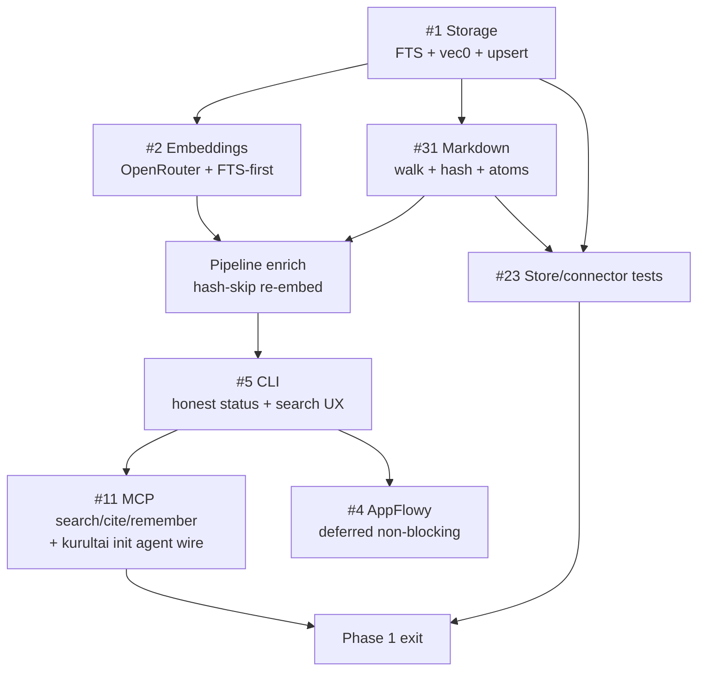

# CE Plan: Phase 1 Work Orders

**Tracking:** [#42](https://github.com/duketopceo/kurultai/issues/42)  
**Audience:** Developer (CLI + MCP)  
**Master plan:** [#27](https://github.com/duketopceo/kurultai/issues/27)  
**Doctrine:** [#37](https://github.com/duketopceo/kurultai/issues/37) — SQL brain, `AgentAtomView`, token budget  
**Upstream:** [docs/upstream-inspiration.md](../upstream-inspiration.md) · [#40](https://github.com/duketopceo/kurultai/issues/40)

---

## Goal

Ship a local end-to-end loop:

```
markdown folder → KnowledgeAtom → SQLite (FTS + vec) → CLI search → MCP search/cite/remember
```

**Exit criteria (Phase 1 done):**

1. `kurultai index --full` indexes a fixture `.md` vault into a real store
2. `kurultai search "<known phrase>"` returns ranked hits (FTS; vector when key present)
3. MCP `search` returns `AgentAtomView` excerpts (never full `content` by default)
4. CI green: fmt, clippy `-D warnings`, test `--locked`, audit, macOS smoke

---

## Assumptions (stated)

| # | Assumption | If wrong |
|---|------------|----------|
| A1 | Framework (#18/#19), env paths (#29/#32), MCP **contract** (#36), doctrine (#37) are done on `main` | Re-baseline before coding |
| A2 | **Raw-first atoms** in Phase 1 — no LLM distillation at index time (`summary` can = truncated content) | Distillation moves to Phase 2/3 (#12/#7) |
| A3 | **FTS-first boot** — search works without API key; vectors only when `OPENROUTER_API_KEY` set | Dev never blocked on spend |
| A4 | AppFlowy (#4) is **in Phase 1 sequence but not blocking exit** — after markdown E2E | Solo can ship without AppFlowy auth |
| A5 | Full RRF fusion + rerank is **Phase 2 (#6)**; Phase 1 ships FTS + vector as separate store methods; CLI may call FTS-only or naive merge | Don’t expand #1 into full #6 |
| A6 | sqlite-vec loads via `rusqlite` bundled + extension; CI Linux + macOS both load | If load fails, document + feature-flag vec |

---

## Current state (code)

| Component | Status | Gap |
|-----------|--------|-----|
| `App` / CLI shell | ✅ Wired | Index/search call stubs that no-op |
| `SqliteVecStore` | 🚧 Open + migrate + count/delete | `upsert` / `vector_search` / `fts_search` stubs |
| Migrations v1 | ✅ `knowledge_atoms` table | No FTS5, no `vec0`, no `content_hash`, no `store_meta` |
| `OpenRouterEmbedder` | 🚧 Returns zero vectors | Real HTTP + zero-vector guard |
| `MarkdownConnector` | 🚧 `init` only | `full_sync` / `poll` empty |
| `IndexPipeline` | ✅ Orchestration | Works once store/embed/connector real |
| MCP | 🚧 Traits only | No stdio server |
| `AgentAtomView` | ✅ `src/brain/` | Unused until MCP/CLI formats results |

---

## Build sequence



| Step | Issue | Blocks | Parallel with |
|------|-------|--------|---------------|
| 1 | **#1** Storage | Everything that persists | — |
| 2a | **#2** Embeddings | Vector arm of search | #31 (after #1 schema) |
| 2b | **#31** Markdown | E2E index | #2 |
| 3 | Pipeline polish | Hash-skip, batch embed | — |
| 4 | **#5** CLI | Human verify path | #23 tests |
| 5 | **#11** MCP slice | Agent verify path | Installer scripts |
| 6 | **#4** AppFlowy | Not exit-blocking | After #5 green |
| ∞ | **#23** Tests | Each step adds tests | Continuous |

---

## Work order specs

### 1. [#1 Storage — SqliteVecStore](https://github.com/duketopceo/kurultai/issues/1)

**Upstream:** Depend [sqlite-vec](https://github.com/asg017/sqlite-vec); inspire [layer0](https://github.com/amajorai/layer0), [kb-mcp](https://github.com/alphabet-h/kb-mcp).

**Deliverables**

| Item | Detail |
|------|--------|
| Migration v2 | `content_hash TEXT`, `store_meta(key,value)`, FTS5 virtual table `atoms_fts`, `vec0` table `atoms_vec` |
| Load extension | On `SqliteVecStore::open`, load sqlite-vec; fail loud if vec required and unloadable |
| `upsert` | Insert/update atom; sync FTS row; write embedding blob to `vec0` when present and non-zero |
| `upsert_batch` | Single transaction |
| `fts_search` | BM25 over title/summary/content (heading weight later in #6) |
| `vector_search` | KNN via `vec0`; empty if no vectors |
| `delete_source` | Cascade FTS + vec rows |
| Meta | Persist `embed_model`, `embed_dim`, schema version; refuse mixed dim |

**Out of scope:** RRF fusion SQL (#6), age decay, graph tables.

**Verify**

```
cargo test store::
# tempdir: upsert → get by id → fts hit → vector hit (fixture vectors) → delete_source → count 0
```

**Success:** All five issue #1 test scenarios pass; no zero-vector written to `vec0`.

---

### 2. [#2 Embeddings — OpenRouter](https://github.com/duketopceo/kurultai/issues/2)

**Upstream:** inspire [layer0](https://github.com/amajorai/layer0) provider trait.

**Deliverables**

| Item | Detail |
|------|--------|
| HTTP | `POST https://openrouter.ai/api/v1/embeddings` via `reqwest` |
| Batch | Chunk ≤32 texts per request |
| Config | `embed.model`, `embed.dimension` (default `openai/text-embedding-3-large` / 3072) |
| Retry | 429/5xx exponential backoff (3 tries) |
| FTS-first | Missing key → `NullEmbedder` (or skip embed) — **never** upsert all-zero vectors |
| Guard | Reject near-zero-norm vectors at upsert boundary |

**Out of scope:** Local ONNX (Phase 5 #9).

**Verify**

```
# Unit: mock httptest# Integration (manual / opt-in): OPENROUTER_API_KEY=… cargo test -- --ignored embed::live
# Dev without key: kurultai index still fills FTS; status says "embedder: none"
```

**Success:** Issue #2 scenarios 1–5; A3 holds (no key → FTS still works).

---

### 3. [#31 Markdown connector](https://github.com/duketopceo/kurultai/issues/31)

**Upstream:** inspire [kb-mcp](https://github.com/alphabet-h/kb-mcp), [mdvault](https://github.com/sderosiaux/mdvault), [sqmd](https://github.com/itkoren/sqmd).

**Deliverables**

| Item | Detail |
|------|--------|
| Walk | Recursive `**/*.md` under `root_path` (respect `validate_readable_path`) |
| Parse | Optional YAML frontmatter → title/tags; body → content |
| Chunk | Split on `##`/`###`; context prefix `[relpath > title > heading]`; max ~400 words (mdvault) |
| ID | `sha256(source + source_id + content_hash)` stable |
| `full_sync` | All files → atoms |
| `poll` | mtime/hash skip; only changed files |
| Raw-first | `summary` = first ~280 chars of body until distillation exists |

**Fixture:** `tests/fixtures/vault/` with 3–5 notes + known phrase.

**Out of scope:** Wikilink graph, Obsidian app, live `notify` watcher (nice-to-have after poll works).

**Verify**

```
kurultai index --full   # against fixture config
kurultai search "KNOWN_PHRASE"
# assert ≥1 hit with correct source_id path
```

**Success:** Acceptance checklist on #31 all checked.

---

### 4. Pipeline polish (between #31 and #5)

Not a separate issue — land in #1/#2/#31 PRs as needed.

| Item | Detail |
|------|--------|
| Hash-skip | If `content_hash` unchanged and embedding exists → skip `embed()` |
| Batch embed | `embed_batch` in pipeline instead of per-atom loop |
| Progress | Already partially in CLI; keep `IndexStats` honest |

---

### 5. [#5 CLI wire-up](https://github.com/duketopceo/kurultai/issues/5)

**Upstream:** inspire [recall](https://github.com/pratikgajjar/recall) CLI ergonomics.

**Note:** Skeleton exists (`main.rs` → `App`). This WO completes honesty + UX.

**Deliverables**

| Item | Detail |
|------|--------|
| `index` / `index --full` | Real atoms in DB (depends #1+#31) |
| `search` | Prefer FTS; if query embedded, also show vector hits (naive concat OK; RRF = #6) |
| `status` | Per **registered** source only; atom counts; embedder mode (live / none); env + path |
| `init` | Write `Config` TOML shape matching Rust types (if not already from #32) |
| Errors | Invalid config → clear `KurultaiError` message |

**Verify:** Issue #5 scenarios 1–5 against fixture vault.

---

### 6. [#11 MCP + installer](https://github.com/duketopceo/kurultai/issues/11) — Phase 1 slice

**Upstream:** Depend `rmcp`; inspire [Stratum](https://github.com/DakodaStemen/Stratum), [kb-mcp](https://github.com/alphabet-h/kb-mcp); integrate [smithery](https://github.com/smithery-ai/cli).

**Phase 1 scope (narrow — full #11 is large):**

| In | Out (later / Phase 3) |
|----|------------------------|
| stdio MCP server binary path (`kurultai mcp`) | Docker / docker-compose |
| Tools: `search`, `cite`, `remember` | Full `ask` synthesis (#7) |
| Return `AgentAtomView` JSON | HTTP transport |
| `kurultai init --agent cursor` writes mcp.json | Windows installer polish |
| Stub `ask` → “use search” or thin FTS synthesis | who_knows, caching layer |

**Verify**

```
# Cursor / Claude: MCP search returns excerpt ≤ DEFAULT_EXCERPT_CAP
# remember creates atom with source=agent
```

**Success:** Agent can search indexed vault without reading files.

---

### 7. [#4 AppFlowy](https://github.com/duketopceo/kurultai/issues/4) — deferred non-blocking

**When:** After #5 green.  
**Minimum:** REST list pages → raw atoms; skip if no token.  
**Does not block** Phase 1 exit criteria.

---

### 8. [#23 Testing — Phase 1 gates](https://github.com/duketopceo/kurultai/issues/23)

| Add with | Tests |
|----------|-------|
| #1 | Store integration (temp DB) |
| #2 | Embedder unit + mock HTTP |
| #31 | Fixture vault → atoms |
| #5 | CLI smoke via `assert_cmd` or `App` API |
| #11 | MCP tool schema + search roundtrip |

CI already has fmt/clippy/test/audit/macOS — keep green every PR.

---

## Definition of done (checklist)

- [ ] #1 merged — FTS + vec upsert/search
- [ ] #2 merged — OpenRouter + null/FTS-first path
- [ ] #31 merged — fixture vault indexes
- [ ] #5 verified — `index` / `status` / `search` honest
- [ ] #11 Phase-1 slice — MCP `search`/`cite`/`remember` + Cursor init
- [ ] #23 Phase-1 store/connector tests in CI
- [ ] #4 started or explicitly deferred with comment on #27
- [ ] README roadmap checkboxes updated for closed items

---

## Risks

| Risk | Mitigation |
|------|------------|
| sqlite-vec load fails on CI | Feature-detect; FTS-only CI job + macOS vec smoke |
| 3072-dim blobs large for solo vaults | Batch upsert; hash-skip; document disk use |
| #11 scope creep (Docker, multi-agent) | Hard slice: stdio + Cursor first |
| Zero-vector pollution | Guard at store upsert; NullEmbedder skips vec write |
| AppFlowy auth blocks timeline | Non-blocking; markdown is exit path |

---

## PR strategy (surgical)

| PR | Branch pattern | Contains |
|----|----------------|----------|
| P1a | `cursor/store-sqlite-vec-1c5e` | #1 + store tests |
| P1b | `cursor/embed-openrouter-1c5e` | #2 + null embedder |
| P1c | `cursor/markdown-ingest-1c5e` | #31 + fixture |
| P1d | `cursor/cli-e2e-1c5e` | #5 polish + e2e test |
| P1e | `cursor/mcp-stdio-1c5e` | #11 slice |
| P1f | `cursor/appflowy-connector-1c5e` | #4 (optional) |

One work order per PR unless #2+#31 both tiny after #1.

---

## Explicit non-goals (Phase 1)

- RRF + cross-encoder rerank (#6)
- Planner/synthesis `ask` (#7)
- Agent transcript ingest (#7)
- GitHub / CocoIndex / Dayflow (#8/#21)
- Distillation LLM extractors (#12)
- Multi-tenant / RBAC

---

## Immediate next action

Start **P1a (#1 Storage)** on `cursor/store-sqlite-vec-1c5e`:

1. Add `sqlite-vec` dependency  
2. Migration v2: FTS5 + vec0 + `content_hash` + `store_meta`  
3. Implement `upsert` / `fts_search` / `vector_search`  
4. Integration tests in tempdir  
5. Open PR against `main`
