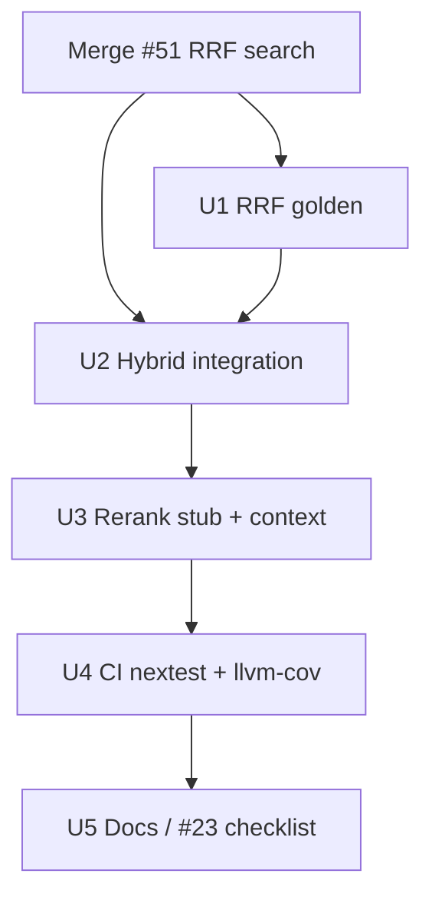

# CE Plan: Phase 2 Testing Work Orders

**Status:** Implementation-ready plan — [2026-07-21-002-feat-phase2-testing-gates-plan.md](2026-07-21-002-feat-phase2-testing-gates-plan.md)  
**Tracking:** [#23](https://github.com/duketopceo/kurultai/issues/23) Phase 2 section · depends on [#6](https://github.com/duketopceo/kurultai/issues/6) / PR [#51](https://github.com/duketopceo/kurultai/pull/51)  
**Audience:** Developer (CLI + MCP + CI)  
**Master plan:** [#27](https://github.com/duketopceo/kurultai/issues/27)

---

## Goal

Ship #23 **Phase 2** gates after RRF search lands:

```
FTS+vector hybrid proof → RRF golden → stub rerank/context → nextest + llvm-cov artifact
```

**Exit criteria**

1. Hybrid integration test with known embeddings proves RRF/`matched_by` through the search path  
2. RRF golden (deterministic `k=60`) tests green  
3. CI runs `cargo nextest`; uploads llvm-cov artifact **without** coverage fail gate  
4. Stub rerank soft-fail + markdown context expand covered  

---

## Assumptions

| # | Assumption | If wrong |
|---|------------|----------|
| A1 | PR #51 (Phase 2 search) merges first or this work bases on that branch | Rebase / wait |
| A2 | No coverage % gate until Phase 3 (#23) | Don’t fail PRs on % |
| A3 | nextest on Linux CI; macOS may keep `cargo test` | Document choice |
| A4 | No live OpenRouter in CI | Fake embedder / NullEmbedder only |

---

## Current state (as of plan write)

| Area | Status | Gap |
|------|--------|-----|
| Store FTS/vector unit | ✅ on `main` / #51 | Not full hybrid brain path |
| RRF unit (`fuse_rrf*`) | ✅ on #51 | Deepen golden tables |
| Hybrid FTS∥vector e2e | ❌ | **U2** |
| Stub rerank via hybrid | ❌ | **U3** |
| Context expand integration | ⚠️ merge unit only | **U3** |
| `cargo nextest` in CI | ❌ | **U4** |
| `llvm-cov` artifact | ❌ | **U4** |
| Coverage hard gate | ❌ (correct) | Phase 3 |

---

## Build sequence



| Step | Unit | Issue | Parallel with |
|------|------|-------|---------------|
| 0 | Merge search | #6 / #51 | — |
| 1 | U1 RRF golden | #23 | — |
| 2 | U2 Hybrid integration | #23 | after U1 |
| 3 | U3 Rerank + context | #23 | after U2 |
| 4 | U4 CI tooling | #23 | after tests |
| 5 | U5 Docs | #23 | last |

---

## Work order specs (summary)

### 1. U1 — RRF golden

**Files:** `src/query/rrf.rs` tests · optional `tests/rrf_golden.rs`  
**Verify:** shared-id score `2/61`; tie-break by id; empty lists.

### 2. U2 — Hybrid FTS + vector integration

**Files:** `tests/retrieval_hybrid.rs`  
**Verify:** Fake live embedder + seeded 4-d atoms; NullEmbedder FTS-only; embed fail soft-path.

### 3. U3 — Stub rerank + context expand

**Files:** `src/query/hybrid.rs` / `src/rerank/` / `src/query/context.rs` tests  
**Verify:** reorder + soft-fail; neighbor `…prev`/`…next` under excerpt cap.

### 4. U4 — CI nextest + llvm-cov

**Files:** `.github/workflows/ci.yml` · optional `.config/nextest.toml`  
**Verify:** PR uploads coverage artifact; Lint & Test still green; no `--fail-under`.

### 5. U5 — Docs / #23

**Files:** README link · update #23 Phase 2 checklist (human if token lacks write)

---

## Definition of done

- [ ] #51 merged (or this PR based on it)
- [ ] U1–U5 done per unified plan
- [ ] #23 Phase 2 bullets checked
- [ ] Phase 3+ #23 items remain open

---

## Explicit non-goals

- Coverage ≥50% (Phase 3)
- Branch protection admin settings
- Live OpenRouter required checks
- Distillation / full `ask` tests

---

## Immediate next action

1. Merge [#51](https://github.com/duketopceo/kurultai/pull/51)  
2. `/ce-work` on [2026-07-21-002-feat-phase2-testing-gates-plan.md](2026-07-21-002-feat-phase2-testing-gates-plan.md)
