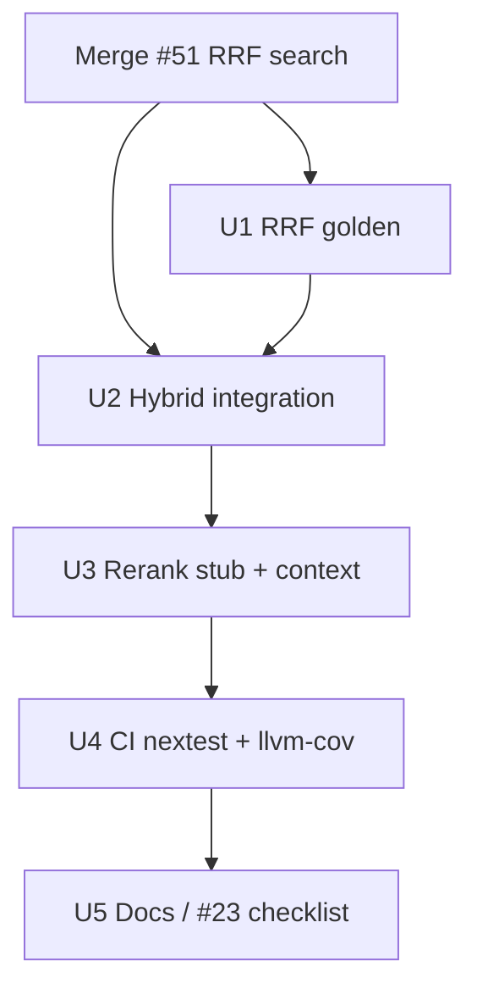

# CE Plan: Phase 2 Testing Work Orders

**Status:** Implementation in progress on `cursor/phase-2-testing-impl-1c5e` — [2026-07-21-002-feat-phase2-testing-gates-plan.md](2026-07-21-002-feat-phase2-testing-gates-plan.md)  
**Tracking:** [#23](https://github.com/duketopceo/kurultai/issues/23) Phase 2 section · depends on [#6](https://github.com/duketopceo/kurultai/issues/6) / PR [#51](https://github.com/duketopceo/kurultai/pull/51)  
**Audience:** Developer (CLI + MCP + CI)  
**Master plan:** [#27](https://github.com/duketopceo/kurultai/issues/27)

---

## Goal

Ship #23 **Phase 2** gates after RRF search lands:

```
FTS+vector hybrid proof → RRF golden → stub rerank/context → nextest + llvm-cov artifact
```

**Exit criteria**

1. Hybrid integration test with known embeddings proves RRF/`matched_by` through the search path  
2. RRF golden (deterministic `k=60`) tests green  
3. CI runs `cargo nextest`; uploads llvm-cov artifact **without** coverage fail gate  
4. Stub rerank soft-fail + markdown context expand covered  

---

## Assumptions

| # | Assumption | If wrong |
|---|------------|----------|
| A1 | PR #51 (Phase 2 search) merges first or this work bases on that branch | Rebase / wait |
| A2 | No coverage % gate until Phase 3 (#23) | Don’t fail PRs on % |
| A3 | nextest on Linux CI; macOS may keep `cargo test` | Document choice |
| A4 | No live OpenRouter in CI | Fake embedder / NullEmbedder only |

---

## Current state

| Area | Status | Notes |
|------|--------|-------|
| Store FTS/vector unit | ✅ | on `main` / #51 |
| RRF unit + golden deepen | ✅ | U1 in `src/query/rrf.rs` |
| Hybrid FTS∥vector e2e | ✅ | U2 `tests/retrieval_hybrid.rs` |
| Stub rerank via hybrid | ✅ | U3 reorder + soft-fail |
| Context expand integration | ✅ | U3 markdown neighbors |
| `cargo nextest` in CI | ✅ | U4 Linux Lint & Test |
| `llvm-cov` artifact | ✅ | U4 no `--fail-under` |
| Coverage hard gate | ❌ (correct) | Phase 3 |

---

## Build sequence



| Step | Unit | Issue | Status |
|------|------|-------|--------|
| 0 | Merge search | #6 / #51 | ✅ |
| 1 | U1 RRF golden | #23 | ✅ |
| 2 | U2 Hybrid integration | #23 | ✅ |
| 3 | U3 Rerank + context | #23 | ✅ |
| 4 | U4 CI tooling | #23 | ✅ |
| 5 | U5 Docs | #23 | ✅ (checklist comment on #23 if token allows) |

---

## Work order specs (summary)

### 1. U1 — RRF golden

**Files:** `src/query/rrf.rs` tests  
**Verify:** shared-id score `2/61`; tie-break by id; empty lists.

### 2. U2 — Hybrid FTS + vector integration

**Files:** `tests/retrieval_hybrid.rs`  
**Verify:** Fake live embedder + seeded 4-d atoms; NullEmbedder FTS-only; embed fail soft-path.

### 3. U3 — Stub rerank + context expand

**Files:** `tests/retrieval_hybrid.rs`  
**Verify:** reorder + soft-fail; neighbor `…prev`/`…next` under excerpt cap.

### 4. U4 — CI nextest + llvm-cov

**Files:** `.github/workflows/ci.yml`  
**Verify:** PR uploads coverage artifact; Lint & Test still green; no `--fail-under`. macOS keeps `cargo test`.

### 5. U5 — Docs / #23

**Files:** README link · #23 Phase 2 checklist (human if token lacks write)

---

## Definition of done

- [x] U1–U3 tests green under `cargo test` / nextest
- [x] CI nextest + llvm-cov artifact, no coverage hard gate
- [x] README links Phase 2 testing plan
- [ ] #23 Phase 2 checklist items checked (maintainers / issue write)
