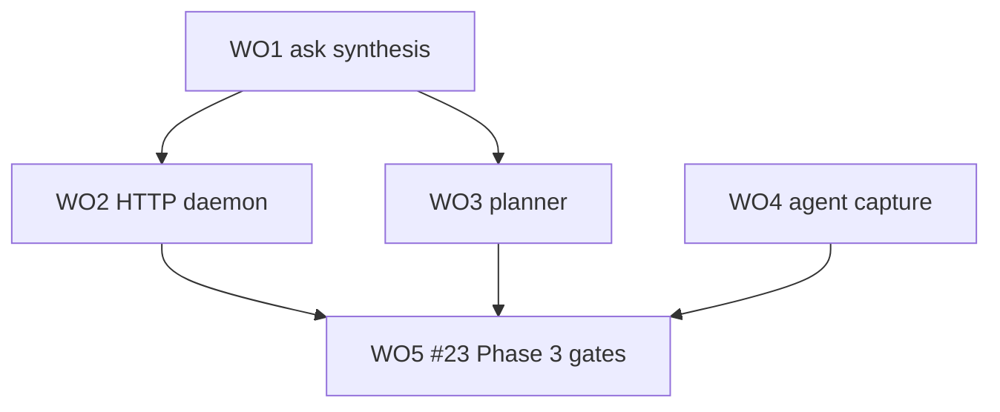

# CE Plan: Phase 3 Work Orders

**Status:** WO1 (ask synthesis) shipping on `cursor/phase-3-ask-synthesis-1c5e` — [2026-07-22-001-feat-phase3-ask-synthesis-plan.md](2026-07-22-001-feat-phase3-ask-synthesis-plan.md)  
**Tracking:** [#7](https://github.com/duketopceo/kurultai/issues/7) · depends on Phase 2 search [#6](https://github.com/duketopceo/kurultai/issues/6) / #51  
**Audience:** Developer (CLI + MCP)  
**Master plan:** [#27](https://github.com/duketopceo/kurultai/issues/27)

---

## Goal

Ship Phase 3 (#7) in sequenced work orders:

```
ask synthesis + citations → HTTP daemon → planner node → agent capture → #23 Phase 3 gates
```

**Exit criteria (full phase)**

1. `ask` synthesizes grounded answers with citations (WO1)
2. HTTP daemon serves search/ask on :8421 (WO2)
3. Optional planner selects retrieval strategy (WO3)
4. Agent transcript → atoms path (WO4)
5. #23 Phase 3 testing gates incl. coverage floor (WO5)

---

## Work order map

| WO | Scope | Plan / status |
|----|--------|----------------|
| **WO1** | Synthesizer + wire `ask` + confidence + tests | [ask synthesis plan](2026-07-22-001-feat-phase3-ask-synthesis-plan.md) — **this LFG** |
| WO2 | HTTP daemon REST (axum) on 8421 | deferred |
| WO3 | Planner → executor diamond (optional LLM) | deferred |
| WO4 | Cursor/Claude/Codex JSONL → distill → atoms | deferred |
| WO5 | #23 Phase 3: MCP e2e expand + ≥50% coverage gate | deferred |

---

## Assumptions

| # | Assumption | If wrong |
|---|------------|----------|
| A1 | Cerebras-style: MCP keeps retrieval primitives; Kurultai owns grounded `ask` | Don’t push all synthesis to the client |
| A2 | No coverage hard gate until WO5 | Don’t fail PRs on % yet |
| A3 | PR #53 (Phase 2 testing) preferred on main but not required for WO1 | Rebase later if needed |

---

## Build sequence



---

## Definition of done (WO1 only)

- [x] Plan units U1–U5 complete
- [x] `cargo test --locked` green without OpenRouter
- [x] README links Phase 3 work orders
- [x] PR [#54](https://github.com/duketopceo/kurultai/pull/54) CI green
